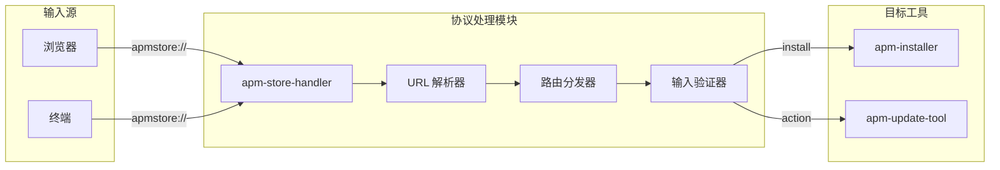
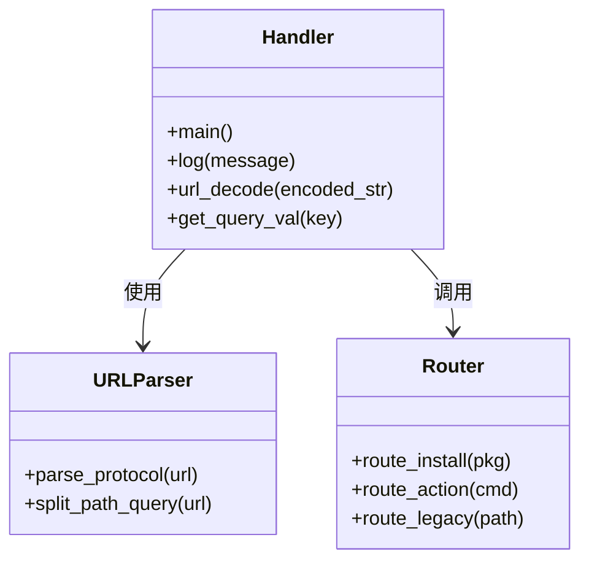
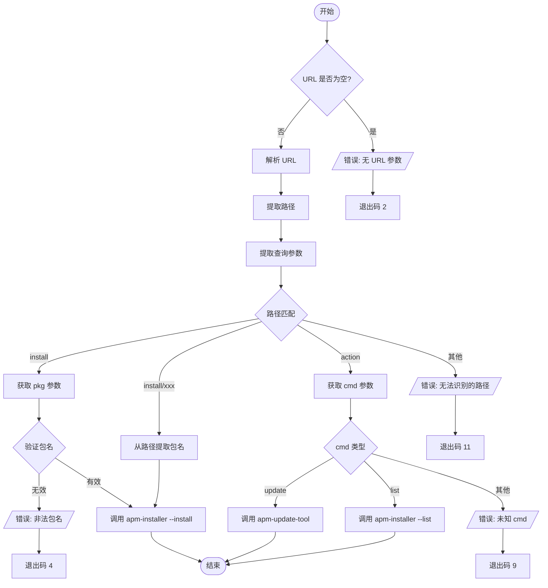
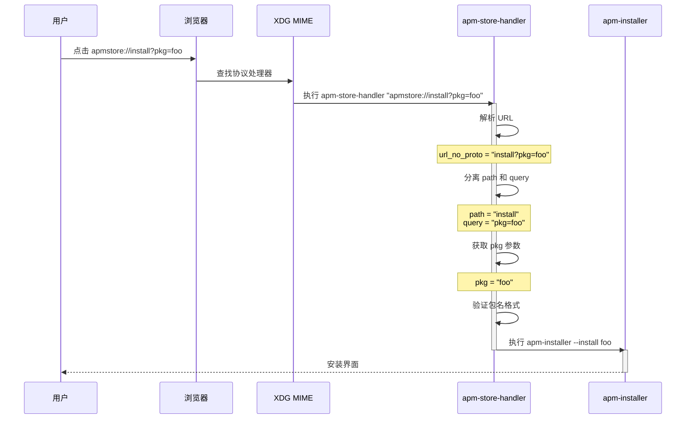
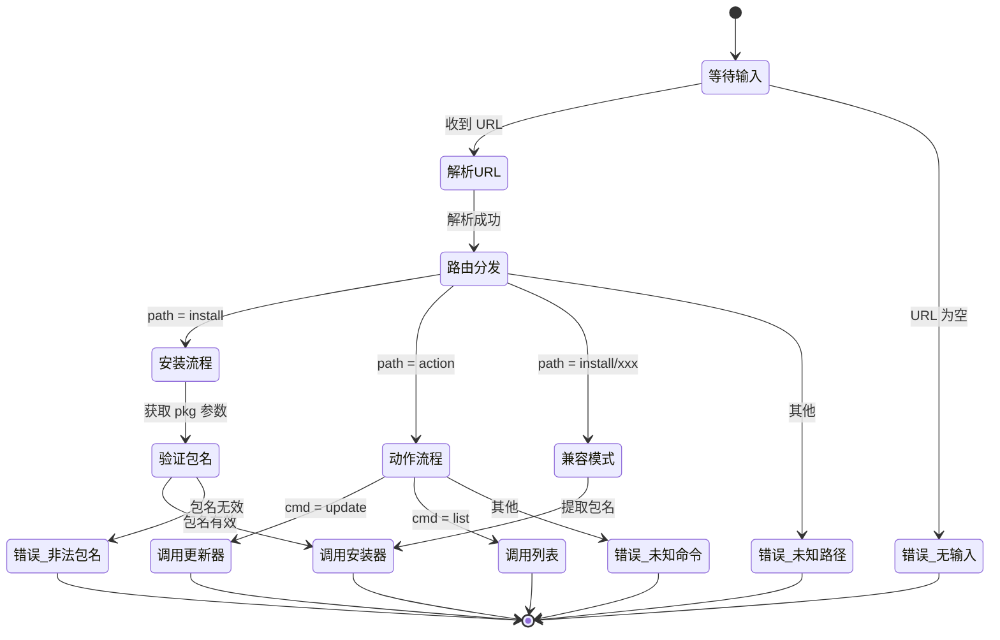

# 协议处理模块

> apm-store-handler - apmstore:// URL 协议解析与路由

## 模块概览

### 文件位置

| 文件 | 路径 | 描述 |
|------|------|------|
| apm-store-handler | `src/usr/bin/apm-store-handler` | 协议处理器主程序 |
| apm-store-handler.desktop | `src/usr/share/applications/apm-store-handler.desktop` | 协议注册桌面文件 |

### 功能职责

协议处理模块负责：
1. 接收并解析 `apmstore://` 协议 URL
2. 提取 URL 中的路径和查询参数
3. 根据不同的操作类型路由到对应的工具
4. 提供输入验证和安全过滤

### 模块关系图



## 函数定义

### 核心函数

```bash
# 日志输出函数
log() { echo "[apm-store-handler] $*" >&2; }

# URL 解码函数（纯 bash 实现）
url_decode() {
  local encoded_str="$1"
  encoded_str="${encoded_str//+/ }"     # 处理 + 号
  printf '%b' "${encoded_str//%/\\x}"   # 处理 %XX 序列
}

# 查询参数解析函数
get_query_val() {
  local key="$1"
  local q="$query"
  # 遍历键值对查找匹配项
  ...
}
```

### 函数关系图



## 核心实现

### URL 解析流程

**文件路径**: `src/usr/bin/apm-store-handler`

```bash
# 先去掉前缀 apmstore://
url_no_proto="${URL#apmstore://}"

# 将 path 与 query 分离
path="${url_no_proto%%\?*}"
query="${url_no_proto#*\?}"
if [ "$query" = "$url_no_proto" ]; then
  query=""
fi
```

#### 伪代码描述

```
输入: URL = "apmstore://install?pkg=foo"

1. 移除协议前缀 "apmstore://"
   -> "install?pkg=foo"

2. 分离路径和查询字符串
   path = "install"
   query = "pkg=foo"

3. 解析查询参数
   pkg = url_decode("foo") -> "foo"

4. 路由到对应处理器
   -> 调用 apm-installer --install foo
```

### 路由分发实现

| 路径模式 | 查询参数 | 目标工具 | 操作 |
|---------|---------|---------|------|
| `install` | `pkg=<name>` | apm-installer | `--install <name>` |
| `install/<name>` | - | apm-installer | `--install <name>` (兼容模式) |
| `action` | `cmd=update` | apm-update-tool | 检查更新 |
| `action` | `cmd=list` | apm-installer | `--list` |

### 安全验证

**文件路径**: `src/usr/bin/apm-store-handler`

```bash
# 仅允许安全字符，避免命令注入
if [[ ! "$pkg" =~ ^[A-Za-z0-9_.:-]+$ ]]; then
  log "非法的包名内容，拒绝执行: '$pkg'"
  exit 4
fi
```

#### 允许字符表

| 字符类型 | 允许的字符 | 示例 |
|---------|-----------|------|
| 字母 | A-Z, a-z | `PackageName` |
| 数字 | 0-9 | `package123` |
| 特殊符号 | `_` `.` `:` `-` | `pkg-name_v1.0:arch` |

## 流程图

### 业务流程图



### 时序图



### 状态图



## 退出码说明

| 退出码 | 含义 |
|-------|------|
| 0 | 成功 |
| 2 | 未传入 URL 参数 |
| 3 | install 操作缺少 pkg 参数 |
| 4 | 包名含有非法字符 |
| 5 | apm-installer 未找到 |
| 6 | action 操作缺少 cmd 参数 |
| 7 | apm-update-tool 未找到 |
| 8 | apm-installer 未找到 (list) |
| 9 | 未知的 action cmd |
| 10 | apm-installer 未找到 (兼容模式) |
| 11 | 无法识别的路径 |

## 导航链接

| 上一篇 | 目录 | 下一篇 |
|-------|------|-------|
| - | [返回目录](README.md) | [核心工具模块](02-核心工具模块.md) |
