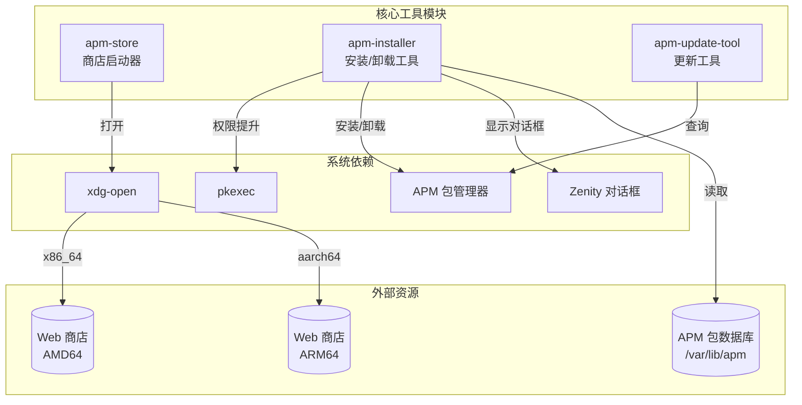
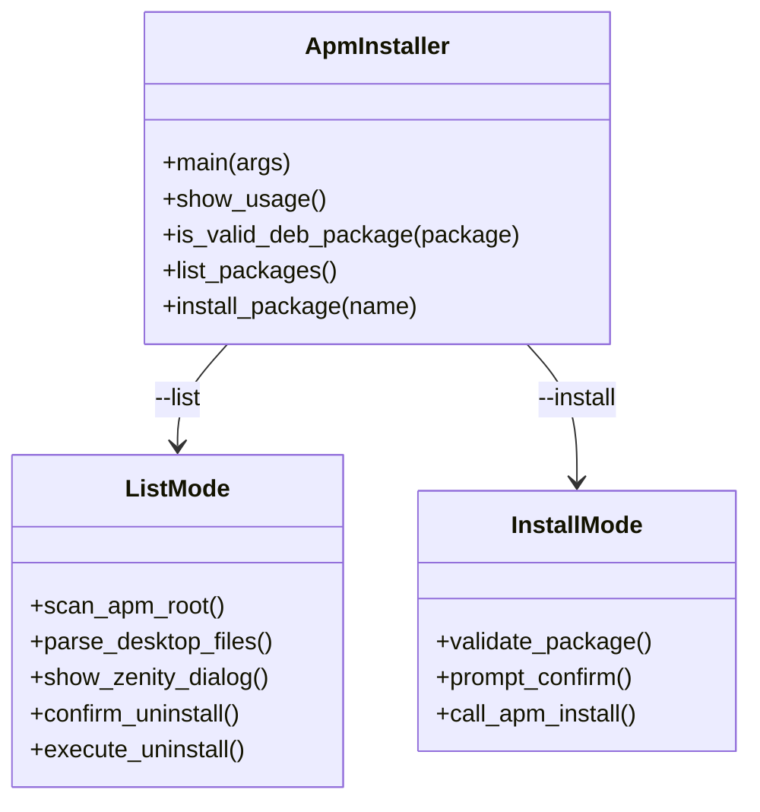
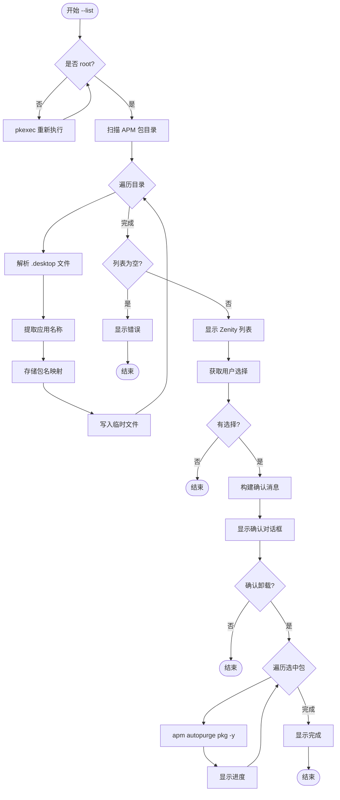
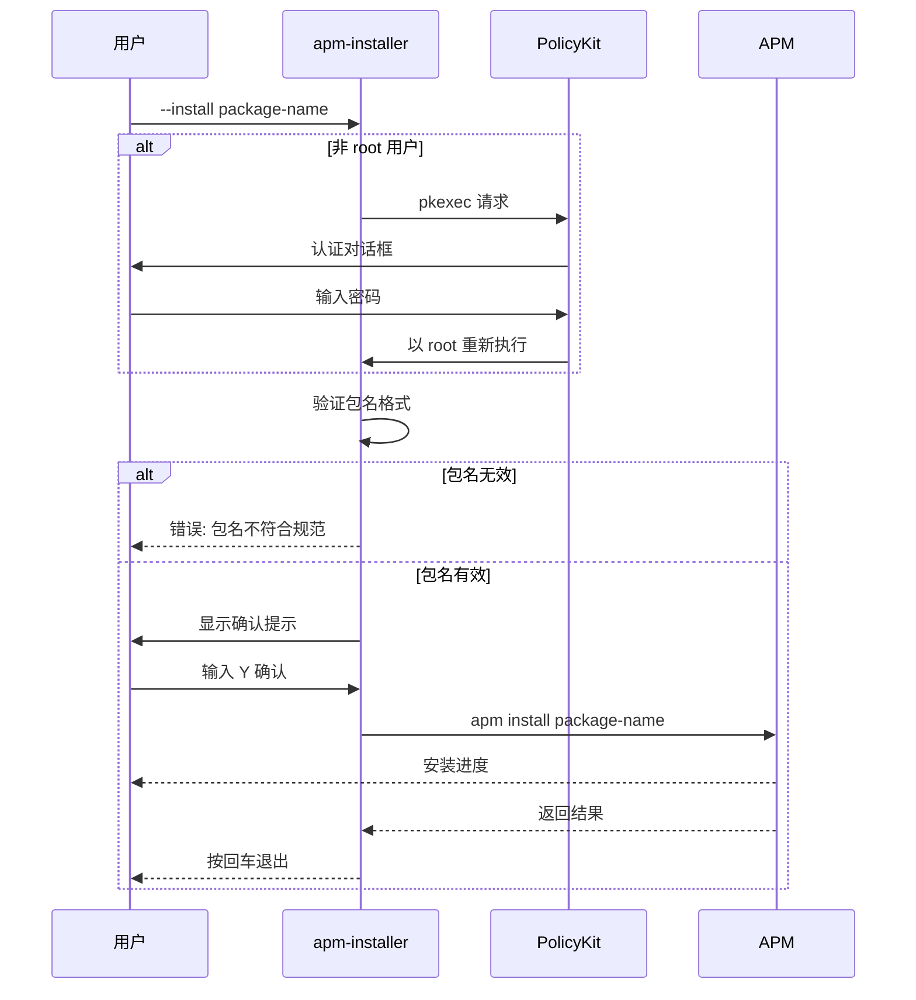
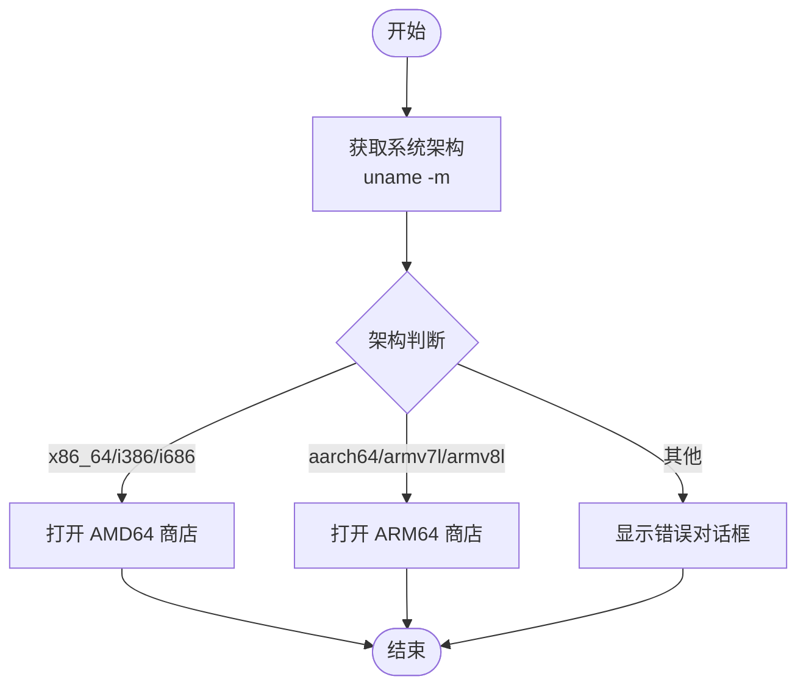
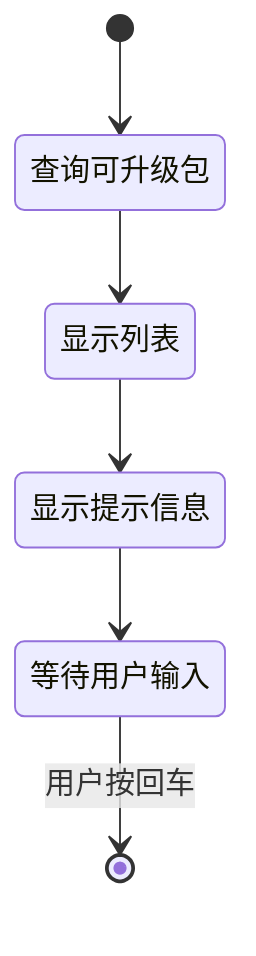

# 核心工具模块

> apm-installer / apm-store / apm-update-tool - 安装、商店与更新工具

## 模块概览

### 文件位置

| 文件 | 路径 | 描述 |
|------|------|------|
| apm-installer | `src/usr/bin/apm-installer` | 软件包安装与卸载工具 |
| apm-store | `src/usr/bin/apm-store` | 商店启动器 |
| apm-update-tool | `src/usr/bin/apm-update-tool` | 更新检查工具 |

### 功能职责

| 工具 | 职责 |
|------|------|
| **apm-installer** | 提供交互式的软件包安装、卸载界面，支持批量操作 |
| **apm-store** | 根据系统架构打开对应的 Web 商店页面 |
| **apm-update-tool** | 检查并显示可升级的软件包列表 |

### 模块关系图



---

## apm-installer 安装工具

### 功能概述

`apm-installer` 是一个多功能的包管理工具，提供：
- 📥 交互式软件包安装
- 🗑️ 图形化批量卸载界面
- 🔐 自动权限提升

### 函数定义

```bash
# 使用说明
show_usage() {
    echo "用法: $0 [选项]"
    echo "选项:"
    echo "  --list                列出可卸载的包"
    echo "  --install <包名>      安装指定的 Debian 包"
}

# Debian 包名验证函数
is_valid_deb_package() {
    local package="$1"
    if [[ "$package" =~ ^[a-z0-9][a-z0-9+-.]*$ ]]; then
        return 0
    else
        return 1
    fi
}
```

### 类/函数继承关系



### 核心实现

#### 权限提升机制

**文件路径**: `src/usr/bin/apm-installer`

```bash
# 检查是否为 root 用户，如果不是则用 pkexec 重新执行
if [[ $EUID -ne 0 ]]; then
    exec pkexec "$0" "$@"
fi
```

#### 伪代码描述 - 卸载列表模式

```
函数 list_packages():
    1. 定义 APM_ROOT = "/var/lib/apm/apm/files/ace-env/var/lib/apm"
    2. 创建临时文件存储包列表
    
    3. 遍历 APM_ROOT 下所有目录:
        a. 获取包名 = 目录名
        b. 查找 .desktop 文件
        c. 提取应用名称 (优先 zh_CN)
        d. 存储映射关系 pkg -> app_name
        e. 写入临时文件: "FALSE|应用名|包名"
    
    4. 如果无包:
        显示错误对话框
        退出
    
    5. 调用 zenity 显示复选框列表
    6. 获取用户选择
    
    7. 构建确认消息（显示应用名称）
    8. 显示确认对话框
    
    9. 如果确认:
        遍历选中的包:
            apm autopurge $pkg -y
            显示进度对话框
    
    10. 显示完成通知
```

#### 实现细节表格 - 包信息提取

| 步骤 | 操作 | 代码片段 |
|------|------|---------|
| 1 | 查找 desktop 文件 | `desktop_files=("$pkgdir"/entries/applications/*.desktop)` |
| 2 | 提取中文名称 | `grep -P '^Name\[zh_CN\]=' "$desktop_file"` |
| 3 | 回退到默认名称 | `grep -P '^Name=' "$desktop_file"` |
| 4 | 清理字段 | `desktop_name=${desktop_name//$'\r'/ }` |

### 流程图

#### 卸载流程图



#### 安装流程时序图



---

## apm-store 商店启动器

### 功能概述

`apm-store` 根据当前系统架构自动打开对应的 Web 商店页面。

### 核心实现

**文件路径**: `src/usr/bin/apm-store`

```bash
#!/bin/bash

# 获取系统架构
arch=$(uname -m)

# 根据架构执行不同操作
case $arch in
    x86_64|i386|i686)
        xdg-open "https://erotica.spark-app.store/amd64-apm/index-client.html"
        ;;
    aarch64|armv7l|armv8l)
        xdg-open "https://erotica.spark-app.store/arm64-apm/index-client.html"
        ;;
    *)
        zenity --error --text="暂不支持此架构: $arch" --title="架构不支持"
        ;;
esac
```

### 架构映射表

| 系统架构 | 商店 URL |
|---------|---------|
| x86_64 / i386 / i686 | `https://erotica.spark-app.store/amd64-apm/index-client.html` |
| aarch64 / armv7l / armv8l | `https://erotica.spark-app.store/arm64-apm/index-client.html` |
| 其他 | 显示错误对话框 |

### 流程图



---

## apm-update-tool 更新工具

### 功能概述

`apm-update-tool` 显示可升级的软件包列表，并提示用户如何进行更新。

### 核心实现

**文件路径**: `src/usr/bin/apm-update-tool`

```bash
#!/usr/bin/env bash

apm list --upgradable
echo
echo "----可通过 sudo apm full-upgrade -y 进行更新----"
echo
echo "请按回车退出...."
read
```

### 流程图


### 状态图



---

## 工具对比表

| 特性 | apm-installer | apm-store | apm-update-tool |
|------|--------------|-----------|-----------------|
| 需要 root 权限 | ✅ | ❌ | ❌ |
| 图形界面 | ✅ Zenity | ❌ 浏览器 | ❌ |
| 交互方式 | 对话框 | 打开 URL | 终端 |
| 主要功能 | 安装/卸载 | 打开商店 | 检查更新 |
| 依赖 | apm, zenity | xdg-open | apm |

## 导航链接

| 上一篇 | 目录 | 下一篇 |
|-------|------|-------|
| [协议处理模块](01-协议处理模块.md) | [返回目录](README.md) | [打包与部署](03-打包与部署.md) |
