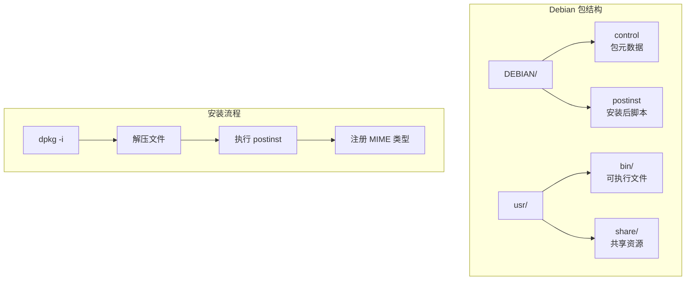
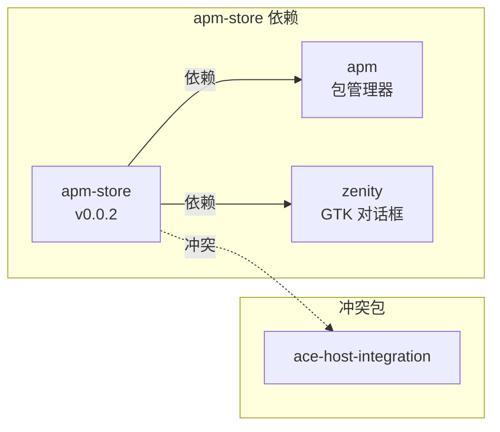
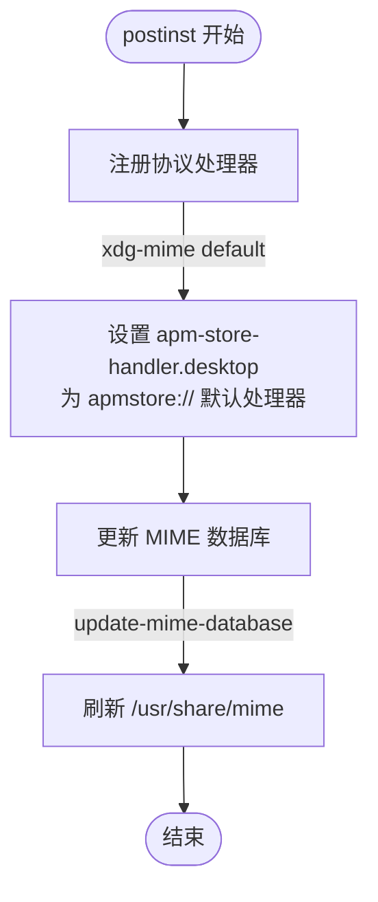
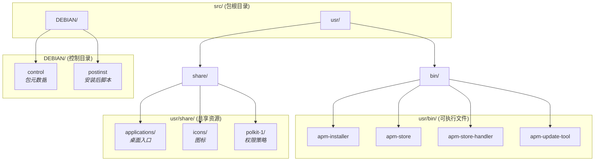
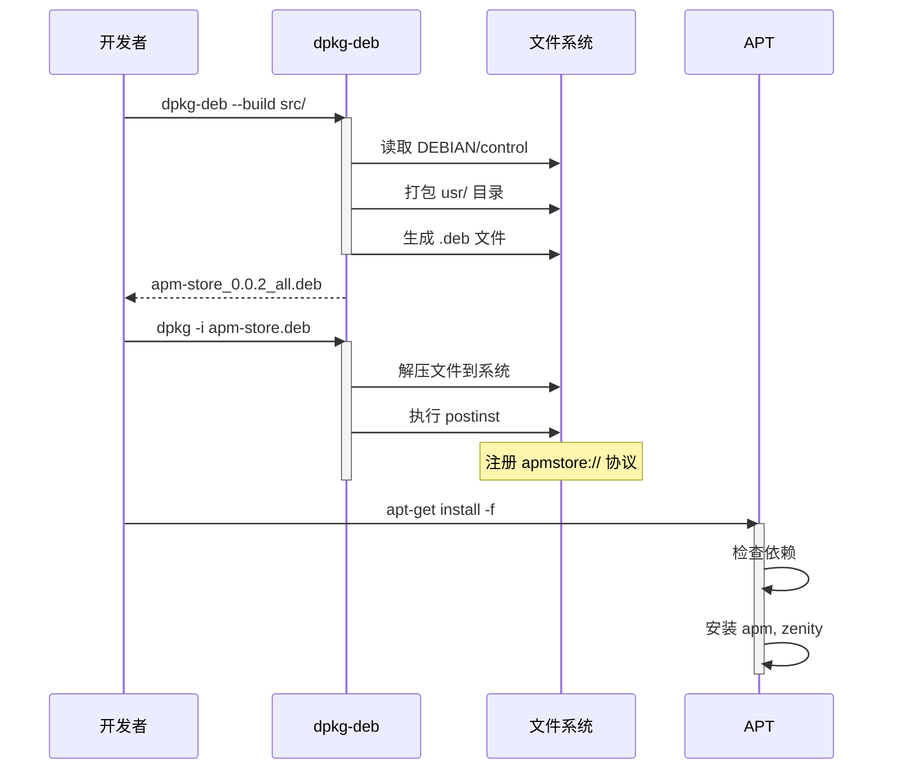
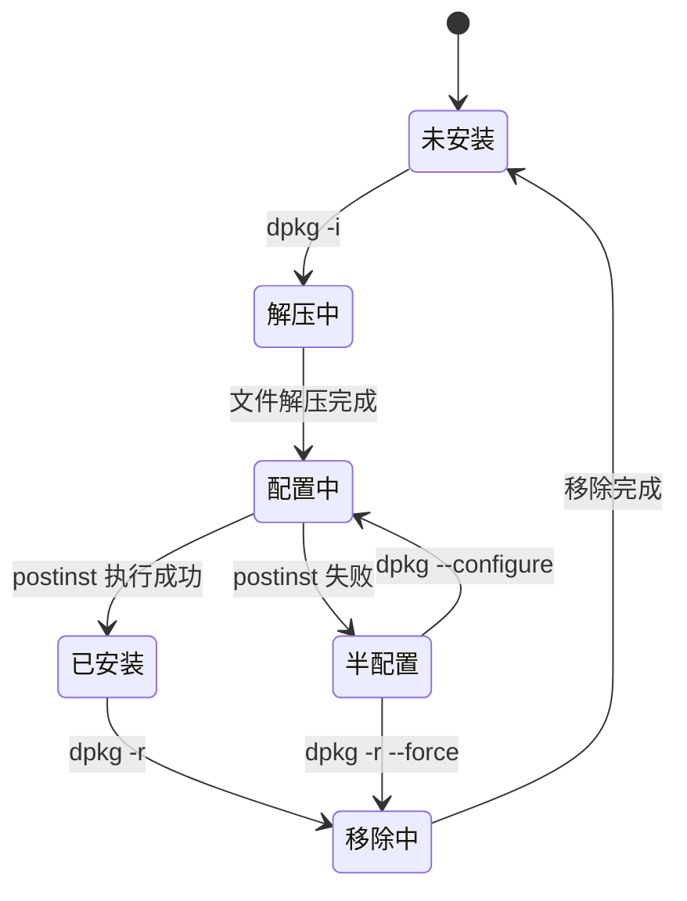

# 打包与部署

> Debian 包结构、控制文件与安装后配置

## 模块概览

### 文件位置

| 文件 | 路径 | 描述 |
|------|------|------|
| control | `src/DEBIAN/control` | 包元数据定义 |
| postinst | `src/DEBIAN/postinst` | 安装后执行脚本 |

### 功能职责

- 定义软件包的元信息（名称、版本、依赖等）
- 安装后注册 apmstore:// 协议处理器
- 配置 MIME 类型数据库

### 模块关系图



## 包控制文件 (control)

### 文件内容

**文件路径**: `src/DEBIAN/control`

```plaintext
Package: apm-store
Version: 0.0.2
Priority: optional
Architecture: all
Section: misc
Source: amber-ce
Maintainer: shenmo <shenmo@spark-app.store>
Installed-Size: 200
Depends: apm,zenity
Conflicts: ace-host-integration
Homepage: https://gitee.com/amber-ce/amber-pm/
Description: store for APM
```

### 字段说明

| 字段 | 值 | 说明 |
|------|-----|------|
| **Package** | `apm-store` | 包名称 |
| **Version** | `0.0.2` | 版本号 |
| **Priority** | `optional` | 优先级（可选包） |
| **Architecture** | `all` | 架构无关（纯脚本） |
| **Section** | `misc` | 分类：杂项 |
| **Source** | `amber-ce` | 源包名 |
| **Maintainer** | `shenmo <shenmo@spark-app.store>` | 维护者 |
| **Installed-Size** | `200` | 安装大小（KB） |
| **Depends** | `apm,zenity` | 运行时依赖 |
| **Conflicts** | `ace-host-integration` | 冲突包 |
| **Homepage** | `https://gitee.com/amber-ce/amber-pm/` | 项目主页 |
| **Description** | `store for APM` | 包描述 |

### 依赖关系图



## 安装后脚本 (postinst)

### 文件内容

**文件路径**: `src/DEBIAN/postinst`

```bash
#!/bin/bash
xdg-mime default apm-store-handler.desktop x-scheme-handler/apmstore
update-mime-database /usr/share/mime || true
```

### 执行步骤说明

| 步骤 | 命令 | 功能 |
|------|------|------|
| 1 | `xdg-mime default` | 将 `apm-store-handler.desktop` 设为 `apmstore://` 协议的默认处理器 |
| 2 | `update-mime-database` | 更新 MIME 数据库，使协议注册生效 |

### 流程图



## 完整包结构



## 构建与安装

### 构建 Debian 包

```bash
# 进入源码目录
cd Examples/apm-store/src

# 构建 .deb 包
dpkg-deb --build . ../apm-store_0.0.2_all.deb
```

### 安装包

```bash
# 安装
sudo dpkg -i apm-store_0.0.2_all.deb

# 安装缺失依赖
sudo apt-get install -f
```

### 卸载包

```bash
sudo dpkg -r apm-store
```

### 构建流程时序图



## 安装状态图



## 安装路径对照表

| 源路径 | 安装路径 | 权限 |
|-------|---------|------|
| `src/usr/bin/apm-installer` | `/usr/bin/apm-installer` | 755 |
| `src/usr/bin/apm-store` | `/usr/bin/apm-store` | 755 |
| `src/usr/bin/apm-store-handler` | `/usr/bin/apm-store-handler` | 755 |
| `src/usr/bin/apm-update-tool` | `/usr/bin/apm-update-tool` | 755 |
| `src/usr/share/applications/*.desktop` | `/usr/share/applications/` | 644 |
| `src/usr/share/icons/apm-store.png` | `/usr/share/icons/apm-store.png` | 644 |
| `src/usr/share/polkit-1/actions/*.policy` | `/usr/share/polkit-1/actions/` | 644 |

## 导航链接

| 上一篇 | 目录 | 下一篇 |
|-------|------|-------|
| [核心工具模块](02-核心工具模块.md) | [返回目录](README.md) | [桌面集成](04-桌面集成.md) |
