# 桌面集成

> Desktop Entry 配置与 PolicyKit 权限策略

## 模块概览

### 文件位置

| 文件 | 路径 | 描述 |
|------|------|------|
| apm-store.desktop | `src/usr/share/applications/apm-store.desktop` | 商店应用入口 |
| apm-store-handler.desktop | `src/usr/share/applications/apm-store-handler.desktop` | 协议处理器入口 |
| apm-store.png | `src/usr/share/icons/apm-store.png` | 应用图标 |
| *.policy | `src/usr/share/polkit-1/actions/store.spark-app.amber-pm-installer.policy` | PolicyKit 权限策略 |

### 功能职责

| 组件 | 职责 |
|------|------|
| **Desktop Entry** | 定义应用在桌面环境中的显示和行为 |
| **MIME 类型注册** | 将 apmstore:// 协议关联到处理程序 |
| **PolicyKit 策略** | 配置 apm-installer 的权限提升规则 |

### 模块关系图


---

## Desktop Entry 配置

### apm-store.desktop - 商店应用入口

**文件路径**: `src/usr/share/applications/apm-store.desktop`

```ini
[Desktop Entry]
Name=APM Store
Name[zh_CN]=APM 琥珀应用商店
Icon=apm-store
NoDisplay=false
Exec=apm-store %U
Type=Application
Terminal=false
MimeType=x-scheme-handler/apmstore;
Categories=Utility;
```

#### 字段说明

| 字段 | 值 | 说明 |
|------|-----|------|
| **Name** | `APM Store` | 英文名称 |
| **Name[zh_CN]** | `APM 琥珀应用商店` | 中文名称 |
| **Icon** | `apm-store` | 图标名称（不含扩展名） |
| **NoDisplay** | `false` | 在应用菜单中显示 |
| **Exec** | `apm-store %U` | 执行命令，%U 接收 URL 参数 |
| **Type** | `Application` | 条目类型：应用程序 |
| **Terminal** | `false` | 不在终端中运行 |
| **MimeType** | `x-scheme-handler/apmstore;` | 处理的 MIME 类型 |
| **Categories** | `Utility;` | 应用分类 |

### apm-store-handler.desktop - 协议处理器

**文件路径**: `src/usr/share/applications/apm-store-handler.desktop`

```ini
[Desktop Entry]
Name=APM Store Protocol Handler
NoDisplay=true
Exec=apm-store-handler %u
Type=Application
Terminal=true
MimeType=x-scheme-handler/apmstore;
Categories=Utility;
```

#### 字段说明

| 字段 | 值 | 说明 |
|------|-----|------|
| **Name** | `APM Store Protocol Handler` | 名称 |
| **NoDisplay** | `true` | 不在应用菜单中显示 |
| **Exec** | `apm-store-handler %u` | 执行命令，%u 接收单个 URL |
| **Terminal** | `true` | 在终端中运行（显示输出） |

### Desktop Entry 对比

| 特性 | apm-store.desktop | apm-store-handler.desktop |
|------|-------------------|---------------------------|
| 菜单可见 | ✅ | ❌ |
| 终端运行 | ❌ | ✅ |
| 本地化名称 | ✅ | ❌ |
| 图标 | ✅ | ❌ |
| 用途 | 用户启动商店 | 处理 URL 协议 |

### Desktop Entry 类图


---

## PolicyKit 权限策略

### 策略文件

**文件路径**: `src/usr/share/polkit-1/actions/store.spark-app.amber-pm-installer.policy`

```xml
<?xml version="1.0" encoding="UTF-8"?>
<!DOCTYPE policyconfig PUBLIC "-//freedesktop//DTD PolicyKit Policy Configuration 1.0//EN"
 "http://www.freedesktop.org/standards/PolicyKit/1/policyconfig.dtd">
<policyconfig>
    <vendor>AmberPM</vendor>
    <icon_name>x-package-repository</icon_name>
    <action id="store.spark-app.amber-pm-installer">
        <description>运行amber-pm-installer需要权限</description>
        <message>要使用amber-pm-installer需要权限</message>
        <defaults>
            <allow_any>yes</allow_any>
            <allow_inactive>yes</allow_inactive>
            <allow_active>yes</allow_active>
        </defaults>
        <annotate key="org.freedesktop.policykit.exec.path">/usr/bin/apm-installer</annotate>
        <annotate key="org.freedesktop.policykit.exec.allow_gui">true</annotate>
    </action>
</policyconfig>
```

### 策略元素说明

| 元素 | 值 | 说明 |
|------|-----|------|
| **vendor** | `AmberPM` | 供应商名称 |
| **icon_name** | `x-package-repository` | 认证对话框显示的图标 |
| **action id** | `store.spark-app.amber-pm-installer` | 动作唯一标识符 |
| **description** | `运行amber-pm-installer需要权限` | 动作描述 |
| **message** | `要使用amber-pm-installer需要权限` | 认证对话框消息 |

### 权限配置

| 配置项 | 值 | 说明 |
|-------|-----|------|
| **allow_any** | `yes` | 任何用户都允许（需认证） |
| **allow_inactive** | `yes` | 非活动会话允许 |
| **allow_active** | `yes` | 活动会话允许 |

### 注解配置

| 注解键 | 值 | 说明 |
|-------|-----|------|
| `org.freedesktop.policykit.exec.path` | `/usr/bin/apm-installer` | 授权执行的程序路径 |
| `org.freedesktop.policykit.exec.allow_gui` | `true` | 允许 GUI 程序 |

### PolicyKit 授权流程


### 权限状态图

```mermaid
stateDiagram-v2
    [*] --> 请求权限
    
    请求权限 --> 检查策略 : pkexec 调用
    
    检查策略 --> 需要认证 : allow_* = yes
    检查策略 --> 直接拒绝 : allow_* = no
    
    需要认证 --> 等待输入 : 显示密码框
    等待输入 --> 验证中 : 用户输入
    等待输入 --> 已取消 : 用户取消
    
    验证中 --> 授权成功 : 密码正确
    验证中 --> 验证失败 : 密码错误
    
    验证失败 --> 等待输入 : 重试
    验证失败 --> 已拒绝 : 超过重试次数
    
    授权成功 --> 执行程序
    执行程序 --> [*]
    
    直接拒绝 --> [*]
    已取消 --> [*]
    已拒绝 --> [*]
```



---

## MIME 类型注册

### 注册流程

```mermaid
flowchart TD
    Start([安装包]) --> Postinst[执行 postinst]
    
    Postinst --> XdgMime["xdg-mime default<br/>apm-store-handler.desktop<br/>x-scheme-handler/apmstore"]
    
    XdgMime --> UpdateDB["update-mime-database<br/>/usr/share/mime"]
    
    UpdateDB --> Result{注册结果}
    
    Result -->|成功| Registered[协议已注册]
    Result -->|失败| Continue[继续安装<br/>|| true]
    
    Registered --> End([结束])
    Continue --> End
```

### 协议处理流程


---

## 图标配置

### 图标位置

| 文件 | 安装路径 |
|------|---------|
| `apm-store.png` | `/usr/share/icons/apm-store.png` |

### 图标引用

Desktop Entry 中通过 `Icon=apm-store` 引用图标，系统会自动在以下位置搜索：

1. `/usr/share/icons/apm-store.png`
2. `/usr/share/icons/hicolor/*/apps/apm-store.png`
3. `~/.local/share/icons/apm-store.png`

---

## 集成验证

### 验证命令

```bash
# 检查 MIME 类型注册
xdg-mime query default x-scheme-handler/apmstore
# 预期输出: apm-store-handler.desktop

# 测试协议处理
xdg-open "apmstore://install?pkg=test"

# 检查 Desktop Entry 有效性
desktop-file-validate /usr/share/applications/apm-store.desktop

# 查看 PolicyKit 策略
pkaction --action-id store.spark-app.amber-pm-installer --verbose
```

### 验证流程图


## 导航链接

| 上一篇 | 目录 | 下一篇 |
|-------|------|-------|
| [打包与部署](03-打包与部署.md) | [返回目录](README.md) | - |
