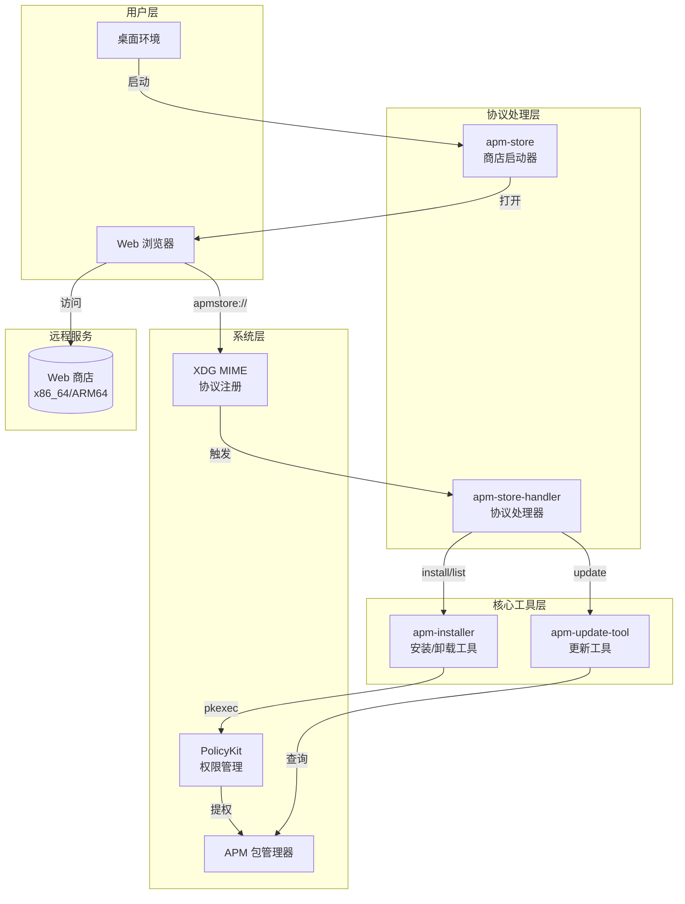
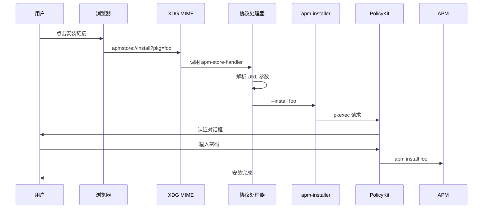

# APM Store 技术文档

> APM (Amber Package Manager) Store - 基于 Web 的琥珀应用商店客户端及协议处理工具集

## 项目概述与定位

APM Store 是一套为 [Amber Package Manager (APM)](https://gitee.com/amber-ce/amber-pm/) 设计的应用商店前端解决方案。它通过自定义 URL 协议 (`apmstore://`) 实现了浏览器与本地包管理器之间的无缝集成，让用户能够从 Web 页面一键安装、更新和管理 APM 软件包。

### 核心特性

- 🌐 **Web 商店集成** - 通过浏览器访问在线商店页面
- 🔗 **自定义协议处理** - 支持 `apmstore://` URL Scheme
- 📦 **包管理操作** - 安装、卸载、更新软件包
- 🔐 **权限提升** - 通过 PolicyKit 实现安全的 root 权限获取
- 🖥️ **多架构支持** - 同时支持 x86_64 和 ARM64 架构

## 技术栈

| 类别 | 技术 |
|------|------|
| 脚本语言 | Bash |
| 包管理器 | APM (Amber Package Manager) |
| 权限管理 | PolicyKit (pkexec) |
| 桌面集成 | XDG Desktop Entry |
| 用户界面 | Zenity (GTK 对话框) |
| 打包格式 | Debian Package (.deb) |

## 目录结构树

```
apm-store/
├── README.md                          # 项目说明
├── apm-store-handler                  # 协议处理器（开发版）
├── apm-store-handler.desktop          # 协议处理器桌面文件（开发版）
└── src/                               # Debian 包源码目录
    ├── DEBIAN/                        # Debian 打包控制目录
    │   ├── control                    # 包元数据
    │   └── postinst                   # 安装后脚本
    └── usr/                           # 安装文件目录
        ├── bin/                       # 可执行文件
        │   ├── apm-installer          # 安装/卸载工具
        │   ├── apm-store              # 商店启动器
        │   ├── apm-store-handler      # 协议处理器
        │   └── apm-update-tool        # 更新检查工具
        └── share/
            ├── applications/          # 桌面入口文件
            │   ├── apm-store.desktop
            │   └── apm-store-handler.desktop
            ├── icons/                 # 应用图标
            │   └── apm-store.png
            └── polkit-1/actions/      # PolicyKit 策略
                └── store.spark-app.amber-pm-installer.policy
```

## 架构总览图



## 核心流程概述图



## 模块文档索引

| 序号 | 模块 | 文档 | 描述 |
|------|------|------|------|
| 1 | 协议处理模块 | [01-协议处理模块.md](01-协议处理模块.md) | apmstore:// URL 协议解析与路由 |
| 2 | 核心工具模块 | [02-核心工具模块.md](02-核心工具模块.md) | 安装器、更新器、商店启动器 |
| 3 | 打包与部署 | [03-打包与部署.md](03-打包与部署.md) | Debian 包结构与安装后配置 |
| 4 | 桌面集成 | [04-桌面集成.md](04-桌面集成.md) | Desktop Entry 与 PolicyKit 配置 |

## 快速开始

### 构建 Debian 包

```bash
cd Examples/apm-store/src
dpkg-deb --build . ../apm-store.deb
```

### 安装

```bash
sudo dpkg -i apm-store.deb
sudo apt-get install -f  # 安装依赖
```

### 使用

```bash
# 打开商店
apm-store

# 通过协议安装包
xdg-open "apmstore://install?pkg=example-package"

# 检查更新
xdg-open "apmstore://action?cmd=update"

# 列出已安装的包
xdg-open "apmstore://action?cmd=list"
```

## 依赖关系

- **apm** - Amber Package Manager
- **zenity** - GTK 对话框工具

## 相关链接

- [APM 官方仓库](https://gitee.com/amber-ce/amber-pm/)
- [Web 商店 (x86_64)](https://erotica.spark-app.store/amd64-apm/index-client.html)
- [Web 商店 (ARM64)](https://erotica.spark-app.store/arm64-apm/index-client.html)

---

**维护者**: shenmo <shenmo@spark-app.store>
