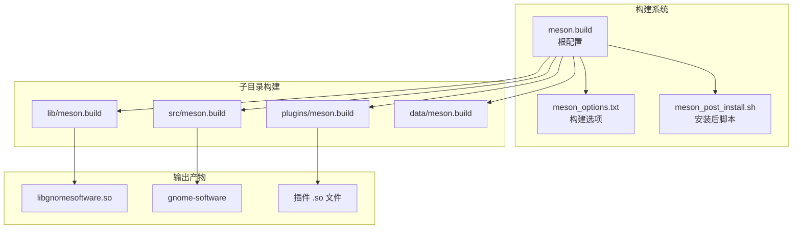
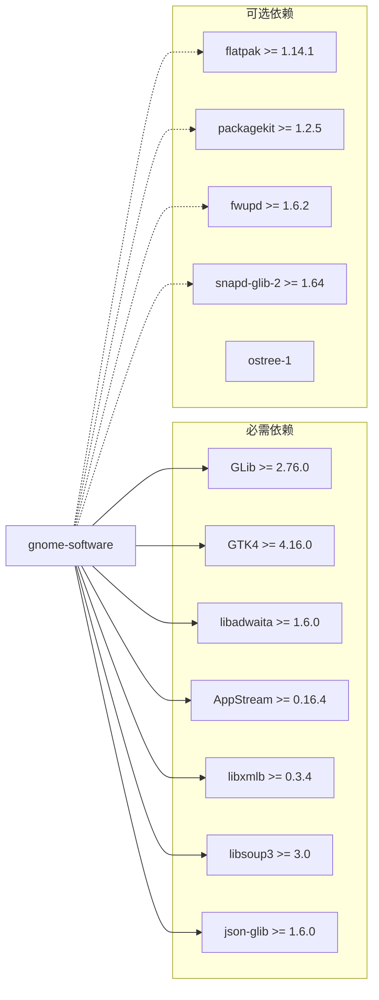
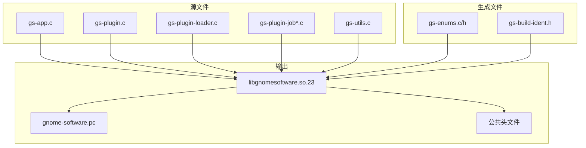
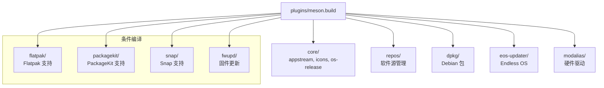
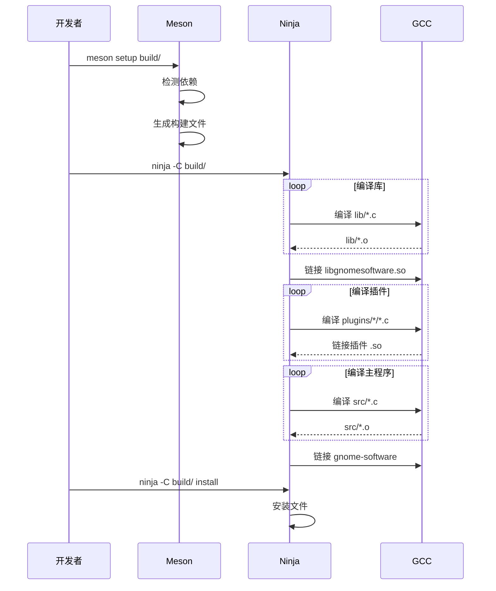

# 01 - 工程结构

## 模块概览

### 文件位置

- 根目录: `Examples/gnome-software/`
- 构建配置: `meson.build`, `meson_options.txt`
- 子项目: `subprojects/`

### 功能职责

工程结构模块定义了 GNOME Software 的构建系统配置、依赖管理、编译选项和安装规则。

### 模块关系图



## 核心配置文件

### meson.build 根配置

```c
// 文件: Examples/gnome-software/meson.build

project('gnome-software', 'c',
  version : '49.3',
  license : 'GPL-2.0-or-later',
  default_options : ['warning_level=2', 'c_std=c11'],
  meson_version : '>=1.6.0'
)

// 插件 API 版本 - 用于插件兼容性检查
gs_plugin_api_version = '23'

// 私有库安装目录
gs_private_libdir = join_paths(
  get_option('prefix'), 
  get_option('libdir'), 
  'gnome-software'
)
```

### 构建选项定义

| 选项名 | 类型 | 默认值 | 说明 |
|--------|------|--------|------|
| `profile` | string | '' | 构建配置文件 (Devel) |
| `packagekit` | boolean | true | PackageKit 传统包支持 |
| `flatpak` | boolean | true | Flatpak 沙盒应用支持 |
| `snap` | boolean | false | Snap 包支持 |
| `fwupd` | boolean | true | 固件更新支持 |
| `malcontent` | boolean | false | 家长控制支持 |
| `mogwai` | boolean | false | 流量计费调度 |
| `polkit` | boolean | true | PolicyKit 权限支持 |
| `external_appstream` | boolean | false | 外部 AppStream 数据 |
| `dkms` | boolean | false | DKMS 驱动支持 |
| `webapps` | boolean | false | Web 应用支持 |
| `man` | boolean | true | 生成手册页 |
| `tests` | boolean | true | 构建测试 |

## 依赖配置

### 核心依赖



### 依赖版本表

| 依赖 | 最低版本 | 用途 |
|------|----------|------|
| glib-2.0 | 2.76.0 | 基础类型、主循环、异步 IO |
| gio-unix-2.0 | 2.56.0 | Unix 特定 GIO 功能 |
| gtk4 | 4.16.0 | 用户界面框架 |
| libadwaita-1 | 1.6.0 | GNOME UI 组件 |
| appstream | 0.16.4 | 应用元数据解析 |
| libxmlb | 0.3.4 | XML 数据库查询 |
| libsoup-3.0 | 3.0 | HTTP 客户端 |
| json-glib-1.0 | 1.6.0 | JSON 解析 |
| gsettings-desktop-schemas | 3.18.0 | 桌面设置 |

## 构建目标

### 库构建 (lib/)



### 主程序构建 (src/)

| 构建目标 | 说明 |
|----------|------|
| `gnome-software` | 主 GUI 程序 |
| `gnome-software-restarter` | 重启辅助程序 |
| `gnome-software-cmd` | 命令行工具 |

### 插件构建 (plugins/)



## 安装布局

### 目录结构

```
${prefix}/
├── bin/
│   └── gnome-software              # 主程序
├── lib/
│   └── gnome-software/             # 私有库目录
│       ├── libgnomesoftware.so.23  # 核心库
│       └── plugins-23/             # 插件目录
│           ├── libgs_plugin_appstream.so
│           ├── libgs_plugin_flatpak.so
│           └── ...
├── libexec/
│   ├── gnome-software-cmd          # 命令行工具
│   └── gnome-software-restarter    # 重启辅助
├── share/
│   ├── applications/               # 桌面文件
│   ├── dbus-1/services/            # D-Bus 服务
│   ├── glib-2.0/schemas/           # GSettings
│   ├── gnome-shell/search-providers/
│   ├── icons/                      # 图标
│   ├── locale/                     # 翻译
│   └── metainfo/                   # AppStream 数据
└── include/
    └── gnome-software/             # 公共头文件
```

### 服务配置

| 服务 | 文件 | 用途 |
|------|------|------|
| D-Bus 服务 | `org.gnome.Software.service` | D-Bus 激活 |
| Systemd 用户服务 | `gnome-software.service` | 后台更新 |
| 搜索提供者 | `org.gnome.Software-search-provider.ini` | GNOME Shell 搜索 |

## 编译器选项

### 警告标志

```c
// 启用的警告
'-Waggregate-return'
'-Warray-bounds'
'-Wcast-align'
'-Wformat=2'
'-Wmissing-declarations'
'-Wmissing-prototypes'
'-Wnull-dereference'
'-Wshadow'
'-Wstrict-prototypes'

// 作为错误处理
'-Werror=implicit-function-declaration'
'-Werror=nested-externs'
```

### 安全加固

```c
// 栈保护
'-fstack-protector-strong'

// RELRO (只读重定位)
'-Wl,-z,relro'
'-Wl,-z,now'
```

## 构建流程



## 测试配置

### 测试环境变量

```bash
G_DEBUG=gc-friendly
G_ENABLE_DIAGNOSTIC=1
MALLOC_CHECK_=2
GSETTINGS_SCHEMA_DIR=build/data/
GSETTINGS_BACKEND=memory
FLATPAK_SYSTEM_HELPER_ON_SESSION=1
```

### 测试目标

| 测试套件 | 位置 | 说明 |
|----------|------|------|
| `gs-self-test-lib` | lib/gs-self-test.c | 核心库测试 |
| `gs-self-test-src` | src/gs-self-test.c | UI 组件测试 |
| 插件测试 | plugins/*/gs-self-test.c | 各插件测试 |

---

**导航**
- 下一篇：[02-核心库.md](02-核心库.md)
- [返回目录](README.md)
