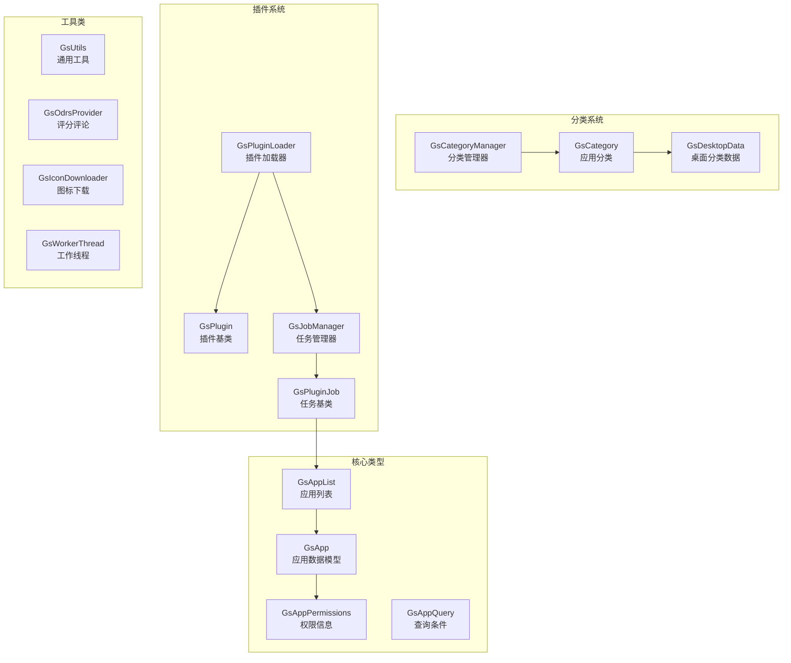
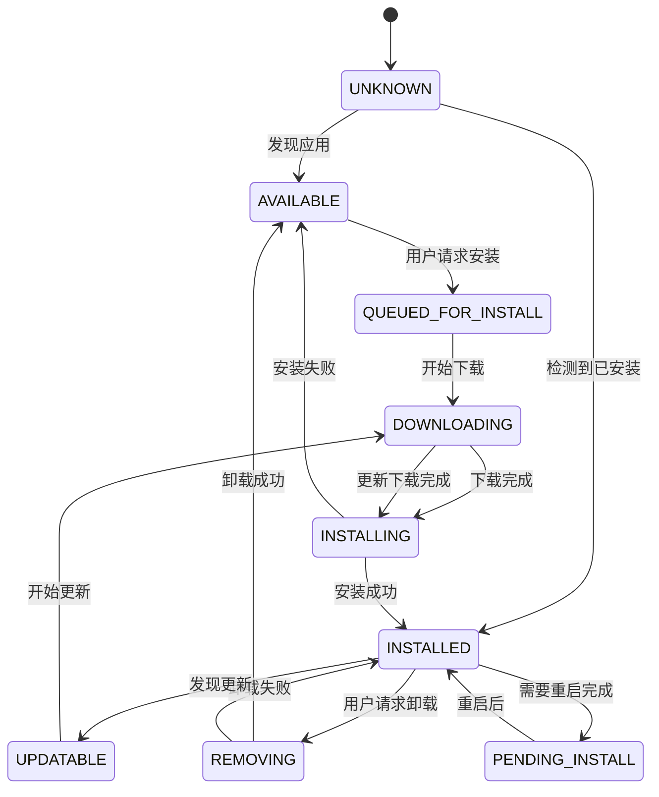
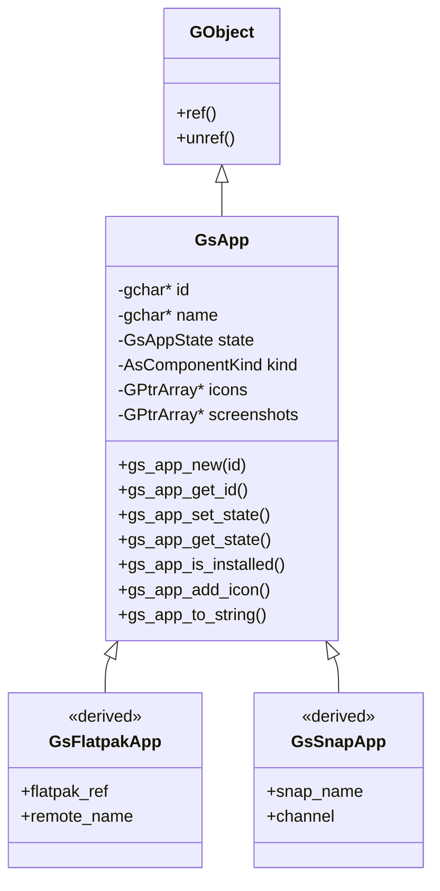
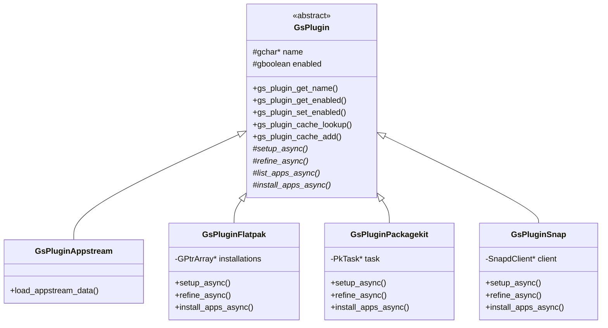
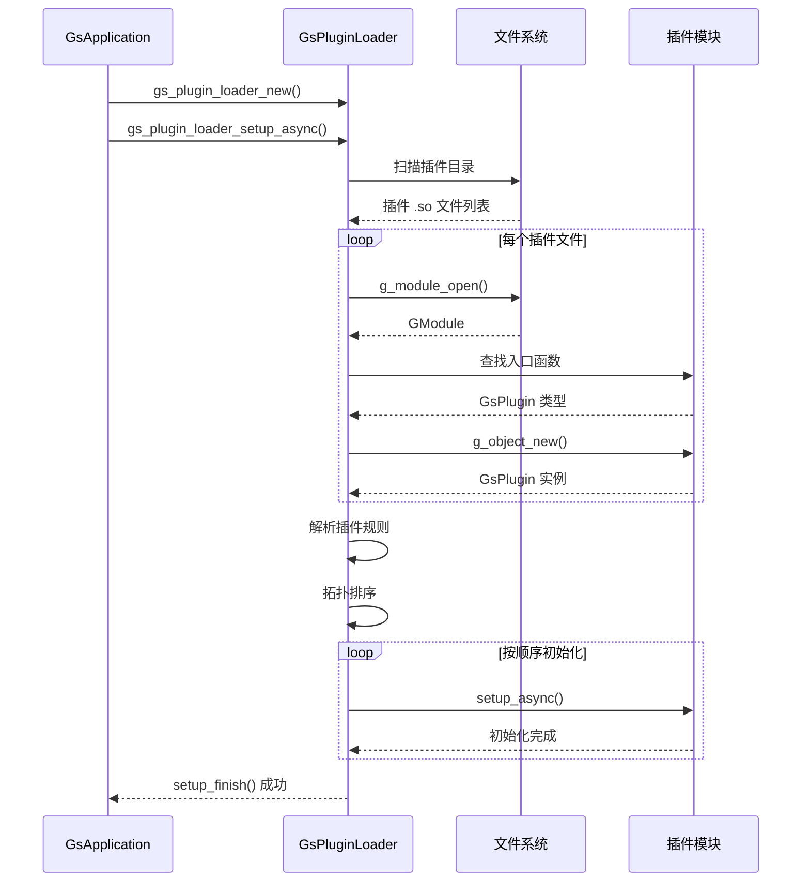
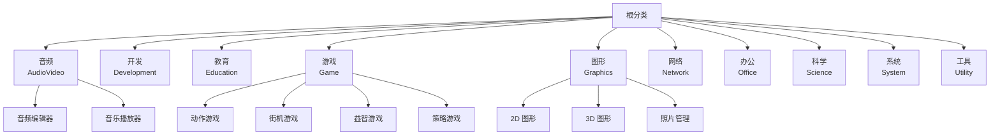

# 02 - 核心库

## 模块概览

### 文件位置

- 目录: `Examples/gnome-software/lib/`
- 头文件: `gnome-software.h` (统一入口)
- 私有头文件: `gnome-software-private.h`

### 功能职责

核心库 (libgnomesoftware) 提供了 GNOME Software 的基础架构，包括：

- 应用程序数据模型 (`GsApp`)
- 插件基类和接口 (`GsPlugin`)
- 插件加载和管理 (`GsPluginLoader`)
- 异步任务系统 (`GsPluginJob`)
- 分类管理 (`GsCategory`)
- 工具函数和帮助类

### 模块关系图



## GsApp - 应用数据模型

### 类定义

```c
// 文件: lib/gs-app.h

#define GS_TYPE_APP (gs_app_get_type ())
G_DECLARE_DERIVABLE_TYPE (GsApp, gs_app, GS, APP, GObject)

struct _GsAppClass
{
    GObjectClass parent_class;
    
    // 虚函数：转换为字符串表示
    void (*to_string) (GsApp *app, GString *str);
    
    gpointer padding[30];
};
```

### 核心状态枚举

```c
// 文件: lib/gs-app.h

typedef enum {
    GS_APP_STATE_UNKNOWN,           // 未知状态
    GS_APP_STATE_INSTALLED,         // 已安装
    GS_APP_STATE_AVAILABLE,         // 可安装
    GS_APP_STATE_AVAILABLE_LOCAL,   // 本地文件可用
    GS_APP_STATE_UPDATABLE,         // 有更新
    GS_APP_STATE_UNAVAILABLE,       // 不可用
    GS_APP_STATE_QUEUED_FOR_INSTALL,// 等待安装
    GS_APP_STATE_INSTALLING,        // 安装中
    GS_APP_STATE_REMOVING,          // 卸载中
    GS_APP_STATE_UPDATABLE_LIVE,    // 可热更新
    GS_APP_STATE_PURCHASABLE,       // 可购买
    GS_APP_STATE_PURCHASING,        // 购买中
    GS_APP_STATE_PENDING_INSTALL,   // 待完成安装
    GS_APP_STATE_PENDING_REMOVE,    // 待完成卸载
    GS_APP_STATE_DOWNLOADING,       // 下载中
} GsAppState;
```

### 状态转换图



### 主要属性

| 属性 | 类型 | 说明 |
|------|------|------|
| `id` | string | 应用唯一标识符 |
| `name` | string | 显示名称 |
| `summary` | string | 简短描述 |
| `description` | string | 详细描述 |
| `version` | string | 当前版本 |
| `state` | GsAppState | 安装状态 |
| `kind` | AsComponentKind | 组件类型 |
| `scope` | AsComponentScope | 安装范围 |
| `bundle-kind` | AsBundleKind | 打包格式 |
| `origin` | string | 来源标识 |
| `license` | string | 许可证 |
| `rating` | int | 评分 (0-100) |
| `size-download` | uint64 | 下载大小 |
| `size-installed` | uint64 | 安装大小 |

### 继承关系图



### 关键 API

```c
// 创建应用
GsApp *gs_app_new (const gchar *id);

// 状态管理
GsAppState gs_app_get_state (GsApp *app);
void gs_app_set_state (GsApp *app, GsAppState state);
gboolean gs_app_is_installed (GsApp *app);
gboolean gs_app_is_updatable (GsApp *app);

// 基本信息
const gchar *gs_app_get_id (GsApp *app);
const gchar *gs_app_get_name (GsApp *app);
void gs_app_set_name (GsApp *app, GsAppQuality quality, const gchar *name);

// 图标管理
void gs_app_add_icon (GsApp *app, GIcon *icon);
GIcon *gs_app_get_icon_for_size (GsApp *app, guint size, guint scale, 
                                  const gchar *fallback);

// 大小信息
GsSizeType gs_app_get_size_download (GsApp *app, guint64 *size_bytes_out);
void gs_app_set_size_download (GsApp *app, GsSizeType type, guint64 size);
```

## GsAppList - 应用列表

### 类定义

```c
// 文件: lib/gs-app-list.h

#define GS_TYPE_APP_LIST (gs_app_list_get_type ())
G_DECLARE_FINAL_TYPE (GsAppList, gs_app_list, GS, APP_LIST, GObject)

// 创建和基本操作
GsAppList *gs_app_list_new (void);
void gs_app_list_add (GsAppList *list, GsApp *app);
void gs_app_list_remove (GsAppList *list, GsApp *app);
guint gs_app_list_length (GsAppList *list);
GsApp *gs_app_list_index (GsAppList *list, guint idx);

// 查询
GsApp *gs_app_list_lookup (GsAppList *list, const gchar *unique_id);
GPtrArray *gs_app_list_to_array (GsAppList *list);

// 过滤和排序
void gs_app_list_filter (GsAppList *list, GsAppListFilterFunc func, 
                         gpointer user_data);
void gs_app_list_sort (GsAppList *list, GsAppListSortFunc func, 
                       gpointer user_data);
```

### 伪代码: 列表去重

```
函数 gs_app_list_add(list, app):
    unique_id = gs_app_get_unique_id(app)
    
    如果 unique_id 在 list.hash_table 中存在:
        existing = hash_table[unique_id]
        合并 app 的新信息到 existing
        返回
    
    添加 app 到 list.array
    hash_table[unique_id] = app
```

## GsPlugin - 插件基类

### 类定义

```c
// 文件: lib/gs-plugin.h

#define GS_TYPE_PLUGIN (gs_plugin_get_type ())
G_DECLARE_DERIVABLE_TYPE (GsPlugin, gs_plugin, GS, PLUGIN, GObject)

struct _GsPluginClass
{
    GObjectClass parent_class;
    
    // 信号回调
    void (*updates_changed) (GsPlugin *plugin);
    void (*reload) (GsPlugin *plugin);
    void (*report_event) (GsPlugin *plugin, GsPluginEvent *event);
    void (*allow_updates) (GsPlugin *plugin, gboolean allow);
    void (*repository_changed) (GsPlugin *plugin, GsApp *repository);
    
    // 生命周期
    void (*setup_async) (GsPlugin *plugin, GCancellable *cancellable,
                         GAsyncReadyCallback callback, gpointer user_data);
    gboolean (*setup_finish) (GsPlugin *plugin, GAsyncResult *result,
                              GError **error);
    void (*shutdown_async) (GsPlugin *plugin, ...);
    gboolean (*shutdown_finish) (GsPlugin *plugin, ...);
    
    // 核心操作
    void (*refine_async) (GsPlugin *plugin, GsAppList *list,
                          GsPluginRefineFlags flags, ...);
    void (*list_apps_async) (GsPlugin *plugin, GsAppQuery *query, ...);
    void (*install_apps_async) (GsPlugin *plugin, GsAppList *apps, ...);
    void (*uninstall_apps_async) (GsPlugin *plugin, GsAppList *apps, ...);
    void (*update_apps_async) (GsPlugin *plugin, GsAppList *apps, ...);
    
    // 更多虚函数...
    gpointer padding[23];
};
```

### 插件类继承图



### 插件规则

```c
// 定义插件执行顺序和依赖
typedef enum {
    GS_PLUGIN_RULE_RUN_AFTER,    // 在指定插件之后运行
    GS_PLUGIN_RULE_RUN_BEFORE,   // 在指定插件之前运行
    GS_PLUGIN_RULE_CONFLICTS,    // 与指定插件冲突
    GS_PLUGIN_RULE_BETTER_THAN,  // 优先级高于指定插件
} GsPluginRule;

// 使用示例
void gs_plugin_add_rule (GsPlugin *plugin, 
                         GsPluginRule rule, 
                         const gchar *name);
```

## GsPluginLoader - 插件加载器

### 类定义

```c
// 文件: lib/gs-plugin-loader.h

#define GS_TYPE_PLUGIN_LOADER (gs_plugin_loader_get_type ())
G_DECLARE_FINAL_TYPE (GsPluginLoader, gs_plugin_loader, 
                      GS, PLUGIN_LOADER, GObject)

// 创建加载器
GsPluginLoader *gs_plugin_loader_new (
    GDBusConnection *session_bus,
    GDBusConnection *system_bus
);

// 初始化
void gs_plugin_loader_setup_async (
    GsPluginLoader *loader,
    const gchar * const *allowlist,
    const gchar * const *blocklist,
    GCancellable *cancellable,
    GAsyncReadyCallback callback,
    gpointer user_data
);

// 执行任务
void gs_plugin_loader_job_process_async (
    GsPluginLoader *loader,
    GsPluginJob *job,
    GCancellable *cancellable,
    GAsyncReadyCallback callback,
    gpointer user_data
);
```

### 加载流程



### 插件排序算法

```
伪代码: 插件拓扑排序

输入: 插件列表 plugins, 规则集合 rules
输出: 排序后的插件列表

1. 构建依赖图:
   对于每个规则 (plugin_a, RUN_AFTER, plugin_b):
       添加边 plugin_b -> plugin_a
   
   对于每个规则 (plugin_a, RUN_BEFORE, plugin_b):
       添加边 plugin_a -> plugin_b

2. Kahn 算法:
   in_degree[] = 计算每个节点的入度
   queue = 入度为0的节点
   result = []
   
   当 queue 非空:
       node = queue.pop()
       result.append(node)
       对于 node 的每个后继 successor:
           in_degree[successor]--
           如果 in_degree[successor] == 0:
               queue.push(successor)

3. 返回 result
```

## GsCategory - 应用分类

### 类定义

```c
// 文件: lib/gs-category.h

#define GS_TYPE_CATEGORY (gs_category_get_type ())
G_DECLARE_FINAL_TYPE (GsCategory, gs_category, GS, CATEGORY, GObject)

// 创建分类
GsCategory *gs_category_new_for_desktop_data (const GsDesktopData *data);

// 属性访问
const gchar *gs_category_get_id (GsCategory *category);
const gchar *gs_category_get_name (GsCategory *category);
const gchar *gs_category_get_icon_name (GsCategory *category);
gint gs_category_get_score (GsCategory *category);

// 层级关系
GsCategory *gs_category_get_parent (GsCategory *category);
GPtrArray *gs_category_get_children (GsCategory *category);
GsCategory *gs_category_find_child (GsCategory *category, const gchar *id);

// 大小统计
guint gs_category_get_size (GsCategory *category);
void gs_category_increment_size (GsCategory *category, guint value);
```

### 分类层级结构



## 公共头文件

### gnome-software.h

```c
// 文件: lib/gnome-software.h
// 插件开发统一入口

#include <gs-app.h>
#include <gs-app-list.h>
#include <gs-app-permissions.h>
#include <gs-app-query.h>
#include <gs-appstream.h>
#include <gs-category.h>
#include <gs-category-manager.h>
#include <gs-desktop-data.h>
#include <gs-download-utils.h>
#include <gs-icon.h>
#include <gs-metered.h>
#include <gs-odrs-provider.h>
#include <gs-os-release.h>
#include <gs-plugin.h>
#include <gs-plugin-event.h>
#include <gs-plugin-helpers.h>
#include <gs-plugin-job.h>
#include <gs-plugin-loader.h>
#include <gs-plugin-types.h>
#include <gs-plugin-vfuncs.h>
#include <gs-remote-icon.h>
#include <gs-utils.h>
```

## 工具类

### GsWorkerThread

```c
// 文件: lib/gs-worker-thread.h
// 后台工作线程，用于执行阻塞操作

GsWorkerThread *gs_worker_thread_new (const gchar *name);
void gs_worker_thread_queue (GsWorkerThread *self,
                             GTaskThreadFunc work_func,
                             GTask *task);
```

### GsOdrsProvider

```c
// 文件: lib/gs-odrs-provider.h
// ODRS (Open Desktop Ratings Service) 评分服务

GsOdrsProvider *gs_odrs_provider_new (void);
void gs_odrs_provider_fetch_reviews_async (
    GsOdrsProvider *self,
    GsApp *app,
    GCancellable *cancellable,
    GAsyncReadyCallback callback,
    gpointer user_data
);
```

---

**导航**
- 上一篇：[01-工程结构.md](01-工程结构.md)
- 下一篇：[03-插件系统.md](03-插件系统.md)
- [返回目录](README.md)
