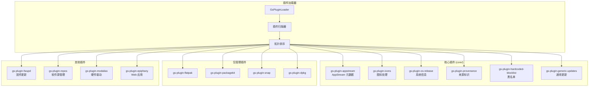
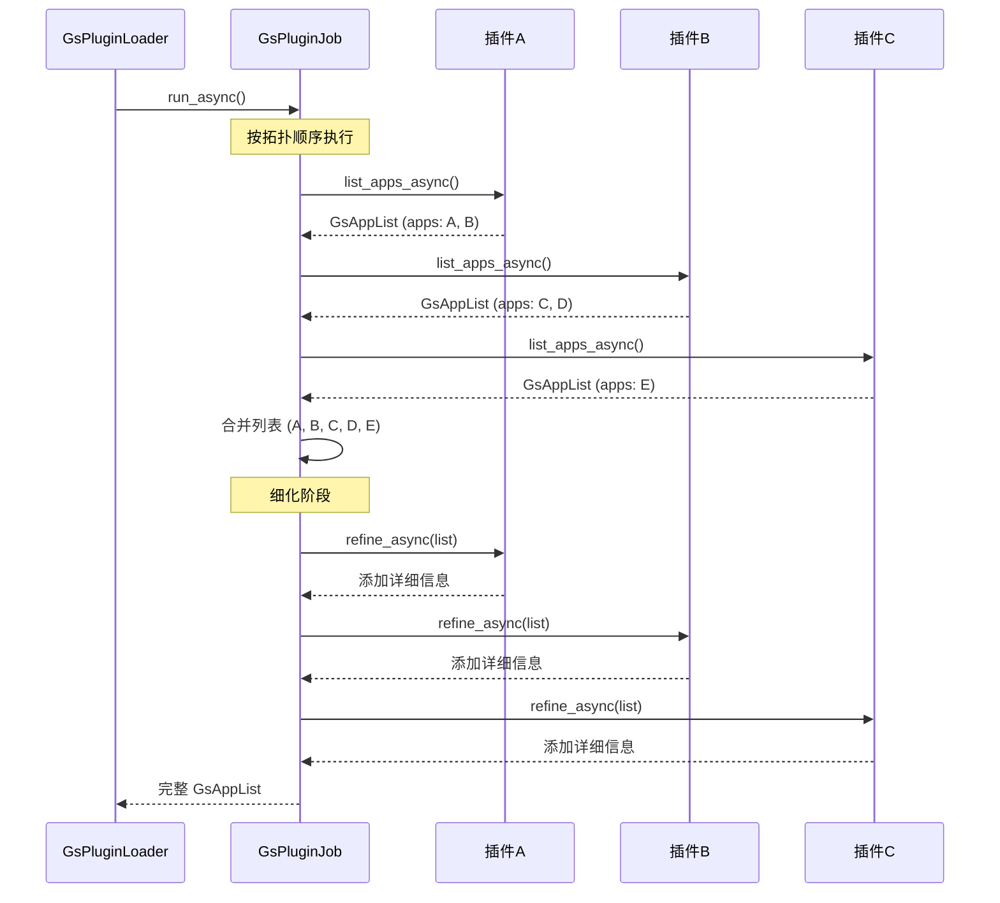
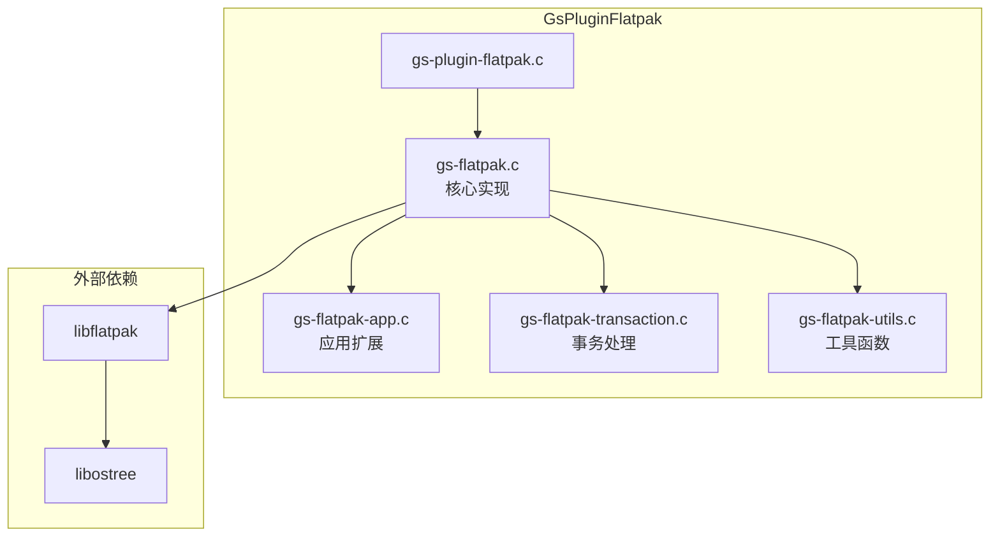
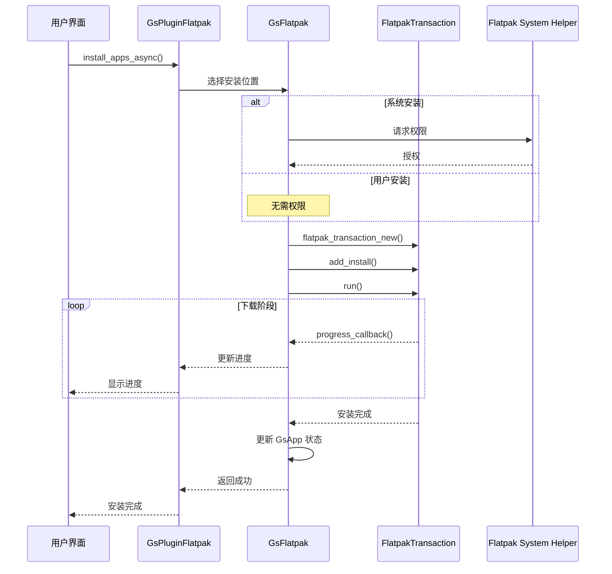
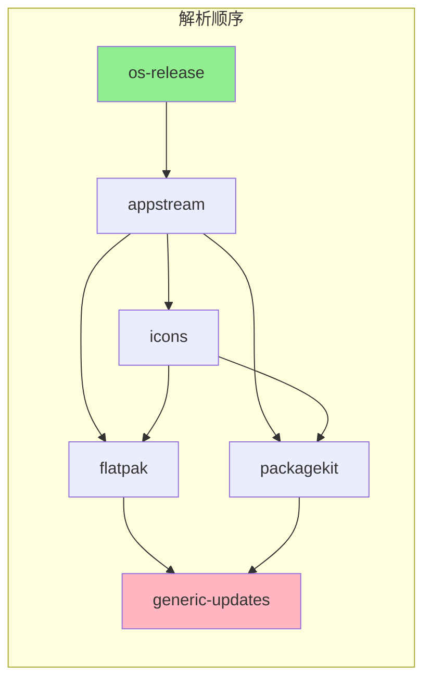
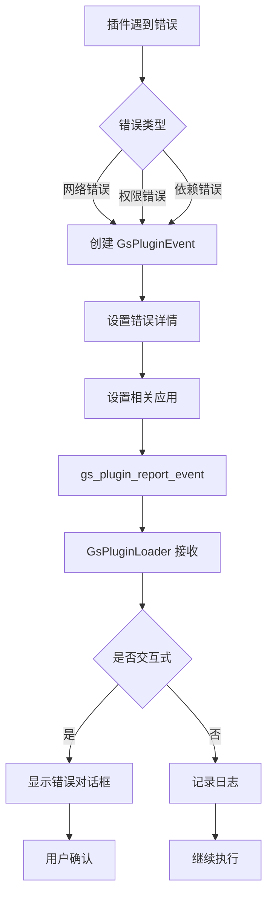

# 03 - 插件系统

## 模块概览

### 文件位置

- 插件目录: `Examples/gnome-software/plugins/`
- 核心插件: `plugins/core/`
- 第三方插件构建配置: `plugins/meson.build`

### 功能职责

插件系统是 GNOME Software 的核心扩展机制，通过插件可以：

- 支持不同的软件包格式 (Flatpak, Snap, DEB, RPM)
- 接入不同的软件源和仓库
- 提供应用元数据 (AppStream)
- 处理固件更新
- 实现发行版特定功能

### 模块关系图



## 插件接口

### GsPlugin 虚函数表

```c
// 文件: lib/gs-plugin.h

struct _GsPluginClass {
    GObjectClass parent_class;
    
    // === 生命周期管理 ===
    
    // 插件初始化
    void (*setup_async) (GsPlugin *plugin,
                         GCancellable *cancellable,
                         GAsyncReadyCallback callback,
                         gpointer user_data);
    gboolean (*setup_finish) (GsPlugin *plugin,
                              GAsyncResult *result,
                              GError **error);
    
    // 插件关闭
    void (*shutdown_async) (GsPlugin *plugin, ...);
    gboolean (*shutdown_finish) (GsPlugin *plugin, ...);
    
    // === 应用发现 ===
    
    // 列出应用
    void (*list_apps_async) (GsPlugin *plugin,
                             GsAppQuery *query,
                             GsPluginListAppsFlags flags,
                             GCancellable *cancellable,
                             GAsyncReadyCallback callback,
                             gpointer user_data);
    GsAppList *(*list_apps_finish) (GsPlugin *plugin,
                                    GAsyncResult *result,
                                    GError **error);
    
    // 细化应用信息
    void (*refine_async) (GsPlugin *plugin,
                          GsAppList *list,
                          GsPluginRefineFlags flags,
                          GsPluginRefineRequireFlags require_flags,
                          GCancellable *cancellable,
                          GAsyncReadyCallback callback,
                          gpointer user_data);
    gboolean (*refine_finish) (GsPlugin *plugin,
                               GAsyncResult *result,
                               GError **error);
    
    // === 应用操作 ===
    
    // 安装应用
    void (*install_apps_async) (GsPlugin *plugin,
                                GsAppList *apps,
                                GsPluginInstallAppsFlags flags,
                                GsPluginProgressCallback progress_cb,
                                gpointer progress_data,
                                GCancellable *cancellable,
                                GAsyncReadyCallback callback,
                                gpointer user_data);
    gboolean (*install_apps_finish) (GsPlugin *plugin,
                                     GAsyncResult *result,
                                     GError **error);
    
    // 卸载应用
    void (*uninstall_apps_async) (GsPlugin *plugin, ...);
    gboolean (*uninstall_apps_finish) (GsPlugin *plugin, ...);
    
    // 更新应用
    void (*update_apps_async) (GsPlugin *plugin, ...);
    gboolean (*update_apps_finish) (GsPlugin *plugin, ...);
    
    // === 其他操作 ===
    
    // 刷新元数据
    void (*refresh_metadata_async) (GsPlugin *plugin, ...);
    
    // 分类细化
    void (*refine_categories_async) (GsPlugin *plugin, ...);
    
    // 文件转应用
    void (*file_to_app_async) (GsPlugin *plugin, GFile *file, ...);
    
    // URL 转应用
    void (*url_to_app_async) (GsPlugin *plugin, const gchar *url, ...);
    
    // 启动应用
    void (*launch_async) (GsPlugin *plugin, GsApp *app, ...);
    
    // 仓库管理
    void (*install_repository_async) (GsPlugin *plugin, GsApp *repo, ...);
    void (*remove_repository_async) (GsPlugin *plugin, GsApp *repo, ...);
    void (*enable_repository_async) (GsPlugin *plugin, GsApp *repo, ...);
    void (*disable_repository_async) (GsPlugin *plugin, GsApp *repo, ...);
    
    // 发行版升级
    void (*list_distro_upgrades_async) (GsPlugin *plugin, ...);
    void (*download_upgrade_async) (GsPlugin *plugin, GsApp *app, ...);
    void (*trigger_upgrade_async) (GsPlugin *plugin, GsApp *app, ...);
    
    gpointer padding[23];
};
```

### 细化标志

```c
// 文件: lib/gs-plugin-types.h

typedef enum {
    GS_PLUGIN_REFINE_REQUIRE_FLAGS_NONE           = 0,
    GS_PLUGIN_REFINE_REQUIRE_FLAGS_ID             = 1 << 0,
    GS_PLUGIN_REFINE_REQUIRE_FLAGS_LICENSE        = 1 << 1,
    GS_PLUGIN_REFINE_REQUIRE_FLAGS_URL            = 1 << 2,
    GS_PLUGIN_REFINE_REQUIRE_FLAGS_DESCRIPTION    = 1 << 3,
    GS_PLUGIN_REFINE_REQUIRE_FLAGS_SIZE           = 1 << 4,
    GS_PLUGIN_REFINE_REQUIRE_FLAGS_RATING         = 1 << 5,
    GS_PLUGIN_REFINE_REQUIRE_FLAGS_VERSION        = 1 << 6,
    GS_PLUGIN_REFINE_REQUIRE_FLAGS_HISTORY        = 1 << 7,
    GS_PLUGIN_REFINE_REQUIRE_FLAGS_SETUP_ACTION   = 1 << 8,
    GS_PLUGIN_REFINE_REQUIRE_FLAGS_UPDATE_DETAILS = 1 << 9,
    GS_PLUGIN_REFINE_REQUIRE_FLAGS_ORIGIN         = 1 << 10,
    GS_PLUGIN_REFINE_REQUIRE_FLAGS_ORIGIN_UI      = 1 << 11,
    GS_PLUGIN_REFINE_REQUIRE_FLAGS_PERMISSIONS    = 1 << 12,
    GS_PLUGIN_REFINE_REQUIRE_FLAGS_SCREENSHOTS    = 1 << 13,
    GS_PLUGIN_REFINE_REQUIRE_FLAGS_CATEGORIES     = 1 << 14,
    GS_PLUGIN_REFINE_REQUIRE_FLAGS_ICON           = 1 << 15,
} GsPluginRefineRequireFlags;
```

## 插件实现模式

### 插件模板

```c
// 文件: plugins/example/gs-plugin-example.c

#include <gnome-software.h>

struct _GsPluginExample {
    GsPlugin parent;
    
    // 私有数据
    SomeClient *client;
    GHashTable *cache;
};

G_DEFINE_TYPE (GsPluginExample, gs_plugin_example, GS_TYPE_PLUGIN)

static void
gs_plugin_example_init (GsPluginExample *self)
{
    GsPlugin *plugin = GS_PLUGIN (self);
    
    // 设置插件名称
    gs_plugin_set_name (plugin, "example");
    
    // 添加规则
    gs_plugin_add_rule (plugin, GS_PLUGIN_RULE_RUN_AFTER, "appstream");
}

static void
gs_plugin_example_setup_async (GsPlugin *plugin,
                               GCancellable *cancellable,
                               GAsyncReadyCallback callback,
                               gpointer user_data)
{
    GsPluginExample *self = GS_PLUGIN_EXAMPLE (plugin);
    g_autoptr(GTask) task = g_task_new (plugin, cancellable, callback, user_data);
    
    // 初始化资源
    self->client = some_client_new ();
    self->cache = g_hash_table_new_full (g_str_hash, g_str_equal, 
                                          g_free, g_object_unref);
    
    g_task_return_boolean (task, TRUE);
}

static gboolean
gs_plugin_example_setup_finish (GsPlugin *plugin,
                                GAsyncResult *result,
                                GError **error)
{
    return g_task_propagate_boolean (G_TASK (result), error);
}

static void
gs_plugin_example_class_init (GsPluginExampleClass *klass)
{
    GsPluginClass *plugin_class = GS_PLUGIN_CLASS (klass);
    
    plugin_class->setup_async = gs_plugin_example_setup_async;
    plugin_class->setup_finish = gs_plugin_example_setup_finish;
    // 实现其他虚函数...
}
```

### 插件执行流程



## 核心插件详解

### AppStream 插件

```c
// 文件: plugins/core/gs-plugin-appstream.c
// 职责: 加载和解析 AppStream 元数据

struct _GsPluginAppstream {
    GsPlugin parent;
    XbSilo *silo;           // libxmlb 数据库
    GHashTable *components; // 组件缓存
};

// 关键功能:
// - 加载 /usr/share/appdata/*.xml
// - 加载 /var/lib/flatpak/app/.../appdata
// - 解析 AppStream 组件到 GsApp
// - 提供搜索和分类查询
```

### Icons 插件

```c
// 文件: plugins/core/gs-plugin-icons.c
// 职责: 下载和管理应用图标

// 图标处理流程:
// 1. 检查本地缓存
// 2. 从远程 URL 下载
// 3. 缩放到合适大小
// 4. 缓存到本地
```

### Provenance 插件

```c
// 文件: plugins/core/gs-plugin-provenance.c
// 职责: 标识应用来源可信度

// 检查应用是否来自:
// - 官方发行版仓库
// - 已验证的第三方源
// - 未知来源
```

## 包管理插件

### Flatpak 插件架构



### Flatpak 安装流程



### PackageKit 插件

```c
// 文件: plugins/packagekit/gs-plugin-packagekit.c

struct _GsPluginPackagekit {
    GsPlugin parent;
    PkTask *task;           // PackageKit 任务
    PkControl *control;     // 守护进程控制
};

// 支持的操作:
// - 搜索包
// - 安装/卸载包
// - 系统更新
// - 依赖解析
// - 事务历史
```

### Snap 插件

```c
// 文件: plugins/snap/gs-plugin-snap.c

struct _GsPluginSnap {
    GsPlugin parent;
    SnapdClient *client;    // snapd 客户端
    GHashTable *store_snaps; // 商店缓存
};

// 特殊处理:
// - 通道 (stable, beta, edge)
// - 连接 (plugs/slots)
// - 权限管理
```

## 插件规则系统

### 规则类型

| 规则 | 说明 | 示例 |
|------|------|------|
| `RUN_AFTER` | 在指定插件之后运行 | flatpak → appstream |
| `RUN_BEFORE` | 在指定插件之前运行 | icons → details |
| `CONFLICTS` | 与指定插件冲突 | snap → flatpak (同一应用) |
| `BETTER_THAN` | 优先级高于指定插件 | flatpak → packagekit |

### 规则示例

```c
// Flatpak 插件规则
static void
gs_plugin_flatpak_init (GsPluginFlatpak *self)
{
    GsPlugin *plugin = GS_PLUGIN (self);
    
    // 在 AppStream 之后运行，需要元数据
    gs_plugin_add_rule (plugin, GS_PLUGIN_RULE_RUN_AFTER, "appstream");
    
    // 在图标插件之后运行
    gs_plugin_add_rule (plugin, GS_PLUGIN_RULE_RUN_AFTER, "icons");
    
    // Flatpak 优先于 PackageKit (同一应用)
    gs_plugin_add_rule (plugin, GS_PLUGIN_RULE_BETTER_THAN, "packagekit");
}
```

### 依赖图解析



## 插件缓存

### 缓存 API

```c
// 查找缓存
GsApp *gs_plugin_cache_lookup (GsPlugin *plugin, const gchar *key);

// 添加到缓存
void gs_plugin_cache_add (GsPlugin *plugin, const gchar *key, GsApp *app);

// 移除缓存
void gs_plugin_cache_remove (GsPlugin *plugin, const gchar *key);

// 清空缓存
void gs_plugin_cache_invalidate (GsPlugin *plugin);

// 列出所有缓存
GsAppList *gs_plugin_list_cached (GsPlugin *plugin);
```

### 缓存键格式

```
{plugin_name}:{unique_id}

示例:
flatpak:user/flatpak/*/org.mozilla.Firefox/stable
packagekit:installed:firefox
snap:installed:firefox
```

## 事件系统

### GsPluginEvent

```c
// 文件: lib/gs-plugin-event.h

typedef enum {
    GS_PLUGIN_EVENT_FLAG_NONE       = 0,
    GS_PLUGIN_EVENT_FLAG_WARNING    = 1 << 0,
    GS_PLUGIN_EVENT_FLAG_INTERACTIVE = 1 << 1,
} GsPluginEventFlags;

// 创建事件
GsPluginEvent *gs_plugin_event_new (void);

// 设置信息
void gs_plugin_event_set_app (GsPluginEvent *event, GsApp *app);
void gs_plugin_event_set_error (GsPluginEvent *event, const GError *error);
void gs_plugin_event_add_flag (GsPluginEvent *event, GsPluginEventFlags flag);

// 上报事件
void gs_plugin_report_event (GsPlugin *plugin, GsPluginEvent *event);
```

### 事件处理流程



---

**导航**
- 上一篇：[02-核心库.md](02-核心库.md)
- 下一篇：[04-任务调度.md](04-任务调度.md)
- [返回目录](README.md)
