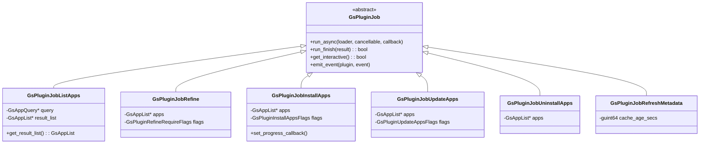

# 04 - 任务调度

## 模块概览

### 文件位置

- 基类: `lib/gs-plugin-job.c/h`
- 任务管理器: `lib/gs-job-manager.c/h`
- 具体任务实现: `lib/gs-plugin-job-*.c/h`

### 功能职责

任务调度模块负责管理 GNOME Software 中的所有异步操作，包括：

- 应用搜索和列表查询
- 应用安装、卸载和更新
- 元数据刷新
- 发行版升级
- 仓库管理

### 模块关系图

```mermaid
graph TB
    subgraph "任务管理"
        JOBMGR[GsJobManager<br/>任务管理器]
        PENDING[待处理队列]
        ACTIVE[活动任务集]
    end
    
    subgraph "任务基类"
        JOB[GsPluginJob<br/>任务基类]
    end
    
    subgraph "查询任务"
        LIST_APPS[GsPluginJobListApps<br/>列出应用]
        LIST_CAT[GsPluginJobListCategories<br/>列出分类]
        LIST_UPGRADE[GsPluginJobListDistroUpgrades<br/>列出升级]
        REFINE[GsPluginJobRefine<br/>细化信息]
    end
    
    subgraph "操作任务"
        INSTALL[GsPluginJobInstallApps<br/>安装应用]
        UNINSTALL[GsPluginJobUninstallApps<br/>卸载应用]
        UPDATE[GsPluginJobUpdateApps<br/>更新应用]
        LAUNCH[GsPluginJobLaunch<br/>启动应用]
    end
    
    subgraph "其他任务"
        REFRESH[GsPluginJobRefreshMetadata<br/>刷新元数据]
        FILE2APP[GsPluginJobFileToApp<br/>文件转应用]
        URL2APP[GsPluginJobUrlToApp<br/>URL转应用]
        REPO[GsPluginJobManageRepository<br/>仓库管理]
    end
    
    JOBMGR --> PENDING
    JOBMGR --> ACTIVE
    ACTIVE --> JOB
    
    JOB <|-- LIST_APPS
    JOB <|-- LIST_CAT
    JOB <|-- LIST_UPGRADE
    JOB <|-- REFINE
    
    JOB <|-- INSTALL
    JOB <|-- UNINSTALL
    JOB <|-- UPDATE
    JOB <|-- LAUNCH
    
    JOB <|-- REFRESH
    JOB <|-- FILE2APP
    JOB <|-- URL2APP
    JOB <|-- REPO
```

## GsPluginJob - 任务基类

### 类定义

```c
// 文件: lib/gs-plugin-job.h

#define GS_TYPE_PLUGIN_JOB (gs_plugin_job_get_type ())
G_DECLARE_DERIVABLE_TYPE (GsPluginJob, gs_plugin_job, GS, PLUGIN_JOB, GObject)

struct _GsPluginJobClass
{
    GObjectClass parent_class;

    // 异步执行任务
    void (*run_async) (GsPluginJob         *self,
                       GsPluginLoader      *plugin_loader,
                       GCancellable        *cancellable,
                       GAsyncReadyCallback  callback,
                       gpointer             user_data);
    
    // 完成任务
    gboolean (*run_finish) (GsPluginJob   *self,
                            GAsyncResult  *result,
                            GError       **error);
    
    // 是否交互式
    gboolean (*get_interactive) (GsPluginJob *self);
};
```

### 任务继承图



## 任务类型详解

### GsPluginJobListApps

```c
// 文件: lib/gs-plugin-job-list-apps.h

// 创建列表任务
GsPluginJob *gs_plugin_job_list_apps_new (GsAppQuery *query,
                                          GsPluginListAppsFlags flags);

// 获取结果
GsAppList *gs_plugin_job_list_apps_get_result_list (GsPluginJobListApps *self);
```

#### 查询条件 (GsAppQuery)

```c
// 文件: lib/gs-app-query.h

// 创建查询
GsAppQuery *gs_app_query_new (const gchar *first_property, ...);

// 查询属性
typedef enum {
    // 搜索
    "keywords",           // 搜索关键词 (gchar**)
    "provides-files",     // 提供的文件
    
    // 过滤
    "is-installed",       // 是否已安装
    "is-source",          // 是否为软件源
    "is-curated",         // 是否精选
    
    // 分类
    "category",           // 分类 (GsCategory*)
    
    // 分页
    "max-results",        // 最大结果数
    "sort-func",          // 排序函数
} GsAppQueryProperty;
```

### GsPluginJobRefine

```c
// 文件: lib/gs-plugin-job-refine.h

// 创建细化任务
GsPluginJob *gs_plugin_job_refine_new (GsAppList *apps,
                                       GsPluginRefineFlags flags,
                                       GsPluginRefineRequireFlags require_flags);

// 细化标志
typedef enum {
    GS_PLUGIN_REFINE_FLAGS_NONE            = 0,
    GS_PLUGIN_REFINE_FLAGS_INTERACTIVE     = 1 << 0,  // 交互式操作
    GS_PLUGIN_REFINE_FLAGS_DISABLE_FILTERING = 1 << 1, // 禁用过滤
} GsPluginRefineFlags;
```

### GsPluginJobInstallApps

```c
// 文件: lib/gs-plugin-job-install-apps.h

// 创建安装任务
GsPluginJob *gs_plugin_job_install_apps_new (GsAppList *apps,
                                             GsPluginInstallAppsFlags flags);

// 安装标志
typedef enum {
    GS_PLUGIN_INSTALL_APPS_FLAGS_NONE         = 0,
    GS_PLUGIN_INSTALL_APPS_FLAGS_INTERACTIVE  = 1 << 0,  // 交互式
    GS_PLUGIN_INSTALL_APPS_FLAGS_NO_DOWNLOAD  = 1 << 1,  // 仅安装已下载
    GS_PLUGIN_INSTALL_APPS_FLAGS_NO_APPLY     = 1 << 2,  // 仅下载不安装
} GsPluginInstallAppsFlags;

// 进度回调
typedef void (*GsPluginProgressCallback) (GsApp    *app,
                                          guint     percentage,
                                          gpointer  user_data);
```

### GsPluginJobUpdateApps

```c
// 文件: lib/gs-plugin-job-update-apps.h

// 创建更新任务
GsPluginJob *gs_plugin_job_update_apps_new (GsAppList *apps,
                                            GsPluginUpdateAppsFlags flags);

// 更新标志
typedef enum {
    GS_PLUGIN_UPDATE_APPS_FLAGS_NONE         = 0,
    GS_PLUGIN_UPDATE_APPS_FLAGS_INTERACTIVE  = 1 << 0,
    GS_PLUGIN_UPDATE_APPS_FLAGS_NO_DOWNLOAD  = 1 << 1,
    GS_PLUGIN_UPDATE_APPS_FLAGS_NO_APPLY     = 1 << 2,
} GsPluginUpdateAppsFlags;
```

## GsJobManager - 任务管理器

### 类定义

```c
// 文件: lib/gs-job-manager.h

#define GS_TYPE_JOB_MANAGER (gs_job_manager_get_type ())
G_DECLARE_FINAL_TYPE (GsJobManager, gs_job_manager, GS, JOB_MANAGER, GObject)

// 创建管理器
GsJobManager *gs_job_manager_new (void);

// 添加任务
void gs_job_manager_add_job (GsJobManager *self, GsPluginJob *job);

// 移除任务
void gs_job_manager_remove_job (GsJobManager *self, GsPluginJob *job);

// 获取活动任务
GPtrArray *gs_job_manager_get_pending_jobs (GsJobManager *self);
```

### 任务状态图


## 任务执行流程

### 搜索应用流程


### 安装应用流程


### 批量更新流程


## 任务伪代码

### 搜索任务执行

```
函数 gs_plugin_job_list_apps_run_async(job, loader, cancellable, callback):
    query = job->query
    result_list = gs_app_list_new()
    
    # 获取所有启用的插件
    plugins = gs_plugin_loader_get_plugins(loader)
    
    # 创建并行任务
    n_pending = 0
    
    对于每个 plugin 在 plugins 中:
        如果 plugin 没有实现 list_apps_async:
            继续
        
        n_pending++
        
        # 异步调用插件
        plugin->list_apps_async(query, on_plugin_done)
    
    等待所有插件完成...

函数 on_plugin_done(plugin, result):
    plugin_list = plugin->list_apps_finish(result)
    
    # 合并到结果列表
    对于每个 app 在 plugin_list 中:
        gs_app_list_add(result_list, app)
    
    n_pending--
    
    如果 n_pending == 0:
        # 所有插件完成，开始细化
        refine_result_list()
```

### 安装任务执行

```
函数 gs_plugin_job_install_apps_run_async(job, loader, cancellable, callback):
    apps = job->apps
    
    对于每个 app 在 apps 中:
        # 设置安装中状态
        gs_app_set_state(app, GS_APP_STATE_INSTALLING)
        
        # 找到管理插件
        plugin = gs_app_dup_management_plugin(app)
        
        如果 plugin == NULL:
            # 尝试认领应用
            plugin = gs_plugin_loader_find_manager(loader, app)
        
        如果 plugin == NULL:
            报错("没有找到能安装此应用的插件")
            继续
        
        # 调用插件安装
        plugin->install_apps_async(
            [app],
            flags,
            progress_callback,
            cancellable,
            on_install_done
        )

函数 on_install_done(plugin, result):
    success = plugin->install_apps_finish(result)
    
    如果 success:
        gs_app_set_state(app, GS_APP_STATE_INSTALLED)
    否则:
        gs_app_set_state_recover(app)  # 恢复之前状态
        报告错误事件
```

## 取消机制

### GCancellable 集成

```c
// 创建可取消的任务
GCancellable *cancellable = g_cancellable_new ();

// 执行任务
gs_plugin_loader_job_process_async (loader, job, cancellable,
                                     on_complete, user_data);

// 用户取消
g_cancellable_cancel (cancellable);

// 在任务中检查取消
if (g_cancellable_is_cancelled (cancellable)) {
    g_task_return_error_if_cancelled (task);
    return;
}
```

### 取消流程


## 并发控制

### 任务队列


### 锁策略

| 资源 | 锁类型 | 说明 |
|------|--------|------|
| 插件缓存 | 读写锁 | 允许并发读取 |
| 应用状态 | 互斥锁 | 状态更新串行 |
| 任务队列 | 互斥锁 | 队列操作串行 |
| D-Bus 连接 | 无锁 | GDBus 线程安全 |

---

**导航**
- 上一篇：[03-插件系统.md](03-插件系统.md)
- 下一篇：[05-用户界面.md](05-用户界面.md)
- [返回目录](README.md)
