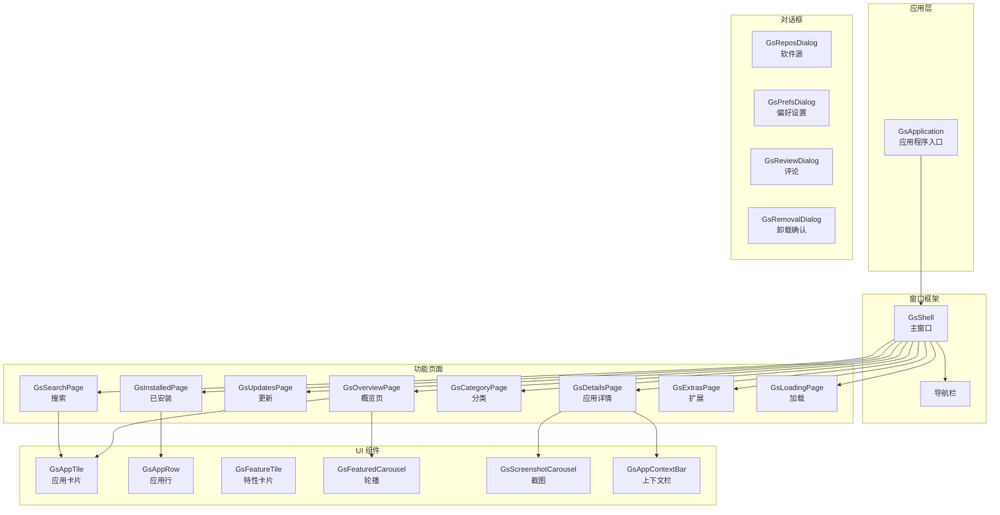
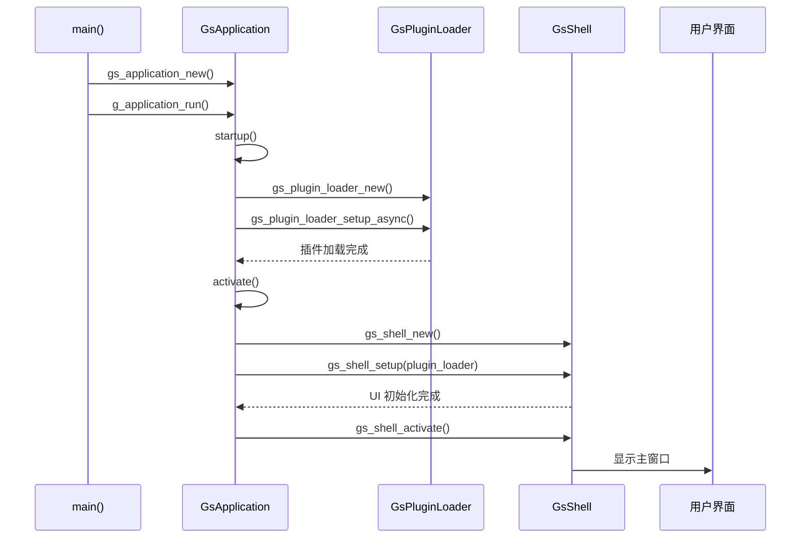
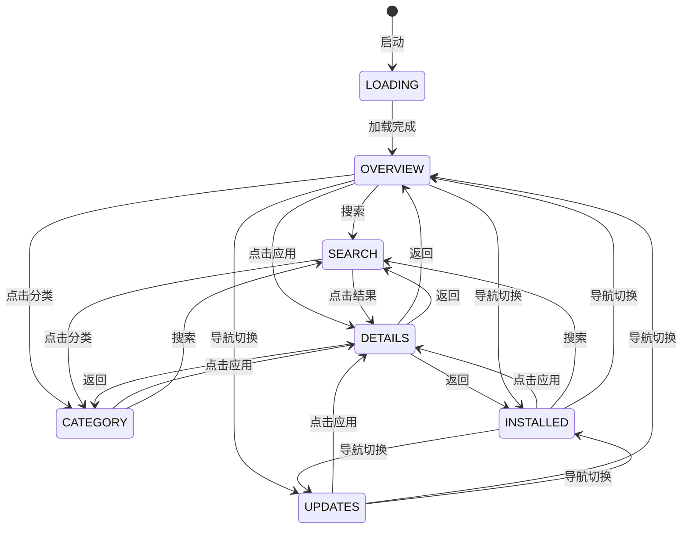
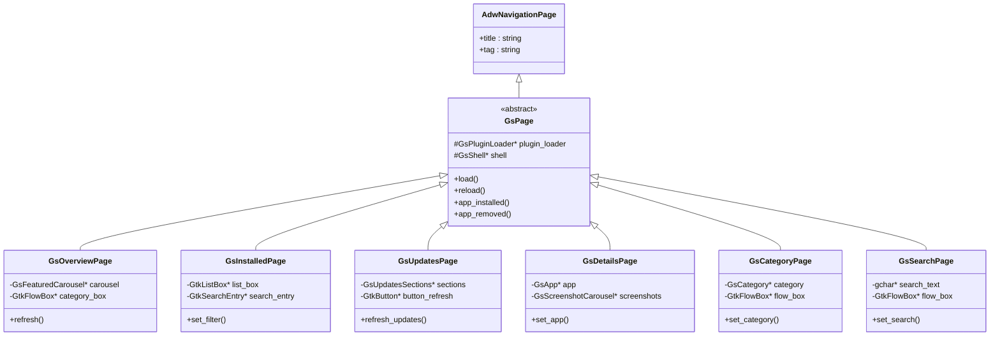
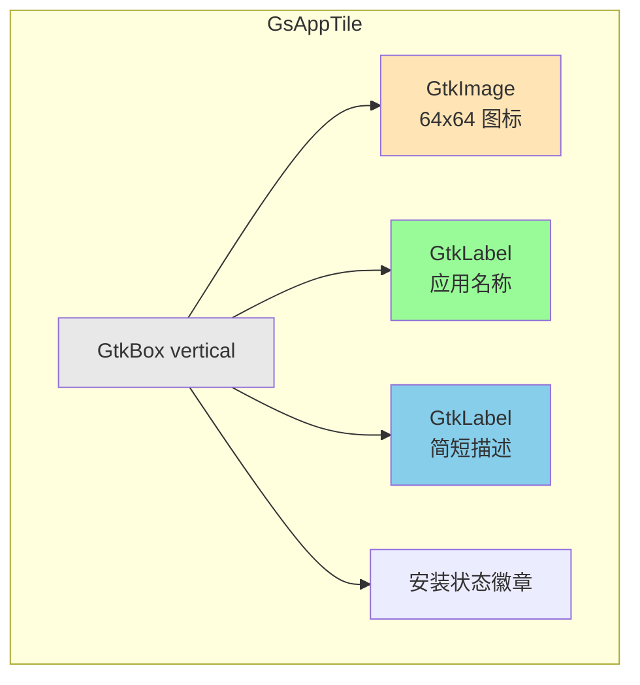
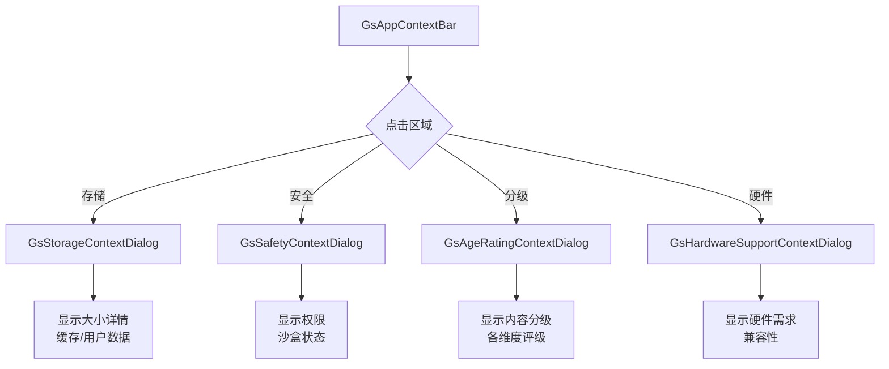

# 05 - 用户界面

## 模块概览

### 文件位置

- 源码目录: `Examples/gnome-software/src/`
- UI 定义文件: `src/*.ui`
- 样式表: `src/style.css`, `src/style-dark.css`, `src/style-hc.css`
- 资源清单: `src/gnome-software.gresource.xml`

### 功能职责

用户界面模块负责：

- 应用程序窗口和导航管理 (`GsShell`)
- 各功能页面的展示和交互
- UI 组件和控件
- 主题和样式

### 模块关系图



## GsApplication - 应用入口

### 类定义

```c
// 文件: src/gs-application.h

#define GS_APPLICATION_TYPE (gs_application_get_type ())
G_DECLARE_FINAL_TYPE (GsApplication, gs_application, GS, APPLICATION, AdwApplication)

GsApplication *gs_application_new (GsDebug *debug);
gboolean gs_application_has_active_window (GsApplication *application);
void gs_application_emit_install_resources_done (GsApplication *application,
                                                  const gchar *ident,
                                                  const GError *error);
```

### 私有结构

```c
// 文件: src/gs-application.c

struct _GsApplication {
    AdwApplication parent;
    
    GCancellable    *cancellable;
    GsPluginLoader  *plugin_loader;     // 插件加载器
    gint             pending_apps;       // 待处理应用数
    GtkWindow       *main_window;        // 主窗口
    GsShell         *shell;              // Shell 实例
    GsUpdateMonitor *update_monitor;     // 更新监控
    GsShellSearchProvider *search_provider;  // Shell 搜索提供者
    GSettings       *settings;           // GSettings
    GSimpleActionGroup *action_map;      // 动作映射
    GsDebug         *debug;              // 调试助手
};
```

### 命令行选项

| 选项 | 说明 |
|------|------|
| `--mode` | 启动模式: updates, installed, overview |
| `--search` | 搜索应用 |
| `--details` | 显示应用详情 (by ID) |
| `--details-pkg` | 显示应用详情 (by package) |
| `--install` | 安装应用 |
| `--uninstall` | 卸载应用 |
| `--local-filename` | 打开本地包文件 |
| `--verbose` | 启用详细日志 |
| `--autoupdate` | 后台自动更新 |

### 启动流程



## GsShell - 主窗口

### 类定义

```c
// 文件: src/gs-shell.h

#define GS_TYPE_SHELL (gs_shell_get_type ())
G_DECLARE_FINAL_TYPE (GsShell, gs_shell, GS, SHELL, AdwApplicationWindow)

typedef enum {
    GS_SHELL_MODE_UNKNOWN,
    GS_SHELL_MODE_OVERVIEW,     // 概览
    GS_SHELL_MODE_INSTALLED,    // 已安装
    GS_SHELL_MODE_SEARCH,       // 搜索
    GS_SHELL_MODE_UPDATES,      // 更新
    GS_SHELL_MODE_DETAILS,      // 详情
    GS_SHELL_MODE_CATEGORY,     // 分类
    GS_SHELL_MODE_EXTRAS,       // 扩展
    GS_SHELL_MODE_LOADING,      // 加载中
} GsShellMode;

typedef enum {
    GS_SHELL_INTERACTION_NONE   = 0,
    GS_SHELL_INTERACTION_NOTIFY = 1 << 0,
    GS_SHELL_INTERACTION_FULL   = 1 << 1 | GS_SHELL_INTERACTION_NOTIFY,
} GsShellInteraction;
```

### 主要 API

```c
// 创建和初始化
GsShell *gs_shell_new (void);
void gs_shell_setup (GsShell *shell, GsPluginLoader *loader, GCancellable *cancellable);
void gs_shell_activate (GsShell *shell);

// 模式切换
void gs_shell_set_mode (GsShell *shell, GsShellMode mode);
void gs_shell_change_mode (GsShell *shell, GsShellMode mode, gpointer data, gboolean scroll_up);
GsShellMode gs_shell_get_mode (GsShell *shell);

// 导航
void gs_shell_show_app (GsShell *shell, GsApp *app);
void gs_shell_show_category (GsShell *shell, GsCategory *category);
void gs_shell_show_search (GsShell *shell, const gchar *search);
void gs_shell_show_local_file (GsShell *shell, GFile *file);

// 应用操作
void gs_shell_install (GsShell *shell, GsApp *app, GsShellInteraction interaction);
void gs_shell_uninstall (GsShell *shell, GsApp *app);
```

### 模式切换状态图



## 功能页面

### GsPage - 页面基类

```c
// 文件: src/gs-page.h

#define GS_TYPE_PAGE (gs_page_get_type ())
G_DECLARE_DERIVABLE_TYPE (GsPage, gs_page, GS, PAGE, AdwNavigationPage)

struct _GsPageClass {
    AdwNavigationPageClass parent_class;
    
    // 页面加载
    void (*load) (GsPage *page);
    void (*reload) (GsPage *page);
    
    // 应用操作回调
    void (*app_installed) (GsPage *page, GsApp *app);
    void (*app_removed) (GsPage *page, GsApp *app);
};
```

### 页面继承图



### GsOverviewPage - 概览页

```c
// 文件: src/gs-overview-page.h

// 主要组件:
// - 精选轮播 (GsFeaturedCarousel)
// - 编辑推荐
// - 最近更新
// - 分类网格
// - 热门应用

// 加载流程:
void gs_overview_page_load (GsPage *page)
{
    // 1. 加载精选应用
    load_featured_apps_async ();
    
    // 2. 加载分类
    load_categories_async ();
    
    // 3. 加载最近更新
    load_recent_apps_async ();
    
    // 4. 加载热门应用
    load_popular_apps_async ();
}
```

### GsDetailsPage - 详情页

```c
// 文件: src/gs-details-page.h

// 主要组件:
// - 应用图标和名称
// - 截图轮播 (GsScreenshotCarousel)
// - 描述文本
// - 上下文信息栏 (GsAppContextBar)
// - 评分和评论
// - 安装/卸载按钮
// - 版本历史
// - 权限信息

void gs_details_page_set_app (GsDetailsPage *page, GsApp *app)
{
    // 1. 设置基本信息
    update_header (page, app);
    
    // 2. 请求细化
    refine_app_async (app, REFINE_FLAGS_ALL);
    
    // 3. 加载截图
    load_screenshots_async (app);
    
    // 4. 加载评论
    load_reviews_async (app);
}
```

## UI 组件

### GsAppTile - 应用卡片

```c
// 文件: src/gs-app-tile.h

#define GS_TYPE_APP_TILE (gs_app_tile_get_type ())
G_DECLARE_DERIVABLE_TYPE (GsAppTile, gs_app_tile, GS, APP_TILE, GtkFlowBoxChild)

// 显示内容:
// - 应用图标
// - 应用名称
// - 简短描述
// - 安装状态标记

void gs_app_tile_set_app (GsAppTile *tile, GsApp *app);
GsApp *gs_app_tile_get_app (GsAppTile *tile);
```

### 卡片 UI 结构



### GsAppRow - 应用行

```c
// 文件: src/gs-app-row.h

#define GS_TYPE_APP_ROW (gs_app_row_get_type ())
G_DECLARE_DERIVABLE_TYPE (GsAppRow, gs_app_row, GS, APP_ROW, GtkListBoxRow)

// 用于列表显示:
// - 已安装页面
// - 更新列表
// - 搜索结果 (列表模式)

void gs_app_row_set_app (GsAppRow *row, GsApp *app);
void gs_app_row_set_show_buttons (GsAppRow *row, gboolean show);
void gs_app_row_set_show_source (GsAppRow *row, gboolean show);
```

### GsScreenshotCarousel - 截图轮播

```c
// 文件: src/gs-screenshot-carousel.h

#define GS_TYPE_SCREENSHOT_CAROUSEL (gs_screenshot_carousel_get_type ())
G_DECLARE_FINAL_TYPE (GsScreenshotCarousel, gs_screenshot_carousel, 
                      GS, SCREENSHOT_CAROUSEL, GtkWidget)

// 功能:
// - 异步加载截图
// - 轮播导航
// - 全屏查看
// - 缩放支持

void gs_screenshot_carousel_load_screenshots (GsScreenshotCarousel *self,
                                              GsApp *app,
                                              GCancellable *cancellable);
```

### GsAppContextBar - 上下文信息栏

```c
// 文件: src/gs-app-context-bar.h

// 显示信息:
// - 存储大小
// - 安全/沙盒信息
// - 年龄分级
// - 硬件要求

// 子对话框:
// - GsStorageContextDialog (存储详情)
// - GsSafetyContextDialog (安全信息)
// - GsAgeRatingContextDialog (年龄分级)
// - GsHardwareSupportContextDialog (硬件支持)
```

### 上下文信息流程



## 对话框

### GsReposDialog - 软件源管理

```c
// 文件: src/gs-repos-dialog.h

#define GS_TYPE_REPOS_DIALOG (gs_repos_dialog_get_type ())
G_DECLARE_FINAL_TYPE (GsReposDialog, gs_repos_dialog, GS, REPOS_DIALOG, AdwDialog)

// 功能:
// - 列出所有软件源
// - 启用/禁用软件源
// - 添加第三方软件源
// - 删除软件源
```

### GsRemovalDialog - 卸载确认

```c
// 文件: src/gs-removal-dialog.h

// 显示:
// - 将删除的应用
// - 关联删除的依赖
// - 释放的空间
// - 确认/取消按钮
```

## 样式系统

### CSS 文件结构

| 文件 | 用途 |
|------|------|
| `style.css` | 默认浅色主题 |
| `style-dark.css` | 深色主题覆盖 |
| `style-hc.css` | 高对比度主题 |

### 主要样式类

```css
/* 文件: src/style.css */

/* 应用卡片 */
.application-tile {
    padding: 12px;
    border-radius: 12px;
}

/* 精选卡片 */
.featured-tile {
    min-height: 200px;
    background-size: cover;
}

/* 详情页头部 */
.details-page-header {
    padding: 24px;
    background: linear-gradient(...);
}

/* 进度按钮 */
.progress-button {
    min-width: 120px;
}

/* 星级评分 */
.star-widget {
    -gtk-icon-size: 16px;
}

/* 上下文信息区 */
.context-tile {
    padding: 16px;
    border-radius: 8px;
    background: @card_bg_color;
}
```

## 资源管理

### GResource 清单

```xml
<!-- 文件: src/gnome-software.gresource.xml -->
<gresources>
  <gresource prefix="/org/gnome/Software">
    <!-- UI 定义 -->
    <file preprocess="xml-stripblanks">gs-shell.ui</file>
    <file preprocess="xml-stripblanks">gs-overview-page.ui</file>
    <file preprocess="xml-stripblanks">gs-details-page.ui</file>
    <file preprocess="xml-stripblanks">gs-installed-page.ui</file>
    <file preprocess="xml-stripblanks">gs-updates-page.ui</file>
    
    <!-- 样式 -->
    <file>style.css</file>
    <file>style-dark.css</file>
    <file>style-hc.css</file>
    
    <!-- 其他 -->
    <file>gs-help-overlay.ui</file>
  </gresource>
</gresources>
```

## UI 模板示例

### 应用详情页 UI

```xml
<!-- 文件: src/gs-details-page.ui (简化) -->
<template class="GsDetailsPage" parent="GsPage">
  <child>
    <object class="GtkScrolledWindow">
      <child>
        <object class="AdwClamp">
          <property name="maximum-size">900</property>
          <child>
            <object class="GtkBox">
              <property name="orientation">vertical</property>
              
              <!-- 头部: 图标、名称、按钮 -->
              <child>
                <object class="GtkBox" id="header_box">
                  <child>
                    <object class="GtkImage" id="icon"/>
                  </child>
                  <child>
                    <object class="GtkBox">
                      <child>
                        <object class="GtkLabel" id="name_label"/>
                      </child>
                      <child>
                        <object class="GtkLabel" id="developer_label"/>
                      </child>
                    </object>
                  </child>
                  <child>
                    <object class="GsProgressButton" id="install_button"/>
                  </child>
                </object>
              </child>
              
              <!-- 截图轮播 -->
              <child>
                <object class="GsScreenshotCarousel" id="screenshot_carousel"/>
              </child>
              
              <!-- 上下文信息栏 -->
              <child>
                <object class="GsAppContextBar" id="context_bar"/>
              </child>
              
              <!-- 描述 -->
              <child>
                <object class="GsDescriptionBox" id="description_box"/>
              </child>
              
              <!-- 评分和评论 -->
              <child>
                <object class="GsReviewHistogram" id="review_histogram"/>
              </child>
              
            </object>
          </child>
        </object>
      </child>
    </object>
  </child>
</template>
```

---

**导航**
- 上一篇：[04-任务调度.md](04-任务调度.md)
- 下一篇：[06-Flatpak插件.md](06-Flatpak插件.md)
- [返回目录](README.md)
