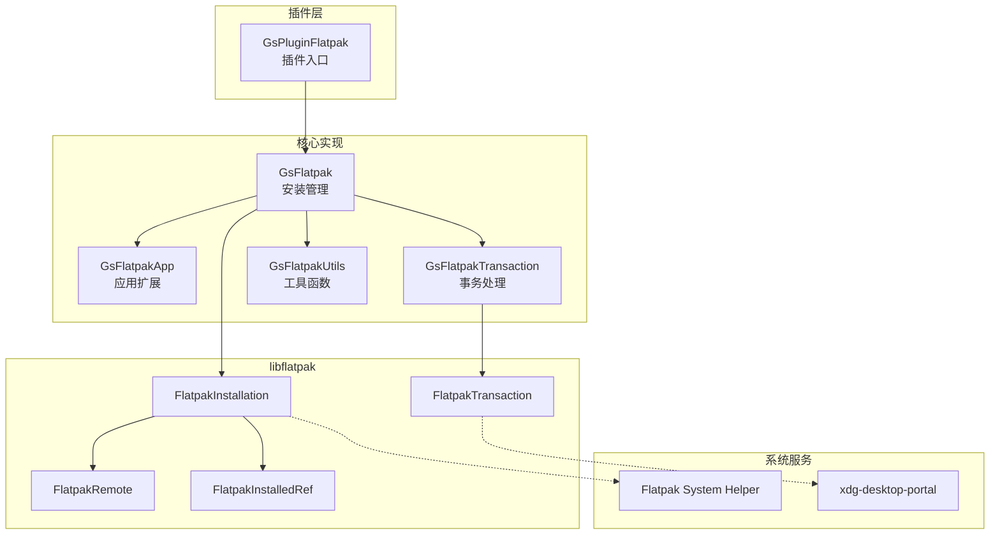
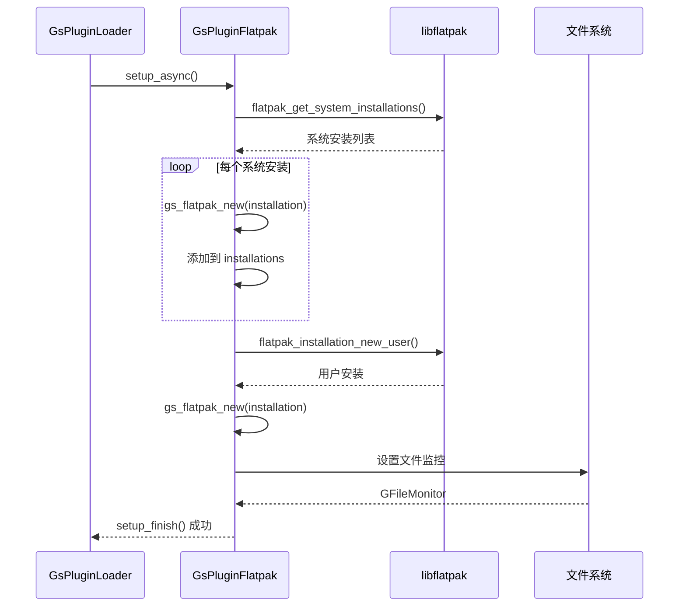
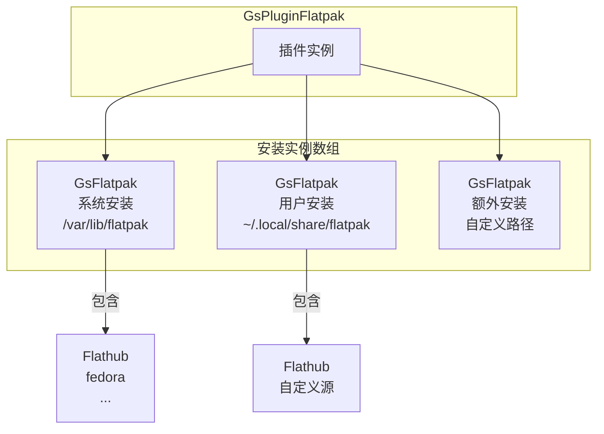
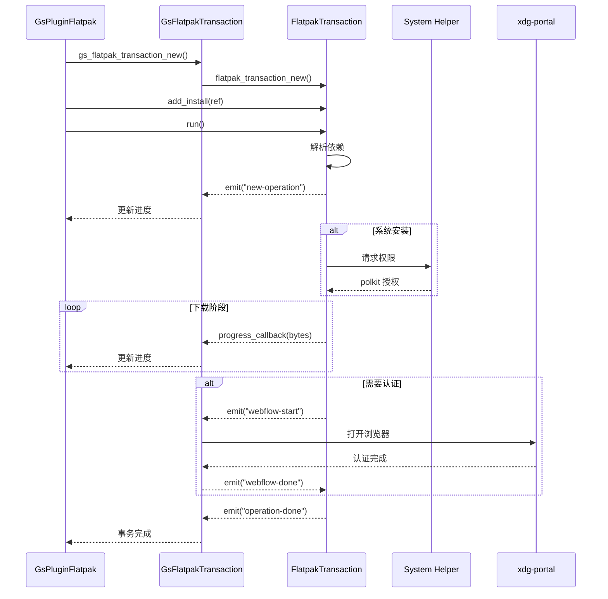
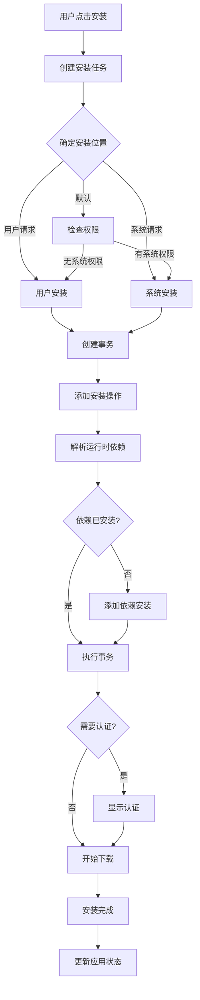
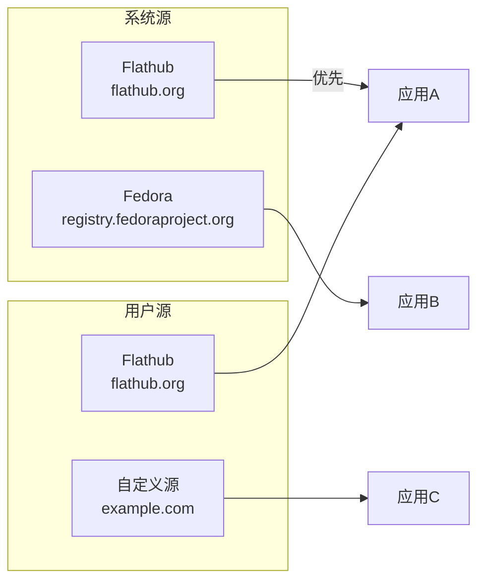
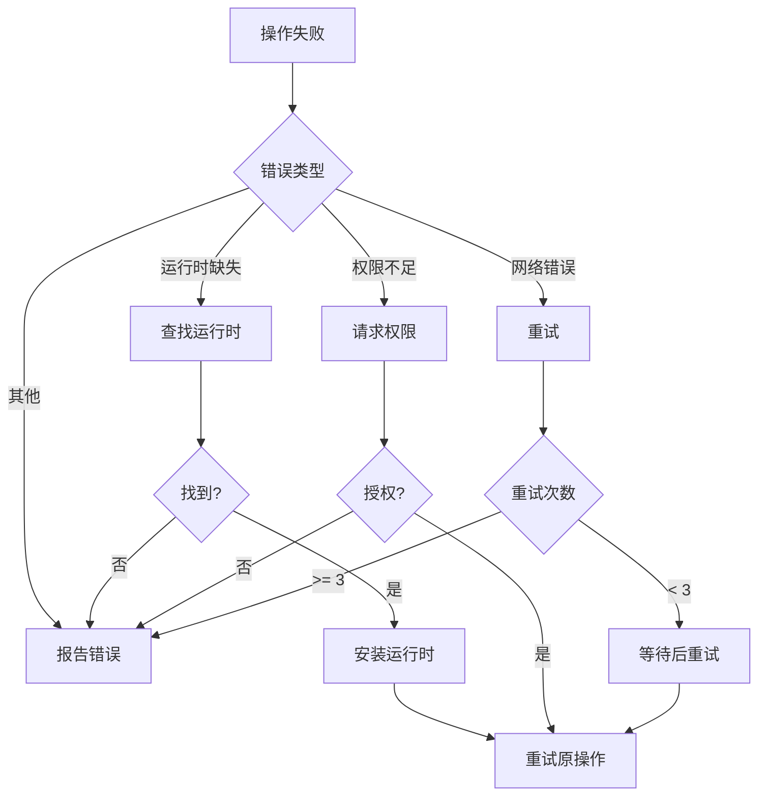

# 06 - Flatpak 插件

## 模块概览

### 文件位置

- 目录: `Examples/gnome-software/plugins/flatpak/`
- 主插件: `gs-plugin-flatpak.c/h`
- 核心实现: `gs-flatpak.c/h`
- 应用扩展: `gs-flatpak-app.c/h`
- 事务处理: `gs-flatpak-transaction.c/h`

### 功能职责

Flatpak 插件为 GNOME Software 提供完整的 Flatpak 应用支持：

- Flatpak 应用搜索和发现
- 应用安装、更新和卸载
- 软件源 (remote) 管理
- 权限和沙盒信息显示
- 运行时依赖处理

### 模块关系图



## GsPluginFlatpak - 插件入口

### 类定义

```c
// 文件: plugins/flatpak/gs-plugin-flatpak.h

#define GS_TYPE_PLUGIN_FLATPAK (gs_plugin_flatpak_get_type ())
G_DECLARE_FINAL_TYPE (GsPluginFlatpak, gs_plugin_flatpak, 
                      GS, PLUGIN_FLATPAK, GsPlugin)
```

### 私有结构

```c
// 文件: plugins/flatpak/gs-plugin-flatpak.c

struct _GsPluginFlatpak {
    GsPlugin parent;
    
    GPtrArray *installations;    // GsFlatpak 实例数组
    GFileMonitor *monitor;       // 安装目录监控
    gboolean has_system;         // 是否有系统安装
    gboolean has_user;           // 是否有用户安装
    
    // 锁
    GMutex mutex;
};
```

### 初始化流程



### 虚函数实现

```c
// 文件: plugins/flatpak/gs-plugin-flatpak.c

static void
gs_plugin_flatpak_class_init (GsPluginFlatpakClass *klass)
{
    GsPluginClass *plugin_class = GS_PLUGIN_CLASS (klass);
    
    // 生命周期
    plugin_class->setup_async = gs_plugin_flatpak_setup_async;
    plugin_class->setup_finish = gs_plugin_flatpak_setup_finish;
    plugin_class->shutdown_async = gs_plugin_flatpak_shutdown_async;
    
    // 应用发现
    plugin_class->list_apps_async = gs_plugin_flatpak_list_apps_async;
    plugin_class->list_apps_finish = gs_plugin_flatpak_list_apps_finish;
    plugin_class->refine_async = gs_plugin_flatpak_refine_async;
    plugin_class->refine_finish = gs_plugin_flatpak_refine_finish;
    
    // 应用操作
    plugin_class->install_apps_async = gs_plugin_flatpak_install_apps_async;
    plugin_class->uninstall_apps_async = gs_plugin_flatpak_uninstall_apps_async;
    plugin_class->update_apps_async = gs_plugin_flatpak_update_apps_async;
    plugin_class->launch_async = gs_plugin_flatpak_launch_async;
    
    // 元数据
    plugin_class->refresh_metadata_async = gs_plugin_flatpak_refresh_metadata_async;
    plugin_class->file_to_app_async = gs_plugin_flatpak_file_to_app_async;
    plugin_class->url_to_app_async = gs_plugin_flatpak_url_to_app_async;
    
    // 仓库管理
    plugin_class->install_repository_async = gs_plugin_flatpak_install_repository_async;
    plugin_class->remove_repository_async = gs_plugin_flatpak_remove_repository_async;
    plugin_class->enable_repository_async = gs_plugin_flatpak_enable_repository_async;
    plugin_class->disable_repository_async = gs_plugin_flatpak_disable_repository_async;
}
```

## GsFlatpak - 安装管理

### 类定义

```c
// 文件: plugins/flatpak/gs-flatpak.h

#define GS_TYPE_FLATPAK (gs_flatpak_get_type ())
G_DECLARE_FINAL_TYPE (GsFlatpak, gs_flatpak, GS, FLATPAK, GObject)

typedef enum {
    GS_FLATPAK_FLAG_NONE           = 0,
    GS_FLATPAK_FLAG_IS_TEMPORARY   = 1 << 0,  // 临时安装 (处理 URI/bundle)
    GS_FLATPAK_FLAG_DISABLE_UPDATE = 1 << 1,  // 禁用元数据更新
} GsFlatpakFlags;
```

### 主要 API

```c
// 创建实例
GsFlatpak *gs_flatpak_new (GsPlugin *plugin,
                           FlatpakInstallation *installation,
                           GsFlatpakFlags flags);

// 获取安装信息
AsComponentScope gs_flatpak_get_scope (GsFlatpak *self);
const gchar *gs_flatpak_get_id (GsFlatpak *self);
FlatpakInstallation *gs_flatpak_get_installation (GsFlatpak *self, gboolean interactive);

// 应用操作
gboolean gs_flatpak_add_installed (GsFlatpak *self, GsAppList *list, ...);
gboolean gs_flatpak_add_updates (GsFlatpak *self, GsAppList *list, ...);
gboolean gs_flatpak_refine_app (GsFlatpak *self, GsApp *app, ...);

// 搜索
gboolean gs_flatpak_search (GsFlatpak *self, const gchar * const *values, 
                            GsAppList *list, ...);

// 分类
gboolean gs_flatpak_add_category_apps (GsFlatpak *self, GsCategory *category,
                                        GsAppList *list, ...);

// 仓库管理
gboolean gs_flatpak_add_repositories (GsFlatpak *self, GsAppList *list, ...);
```

### 安装位置管理



## GsFlatpakApp - 应用扩展

### 元数据键

```c
// 文件: plugins/flatpak/gs-flatpak-app.h

// 存储在 GsApp 元数据中的 Flatpak 特定信息

#define GS_FLATPAK_APP_METADATA_FLATPAK_REF    "flatpak::ref"
#define GS_FLATPAK_APP_METADATA_FLATPAK_NAME   "flatpak::name"
#define GS_FLATPAK_APP_METADATA_FLATPAK_ARCH   "flatpak::arch"
#define GS_FLATPAK_APP_METADATA_FLATPAK_BRANCH "flatpak::branch"
#define GS_FLATPAK_APP_METADATA_FLATPAK_COMMIT "flatpak::commit"

// 辅助函数
const gchar *gs_flatpak_app_get_ref_name (GsApp *app);
const gchar *gs_flatpak_app_get_ref_arch (GsApp *app);
const gchar *gs_flatpak_app_get_ref_branch (GsApp *app);
const gchar *gs_flatpak_app_get_commit (GsApp *app);

void gs_flatpak_app_set_ref_name (GsApp *app, const gchar *val);
void gs_flatpak_app_set_ref_arch (GsApp *app, const gchar *val);
void gs_flatpak_app_set_ref_branch (GsApp *app, const gchar *val);
```

### Flatpak Ref 格式

```
{kind}/{name}/{arch}/{branch}

示例:
app/org.mozilla.Firefox/x86_64/stable
runtime/org.gnome.Platform/x86_64/45
```

## GsFlatpakTransaction - 事务处理

### 类定义

```c
// 文件: plugins/flatpak/gs-flatpak-transaction.h

#define GS_TYPE_FLATPAK_TRANSACTION (gs_flatpak_transaction_get_type ())
G_DECLARE_FINAL_TYPE (GsFlatpakTransaction, gs_flatpak_transaction,
                      GS, FLATPAK_TRANSACTION, FlatpakTransaction)
```

### 事务信号处理

```c
// 创建事务
GsFlatpakTransaction *gs_flatpak_transaction_new (
    FlatpakInstallation *installation,
    GCancellable *cancellable,
    GError **error
);

// 信号回调
// - new-operation: 新操作开始
// - operation-done: 操作完成
// - operation-error: 操作出错
// - choose-remote-for-ref: 选择远程源
// - end-of-lifed-with-rebase: EOL 处理
// - webflow-start: 认证开始
// - webflow-done: 认证完成
```

### 事务执行流程



## 安装流程详解

### 应用安装



### 应用更新


## 源管理

### 添加 Flatpak 源

```c
// 伪代码: 添加 flatpakref 文件

函数 gs_flatpak_add_repository_app(self, app, is_install, interactive):
    // 1. 获取源 URL
    flatpakref_url = gs_app_get_url(app, AS_URL_KIND_HOMEPAGE)
    
    // 2. 下载 flatpakref
    bytes = gs_download_file(flatpakref_url)
    
    // 3. 解析 flatpakref
    keyfile = g_key_file_load_from_data(bytes)
    name = keyfile.get_string("Flatpak Ref", "Name")
    url = keyfile.get_string("Flatpak Ref", "Url")
    gpg_key = keyfile.get_string("Flatpak Ref", "GPGKey")
    
    // 4. 创建 remote
    remote = flatpak_remote_new(name)
    flatpak_remote_set_url(remote, url)
    flatpak_remote_set_gpg_key(remote, gpg_key)
    
    // 5. 添加到安装
    flatpak_installation_add_remote(installation, remote)
    
    // 6. 刷新元数据
    flatpak_installation_update_remote_sync(installation, name)
```

### 源列表



## 权限处理

### Flatpak 权限映射

```c
// 文件: plugins/flatpak/gs-flatpak.c

// 从 Flatpak 元数据提取权限
static GsAppPermissions *
gs_flatpak_get_permissions (GsFlatpak *self, GsApp *app)
{
    GsAppPermissions *permissions = gs_app_permissions_new ();
    
    // 解析 finish-args
    // --filesystem=host -> 完整文件系统访问
    // --device=all -> 所有设备
    // --share=network -> 网络访问
    // --socket=x11 -> X11 显示
    // --socket=wayland -> Wayland 显示
    
    return permissions;
}
```

### 权限分类

| 权限类型 | Flatpak 参数 | 风险等级 |
|----------|--------------|----------|
| 网络访问 | `--share=network` | 低 |
| X11 显示 | `--socket=x11` | 中 |
| 完整文件系统 | `--filesystem=host` | 高 |
| 所有设备 | `--device=all` | 高 |
| D-Bus 会话 | `--socket=session-bus` | 中 |
| D-Bus 系统 | `--socket=system-bus` | 高 |

## 缓存管理

### AppStream 缓存

```c
// Flatpak 的 AppStream 数据存储位置:
// 系统: /var/lib/flatpak/appstream/{remote}/{arch}/active/appstream.xml
// 用户: ~/.local/share/flatpak/appstream/{remote}/{arch}/active/appstream.xml

gboolean
gs_flatpak_refresh (GsFlatpak *self, guint64 cache_age_secs, ...)
{
    // 1. 检查缓存时间
    如果 缓存未过期:
        返回 TRUE
    
    // 2. 更新远程元数据
    flatpak_installation_update_remote_sync()
    
    // 3. 重新加载 AppStream
    reload_appstream_data()
}
```

### 图标缓存

```
~/.cache/gnome-software/flatpak/
├── flathub/
│   ├── icons/
│   │   ├── 64x64/
│   │   └── 128x128/
│   └── appstream.xml.gz
└── fedora/
    └── ...
```

## 错误处理

### 常见错误

| 错误代码 | 说明 | 处理方式 |
|----------|------|----------|
| `FLATPAK_ERROR_ALREADY_INSTALLED` | 已安装 | 忽略，更新状态 |
| `FLATPAK_ERROR_NOT_INSTALLED` | 未安装 | 报告错误 |
| `FLATPAK_ERROR_RUNTIME_NOT_FOUND` | 缺少运行时 | 尝试安装 |
| `FLATPAK_ERROR_PERMISSION_DENIED` | 权限不足 | 提示用户 |
| `FLATPAK_ERROR_NEED_NEW_FLATPAK` | 版本过低 | 提示升级 |

### 错误恢复



---

**导航**
- 上一篇：[05-用户界面.md](05-用户界面.md)
- 下一篇：[07-PackageKit插件.md](07-PackageKit插件.md)
- [返回目录](README.md)
