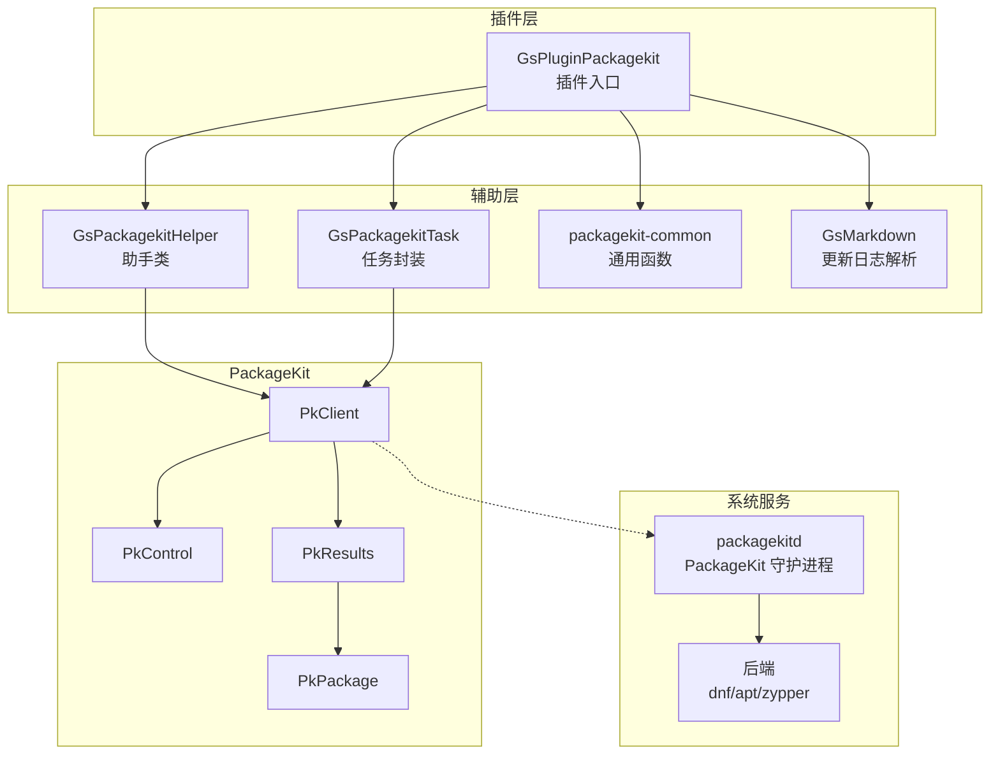
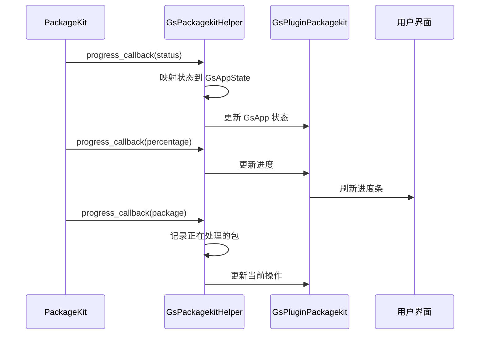
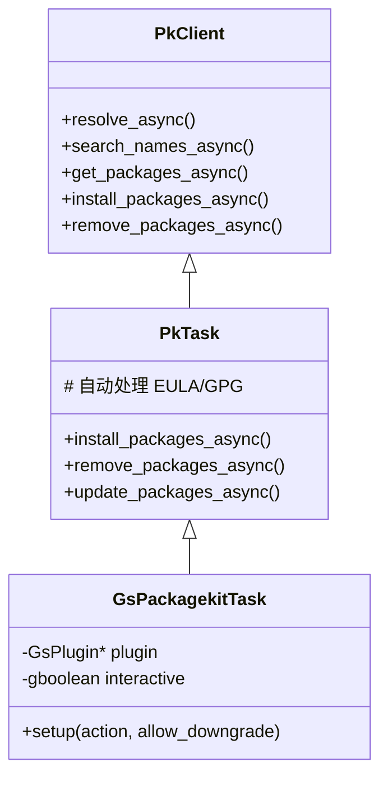
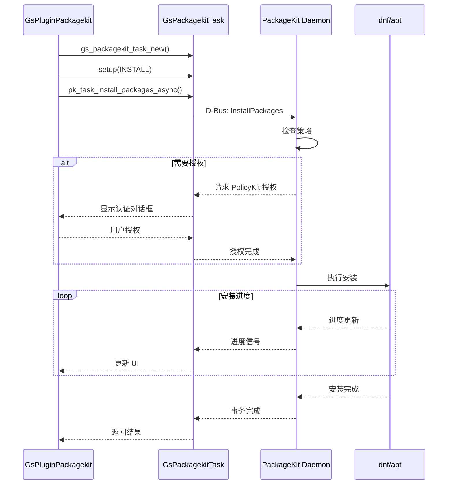
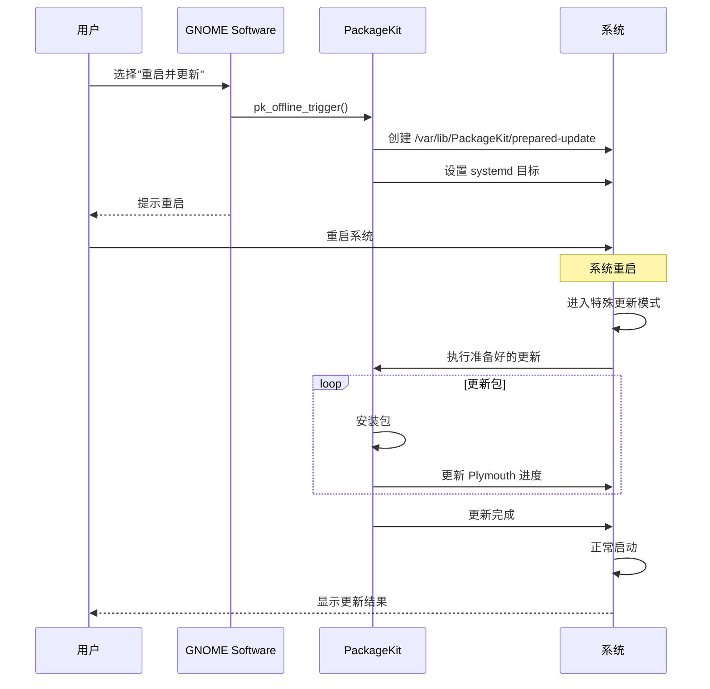
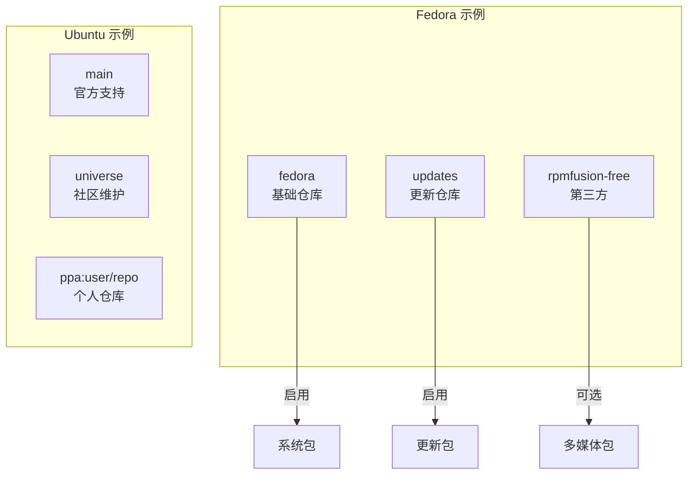
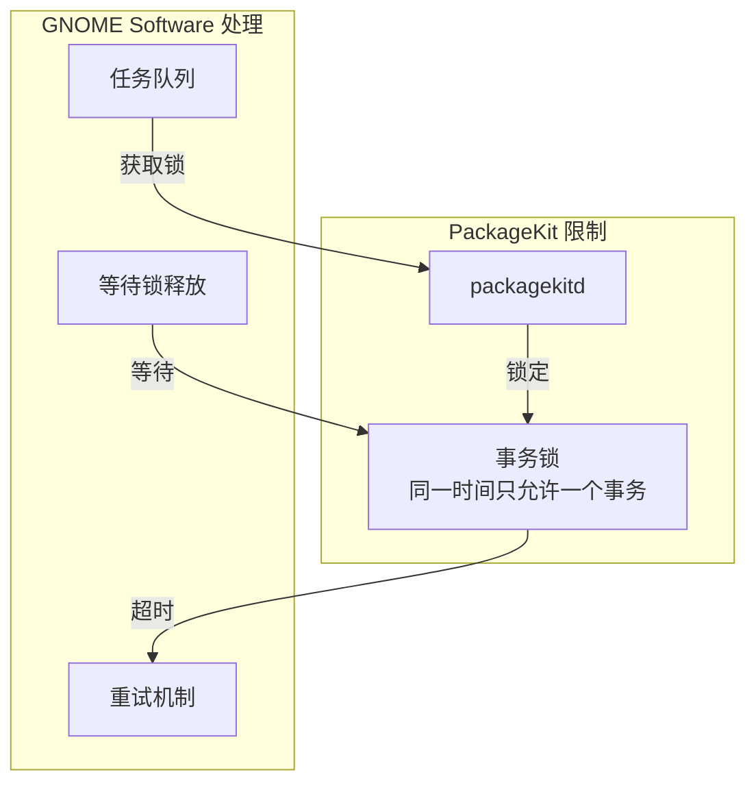

# 07 - PackageKit 插件

## 模块概览

### 文件位置

- 目录: `Examples/gnome-software/plugins/packagekit/`
- 主插件: `gs-plugin-packagekit.c/h`
- PackageKit 助手: `gs-packagekit-helper.c/h`
- PackageKit 任务: `gs-packagekit-task.c/h`
- 通用函数: `packagekit-common.c/h`
- Markdown 解析: `gs-markdown.c/h`

### 功能职责

PackageKit 插件为 GNOME Software 提供传统包管理支持：

- 支持 RPM、DEB 等传统包格式
- 系统更新和升级
- 包搜索和安装
- 依赖解析
- 事务历史

### 模块关系图



## GsPluginPackagekit - 插件入口

### 类定义

```c
// 文件: plugins/packagekit/gs-plugin-packagekit.h

#define GS_TYPE_PLUGIN_PACKAGEKIT (gs_plugin_packagekit_get_type ())
G_DECLARE_FINAL_TYPE (GsPluginPackagekit, gs_plugin_packagekit,
                      GS, PLUGIN_PACKAGEKIT, GsPlugin)
```

### 私有结构

```c
// 文件: plugins/packagekit/gs-plugin-packagekit.c

struct _GsPluginPackagekit {
    GsPlugin parent;
    
    PkControl *control;           // PackageKit 控制接口
    PkClient *client_refine;      // 用于细化的客户端
    GHashTable *prepared_updates; // 准备好的离线更新
    
    // 缓存
    GHashTable *package_cache;    // 包信息缓存
    GMutex cache_mutex;
    
    // 状态
    gboolean is_distro_upgrade_supported;
};
```

### 虚函数实现

```c
static void
gs_plugin_packagekit_class_init (GsPluginPackagekitClass *klass)
{
    GsPluginClass *plugin_class = GS_PLUGIN_CLASS (klass);
    
    // 生命周期
    plugin_class->setup_async = gs_plugin_packagekit_setup_async;
    plugin_class->shutdown_async = gs_plugin_packagekit_shutdown_async;
    
    // 应用发现
    plugin_class->refine_async = gs_plugin_packagekit_refine_async;
    plugin_class->list_apps_async = gs_plugin_packagekit_list_apps_async;
    
    // 应用操作
    plugin_class->install_apps_async = gs_plugin_packagekit_install_apps_async;
    plugin_class->uninstall_apps_async = gs_plugin_packagekit_uninstall_apps_async;
    plugin_class->update_apps_async = gs_plugin_packagekit_update_apps_async;
    plugin_class->launch_async = gs_plugin_packagekit_launch_async;
    
    // 元数据
    plugin_class->refresh_metadata_async = gs_plugin_packagekit_refresh_metadata_async;
    plugin_class->file_to_app_async = gs_plugin_packagekit_file_to_app_async;
    
    // 仓库管理
    plugin_class->install_repository_async = gs_plugin_packagekit_install_repository_async;
    plugin_class->remove_repository_async = gs_plugin_packagekit_remove_repository_async;
    plugin_class->enable_repository_async = gs_plugin_packagekit_enable_repository_async;
    plugin_class->disable_repository_async = gs_plugin_packagekit_disable_repository_async;
}
```

## GsPackagekitHelper - 助手类

### 类定义

```c
// 文件: plugins/packagekit/gs-packagekit-helper.h

#define GS_TYPE_PACKAGEKIT_HELPER (gs_packagekit_helper_get_type ())
G_DECLARE_FINAL_TYPE (GsPackagekitHelper, gs_packagekit_helper,
                      GS, PACKAGEKIT_HELPER, GObject)

// 创建助手
GsPackagekitHelper *gs_packagekit_helper_new (GsPlugin *plugin);

// 设置关联应用
void gs_packagekit_helper_set_app (GsPackagekitHelper *self, GsApp *app);

// 添加应用
void gs_packagekit_helper_add_app (GsPackagekitHelper *self, GsApp *app);

// 错误处理
void gs_packagekit_helper_error_convert (GError **error, ...);

// 回调代理
void gs_packagekit_helper_cb (PkProgress *progress,
                              PkProgressType type,
                              gpointer user_data);
```

### 进度处理



## GsPackagekitTask - 任务封装

### 类定义

```c
// 文件: plugins/packagekit/gs-packagekit-task.h

#define GS_TYPE_PACKAGEKIT_TASK (gs_packagekit_task_get_type ())
G_DECLARE_FINAL_TYPE (GsPackagekitTask, gs_packagekit_task,
                      GS, PACKAGEKIT_TASK, PkTask)

// 创建任务
GsPackagekitTask *gs_packagekit_task_new (GsPlugin *plugin);

// 设置交互模式
void gs_packagekit_task_set_interactive (GsPackagekitTask *self, gboolean interactive);

// 配置任务
void gs_packagekit_task_setup (GsPackagekitTask *self, 
                               GsPluginAction action,
                               gboolean allow_downgrade);
```

### 任务继承



## 核心操作实现

### 包搜索

```c
// 伪代码: 搜索包

函数 gs_plugin_packagekit_list_apps_async(plugin, query, ...):
    keywords = gs_app_query_get_keywords(query)
    
    // 创建 PK 搜索
    task = gs_packagekit_task_new(plugin)
    
    // 搜索名称
    pk_client_search_names_async(
        task,
        PK_FILTER_ENUM_NEWEST | PK_FILTER_ENUM_ARCH,
        keywords,
        callback
    )

回调函数 on_search_done(result):
    packages = pk_results_get_package_array(result)
    
    对于每个 package 在 packages 中:
        app = gs_app_new(pk_package_get_id(package))
        gs_app_set_name(app, pk_package_get_name(package))
        gs_app_set_summary(app, pk_package_get_summary(package))
        gs_app_set_version(app, pk_package_get_version(package))
        
        // 设置状态
        info = pk_package_get_info(package)
        如果 info == PK_INFO_ENUM_INSTALLED:
            gs_app_set_state(app, GS_APP_STATE_INSTALLED)
        否则:
            gs_app_set_state(app, GS_APP_STATE_AVAILABLE)
        
        gs_app_list_add(result_list, app)
```

### 包安装



### 系统更新

```mermaid
flowchart TD
    A[检查更新] --> B[pk_client_get_updates]
    B --> C{有更新?}
    
    C -->|否| D[显示"已是最新"]
    C -->|是| E[创建更新列表]
    
    E --> F[用户确认]
    F --> G{更新模式}
    
    G -->|在线更新| H[pk_task_update_packages]
    G -->|离线更新| I[pk_client_offline_prepare]
    
    H --> J[执行更新]
    J --> K{需要重启?}
    
    K -->|是| L[提示重启]
    K -->|否| M[更新完成]
    
    I --> N[准备离线更新]
    N --> O[设置重启触发]
    O --> P[提示重启]
    P --> Q[重启后自动更新]
```

## 离线更新

### 工作原理



### 相关 API

```c
// 准备离线更新
gboolean pk_offline_trigger (PkOfflineAction action, 
                             GCancellable *cancellable,
                             GError **error);

// 取消离线更新
gboolean pk_offline_cancel (GCancellable *cancellable, GError **error);

// 获取准备好的更新
PkPackageSack *pk_offline_get_prepared_sack (GError **error);

// 离线更新动作
typedef enum {
    PK_OFFLINE_ACTION_UNKNOWN,
    PK_OFFLINE_ACTION_REBOOT,      // 更新后重启
    PK_OFFLINE_ACTION_POWER_OFF,   // 更新后关机
} PkOfflineAction;
```

## 包信息解析

### PackageKit 包 ID 格式

```
{name};{version};{arch};{data}

示例:
firefox;125.0-1.fc40;x86_64;fedora
gnome-shell;46.0-1.fc40;x86_64;@System
libreoffice-writer;7.6.4-1;x86_64;updates
```

### 包状态映射

| PkInfoEnum | GsAppState | 说明 |
|------------|------------|------|
| `PK_INFO_ENUM_INSTALLED` | `GS_APP_STATE_INSTALLED` | 已安装 |
| `PK_INFO_ENUM_AVAILABLE` | `GS_APP_STATE_AVAILABLE` | 可安装 |
| `PK_INFO_ENUM_INSTALLING` | `GS_APP_STATE_INSTALLING` | 安装中 |
| `PK_INFO_ENUM_REMOVING` | `GS_APP_STATE_REMOVING` | 卸载中 |
| `PK_INFO_ENUM_UPDATING` | `GS_APP_STATE_INSTALLING` | 更新中 |

### 更新日志解析

```c
// 文件: plugins/packagekit/gs-markdown.c

// 将 RPM changelog 或 Debian changelog 转换为显示格式

GsMarkdown *gs_markdown_new (void);

gchar *gs_markdown_parse (GsMarkdown *self, const gchar *text);

// 支持的格式:
// - RPM changelog (日期 + 作者 + 内容)
// - Debian changelog (版本 + 紧急程度 + 内容)
// - 简单 Markdown
```

## 仓库管理

### 添加/启用仓库

```c
// 伪代码: 启用仓库

函数 gs_plugin_packagekit_enable_repository_async(plugin, repo, ...):
    repo_id = gs_app_get_id(repo)
    
    task = gs_packagekit_task_new(plugin)
    gs_packagekit_task_set_interactive(task, TRUE)
    
    // 调用 PackageKit 启用仓库
    pk_client_repo_enable_async(
        task,
        repo_id,
        TRUE,  // enable
        callback
    )

回调函数 on_enable_done(result):
    如果 成功:
        gs_app_set_state(repo, GS_APP_STATE_INSTALLED)
        // 刷新元数据
        pk_client_refresh_cache_async(...)
    否则:
        报告错误
```

### 仓库列表



## 错误处理

### PackageKit 错误码

| 错误码 | 说明 | 处理方式 |
|--------|------|----------|
| `PK_ERROR_ENUM_PACKAGE_NOT_FOUND` | 包未找到 | 刷新缓存重试 |
| `PK_ERROR_ENUM_DEP_RESOLUTION_FAILED` | 依赖解析失败 | 显示详情 |
| `PK_ERROR_ENUM_NOT_AUTHORIZED` | 未授权 | 请求权限 |
| `PK_ERROR_ENUM_TRANSACTION_CANCELLED` | 已取消 | 静默处理 |
| `PK_ERROR_ENUM_NO_NETWORK` | 无网络 | 提示检查网络 |
| `PK_ERROR_ENUM_CANNOT_GET_LOCK` | 锁定失败 | 等待或提示 |

### 错误转换

```c
// 文件: plugins/packagekit/gs-packagekit-helper.c

void
gs_packagekit_helper_error_convert (GError **error, ...)
{
    如果 error == NULL:
        返回
    
    // 转换 PackageKit 错误到 GsPlugin 错误
    switch ((*error)->code) {
    case PK_ERROR_ENUM_PACKAGE_NOT_FOUND:
        new_code = GS_PLUGIN_ERROR_NOT_FOUND;
        break;
    case PK_ERROR_ENUM_NOT_AUTHORIZED:
        new_code = GS_PLUGIN_ERROR_AUTH_REQUIRED;
        break;
    case PK_ERROR_ENUM_NO_NETWORK:
        new_code = GS_PLUGIN_ERROR_NO_NETWORK;
        break;
    default:
        new_code = GS_PLUGIN_ERROR_FAILED;
    }
    
    g_set_error_literal(error, GS_PLUGIN_ERROR, new_code, 
                        (*error)->message);
}
```

## 缓存策略

### 元数据刷新

```c
// 伪代码: 刷新缓存

函数 gs_plugin_packagekit_refresh_metadata_async(plugin, cache_age, ...):
    // 检查上次刷新时间
    如果 cache_age > 0:
        last_refresh = 获取上次刷新时间()
        如果 当前时间 - last_refresh < cache_age:
            返回成功  // 缓存仍有效
    
    // 刷新 PackageKit 缓存
    pk_client_refresh_cache_async(
        client,
        TRUE,  // force
        callback
    )

回调函数 on_refresh_done(result):
    如果 成功:
        记录刷新时间()
        清空本地缓存()
```

### 包缓存

```c
// 缓存结构
struct PackageCache {
    GHashTable *by_name;      // 按名称索引
    GHashTable *by_package_id; // 按完整 ID 索引
    gint64 cache_time;        // 缓存时间戳
};

// 缓存查找
GsApp *gs_plugin_packagekit_cache_lookup (GsPluginPackagekit *self,
                                          const gchar *package_id);

// 缓存添加
void gs_plugin_packagekit_cache_add (GsPluginPackagekit *self,
                                     const gchar *package_id,
                                     GsApp *app);
```

## 性能优化

### 批量操作

```c
// 批量细化多个应用
void
gs_plugin_packagekit_refine_async (GsPlugin *plugin,
                                   GsAppList *list, ...)
{
    // 收集需要细化的包名
    package_ids = g_ptr_array_new ();
    
    对于每个 app 在 list 中:
        如果 需要细化(app):
            g_ptr_array_add(package_ids, get_package_id(app));
    
    // 单次 D-Bus 调用获取所有包信息
    pk_client_get_details_async(
        client,
        package_ids->pdata,
        on_details_done
    );
}
```

### 并发控制



---

**导航**
- 上一篇：[06-Flatpak插件.md](06-Flatpak插件.md)
- 下一篇：[08-API参考.md](08-API参考.md)
- [返回目录](README.md)
