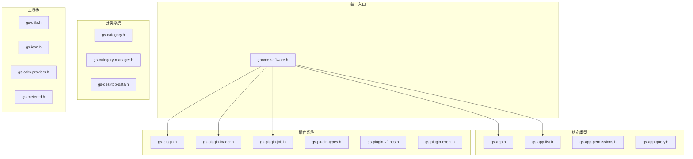

# 08 - API 参考

## 模块概览

### 文件位置

- 公共头文件: `Examples/gnome-software/lib/*.h`
- API 文档: `Examples/gnome-software/doc/api/`
- pkg-config: `gnome-software.pc`

### 功能职责

本文档提供 libgnomesoftware 的公共 API 参考，供插件开发者和集成开发使用。

## 公共 API 总览

### 头文件结构



## GsApp API

### 创建与销毁

```c
// 创建新应用
GsApp *gs_app_new (const gchar *id);

// 从唯一 ID 设置属性
void gs_app_set_from_unique_id (GsApp *app,
                                const gchar *unique_id,
                                AsComponentKind kind);

// 转换为字符串 (调试用)
gchar *gs_app_to_string (GsApp *app);
```

### 基本属性

```c
// ID
const gchar *gs_app_get_id (GsApp *app);
void gs_app_set_id (GsApp *app, const gchar *id);

// 名称
const gchar *gs_app_get_name (GsApp *app);
void gs_app_set_name (GsApp *app, GsAppQuality quality, const gchar *name);

// 摘要
const gchar *gs_app_get_summary (GsApp *app);
void gs_app_set_summary (GsApp *app, GsAppQuality quality, const gchar *summary);

// 描述
const gchar *gs_app_get_description (GsApp *app);
void gs_app_set_description (GsApp *app, GsAppQuality quality, 
                             const gchar *description);

// 版本
const gchar *gs_app_get_version (GsApp *app);
void gs_app_set_version (GsApp *app, const gchar *version);
const gchar *gs_app_get_version_ui (GsApp *app);  // 用户友好版本
```

### 状态管理

```c
// 获取/设置状态
GsAppState gs_app_get_state (GsApp *app);
void gs_app_set_state (GsApp *app, GsAppState state);

// 恢复之前状态 (操作失败时)
void gs_app_set_state_recover (GsApp *app);

// 状态查询
gboolean gs_app_is_installed (GsApp *app);
gboolean gs_app_is_updatable (GsApp *app);

// 进度
guint gs_app_get_progress (GsApp *app);
void gs_app_set_progress (GsApp *app, guint percentage);

// 取消控制
gboolean gs_app_get_allow_cancel (GsApp *app);
void gs_app_set_allow_cancel (GsApp *app, gboolean allow);
```

### 类型信息

```c
// 组件类型 (来自 AppStream)
AsComponentKind gs_app_get_kind (GsApp *app);
void gs_app_set_kind (GsApp *app, AsComponentKind kind);

// 特殊类型
GsAppSpecialKind gs_app_get_special_kind (GsApp *app);
void gs_app_set_special_kind (GsApp *app, GsAppSpecialKind kind);

// 打包格式
AsBundleKind gs_app_get_bundle_kind (GsApp *app);
void gs_app_set_bundle_kind (GsApp *app, AsBundleKind bundle_kind);

// 安装范围
AsComponentScope gs_app_get_scope (GsApp *app);
void gs_app_set_scope (GsApp *app, AsComponentScope scope);
```

### 大小信息

```c
// 下载大小
GsSizeType gs_app_get_size_download (GsApp *app, guint64 *size_bytes_out);
void gs_app_set_size_download (GsApp *app, GsSizeType type, guint64 size);

// 安装大小
GsSizeType gs_app_get_size_installed (GsApp *app, guint64 *size_bytes_out);
void gs_app_set_size_installed (GsApp *app, GsSizeType type, guint64 size);

// 用户数据大小
GsSizeType gs_app_get_size_user_data (GsApp *app, guint64 *size_bytes_out);
void gs_app_set_size_user_data (GsApp *app, GsSizeType type, guint64 size);

// 缓存数据大小
GsSizeType gs_app_get_size_cache_data (GsApp *app, guint64 *size_bytes_out);
void gs_app_set_size_cache_data (GsApp *app, GsSizeType type, guint64 size);
```

### 图标管理

```c
// 获取图标
GIcon *gs_app_get_icon_for_size (GsApp *app, 
                                  guint size, 
                                  guint scale,
                                  const gchar *fallback_icon_name);
GPtrArray *gs_app_dup_icons (GsApp *app);
gboolean gs_app_has_icons (GsApp *app);

// 添加/移除图标
void gs_app_add_icon (GsApp *app, GIcon *icon);
void gs_app_remove_all_icons (GsApp *app);

// 图标状态
GsAppIconsState gs_app_get_icons_state (GsApp *app);
```

### 截图

```c
// 获取截图
GPtrArray *gs_app_get_screenshots (GsApp *app);
void gs_app_add_screenshot (GsApp *app, AsScreenshot *screenshot);

// 操作截图 (用于预览)
AsScreenshot *gs_app_get_action_screenshot (GsApp *app);
void gs_app_set_action_screenshot (GsApp *app, AsScreenshot *screenshot);
```

### URL 和启动

```c
// URL
const gchar *gs_app_get_url (GsApp *app, AsUrlKind kind);
void gs_app_set_url (GsApp *app, AsUrlKind kind, const gchar *url);

// 启动命令
const gchar *gs_app_get_launchable (GsApp *app, AsLaunchableKind kind);
void gs_app_set_launchable (GsApp *app, AsLaunchableKind kind, 
                            const gchar *launchable);
```

### 来源信息

```c
// 来源标识
const gchar *gs_app_get_origin (GsApp *app);
void gs_app_set_origin (GsApp *app, const gchar *origin);

// 来源主机名
const gchar *gs_app_get_origin_hostname (GsApp *app);
void gs_app_set_origin_hostname (GsApp *app, const gchar *hostname);

// 来源 UI 显示
gchar *gs_app_dup_origin_ui (GsApp *app, gboolean with_format);
void gs_app_set_origin_ui (GsApp *app, const gchar *origin_ui);
```

### 元数据

```c
// 字符串元数据
const gchar *gs_app_get_metadata_item (GsApp *app, const gchar *key);
void gs_app_set_metadata (GsApp *app, const gchar *key, const gchar *value);

// Variant 元数据
GVariant *gs_app_get_metadata_variant (GsApp *app, const gchar *key);
void gs_app_set_metadata_variant (GsApp *app, const gchar *key, GVariant *value);
```

### Quirks (特殊标记)

```c
// 检查/添加/移除 quirk
gboolean gs_app_has_quirk (GsApp *app, GsAppQuirk quirk);
void gs_app_add_quirk (GsApp *app, GsAppQuirk quirk);
void gs_app_remove_quirk (GsApp *app, GsAppQuirk quirk);
```

## GsAppList API

### 创建与基本操作

```c
// 创建列表
GsAppList *gs_app_list_new (void);

// 添加/移除
void gs_app_list_add (GsAppList *list, GsApp *app);
void gs_app_list_remove (GsAppList *list, GsApp *app);

// 长度和索引
guint gs_app_list_length (GsAppList *list);
GsApp *gs_app_list_index (GsAppList *list, guint idx);

// 查找
GsApp *gs_app_list_lookup (GsAppList *list, const gchar *unique_id);
```

### 过滤和排序

```c
// 过滤回调
typedef gboolean (*GsAppListFilterFunc) (GsApp *app, gpointer user_data);

void gs_app_list_filter (GsAppList *list,
                         GsAppListFilterFunc func,
                         gpointer user_data);

// 排序回调
typedef gint (*GsAppListSortFunc) (GsApp *app1, GsApp *app2, gpointer user_data);

void gs_app_list_sort (GsAppList *list,
                       GsAppListSortFunc func,
                       gpointer user_data);
```

### 批量操作

```c
// 添加多个应用
void gs_app_list_add_list (GsAppList *list, GsAppList *donor);

// 转换为数组
GPtrArray *gs_app_list_to_array (GsAppList *list);

// 去重
void gs_app_list_filter_duplicates (GsAppList *list, GsAppListFilterFlags flags);
```

## GsPlugin API

### 基本属性

```c
// 名称
const gchar *gs_plugin_get_name (GsPlugin *plugin);

// 启用状态
gboolean gs_plugin_get_enabled (GsPlugin *plugin);
void gs_plugin_set_enabled (GsPlugin *plugin, gboolean enabled);

// 显示比例
guint gs_plugin_get_scale (GsPlugin *plugin);

// 语言
const gchar *gs_plugin_get_language (GsPlugin *plugin);
```

### 插件规则

```c
// 添加规则
void gs_plugin_add_rule (GsPlugin *plugin, GsPluginRule rule, const gchar *name);

// 规则类型
typedef enum {
    GS_PLUGIN_RULE_RUN_AFTER,
    GS_PLUGIN_RULE_RUN_BEFORE,
    GS_PLUGIN_RULE_CONFLICTS,
    GS_PLUGIN_RULE_BETTER_THAN,
} GsPluginRule;
```

### 缓存管理

```c
// 查找缓存
GsApp *gs_plugin_cache_lookup (GsPlugin *plugin, const gchar *key);

// 按状态查找
void gs_plugin_cache_lookup_by_state (GsPlugin *plugin, 
                                      GsAppList *list,
                                      GsAppState state);

// 添加到缓存
void gs_plugin_cache_add (GsPlugin *plugin, const gchar *key, GsApp *app);

// 移除缓存
void gs_plugin_cache_remove (GsPlugin *plugin, const gchar *key);

// 清空缓存
void gs_plugin_cache_invalidate (GsPlugin *plugin);

// 列出所有缓存
GsAppList *gs_plugin_list_cached (GsPlugin *plugin);
```

### 事件和信号

```c
// 报告事件
void gs_plugin_report_event (GsPlugin *plugin, GsPluginEvent *event);

// 发送信号
void gs_plugin_updates_changed (GsPlugin *plugin);
void gs_plugin_reload (GsPlugin *plugin);
void gs_plugin_repository_changed (GsPlugin *plugin, GsApp *repository);

// 权限控制
void gs_plugin_set_allow_updates (GsPlugin *plugin, gboolean allow);
gboolean gs_plugin_get_network_available (GsPlugin *plugin);
```

### 应用启动

```c
// 启动应用
void gs_plugin_app_launch_async (GsPlugin *plugin,
                                 GsApp *app,
                                 GsPluginLaunchFlags flags,
                                 GCancellable *cancellable,
                                 GAsyncReadyCallback callback,
                                 gpointer user_data);

gboolean gs_plugin_app_launch_finish (GsPlugin *plugin,
                                      GAsyncResult *result,
                                      GError **error);
```

### D-Bus 连接

```c
// 获取总线连接
GDBusConnection *gs_plugin_get_session_bus_connection (GsPlugin *plugin);
GDBusConnection *gs_plugin_get_system_bus_connection (GsPlugin *plugin);
```

## GsPluginLoader API

### 创建与初始化

```c
// 创建加载器
GsPluginLoader *gs_plugin_loader_new (GDBusConnection *session_bus,
                                      GDBusConnection *system_bus);

// 初始化
void gs_plugin_loader_setup_async (GsPluginLoader *loader,
                                   const gchar * const *allowlist,
                                   const gchar * const *blocklist,
                                   GCancellable *cancellable,
                                   GAsyncReadyCallback callback,
                                   gpointer user_data);

gboolean gs_plugin_loader_setup_finish (GsPluginLoader *loader,
                                        GAsyncResult *result,
                                        GError **error);

// 关闭
void gs_plugin_loader_shutdown (GsPluginLoader *loader,
                                GCancellable *cancellable);
```

### 任务执行

```c
// 执行任务
void gs_plugin_loader_job_process_async (GsPluginLoader *loader,
                                         GsPluginJob *job,
                                         GCancellable *cancellable,
                                         GAsyncReadyCallback callback,
                                         gpointer user_data);

gboolean gs_plugin_loader_job_process_finish (GsPluginLoader *loader,
                                              GAsyncResult *result,
                                              GsPluginJob **out_job,
                                              GError **error);
```

### 状态查询

```c
// 插件状态
gboolean gs_plugin_loader_get_enabled (GsPluginLoader *loader,
                                       const gchar *plugin_name);

GPtrArray *gs_plugin_loader_get_plugins (GsPluginLoader *loader);

GsPlugin *gs_plugin_loader_find_plugin (GsPluginLoader *loader,
                                        const gchar *plugin_name);

// 网络状态
gboolean gs_plugin_loader_get_network_available (GsPluginLoader *loader);
gboolean gs_plugin_loader_get_network_metered (GsPluginLoader *loader);

// 更新控制
gboolean gs_plugin_loader_get_allow_updates (GsPluginLoader *loader);
```

### 事件管理

```c
// 添加事件
void gs_plugin_loader_add_event (GsPluginLoader *loader, GsPluginEvent *event);

// 获取事件
GPtrArray *gs_plugin_loader_get_events (GsPluginLoader *loader);
GsPluginEvent *gs_plugin_loader_get_event_default (GsPluginLoader *loader);

// 清除事件
void gs_plugin_loader_remove_events (GsPluginLoader *loader);
```

## GsPluginJob 子类

### GsPluginJobListApps

```c
// 创建
GsPluginJob *gs_plugin_job_list_apps_new (GsAppQuery *query,
                                          GsPluginListAppsFlags flags);

// 获取结果
GsAppList *gs_plugin_job_list_apps_get_result_list (GsPluginJobListApps *self);
```

### GsPluginJobRefine

```c
// 创建
GsPluginJob *gs_plugin_job_refine_new (GsAppList *apps,
                                       GsPluginRefineFlags flags,
                                       GsPluginRefineRequireFlags require_flags);
```

### GsPluginJobInstallApps

```c
// 创建
GsPluginJob *gs_plugin_job_install_apps_new (GsAppList *apps,
                                             GsPluginInstallAppsFlags flags);

// 设置回调
void gs_plugin_job_install_apps_set_progress_callback (
    GsPluginJobInstallApps *self,
    GsPluginProgressCallback callback,
    gpointer user_data);
```

### GsPluginJobUpdateApps

```c
// 创建
GsPluginJob *gs_plugin_job_update_apps_new (GsAppList *apps,
                                            GsPluginUpdateAppsFlags flags);
```

### GsPluginJobUninstallApps

```c
// 创建
GsPluginJob *gs_plugin_job_uninstall_apps_new (GsAppList *apps,
                                               GsPluginUninstallAppsFlags flags);
```

## GsCategory API

```c
// 创建
GsCategory *gs_category_new_for_desktop_data (const GsDesktopData *data);

// 属性
const gchar *gs_category_get_id (GsCategory *category);
const gchar *gs_category_get_name (GsCategory *category);
const gchar *gs_category_get_icon_name (GsCategory *category);
gint gs_category_get_score (GsCategory *category);

// 层级
GsCategory *gs_category_get_parent (GsCategory *category);
GPtrArray *gs_category_get_children (GsCategory *category);
GsCategory *gs_category_find_child (GsCategory *category, const gchar *id);

// 大小
guint gs_category_get_size (GsCategory *category);
void gs_category_increment_size (GsCategory *category, guint value);
```

## 工具函数

### gs-utils.h

```c
// 版本比较
gint gs_utils_vercmp (const gchar *version_a, const gchar *version_b);

// 错误处理
gboolean gs_utils_error_convert_gio (GError **error);
gboolean gs_utils_error_convert_gdbus (GError **error);

// 文件操作
gboolean gs_utils_unlink (const gchar *path, GError **error);
gchar *gs_utils_get_cache_filename (const gchar *subdir, 
                                     const gchar *filename,
                                     GsUtilsCacheFlags flags,
                                     GError **error);

// 桌面集成
gboolean gs_utils_is_current_desktop (const gchar *name);
```

### gs-icon.h

```c
// 创建 GIcon
GIcon *gs_icon_new_for_remote (const gchar *url);
GIcon *gs_icon_new_for_stock (const gchar *icon_name);
```

## 错误处理

### GsPluginError

```c
// 错误域
#define GS_PLUGIN_ERROR gs_plugin_error_quark()
GQuark gs_plugin_error_quark (void);

// 错误码
typedef enum {
    GS_PLUGIN_ERROR_FAILED,
    GS_PLUGIN_ERROR_NOT_SUPPORTED,
    GS_PLUGIN_ERROR_CANCELLED,
    GS_PLUGIN_ERROR_NO_NETWORK,
    GS_PLUGIN_ERROR_NO_SECURITY,
    GS_PLUGIN_ERROR_NO_SPACE,
    GS_PLUGIN_ERROR_AUTH_REQUIRED,
    GS_PLUGIN_ERROR_AUTH_INVALID,
    GS_PLUGIN_ERROR_PLUGIN_DEPSOLVE_FAILED,
    GS_PLUGIN_ERROR_DOWNLOAD_FAILED,
    GS_PLUGIN_ERROR_WRITE_FAILED,
    GS_PLUGIN_ERROR_INVALID_FORMAT,
    GS_PLUGIN_ERROR_DELETE_FAILED,
    GS_PLUGIN_ERROR_RESTART_REQUIRED,
    GS_PLUGIN_ERROR_AC_POWER_REQUIRED,
    GS_PLUGIN_ERROR_TIMED_OUT,
    GS_PLUGIN_ERROR_NOT_FOUND,
} GsPluginError;
```

## pkg-config 使用

### 编译标志

```bash
# 获取编译标志
pkg-config --cflags gnome-software

# 获取链接标志
pkg-config --libs gnome-software

# 获取插件目录
pkg-config --variable=plugindir gnome-software
```

### 示例 meson.build

```meson
gnome_software_dep = dependency('gnome-software')

shared_module('gs_plugin_example',
  sources: 'gs-plugin-example.c',
  dependencies: [gnome_software_dep],
  install: true,
  install_dir: gnome_software_dep.get_variable('plugindir'),
)
```

---

**导航**
- 上一篇：[07-PackageKit插件.md](07-PackageKit插件.md)
- [返回目录](README.md)
