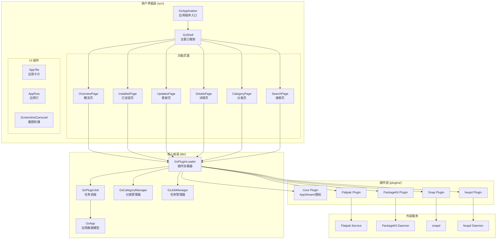
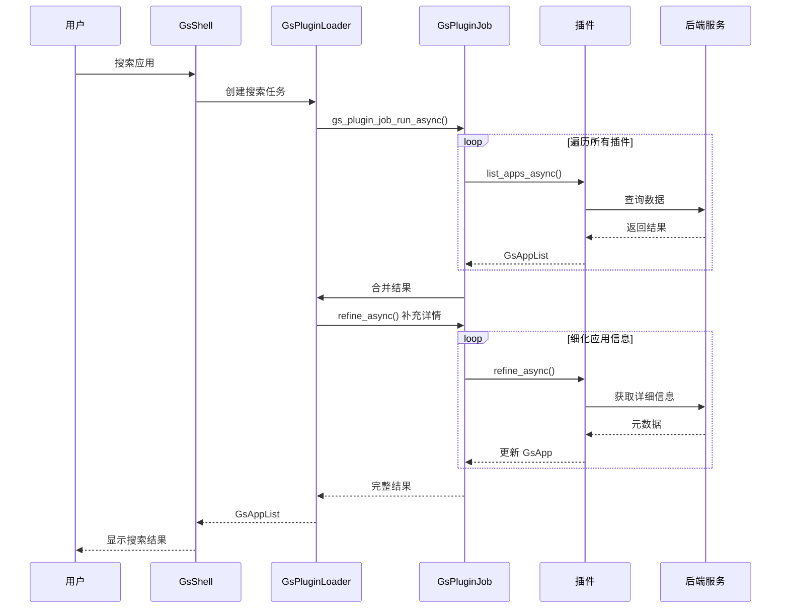
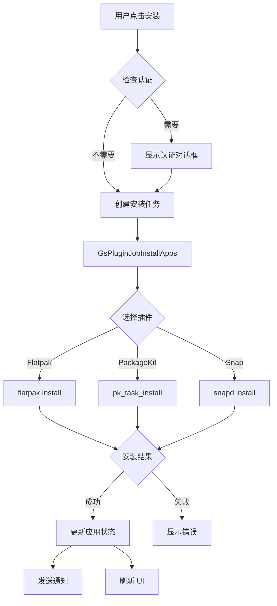

# GNOME Software 技术文档

## 项目概述

GNOME Software 是 GNOME 桌面环境的官方软件中心，为用户提供应用程序发现、安装、更新和管理功能。项目采用插件化架构设计，支持多种软件源（Flatpak、Snap、PackageKit 等），并提供现代化的 GTK4/Libadwaita 用户界面。

### 项目定位

- **软件中心**：提供统一的应用浏览、搜索和安装体验
- **更新管理**：处理应用程序、操作系统和固件更新
- **多源支持**：通过插件系统支持不同的软件分发格式
- **GNOME Shell 集成**：提供搜索提供者和后台更新服务

## 技术栈

| 类别 | 技术 | 版本要求 |
|------|------|----------|
| 语言 | C (C11) | - |
| 构建系统 | Meson | >= 1.6.0 |
| UI 框架 | GTK4 | >= 4.16.0 |
| UI 组件库 | Libadwaita | >= 1.6.0 |
| 核心库 | GLib/GIO | >= 2.76.0 |
| 元数据 | AppStream | >= 0.16.4 |
| XML 处理 | libxmlb | >= 0.3.4 |
| 网络 | libsoup3 | >= 3.0 |
| JSON | json-glib | >= 1.6.0 |
| Flatpak | flatpak | >= 1.14.1 |
| PackageKit | packagekit-glib2 | >= 1.2.5 |
| 固件 | fwupd | >= 1.6.2 |

## 目录结构

```
gnome-software/
├── build-aux/           # 构建辅助文件 (Flatpak 开发配置)
├── contrib/             # 发行版定制配置
├── data/                # 数据文件 (图标、GSettings schema)
│   ├── assets/          # 静态资源
│   ├── icons/           # 应用图标
│   └── metainfo/        # AppStream 元数据
├── doc/                 # 文档
│   └── api/             # API 文档
├── gs-install-appstream/# 外部 AppStream 安装工具
├── help/                # 用户帮助文档
├── lib/                 # 核心库 (libgnomesoftware)
│   ├── gs-app.c/h       # 应用程序数据模型
│   ├── gs-plugin.c/h    # 插件基类
│   ├── gs-plugin-loader.c/h  # 插件加载器
│   ├── gs-plugin-job*.c/h    # 插件任务系统
│   └── tests/           # 库测试
├── plugins/             # 插件模块
│   ├── core/            # 核心插件 (AppStream、图标等)
│   ├── flatpak/         # Flatpak 支持
│   ├── packagekit/      # PackageKit 支持
│   ├── snap/            # Snap 支持
│   ├── fwupd/           # 固件更新支持
│   └── ...              # 其他插件
├── po/                  # 国际化翻译
├── src/                 # 主程序源码
│   ├── gs-application.c/h    # 应用程序入口
│   ├── gs-shell.c/h          # 主窗口框架
│   ├── gs-*-page.c/h         # 各功能页面
│   └── gs-*.ui               # UI 定义文件
├── subprojects/         # Meson 子项目
└── tests/               # 集成测试
```

## 架构总览



## 核心流程



## 应用安装流程



## 模块文档索引

| 序号 | 模块 | 描述 | 文档链接 |
|------|------|------|----------|
| 01 | 工程结构 | 项目构建、依赖、配置 | [01-工程结构.md](01-工程结构.md) |
| 02 | 核心库 | libgnomesoftware 核心类型 | [02-核心库.md](02-核心库.md) |
| 03 | 插件系统 | 插件架构与加载机制 | [03-插件系统.md](03-插件系统.md) |
| 04 | 任务调度 | 异步任务与作业管理 | [04-任务调度.md](04-任务调度.md) |
| 05 | 用户界面 | UI 组件与页面 | [05-用户界面.md](05-用户界面.md) |
| 06 | Flatpak 插件 | Flatpak 集成实现 | [06-Flatpak插件.md](06-Flatpak插件.md) |
| 07 | PackageKit 插件 | 传统包管理集成 | [07-PackageKit插件.md](07-PackageKit插件.md) |
| 08 | API 参考 | 公共 API 文档 | [08-API参考.md](08-API参考.md) |

## 快速开始

### 构建项目

```bash
# 配置构建
meson setup build/ --prefix=$PWD/install

# 编译
ninja -C build/ all install

# 运行
XDG_DATA_DIRS=install/share:$XDG_DATA_DIRS \
LD_LIBRARY_PATH=install/lib64/:$LD_LIBRARY_PATH \
./install/bin/gnome-software
```

### 构建选项

| 选项 | 默认值 | 说明 |
|------|--------|------|
| `flatpak` | true | 启用 Flatpak 支持 |
| `packagekit` | true | 启用 PackageKit 支持 |
| `snap` | false | 启用 Snap 支持 |
| `fwupd` | true | 启用固件更新支持 |
| `malcontent` | false | 启用家长控制 |
| `mogwai` | false | 启用流量计费支持 |

## 相关资源

- **官方网站**: https://apps.gnome.org/Software
- **GitLab 仓库**: https://gitlab.gnome.org/GNOME/gnome-software
- **Matrix 频道**: #gnome-software:gnome.org
- **问题追踪**: https://gitlab.gnome.org/GNOME/gnome-software/-/issues
