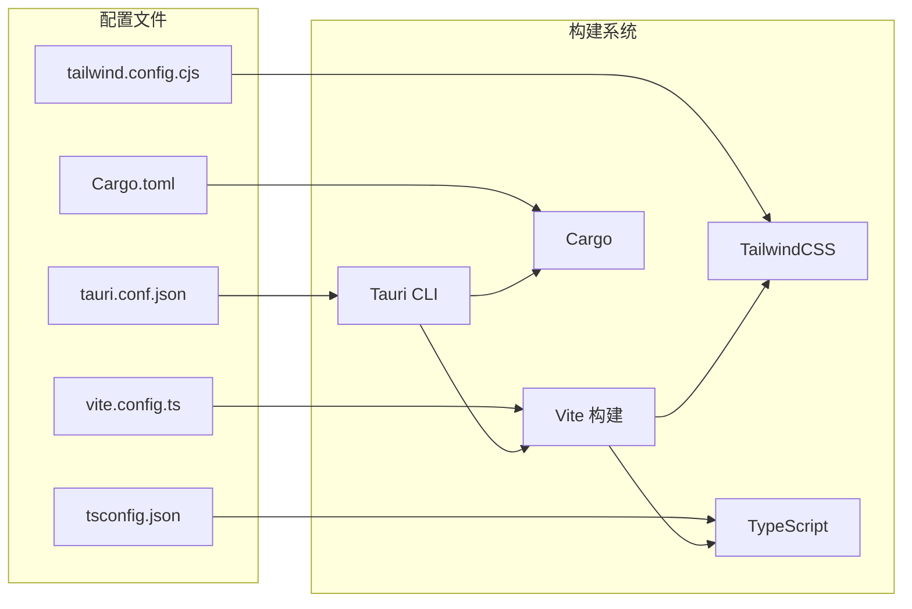
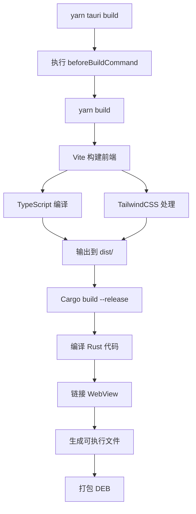
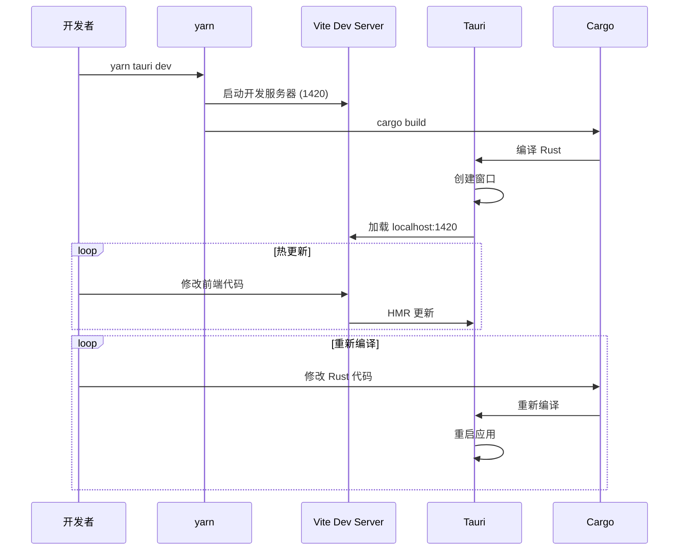

# 01 - 项目结构与配置

## 模块概览

### 文件位置

- 前端配置：`package.json`, `vite.config.ts`, `tailwind.config.cjs`, `tsconfig.json`
- 后端配置：`src-tauri/Cargo.toml`, `src-tauri/tauri.conf.json`
- 入口文件：`index.html`, `src-tauri/src/main.rs`

### 功能职责

本模块负责项目的整体配置管理，包括：
- 前端构建配置（Vite）
- 样式系统配置（TailwindCSS）
- TypeScript 编译配置
- Tauri 应用配置
- Rust 依赖管理

### 模块关系图



## 前端配置

### package.json

```json
{
  "name": "spark-store",
  "version": "0.1.0",
  "type": "module",
  "scripts": {
    "start": "vite",
    "dev": "vite",
    "build": "vite build",
    "serve": "vite preview",
    "tauri": "tauri"
  }
}
```

#### 核心依赖说明

| 依赖 | 版本 | 用途 |
|------|------|------|
| `solid-js` | ^1.9.3 | 响应式 UI 框架 |
| `@solidjs/router` | ^0.15.3 | SPA 路由 |
| `@kobalte/core` | ^0.13.7 | 无障碍 UI 组件 |
| `@tauri-apps/api` | ^2 | Tauri 前端 API |
| `@tauri-apps/plugin-*` | ^2 | Tauri 插件 |
| `tailwindcss` | ^3.4.17 | CSS 框架 |
| `embla-carousel-solid` | ^8.5.2 | 轮播组件 |
| `lucide-solid` | ^0.473.0 | 图标库 |

### vite.config.ts

```typescript
// 文件路径: vite.config.ts
import { defineConfig } from "vite";
import solid from "vite-plugin-solid";
import { resolve } from "path";

export default defineConfig(async () => ({
  plugins: [solid()],
  
  resolve: {
    alias: {
      "@": resolve(__dirname, "src"),     // @ 指向 src 目录
      "src": resolve(__dirname, "src"),
    },
  },

  clearScreen: false,                      // 不清屏，保留 Rust 错误信息
  server: {
    port: 1420,                            // 固定开发端口
    strictPort: true,                      // 端口不可用时报错
    watch: {
      ignored: ["**/src-tauri/**"],        // 忽略 Rust 代码变更
    },
  },
}));
```

#### 伪代码描述

```
配置 Vite:
  1. 启用 SolidJS 插件
  2. 设置路径别名 @ -> src/
  3. 固定开发服务器端口为 1420
  4. 忽略 src-tauri 目录的监听
```

### tailwind.config.cjs

TailwindCSS 配置定义了完整的设计系统：

| 类别 | 说明 |
|------|------|
| **暗色模式** | 支持 `.dark` 类和 `data-kb-theme="dark"` 属性 |
| **侧边栏颜色** | `sidebar-*` 系列 CSS 变量 |
| **语义颜色** | primary, secondary, destructive, success, warning, error |
| **圆角** | 基于 `--radius` CSS 变量的动态计算 |
| **动画** | accordion, content-show/hide, caret-blink |

### tsconfig.json

```jsonc
{
  "compilerOptions": {
    "target": "ES2020",
    "module": "ESNext",
    "jsx": "preserve",
    "jsxImportSource": "solid-js",      // SolidJS JSX 转换
    "strict": true,
    "baseUrl": ".",
    "paths": {
      "@/*": ["src/*"]                  // 路径别名
    }
  }
}
```

## 后端配置

### Cargo.toml

```toml
# 文件路径: src-tauri/Cargo.toml
[package]
name = "spark-store"
version = "4.9.9"
edition = "2021"

[lib]
name = "spark_store_lib"
crate-type = ["staticlib", "cdylib", "rlib"]
```

#### Rust 依赖说明

| 依赖 | 版本 | 用途 |
|------|------|------|
| `tauri` | 2 | 桌面应用框架 |
| `tauri-plugin-opener` | 2 | 打开外部链接 |
| `tauri-plugin-cli` | 2 | 命令行参数解析 |
| `tauri-plugin-window-state` | 2 | 窗口状态持久化 |
| `tauri-plugin-clipboard-manager` | 2.2.0 | 剪贴板管理 |
| `reqwest` | 0.12.12 | HTTP 客户端 |
| `tokio` | 1.43.0 | 异步运行时 |
| `serde` / `serde_json` | 1 | 序列化/反序列化 |
| `pinyin` | 0.10.0 | 中文拼音转换 |
| `lazy_static` | 1.5.0 | 静态变量延迟初始化 |
| `base64` | 0.22.1 | Base64 编解码 |
| `dirs` | 6.0.0 | 系统目录路径 |

### tauri.conf.json

```json
{
  "$schema": "https://schema.tauri.app/config/2",
  "productName": "spark-store",
  "version": "0.1.0",
  "identifier": "store.spark-app.app",
  "build": {
    "beforeDevCommand": "yarn dev",
    "devUrl": "http://localhost:1420",
    "beforeBuildCommand": "yarn build",
    "frontendDist": "../dist"
  },
  "app": {
    "windows": [{
      "title": "spark-store",
      "width": 800,
      "height": 600,
      "minWidth": 355,
      "minHeight": 510
    }]
  },
  "bundle": {
    "linux": {
      "deb": {
        "depends": ["aria2"]
      }
    }
  },
  "plugins": {
    "cli": {
      "args": [{
        "name": "spk",
        "index": 1,
        "takesValue": true
      }]
    }
  }
}
```

#### 配置说明表

| 配置项 | 值 | 说明 |
|--------|-----|------|
| `productName` | spark-store | 应用名称 |
| `identifier` | store.spark-app.app | 应用唯一标识 |
| `devUrl` | http://localhost:1420 | 开发服务器地址 |
| `minWidth/minHeight` | 355x510 | 最小窗口尺寸 |
| `deb.depends` | ["aria2"] | DEB 包依赖 |
| `cli.args.spk` | 位置参数 | SPK 协议参数 |

## 入口文件

### index.html

```html
<!-- 文件路径: index.html -->
<!doctype html>
<html lang="en">
  <head>
    <meta charset="utf-8" />
    <meta name="viewport" content="width=device-width, initial-scale=1" />
    <link rel="icon" type="image/svg+xml" href="/src/assets/logo.svg" />
    <title>Tauri + Solid + Typescript App</title>
  </head>
  <body>
    <div id="root"></div>
    <script src="/src/index.tsx" type="module"></script>
  </body>
</html>
```

### main.rs

```rust
// 文件路径: src-tauri/src/main.rs
#![cfg_attr(not(debug_assertions), windows_subsystem = "windows")]

fn main() {
    spark_store_lib::run()
}
```

#### 伪代码描述

```
主函数入口:
  1. Release 模式下隐藏 Windows 控制台窗口
  2. 调用库函数 spark_store_lib::run() 启动应用
```

## 构建流程



## 开发流程



---

[返回目录](README.md) | [下一篇: 02-前端核心模块](02-前端核心模块.md)
