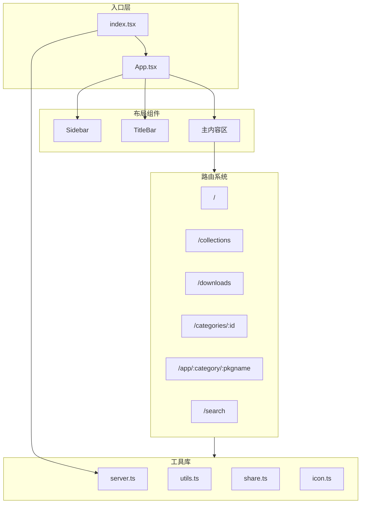
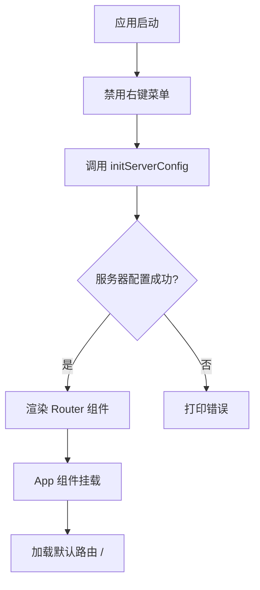
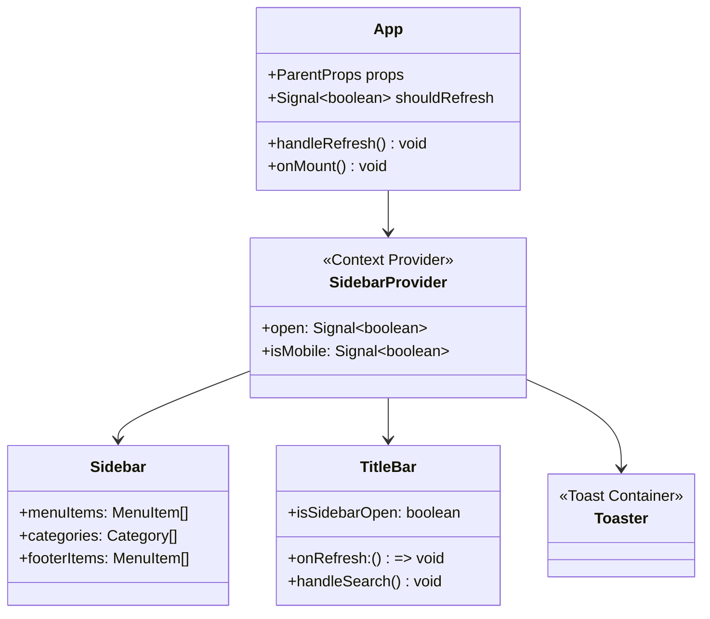
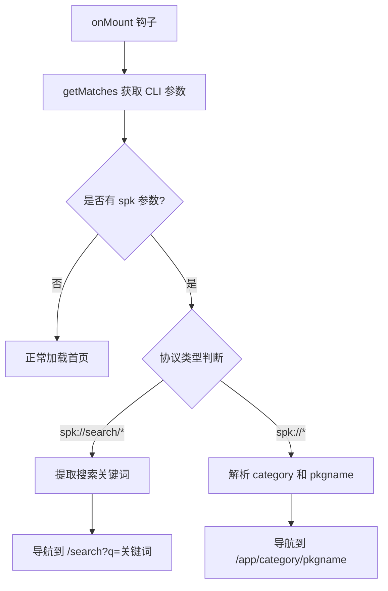
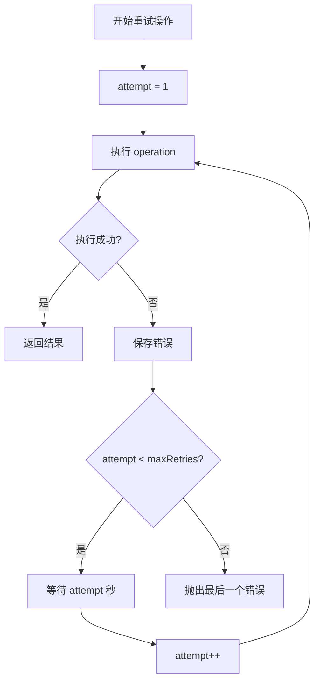

# 02 - 前端核心模块

## 模块概览

### 文件位置

- `src/index.tsx` - 应用入口与路由配置
- `src/App.tsx` - 根组件
- `src/App.css` - 全局样式
- `src/lib/` - 工具库

### 功能职责

前端核心模块负责：
- 应用初始化与服务器配置
- 路由系统配置与页面懒加载
- 全局布局管理（侧边栏、标题栏）
- SPK 协议处理
- 全局工具函数

### 模块关系图



## 应用入口 (index.tsx)

### 核心代码

```typescript
// 文件路径: src/index.tsx
import { render } from "solid-js/web";
import { Router } from "@solidjs/router";
import { lazy } from "solid-js";
import App from "./App";
import { initServerConfig } from "./lib/api/server";

const routes = {
  path: "/",
  component: App,
  children: [
    { path: "/", component: lazy(() => import("./features/home/Home")) },
    { path: "/collections", component: lazy(() => import("./features/collection/Collections")) },
    { path: "/collectionDetail/:id", component: lazy(() => import("./features/collection/CollectionDetail")) },
    { path: "/downloads", component: lazy(() => import("./features/downloads/Downloads")) },
    { path: "/categories/:id", component: lazy(() => import("./features/categories/Categories")) },
    { path: "/app/:category/:pkgname", component: lazy(() => import("./features/app-detail/AppDetail")) },
    { path: "/search", component: lazy(() => import("./features/search/Search")) },
  ],
};

const init = async () => {
  // 禁用右键菜单
  document.addEventListener('contextmenu', event => event.preventDefault());
  
  // 初始化服务器配置
  await initServerConfig();
  
  // 渲染应用
  render(() => <Router>{routes}</Router>, document.getElementById("root") as HTMLElement);
};

init().catch(console.error);
```

### 路由配置表

| 路径 | 组件 | 说明 |
|------|------|------|
| `/` | Home | 首页，展示轮播和推荐应用 |
| `/collections` | Collections | 收藏夹列表页 |
| `/collectionDetail/:id` | CollectionDetail | 收藏夹详情页 |
| `/downloads` | Downloads | 下载管理页 |
| `/categories/:id` | Categories | 分类应用列表页 |
| `/app/:category/:pkgname` | AppDetail | 应用详情页 |
| `/search` | Search | 搜索结果页 |

### 初始化流程



## 根组件 (App.tsx)

### 核心代码

```typescript
// 文件路径: src/App.tsx
import { Component, ParentProps, createSignal, onMount } from "solid-js";
import Sidebar from "./components/Sidebar";
import { SidebarProvider, useIsMobile, useSidebar } from "./components/ui/sidebar";
import TitleBar from "./components/TitleBar";
import { Toaster } from "./components/ui/toast";
import { getMatches } from '@tauri-apps/plugin-cli';
import { useNavigate } from "@solidjs/router";

const App: Component = (props: ParentProps) => {
  const isMobile = useIsMobile();
  const navigate = useNavigate();
  const [shouldRefresh, setShouldRefresh] = createSignal(false);

  const handleRefresh = () => {
    setShouldRefresh(prev => !prev);
  };

  onMount(async () => {
    const matches = await getMatches();
    
    if(typeof matches.args.spk?.value === 'string') {
      if(matches.args.spk.value.startsWith('spk://search/')) {
        // 处理搜索协议
        const path = matches.args.spk?.value.replace('spk://search/', '');
        navigate(`/search?q=${path}`);
      } else if(matches.args.spk.value.startsWith('spk://')) {
        // 处理应用协议
        const path = matches.args.spk?.value.replace('spk://', '');
        const parts = path.split('/');
        const category = parts[parts.length - 2];
        const pkgname = parts[parts.length - 1];
        navigate(`/app/${category}/${pkgname}`);
      }
    }
  });

  return (
    <div class="app-layout">
      <SidebarProvider>
        <Sidebar />
        <div class="flex flex-col w-full">
          <Toaster />
          <TitleBar onRefresh={handleRefresh} isSidebarOpen={!isMobile() && useSidebar().open()} />
          <main class="main-content w-full h-[calc(100vh-48px)] mt-12 overflow-y-auto" id="main-content">
            {props.children}
          </main>
        </div>
      </SidebarProvider>
    </div>
  );
};

export default App;
```

### 组件结构图



### SPK 协议处理



### SPK 协议格式

| 协议格式 | 示例 | 行为 |
|----------|------|------|
| `spk://search/{keyword}` | `spk://search/wechat` | 跳转搜索页 |
| `spk://{arch}/{category}/{pkgname}` | `spk://amd64-store/chat/wechat` | 跳转应用详情页 |

## 工具库 (lib/)

### server.ts - 服务器配置

```typescript
// 文件路径: src/lib/api/server.ts
import { invoke } from "@tauri-apps/api/core";

let targetArchToStore: string;
let jsonServerUrl: string;
let imgServerUrl: string;

// 初始化服务器配置
export async function initServerConfig() {
  targetArchToStore = await invoke('get_target_arch_to_store');
  jsonServerUrl = await invoke('get_json_server_url');
  imgServerUrl = await invoke('get_img_server_url');
}

export function getTargetArchToStore(): string { /* ... */ }
export function getJsonServerUrl(): string { /* ... */ }
export function getImgServerUrl(): string { /* ... */ }
export async function getUserAgent(): Promise<string> { /* ... */ }
```

#### 服务器 URL 规则

| 架构 | JSON 服务器 URL | 图片服务器 URL |
|------|----------------|----------------|
| x86_64 | `https://cdn.d.store.deepinos.org.cn/amd64-store/` | `https://spk-json.spark-app.store/amd64-store/` |
| aarch64 | `https://cdn.d.store.deepinos.org.cn/arm64-store/` | `https://spk-json.spark-app.store/arm64-store/` |
| loongarch64 | `https://cdn.d.store.deepinos.org.cn/loong64-store/` | `https://spk-json.spark-app.store/loong64-store/` |

### utils.ts - 通用工具

```typescript
// 文件路径: src/lib/utils.ts
import { type ClassValue, clsx } from "clsx";
import { twMerge } from "tailwind-merge";

// 合并 TailwindCSS 类名
export function cn(...inputs: ClassValue[]) {
  return twMerge(clsx(inputs));
}

// 重试操作包装器
export const retryOperation = async <T>(
  operation: () => Promise<T>,
  maxRetries: number = 3
): Promise<T> => {
  let lastError: any;
  
  for (let attempt = 1; attempt <= maxRetries; attempt++) {
    try {
      return await operation();
    } catch (error) {
      lastError = error;
      if (attempt === maxRetries) break;
      await new Promise(resolve => setTimeout(resolve, 1000 * attempt));
    }
  }
  
  throw lastError;
};
```

#### retryOperation 流程



### share.ts - 分享功能

```typescript
// 文件路径: src/lib/share.ts
import { invoke } from "@tauri-apps/api/core";
import { writeText } from '@tauri-apps/plugin-clipboard-manager';

export const copy = async (text: string): Promise<void> => {
  await writeText(text);
};

export const generateShareLinks = async (category: string, pkgname: string) => {
  const targetArch = await getTargetArchToStore();
  
  return {
    spkLink: `spk://${targetArch}/${category}/${pkgname}`,
    shareLink: `https://spk-resolv.spark-app.store/?spk=spk://${targetArch}/${category}/${pkgname}`,
    shareIframe: `<iframe src="..." height="350" width="100%"></iframe>`
  };
};
```

#### 分享链接类型

| 类型 | 格式 | 用途 |
|------|------|------|
| SPK Link | `spk://arch/category/pkgname` | 本地应用打开 |
| Share Link | `https://spk-resolv.spark-app.store/?spk=...` | 网页分享 |
| Share Iframe | `<iframe src="...">` | 嵌入网页 |

### icon.ts - 图标映射

```typescript
// 文件路径: src/lib/icon.ts
import { Package, Code, Globe, Palette, /* ... */ } from 'lucide-solid';

const iconMap: Record<string, typeof Icon> = {
  'code': Code,
  'globe': Globe,
  'palette': Palette,
  'message-circle': MessageCircle,
  'gamepad-2': Gamepad2,
  'image': Image,
  'music': Music,
  'file-text': FileText,
  'grid': Grid
};

export const getIconComponent = (iconName?: string): typeof Icon => {
  if (!iconName) return Package;
  return iconMap[iconName] || Package;
};
```

## 状态管理模式

项目采用 SolidJS 的响应式原语进行状态管理：

```mermaid
flowchart LR
    subgraph Primitives["SolidJS 原语"]
        Signal[createSignal]
        Resource[createResource]
        Effect[createEffect]
    end
    
    subgraph Store["Store 模式"]
        HomeStore[useHomeStore]
        AppDetailStore[useAppDetailStore]
        DownloadsStore[useDownloadsStore]
        CollectionStore[useCollectionStore]
        CategoriesStore[useCategoriesStore]
    end
    
    subgraph Features["功能模块"]
        Home[Home 页面]
        AppDetail[AppDetail 页面]
        Downloads[Downloads 页面]
    end
    
    Primitives --> Store
    Store --> Features
```



### Store 设计模式

```typescript
// 典型的 Store 结构
export const useXxxStore = () => {
  // 使用 createResource 进行数据获取
  const [data, { refetch }] = createResource(fetchData);
  
  // 派生状态
  const loading = () => data.loading;
  
  // 操作方法
  const someAction = async () => { /* ... */ };
  
  return {
    data,
    loading,
    refetch,
    someAction
  };
};
```

---

[上一篇: 01-项目结构](01-项目结构.md) | [返回目录](README.md) | [下一篇: 03-后端核心模块](03-后端核心模块.md)
