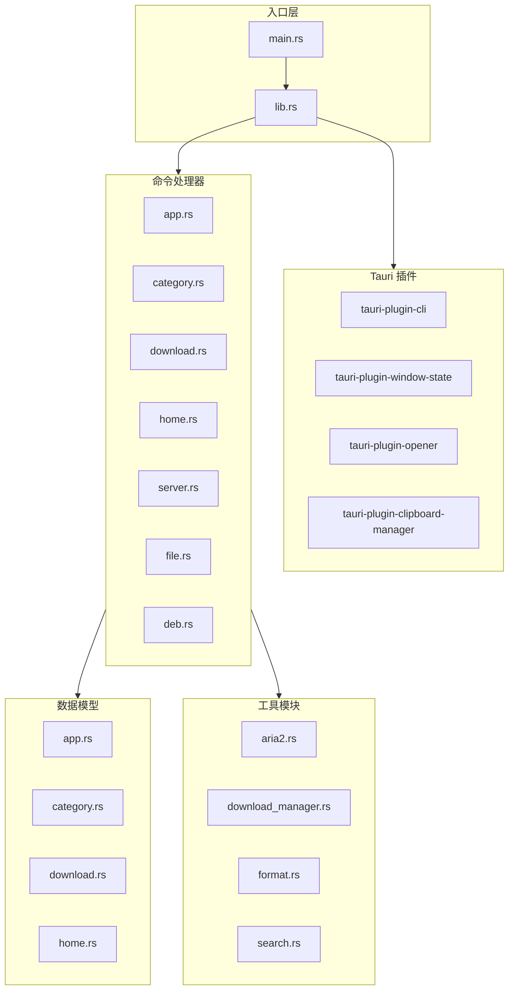
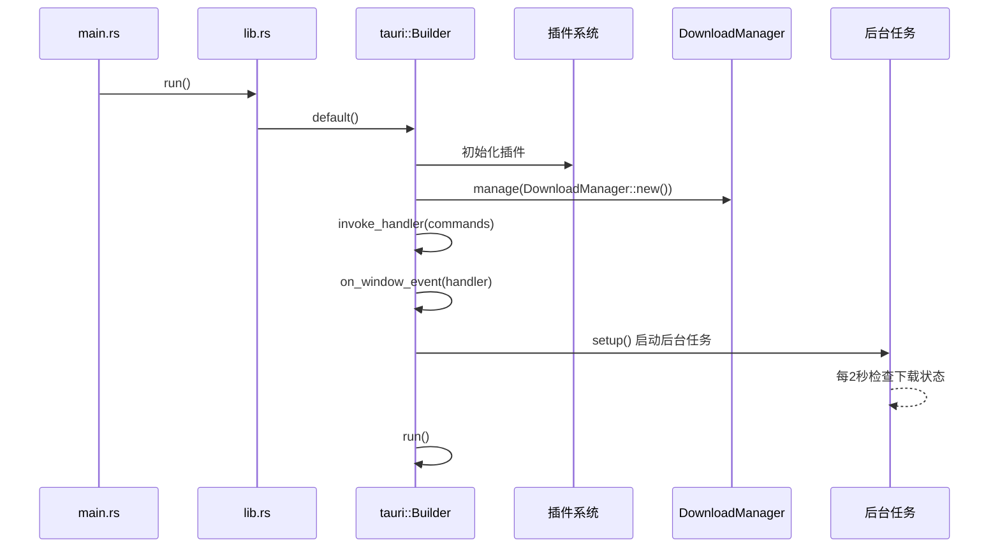
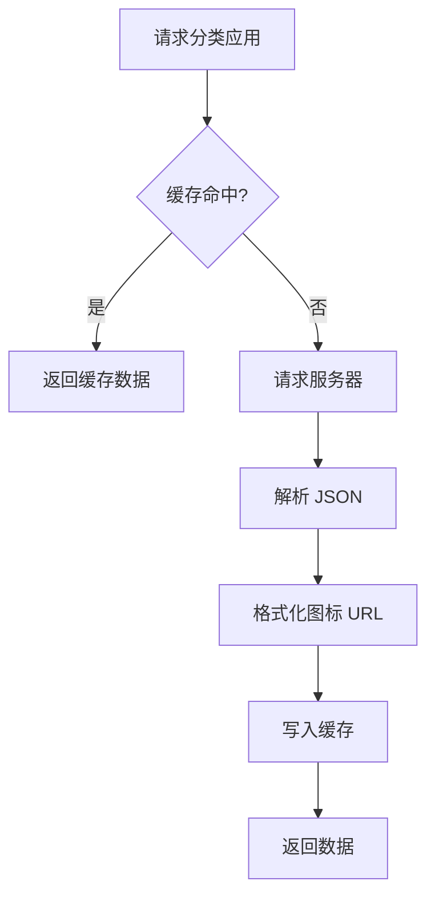
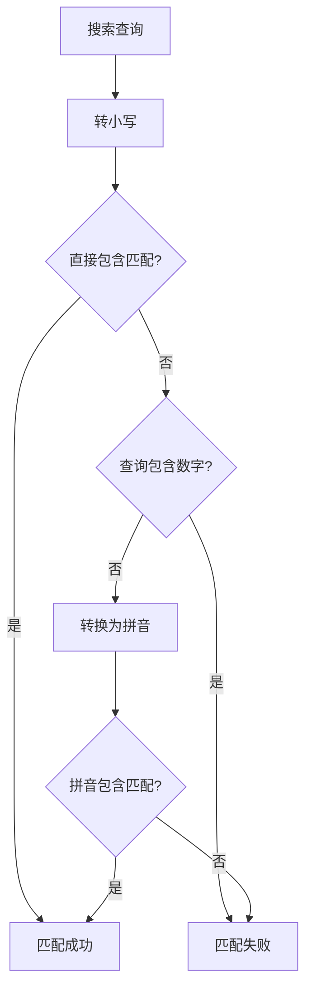
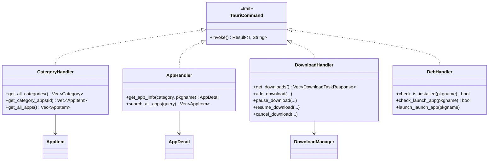

# 03 - 后端核心模块

## 模块概览

### 文件位置

- `src-tauri/src/lib.rs` - 库入口与 Tauri 配置
- `src-tauri/src/main.rs` - 主程序入口
- `src-tauri/src/handlers/` - 命令处理器
- `src-tauri/src/models/` - 数据模型
- `src-tauri/src/utils/` - 工具模块

### 功能职责

后端核心模块负责：
- Tauri 应用初始化与插件配置
- 命令处理器注册与实现
- 数据模型定义与序列化
- 网络请求与缓存管理
- 系统交互（文件、进程）

### 模块关系图



## 库入口 (lib.rs)

### 核心代码

```rust
// 文件路径: src-tauri/src/lib.rs
use tauri::Manager;
use utils::download_manager::DownloadManager;

mod handlers;
mod models;
mod utils;

#[cfg_attr(mobile, tauri::mobile_entry_point)]
pub fn run() {
    tauri::Builder::default()
        // 插件初始化
        .plugin(tauri_plugin_cli::init())
        .plugin(tauri_plugin_window_state::Builder::new().build())
        .plugin(tauri_plugin_opener::init())
        .plugin(tauri_plugin_clipboard_manager::init())
        // 状态管理
        .manage(utils::download_manager::DownloadManager::new())
        // 命令注册
        .invoke_handler(tauri::generate_handler![
            handlers::category::get_all_categories,
            handlers::category::get_category_apps,
            handlers::category::get_all_apps,
            handlers::server::get_target_arch_to_store,
            handlers::server::get_json_server_url,
            handlers::server::get_img_server_url,
            handlers::app::get_app_info,
            handlers::app::search_all_apps,
            handlers::home::get_home_links,
            handlers::home::get_home_lists,
            handlers::home::get_home_list_apps,
            handlers::file::read_text_file,
            handlers::file::save_text_file,
            handlers::download::get_downloads,
            handlers::download::add_download,
            handlers::download::pause_download,
            handlers::download::resume_download,
            handlers::download::cancel_download,
            handlers::deb::check_is_installed,
            handlers::deb::check_launch_app,
            handlers::deb::launch_launch_app,
            utils::get_user_agent,
        ])
        // 窗口事件处理
        .on_window_event(|window, event| match event {
            tauri::WindowEvent::Destroyed => {
                let download_manager = window.state::<DownloadManager>();
                download_manager.shutdown_aria2();
            }
            _ => {}
        })
        // 应用初始化
        .setup(|app| {
            let app_handle = app.handle().clone();
            // 后台任务：定时检查下载状态
            tauri::async_runtime::spawn(async move {
                loop {
                    {
                        let download_manager = app_handle.state::<DownloadManager>();
                        if download_manager.has_downloads() {
                            let _ = download_manager.get_downloads().await;
                        }
                    }
                    tokio::time::sleep(tokio::time::Duration::from_secs(2)).await;
                }
            });
            Ok(())
        })
        .run(tauri::generate_context!())
        .expect("error while running tauri application");
}
```

### 插件说明表

| 插件 | 功能 | 使用场景 |
|------|------|----------|
| `tauri_plugin_cli` | 命令行参数解析 | 处理 SPK 协议 |
| `tauri_plugin_window_state` | 窗口状态持久化 | 记住窗口位置和大小 |
| `tauri_plugin_opener` | 打开外部链接/文件 | 打开应用官网 |
| `tauri_plugin_clipboard_manager` | 剪贴板操作 | 复制分享链接 |

### 命令注册表

| 模块 | 命令 | 说明 |
|------|------|------|
| **category** | `get_all_categories` | 获取所有分类 |
| | `get_category_apps` | 获取分类下的应用 |
| | `get_all_apps` | 获取所有应用 |
| **server** | `get_target_arch_to_store` | 获取目标架构 |
| | `get_json_server_url` | 获取 JSON 服务器 URL |
| | `get_img_server_url` | 获取图片服务器 URL |
| **app** | `get_app_info` | 获取应用详情 |
| | `search_all_apps` | 搜索应用 |
| **home** | `get_home_links` | 获取首页轮播 |
| | `get_home_lists` | 获取首页列表 |
| | `get_home_list_apps` | 获取列表应用 |
| **file** | `read_text_file` | 读取配置文件 |
| | `save_text_file` | 保存配置文件 |
| **download** | `get_downloads` | 获取下载列表 |
| | `add_download` | 添加下载 |
| | `pause_download` | 暂停下载 |
| | `resume_download` | 恢复下载 |
| | `cancel_download` | 取消下载 |
| **deb** | `check_is_installed` | 检查是否已安装 |
| | `check_launch_app` | 检查能否启动 |
| | `launch_launch_app` | 启动应用 |

### 初始化流程



## 命令处理器

### handlers/mod.rs

```rust
// 文件路径: src-tauri/src/handlers/mod.rs
pub mod app;
pub mod category;
pub mod deb;
pub mod download;
pub mod file;
pub mod home;
pub mod server;
```

### handlers/server.rs - 服务器配置

```rust
// 文件路径: src-tauri/src/handlers/server.rs
#[tauri::command]
pub fn get_target_arch_to_store() -> String {
    #[cfg(target_arch = "x86_64")]
    { return "amd64-store".to_string(); }
    
    #[cfg(target_arch = "aarch64")]
    { return "arm64-store".to_string(); }
    
    #[cfg(target_arch = "loongarch64")]
    { return "loong64-store".to_string(); }
}

#[tauri::command]
pub fn get_json_server_url() -> String {
    let arch = get_target_arch_to_store();
    format!("https://cdn.d.store.deepinos.org.cn/{}/", arch)
}

#[tauri::command]
pub fn get_img_server_url() -> String {
    let arch = get_target_arch_to_store();
    format!("https://spk-json.spark-app.store/{}/", arch)
}
```

#### 架构映射表

| Rust 架构 | Store 架构 | JSON 服务器 |
|-----------|-----------|-------------|
| `x86_64` | `amd64-store` | `cdn.d.store.deepinos.org.cn/amd64-store/` |
| `aarch64` | `arm64-store` | `cdn.d.store.deepinos.org.cn/arm64-store/` |
| `loongarch64` | `loong64-store` | `cdn.d.store.deepinos.org.cn/loong64-store/` |

### handlers/category.rs - 分类管理

```rust
// 文件路径: src-tauri/src/handlers/category.rs
use lazy_static::lazy_static;
use std::collections::HashMap;
use std::sync::Mutex;

lazy_static! {
    static ref APPS_CACHE: Mutex<HashMap<String, Vec<AppItem>>> = Mutex::new(HashMap::new());
    static ref CATEGORIES_CACHE: Mutex<Option<Vec<Category>>> = Mutex::new(None);
}

#[tauri::command]
pub async fn get_category_apps(category_id: String) -> Result<Vec<AppItem>, String> {
    // 尝试从缓存获取
    if let Some(cached_apps) = APPS_CACHE.lock().unwrap().get(&category_id) {
        return Ok(cached_apps.clone());
    }
    
    // 从服务器获取
    let url = format!("{}{}/applist.json", json_server_url, category_id);
    let mut apps: Vec<AppItem> = client.get(&url).send().await?.json().await?;
    
    // 设置图标 URL
    for app in &mut apps {
        app.icon = Some(format_icon_url(&category_id, &app.pkgname));
        app.category = Some(category_id.clone());
    }
    
    // 更新缓存
    APPS_CACHE.lock().unwrap().insert(category_id.clone(), apps.clone());
    
    Ok(apps)
}

#[tauri::command]
pub async fn get_all_apps() -> Result<Vec<AppItem>, String> {
    let categories = get_all_categories().await?;
    let futures: Vec<_> = categories.iter()
        .map(|c| get_category_apps(c.id.clone()))
        .collect();
    
    let results = join_all(futures).await;
    // 合并所有结果...
}
```

#### 缓存策略



### handlers/app.rs - 应用管理

```rust
// 文件路径: src-tauri/src/handlers/app.rs
#[tauri::command]
pub async fn get_app_info(category: String, pkgname: String) -> Result<AppDetail, String> {
    let url = format!("{}{}/{}/app.json", json_server_url, category, pkgname);
    
    let response = reqwest::Client::new()
        .get(&url)
        .header("User-Agent", UA)
        .send().await?
        .text().await?;
    
    let mut app_info: AppDetail = serde_json::from_str(&response)?;
    
    // 补充信息
    app_info.category = Some(category.clone());
    app_info.icon = Some(format_icon_url(&category, &app_info.pkgname));
    app_info.download_times = Some(get_download_times(category, pkgname).await?);
    
    Ok(app_info)
}

#[tauri::command]
pub async fn search_all_apps(query: String) -> Result<Vec<AppItem>, String> {
    let all_apps = get_all_apps().await?;
    Ok(crate::utils::search::search_apps(&all_apps, &query))
}
```

### handlers/deb.rs - DEB 包操作

```rust
// 文件路径: src-tauri/src/handlers/deb.rs
use std::process::Command;

#[tauri::command]
pub async fn check_is_installed(pkgname: String) -> Result<bool, String> {
    let output = Command::new("/opt/durapps/spark-store/bin/store-helper/check-is-installed")
        .arg(&pkgname)
        .output()?;
    
    Ok(output.status.success())
}

#[tauri::command]
pub async fn launch_launch_app(pkgname: String) -> Result<(), String> {
    Command::new("/opt/durapps/spark-store/bin/store-helper/ss-launcher")
        .arg("launch")
        .arg(&pkgname)
        .process_group(0)  // 独立进程组
        .spawn()?;
    
    Ok(())
}
```

#### 系统工具路径

| 工具 | 路径 | 功能 |
|------|------|------|
| `check-is-installed` | `/opt/durapps/spark-store/bin/store-helper/` | 检查包是否已安装 |
| `ss-launcher` | `/opt/durapps/spark-store/bin/store-helper/` | 启动应用 |
| `ssinstall` | 系统 PATH | 安装 DEB 包 |

### handlers/file.rs - 文件操作

```rust
// 文件路径: src-tauri/src/handlers/file.rs
use std::fs;

#[tauri::command]
pub fn save_text_file(filename: String, content: String) -> Result<(), String> {
    let config_dir = dirs::config_dir().ok_or("无法获取配置目录")?;
    let dir = config_dir.join(env!("CARGO_PKG_NAME"));  // ~/.config/spark-store/
    
    fs::create_dir_all(&dir)?;
    let file_path = dir.join(filename);
    fs::write(file_path, content)?;
    
    Ok(())
}

#[tauri::command]
pub fn read_text_file(filename: String) -> Result<String, String> {
    let config_dir = dirs::config_dir().ok_or("无法获取配置目录")?;
    let dir = config_dir.join(env!("CARGO_PKG_NAME"));
    let file_path = dir.join(filename);
    
    fs::read_to_string(file_path).map_err(|e| e.to_string())
}
```

## 工具模块

### utils/mod.rs

```rust
// 文件路径: src-tauri/src/utils/mod.rs
pub mod aria2;
pub mod download_manager;
pub mod format;
pub mod search;

pub const UA: &str = concat!("Spark-Store/", env!("CARGO_PKG_VERSION"));

#[tauri::command]
pub fn get_user_agent() -> String {
    UA.into()
}
```

### utils/search.rs - 搜索算法

```rust
// 文件路径: src-tauri/src/utils/search.rs
use pinyin::ToPinyin;

pub fn match_text(text: &str, query: &str) -> bool {
    let text_lower = text.to_lowercase();
    let query_lower = query.to_lowercase();
    
    // 直接匹配
    if text_lower.contains(&query_lower) {
        return true;
    }
    
    // 拼音匹配（跳过包含数字的查询）
    if query.chars().any(|c| c.is_numeric()) {
        return false;
    }
    
    // 获取拼音
    let text_pinyin: String = text.to_pinyin()
        .filter_map(|p| p)
        .map(|p| p.plain().to_lowercase())
        .collect();
    
    let query_pinyin = if query.chars().all(|c| c.is_ascii_alphabetic()) {
        query.to_lowercase()
    } else {
        query.to_pinyin().filter_map(|p| p).map(|p| p.plain().to_lowercase()).collect()
    };
    
    text_pinyin.contains(&query_pinyin)
}

pub fn search_apps(apps: &[AppItem], query: &str) -> Vec<AppItem> {
    apps.iter()
        .filter(|app| {
            match_text(&app.name, query) ||
            match_text(&app.pkgname, query) ||
            match_text(&app.more, query)
        })
        .cloned()
        .collect()
}
```

#### 搜索匹配流程



### utils/format.rs - 格式化工具

```rust
// 文件路径: src-tauri/src/utils/format.rs
pub fn format_size(size: u64) -> String {
    const KB: u64 = 1024;
    const MB: u64 = KB * 1024;
    const GB: u64 = MB * 1024;
    
    if size >= GB {
        format!("{:.2} GB", size as f64 / GB as f64)
    } else if size >= MB {
        format!("{:.2} MB", size as f64 / MB as f64)
    } else if size >= KB {
        format!("{:.2} KB", size as f64 / KB as f64)
    } else {
        format!("{} B", size)
    }
}

pub fn format_speed(speed: u64) -> String {
    format!("{}/s", format_size(speed))
}

pub fn format_icon_url(category: &str, pkgname: &str) -> String {
    format!("{}{}/{}/icon.png", get_img_server_url(), category, pkgname)
}
```

## 类继承关系



---

[上一篇: 02-前端核心模块](02-前端核心模块.md) | [返回目录](README.md) | [下一篇: 04-数据类型定义](04-数据类型定义.md)
