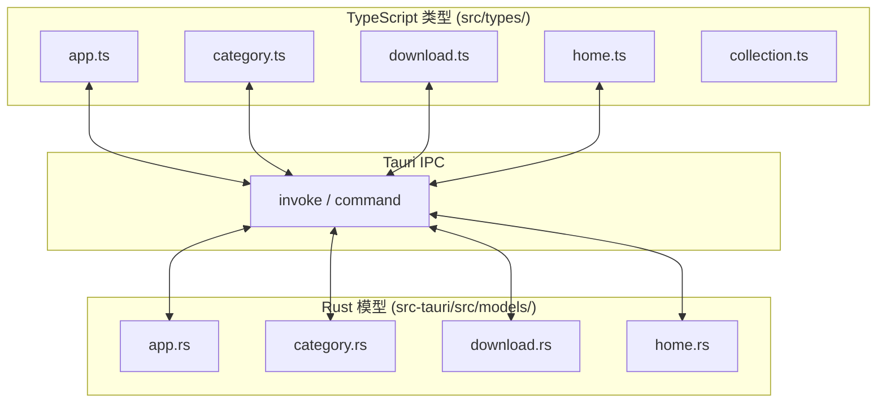
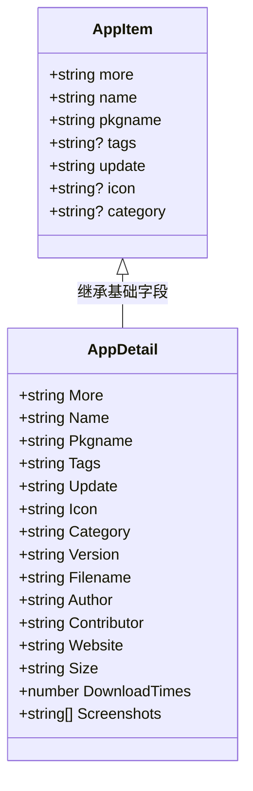
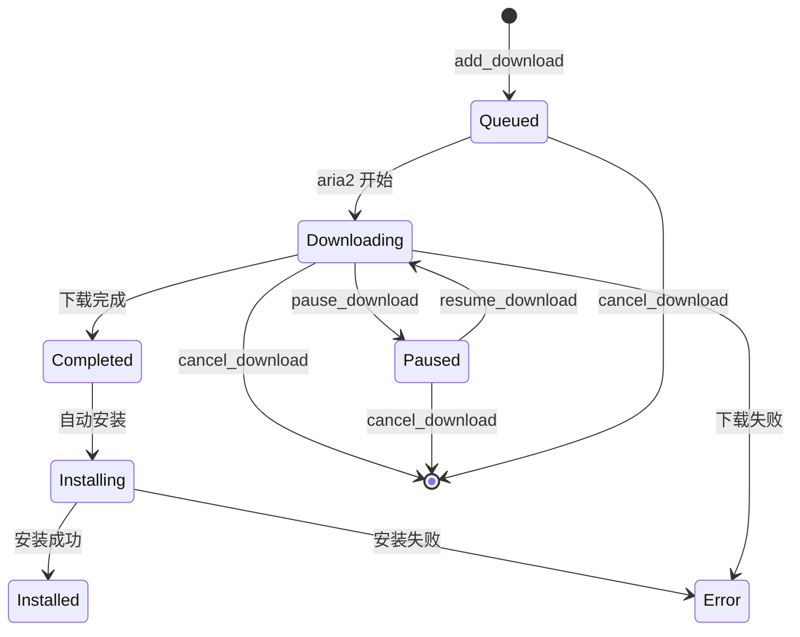
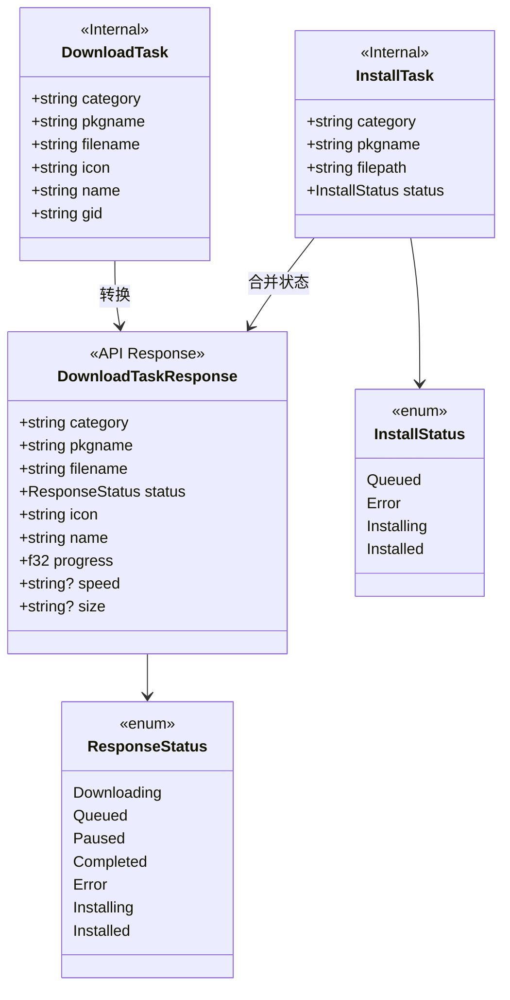
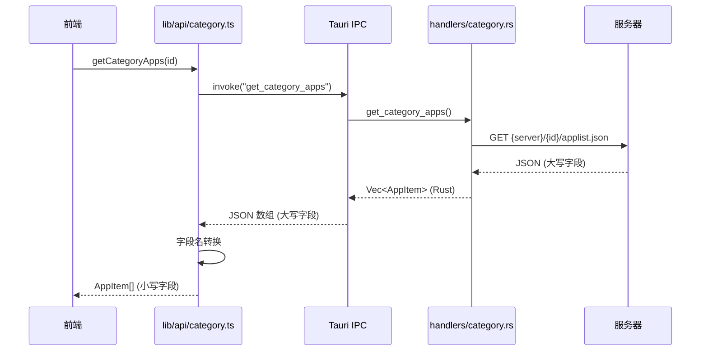

# 04 - 数据类型定义

## 模块概览

### 文件位置

- TypeScript 类型：`src/types/`
- Rust 模型：`src-tauri/src/models/`

### 功能职责

数据类型定义模块负责：
- 定义前后端共享的数据结构
- 提供类型安全的接口契约
- 处理序列化/反序列化映射

### 模块关系图



## 应用类型 (App)

### TypeScript 定义

```typescript
// 文件路径: src/types/app.ts

// 应用列表项（简略信息）
export interface AppItem {
  more: string;        // 应用描述
  name: string;        // 应用名称
  pkgname: string;     // 包名
  tags?: string;       // 标签
  update: string;      // 更新时间
  icon?: string;       // 图标 URL
  category?: string;   // 分类 ID
}

// 应用详情（完整信息）
export interface AppDetail {
  More: string;           // 应用描述
  Name: string;           // 应用名称
  Pkgname: string;        // 包名
  Tags: string;           // 标签
  Update: string;         // 更新时间
  Icon: string;           // 图标 URL
  Category: string;       // 分类 ID
  Version: string;        // 版本号
  Filename: string;       // 文件名
  Author: string;         // 作者
  Contributor: string;    // 投稿者
  Website: string;        // 官网
  Size: string;           // 大小
  DownloadTimes: number;  // 下载次数
  Screenshots: string[];  // 截图列表
}
```

### Rust 定义

```rust
// 文件路径: src-tauri/src/models/app.rs
use serde::{Deserialize, Serialize};

#[derive(Serialize, Deserialize, Clone)]
pub struct AppItem {
    #[serde(rename = "More")]
    pub more: String,
    #[serde(rename = "Name")]
    pub name: String,
    #[serde(rename = "Pkgname")]
    pub pkgname: String,
    #[serde(rename = "Tags")]
    pub tags: Option<String>,
    #[serde(rename = "Update")]
    pub update: String,
    pub icon: Option<String>,
    pub category: Option<String>,
}

#[derive(Serialize, Deserialize, Clone)]
pub struct AppDetail {
    #[serde(rename = "More")]
    pub more: String,
    #[serde(rename = "Name")]
    pub name: String,
    #[serde(rename = "Pkgname")]
    pub pkgname: String,
    #[serde(rename = "Tags")]
    pub tags: Option<String>,
    #[serde(rename = "Update")]
    pub update: String,
    #[serde(rename = "Icon")]
    pub icon: Option<String>,
    #[serde(rename = "Category")]
    pub category: Option<String>,
    #[serde(rename = "Version")]
    pub version: String,
    #[serde(rename = "Filename")]
    pub filename: String,
    #[serde(rename = "Author")]
    pub author: String,
    #[serde(rename = "Contributor")]
    pub contributor: String,
    #[serde(rename = "Website")]
    pub website: Option<String>,
    #[serde(rename = "Size")]
    pub size: String,
    #[serde(rename = "DownloadTimes")]
    pub download_times: Option<i32>,
}
```

### 字段映射表

| TypeScript 字段 | Rust 字段 | JSON 字段 | 说明 |
|-----------------|-----------|-----------|------|
| `more` / `More` | `more` | `More` | 应用描述 |
| `name` / `Name` | `name` | `Name` | 应用名称 |
| `pkgname` / `Pkgname` | `pkgname` | `Pkgname` | 包名 |
| `tags` / `Tags` | `tags` | `Tags` | 标签 |
| `update` / `Update` | `update` | `Update` | 更新时间 |
| `icon` / `Icon` | `icon` | - | 图标 URL（前端生成） |
| `category` / `Category` | `category` | - | 分类 ID（前端补充） |

> **注意**：`AppItem` 使用小写字段名，`AppDetail` 使用大写字段名，这是历史遗留的命名不一致问题。前端需要进行字段名转换。

### 类型关系图



## 分类类型 (Category)

### TypeScript 定义

```typescript
// 文件路径: src/types/category.ts
export interface Category {
  id: string;         // 分类 ID
  icon: string;       // 图标名称
  name_zh_cn: string; // 中文名称
}
```

### Rust 定义

```rust
// 文件路径: src-tauri/src/models/category.rs
use serde::{Deserialize, Serialize};

#[derive(Serialize, Deserialize, Clone, Debug)]
pub struct Category {
    pub id: String,
    pub icon: String,
    pub name_zh_cn: String,
}
```

### 分类示例

| ID | 图标 | 中文名称 |
|----|------|----------|
| `chat` | `message-circle` | 即时通讯 |
| `music` | `music` | 音乐欣赏 |
| `video` | `image` | 视频播放 |
| `games` | `gamepad-2` | 游戏娱乐 |
| `office` | `file-text` | 办公学习 |
| `development` | `code` | 编程开发 |

## 下载类型 (Download)

### TypeScript 定义

```typescript
// 文件路径: src/types/download.ts

// 下载状态枚举
export enum DownloadStatus {
  downloading = 'downloading',  // 下载中
  queued = 'queued',           // 排队中
  paused = 'paused',           // 已暂停
  completed = 'completed',     // 下载完成
  error = 'error',             // 错误
  installing = 'installing',   // 安装中
  installed = 'installed'      // 已安装
}

// 下载任务
export interface DownloadTask {
  category: string;            // 分类
  pkgname: string;             // 包名
  filename: string;            // 文件名
  status: DownloadStatus;      // 状态
  progress: number;            // 进度 (0-100)
  speed?: string;              // 速度
  size?: string;               // 大小
  icon: string;                // 图标
  name: string;                // 名称
}
```

### Rust 定义

```rust
// 文件路径: src-tauri/src/models/download.rs
use serde::{Deserialize, Serialize};

// 下载任务（内部使用）
#[derive(Debug, Serialize, Deserialize, Clone)]
pub struct DownloadTask {
    pub category: String,
    pub pkgname: String,
    pub filename: String,
    pub icon: String,
    pub name: String,
    pub gid: String,        // aria2 任务 ID
}

// 安装任务
#[derive(Debug, Serialize, Deserialize, Clone)]
pub struct InstallTask {
    pub category: String,
    pub pkgname: String,
    pub filepath: String,
    pub status: InstallStatus,
}

// 下载任务响应（返回前端）
#[derive(Debug, Serialize, Deserialize, Clone)]
pub struct DownloadTaskResponse {
    pub category: String,
    pub pkgname: String,
    pub filename: String,
    pub status: ResponseStatus,
    pub icon: String,
    pub name: String,
    pub progress: f32,
    pub speed: Option<String>,
    pub size: Option<String>,
}

// 响应状态枚举
#[derive(Debug, Serialize, Deserialize, Clone)]
#[serde(rename_all = "lowercase")]
pub enum ResponseStatus {
    Downloading,  // 下载中
    Queued,       // 排队中
    Paused,       // 已暂停
    Completed,    // 下载完成
    Error,        // 错误
    Installing,   // 安装中
    Installed,    // 已安装
}

// 安装状态枚举
#[derive(Debug, Serialize, Deserialize, Clone)]
#[serde(rename_all = "lowercase")]
pub enum InstallStatus {
    Queued,       // 等待安装
    Error,        // 错误
    Installing,   // 安装中
    Installed,    // 安装完成
}
```

### 状态流转图



### 类型关系图



## 首页类型 (Home)

### TypeScript 定义

```typescript
// 文件路径: src/types/home.ts

// 首页轮播链接
export interface HomeLink {
  name: string;       // 名称
  more: string;       // 描述
  imgUrl: string;     // 图片 URL
  type: string;       // 类型
  linkUrl: string;    // 跳转链接
}

// 首页轮播原始响应
export interface HomeLinkResponse {
  name: string;
  more: string;
  imgUrl: string;
  type: string;
  url: string;        // 原始字段名
}

// 首页列表
export interface HomeList {
  name: string;       // 列表名称
  more: string;       // 描述
  jsonUrl: string;    // 数据 URL
}

// 首页列表应用
export interface HomeListApp {
  Name: string;       // 应用名称
  Pkgname: string;    // 包名
  Category: string;   // 分类
  More: string;       // 描述
  Icon: string;       // 图标
}
```

### Rust 定义

```rust
// 文件路径: src-tauri/src/models/home.rs
use serde::{Deserialize, Serialize};

#[derive(Serialize, Deserialize, Clone, Debug)]
pub struct HomeListApp {
    #[serde(rename = "Name")]
    pub name: String,
    #[serde(rename = "Pkgname")]
    pub pkgname: String,
    #[serde(rename = "Category")]
    pub category: String,
    #[serde(rename = "More")]
    pub more: String,
    #[serde(rename = "Icon")]
    pub icon: Option<String>,
}

#[derive(Serialize, Deserialize, Clone)]
pub struct HomeLink {
    pub name: String,
    pub more: String,
    #[serde(rename = "imgUrl")]
    pub img_url: String,
    #[serde(rename = "type")]
    pub link_type: String,
    pub url: String,
}

#[derive(Serialize, Deserialize, Clone)]
pub struct HomeList {
    pub name: String,
    #[serde(rename = "type")]
    pub list_type: String,
    #[serde(rename = "jsonUrl")]
    pub json_url: String,
}
```

## 收藏类型 (Collection)

### TypeScript 定义

```typescript
// 文件路径: src/types/collection.ts
import { AppDetail } from "./app";

// 收藏夹
export interface Collection {
  id: string;              // 唯一 ID
  name: string;            // 名称
  description?: string;    // 描述
  apps: {                  // 应用列表
    Category: string;
    Pkgname: string;
  }[];
  createdAt: number;       // 创建时间戳
  updatedAt: number;       // 更新时间戳
}

// 带完整应用信息的收藏夹
export interface CollectionWithApps extends Collection {
  apps: AppDetail[];
}

// 创建收藏夹参数
export interface CreateCollectionParams {
  name: string;
  description?: string;
}
```

> **注意**：`Collection` 是纯前端类型，数据存储在本地配置文件 `~/.config/spark-store/collections.json`。

## 类型转换流程

### 前端获取应用列表



### 字段名转换代码

```typescript
// 前端需要转换大写字段名为小写
const rawApps = await invoke<Array<{
  More: string,
  Name: string,
  Pkgname: string,
  Tags?: string,
  Update: string,
  icon?: string,
  category?: string
}>>("get_category_apps", { categoryId });

// 转换为前端使用的小写格式
return rawApps.map(app => ({
  more: app.More,
  name: app.Name,
  pkgname: app.Pkgname,
  tags: app.Tags,
  update: app.Update,
  icon: app.icon,
  category: app.category
}));
```

## JSON 数据结构

### applist.json

```json
[
  {
    "More": "微信是一款跨平台的通讯工具",
    "Name": "微信",
    "Pkgname": "com.tencent.weixin",
    "Tags": "社交,即时通讯",
    "Update": "2024-01-01"
  }
]
```

### app.json

```json
{
  "More": "微信是一款跨平台的通讯工具",
  "Name": "微信",
  "Pkgname": "com.tencent.weixin",
  "Tags": "社交,即时通讯",
  "Update": "2024-01-01",
  "Version": "3.0.0",
  "Filename": "com.tencent.weixin_3.0.0_amd64.deb",
  "Author": "Tencent",
  "Contributor": "spark-store",
  "Website": "https://weixin.qq.com",
  "Size": "150 MB"
}
```

### category.json

```json
[
  {
    "id": "chat",
    "icon": "message-circle",
    "name_zh_cn": "即时通讯"
  }
]
```

---

[上一篇: 03-后端核心模块](03-后端核心模块.md) | [返回目录](README.md) | [下一篇: 05-UI组件模块](05-UI组件模块.md)
