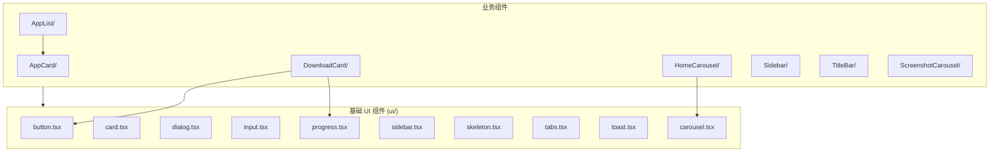
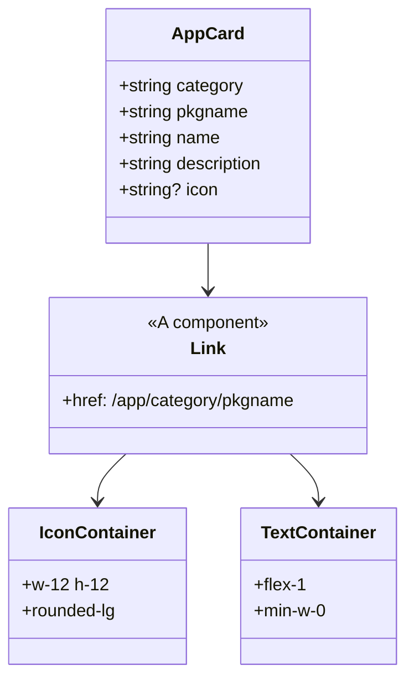
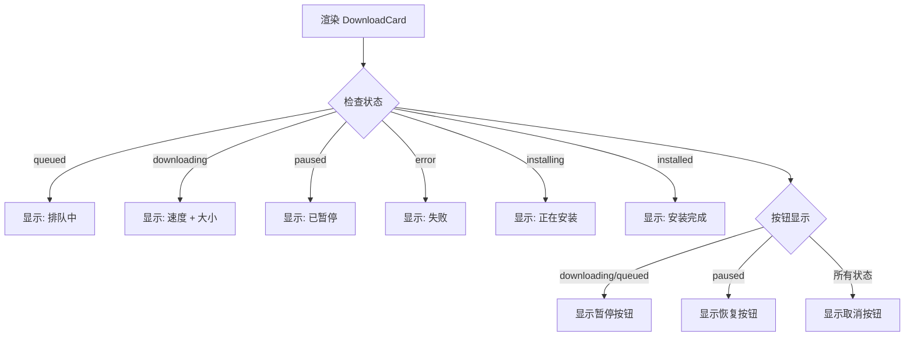
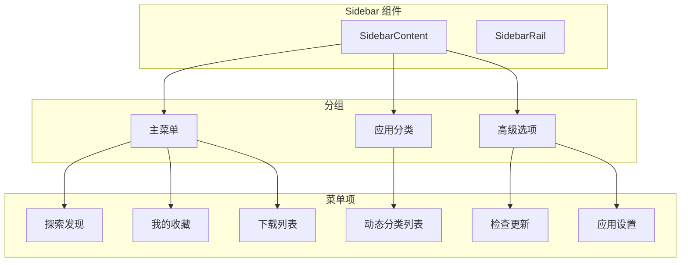

# 05 - UI 组件模块

## 模块概览

### 文件位置

- `src/components/` - 业务组件
- `src/components/ui/` - 基础 UI 组件库

### 功能职责

UI 组件模块负责：
- 提供可复用的基础 UI 组件
- 实现业务相关的复合组件
- 统一的设计系统和样式规范

### 模块关系图



## 基础 UI 组件库

项目使用 [Kobalte](https://kobalte.dev/) 作为无障碍组件库基础，结合 TailwindCSS 实现设计系统。

### 组件列表

| 组件 | 文件 | 说明 |
|------|------|------|
| Button | `button.tsx` | 按钮组件 |
| Card | `card.tsx` | 卡片组件 |
| Carousel | `carousel.tsx` | 轮播组件 |
| Checkbox | `checkbox.tsx` | 复选框 |
| Dialog | `dialog.tsx` | 对话框 |
| DropdownMenu | `dropdown-menu.tsx` | 下拉菜单 |
| Input | `input.tsx` | 输入框 |
| Label | `label.tsx` | 标签 |
| Progress | `progress.tsx` | 进度条 |
| Separator | `separator.tsx` | 分隔线 |
| Sheet | `sheet.tsx` | 侧边抽屉 |
| Sidebar | `sidebar.tsx` | 侧边栏 |
| Skeleton | `skeleton.tsx` | 骨架屏 |
| Tabs | `tabs.tsx` | 标签页 |
| TextField | `text-field.tsx` | 文本输入 |
| Toast | `toast.tsx` | 消息提示 |
| Tooltip | `tooltip.tsx` | 工具提示 |

## 业务组件

### AppCard - 应用卡片

```typescript
// 文件路径: src/components/AppCard/index.tsx
import { Component } from 'solid-js';
import { A } from '@solidjs/router';

export interface AppCardProps {
  category: string;     // 分类 ID
  pkgname: string;      // 包名
  name: string;         // 应用名称
  description: string;  // 描述
  icon?: string;        // 图标 URL
}

const AppCard: Component<AppCardProps> = (props) => {
  return (
    <A
      href={`/app/${props.category}/${props.pkgname}`}
      class="block p-4 rounded-lg border border-border bg-card hover:border-primary/50 transition-colors"
    >
      <div class="flex items-center gap-3 h-full">
        <div class="w-12 h-12 rounded-lg bg-muted flex items-center justify-center overflow-hidden">
          {props.icon ? (
            
          ) : (
            <div class="text-2xl font-bold text-muted-foreground">
              {props.name.charAt(0)}
            </div>
          )}
        </div>
        <div class="flex-1 min-w-0">
          <h3 class="font-medium text-base truncate">{props.name}</h3>
          <p class="mt-1 text-sm text-muted-foreground line-clamp-2">
            {props.description}
          </p>
        </div>
      </div>
    </A>
  );
};
```

#### 组件结构



### AppList - 应用列表

```typescript
// 文件路径: src/components/AppList/index.tsx
import { Component, For } from 'solid-js';
import { AppItem } from '@/types/app';
import AppCard from '../AppCard';
import { Skeleton } from "@/components/ui/skeleton";

interface AppListProps {
  apps: AppItem[];      // 应用列表
  loading: boolean;     // 加载状态
  category?: string;    // 默认分类
}

const AppList: Component<AppListProps> = (props) => {
  return (
    <div class="grid auto-rows-auto grid-cols-[repeat(auto-fit,minmax(200px,1fr))] gap-4 pb-6">
      {props.loading ? (
        // 骨架屏
        <For each={Array(8).fill(0)}>
          {() => (
            <div class="p-4 rounded-lg border border-border/40 bg-card">
              <div class="flex items-start gap-3">
                <Skeleton width={48} height={48} radius={8} />
                <div class="flex-1 min-w-0">
                  <Skeleton height={20} width={96} />
                  <Skeleton height={16} width={100} class="mt-2" />
                </div>
              </div>
            </div>
          )}
        </For>
      ) : (
        // 实际列表
        <For each={props.apps}>
          {(app) => (
            <AppCard
              category={props.category || app.category || ''}
              pkgname={app.pkgname}
              name={app.name}
              description={app.more}
              icon={app.icon}
            />
          )}
        </For>
      )}
    </div>
  );
};
```

#### 响应式网格布局

| 屏幕宽度 | 列数 | 说明 |
|----------|------|------|
| < 400px | 1 列 | 超小屏幕 |
| 400-600px | 2 列 | 小屏幕 |
| 600-800px | 3 列 | 中等屏幕 |
| 800-1000px | 4 列 | 大屏幕 |
| > 1000px | 5+ 列 | 超大屏幕 |

### DownloadCard - 下载卡片

```typescript
// 文件路径: src/components/DownloadCard/index.tsx
import { Component } from 'solid-js';
import { Progress } from '@/components/ui/progress';
import { Button } from '@/components/ui/button';
import { Pause, Play, X } from 'lucide-solid';
import { DownloadTask } from '@/types/download';

const DownloadCard: Component<{ download: DownloadTask }> = (props) => {
  const { pauseDownload, resumeDownload, cancelDownload } = useDownloadsStore();

  return (
    <div class="flex items-center gap-3 p-4 bg-card rounded-lg border border-border/40">
      
      <div class="flex-1">
        <div class="flex items-center justify-between mb-2">
          <h3 class="font-medium">{props.download.name}</h3>
          <div class="text-sm text-muted-foreground">
            {/* 状态显示 */}
          </div>
        </div>
        <div class="flex items-center gap-2">
          <Progress 
            value={props.download.status === 'installed' ? 100 : props.download.progress} 
            indeterminate={props.download.status === 'installing'}
          />
          <span class="text-sm">{props.download.progress}%</span>
          {/* 操作按钮 */}
        </div>
      </div>
    </div>
  );
};
```

#### 状态显示逻辑



### HomeCarousel - 首页轮播

```typescript
// 文件路径: src/components/HomeCarousel/index.tsx
import { Component } from 'solid-js';
import BaseCarousel from "@/components/ui/base-carousel";
import { HomeLink } from '@/types/home';

interface HomeCarouselProps {
  slides?: HomeLink[];
  loading?: boolean;
  class?: string;
}

const HomeCarousel: Component<HomeCarouselProps> = (props) => {
  const renderItem = (slide: HomeLink) => (
    <a 
      href={slide.linkUrl}
      target="_blank"
      class="text-center w-full h-[120px] relative bg-cover bg-center bg-no-repeat block" 
      style={{"background-image": `url(${slide.imgUrl})`}}
    >
      <div class="absolute inset-0 bg-black/50" />
      <div class="relative z-10 p-4 flex flex-col justify-center h-full">
        <h3 class="text-xl font-semibold mb-2 text-white">{slide.name}</h3>
        <p class="text-sm text-gray-200">{slide.more}</p>
      </div>
    </a>
  );

  return (
    <BaseCarousel
      items={props.slides}
      loading={props.loading}
      renderItem={renderItem}
    />
  );
};
```

### Sidebar - 侧边栏

```typescript
// 文件路径: src/components/Sidebar/index.tsx
import { Component, For } from 'solid-js';
import { A } from '@solidjs/router';
import { Compass, Heart, Download, RefreshCw, Settings } from 'lucide-solid';

const menuItems = [
  { title: '探索发现', url: '/', icon: () => <Compass size={20} /> },
  { title: '我的收藏', url: '/collections', icon: () => <Heart size={20} /> },
  { title: '下载列表', url: '/downloads', icon: () => <Download size={20} /> }
];

const footerItems = [
  { title: '检查更新', url: '/update', icon: () => <RefreshCw size={20} /> },
  { title: '应用设置', url: '/settings', icon: () => <Settings size={20} /> }
];

const AppSidebar: Component = () => {
  const { categories } = useCategoriesStore();

  return (
    <Sidebar>
      <SidebarContent>
        <SidebarGroup>
          <SidebarGroupLabel>Spark Store</SidebarGroupLabel>
          <SidebarGroupContent>
            <SidebarMenu>
              <For each={menuItems}>
                {(item) => (
                  <SidebarMenuItem>
                    <SidebarMenuButton as={A} href={item.url}>
                      {item.icon()}
                      <span>{item.title}</span>
                    </SidebarMenuButton>
                  </SidebarMenuItem>
                )}
              </For>
            </SidebarMenu>
          </SidebarGroupContent>
          
          <SidebarGroupLabel>应用分类</SidebarGroupLabel>
          <SidebarGroupContent>
            <SidebarMenu>
              <For each={categories()}>
                {(category) => (
                  <SidebarMenuItem>
                    <SidebarMenuButton as={A} href={`/categories/${category.id}`}>
                      {getIconComponent(category.icon)({ size: 20 })}
                      <span>{category.name_zh_cn}</span>
                    </SidebarMenuButton>
                  </SidebarMenuItem>
                )}
              </For>
            </SidebarMenu>
          </SidebarGroupContent>
        </SidebarGroup>
      </SidebarContent>
      <SidebarRail />
    </Sidebar>
  );
};
```

#### 侧边栏结构



### TitleBar - 标题栏

```typescript
// 文件路径: src/components/TitleBar/index.tsx
import { Component, Show } from "solid-js";
import { Maximize2, Minus, X, ArrowLeft, RotateCw, Search } from "lucide-solid";
import { Button } from "@/components/ui/button";
import { SidebarTrigger } from "../ui/sidebar";

interface TitleBarProps {
  onRefresh?: () => void;
  isSidebarOpen?: boolean;
}

const TitleBar: Component<TitleBarProps> = (props) => {
  const { goBack, canGoBack, refresh } = useTitleBarStore();
  const navigate = useNavigate();
  
  const handleSearch = () => {
    if (searchInput?.value) {
      if (searchInput.value.startsWith('spk://')) {
        // 处理 SPK 协议
        const path = searchInput.value.replace('spk://', '');
        const parts = path.split('/');
        navigate(`/app/${parts[parts.length - 2]}/${parts[parts.length - 1]}`);
      } else {
        navigate(`/search?q=${encodeURIComponent(searchInput.value)}`);
      }
    }
  };

  return (
    <div class="h-12 border-b flex items-center justify-between px-2 bg-background fixed top-0 right-0 z-50">
      <div class="flex items-center gap-2">
        <SidebarTrigger />
        <Show when={canGoBack()}>
          <Button variant="ghost" size="icon" onClick={goBack}>
            <ArrowLeft size={16} />
          </Button>
        </Show>
        <Button variant="ghost" size="icon" onClick={() => refresh(props.onRefresh)}>
          <RotateCw size={16} />
        </Button>
        <TextField>
          <TextFieldInput placeholder="搜索应用..." onKeyPress={handleKeyPress} />
        </TextField>
        <Button variant="ghost" size="icon" onClick={handleSearch}>
          <Search size={16} />
        </Button>
      </div>
      <div class="flex items-center gap-2">
        <Button variant="ghost"><Minus size={16} /></Button>
        <Button variant="ghost"><Maximize2 size={16} /></Button>
        <Button variant="ghost"><X size={16} /></Button>
      </div>
    </div>
  );
};
```

#### 标题栏布局

```
┌──────────────────────────────────────────────────────────────┐
│ ≡ │ ← │ ↻ │ [     搜索应用...     ] │ 🔍 │     │ — │ □ │ × │
└──────────────────────────────────────────────────────────────┘
  ↑    ↑    ↑           ↑               ↑           ↑   ↑   ↑
侧边栏 返回 刷新      搜索框           搜索        最小化 最大化 关闭
```

## 组件设计规范

### 样式类命名

项目使用 TailwindCSS + CSS 变量的设计系统：

| 类别 | CSS 变量 | 说明 |
|------|----------|------|
| 背景 | `--background` | 主背景色 |
| 前景 | `--foreground` | 主文字色 |
| 卡片 | `--card` | 卡片背景 |
| 边框 | `--border` | 边框色 |
| 主色 | `--primary` | 主题色 |
| 次要 | `--secondary` | 次要色 |
| 静音 | `--muted` | 弱化色 |
| 强调 | `--accent` | 强调色 |

### 组件 Props 规范

```typescript
// 通用 Props 模式
interface ComponentProps {
  class?: string;        // 外部样式类
  children?: JSX.Element; // 子元素
  loading?: boolean;     // 加载状态
  disabled?: boolean;    // 禁用状态
  // ... 业务 Props
}
```

---

[上一篇: 04-数据类型定义](04-数据类型定义.md) | [返回目录](README.md) | [下一篇: 06-页面功能模块](06-页面功能模块.md)
