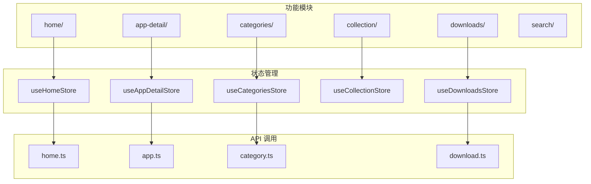
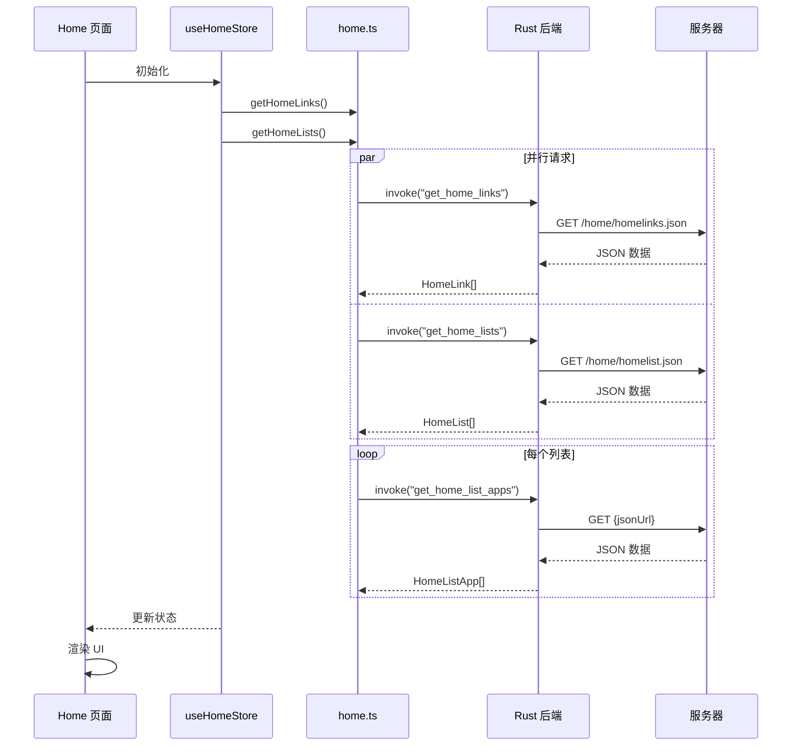
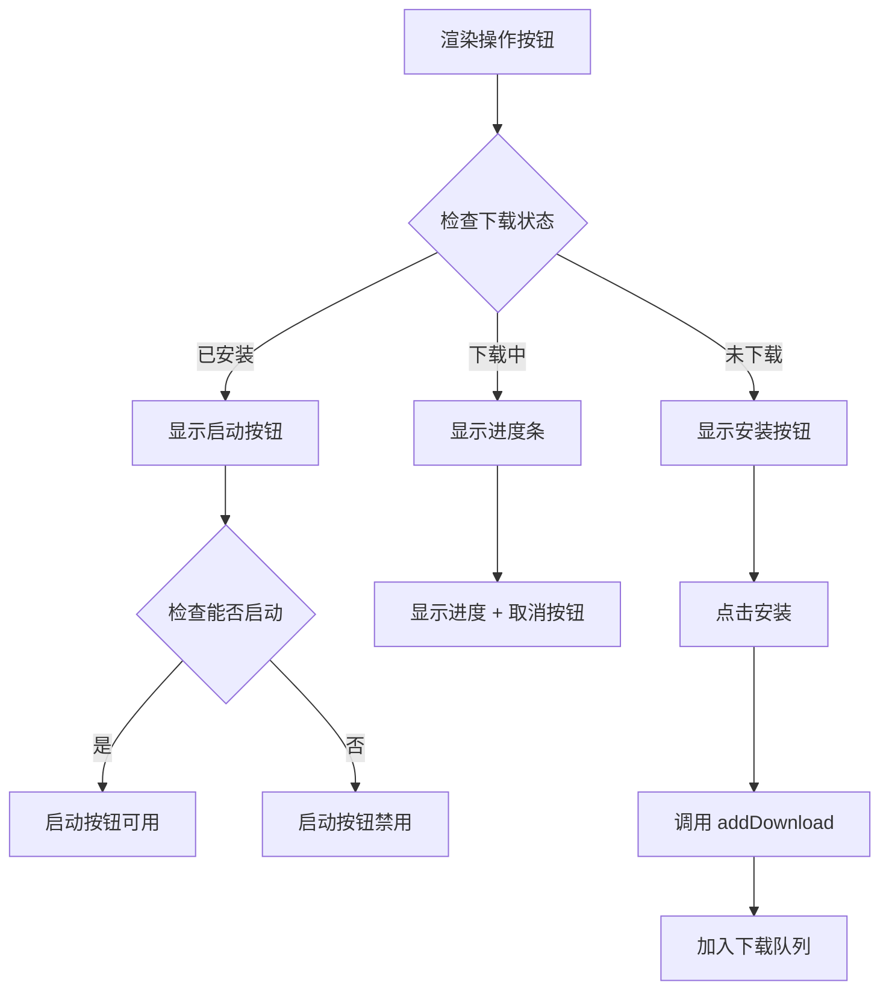
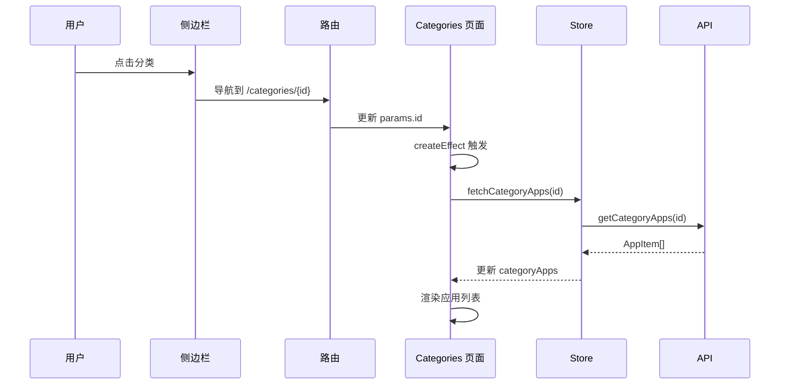
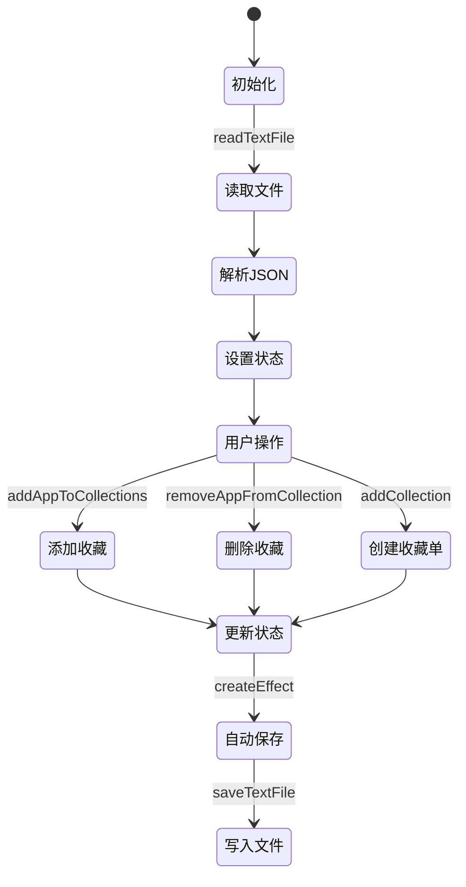
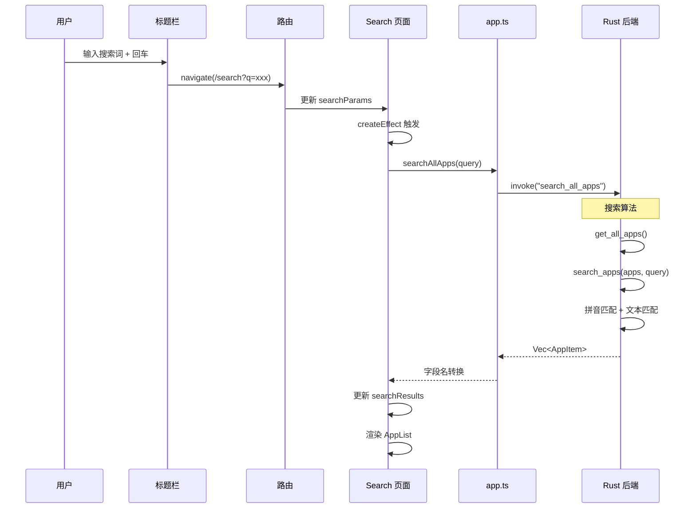

# 06 - 页面功能模块

## 模块概览

### 文件位置

- `src/features/` - 功能模块目录
  - `home/` - 首页
  - `app-detail/` - 应用详情
  - `categories/` - 分类页面
  - `collection/` - 收藏夹
  - `downloads/` - 下载管理
  - `search/` - 搜索功能

### 功能职责

每个功能模块遵循统一的组织结构：
- `index.tsx` / `{Name}.tsx` - 页面组件
- `store.ts` - 状态管理
- `style.css` - 模块样式（可选）

### 模块关系图



## 首页 (Home)

### 页面组件

```typescript
// 文件路径: src/features/home/Home.tsx
import { Component, For } from 'solid-js';
import { useHomeStore } from './store';
import HomeCarousel from '@/components/HomeCarousel';
import HomeListApps from '@/components/HomeListApps';

const Home: Component = () => {
  const { lists, loading, slides } = useHomeStore();

  return (
    <div class="p-6 w-full h-full">
      <HomeCarousel slides={slides() ?? []} loading={loading()} />
      {loading() ? (
        <For each={Array(2).fill(0)}>
          {() => <HomeListApps title="" apps={[]} loading={true} />}
        </For>
      ) : (
        <For each={lists() ?? []}>
          {(list) => (
            <HomeListApps
              title={list.title}
              apps={list.apps}
              loading={loading()}
            />
          )}
        </For>
      )}
    </div>
  );
};
```

### Store 实现

```typescript
// 文件路径: src/features/home/store.ts
import { createResource } from 'solid-js';
import { getHomeLinks, getHomeLists, getListApps } from '@/lib/api/home';

const fetchLists = async () => {
  const homeLists = await getHomeLists();
  
  const listsWithApps = await Promise.all(
    homeLists.map(async (list) => {
      const apps = await getListApps(list.jsonUrl);
      return { title: list.name, apps };
    })
  );
  
  return listsWithApps;
};

export const useHomeStore = () => {
  const [lists, { refetch: refetchLists }] = createResource(fetchLists);
  const [slides, { refetch: refetchSlides }] = createResource(getHomeLinks);
  const loading = () => lists.loading || slides.loading;

  return { lists, slides, loading, refetch: () => { refetchLists(); refetchSlides(); } };
};
```

### 数据加载流程



## 应用详情 (AppDetail)

### 页面组件

```typescript
// 文件路径: src/features/app-detail/AppDetail.tsx
import { Component, createSignal, onMount } from 'solid-js';
import { useParams } from '@solidjs/router';
import { useAppDetailStore } from './store';

const AppDetail: Component = () => {
  const params = useParams();
  const { app, loading } = useAppDetailStore(params.category, params.pkgname);
  const { collections, addAppToCollections } = useCollectionStore();
  const { downloads, addDownload, cancelDownload } = useDownloadsStore();
  const [isInstalled, setIsInstalled] = createSignal(false);

  onMount(async () => {
    const installed = await checkIsInstalled(params.pkgname);
    setIsInstalled(installed);
  });

  return (
    <div class="w-full h-full">
      {loading() ? (
        // 骨架屏
      ) : (
        <div class="app-detail">
          <div class="bg-container">
            <div class="bg" style={{ "background-image": `url(${app()?.Icon})` }} />
          </div>
          <div class="info-container">
            {/* 应用信息 */}
            {/* 操作按钮 */}
            {/* 应用描述 */}
            {/* 应用信息表格 */}
            {/* 截图轮播 */}
          </div>
        </div>
      )}
    </div>
  );
};
```

### Store 实现

```typescript
// 文件路径: src/features/app-detail/store.ts
import { createResource } from 'solid-js';
import { getAppInfo } from '@/lib/api/app';
import { getImgServerUrl } from '@/lib/api/server';

const fetchAppDetail = async (category: string, pkgname: string) => {
  const appInfo = await getAppInfo(category, pkgname);
  
  // 生成截图 URL
  const screenshots = Array.from({ length: 5 }, (_, index) => 
    `${getImgServerUrl()}/${appInfo.Category}/${appInfo.Pkgname}/screen_${index}.png`
  );
  
  return { ...appInfo, Screenshots: screenshots };
};

export const useAppDetailStore = (category: string, pkgname: string) => {
  const [app, { refetch }] = createResource(() => fetchAppDetail(category, pkgname));
  
  return { app, loading: () => app.loading, refetch };
};
```

### 操作按钮逻辑



### 信息展示表格

| 字段 | 说明 |
|------|------|
| 软件大小 | `app.Size` |
| 下载总量 | `app.DownloadTimes` |
| 软件分类 | `app.Category` |
| 软件包名 | `app.Pkgname` |
| 更新时间 | `app.Update` |
| 软件作者 | `app.Author` |
| 投稿用户 | `app.Contributor` |
| 软件官网 | `app.Website` |

## 分类页面 (Categories)

### 页面组件

```typescript
// 文件路径: src/features/categories/Categories.tsx
import { Component, createEffect, createSignal } from 'solid-js';
import { useParams } from '@solidjs/router';
import { fetchCategoryApps, useCategoriesStore } from './store';
import AppList from '@/components/AppList';

const Categories: Component = () => {
  const params = useParams();
  const [categoryApps, setCategoryApps] = createSignal<any[]>([]);
  const [loadingApps, setLoadingApps] = createSignal(true);
  const { categories } = useCategoriesStore();

  createEffect(async () => {
    if (params.id) {
      setLoadingApps(true);
      try {
        const apps = await fetchCategoryApps(params.id);
        setCategoryApps(apps);
      } finally {
        setLoadingApps(false);
      }
    }
  });

  return (
    <div class="p-6 w-full h-full">
      <h1 class="text-2xl font-bold mb-6">
        {categories()?.find((c) => c.id === params.id)?.name_zh_cn}
      </h1>
      <AppList apps={categoryApps()} loading={loadingApps()} category={params.id} />
    </div>
  );
};
```

### Store 实现

```typescript
// 文件路径: src/features/categories/store.ts
import { createResource } from 'solid-js';
import { getAllCategories, getCategoryApps } from '@/lib/api/category';

export const fetchCategoryApps = async (categoryId: string) => {
  return await getCategoryApps(categoryId);
};

export const useCategoriesStore = () => {
  const [categories, { refetch }] = createResource(getAllCategories);
  
  return { categories, loading: () => categories.loading, refetch };
};
```

### 分类切换流程



## 收藏夹 (Collection)

### 页面组件

```typescript
// 文件路径: src/features/collection/Collections.tsx
import { Component } from 'solid-js';
import { useNavigate } from '@solidjs/router';
import { useCollectionStore } from './store';
import { Card, CardContent, CardHeader, CardTitle } from '@/components/ui/card';

const Collections: Component = () => {
  const navigate = useNavigate();
  const { collections } = useCollectionStore();

  return (
    <div class="p-6 w-full h-full">
      <div class="grid grid-cols-1 md:grid-cols-2 lg:grid-cols-3 gap-4">
        {collections().map((collection) => (
          <Card
            class="cursor-pointer hover:bg-accent/50 transition-colors"
            onClick={() => navigate(`/collectionDetail/${collection.id}`)}
          >
            <CardHeader>
              <CardTitle>{collection.name}</CardTitle>
            </CardHeader>
            <CardContent>
              <p>收藏应用：{collection.apps.length} 个</p>
              <p>更新时间：{new Date(collection.updatedAt).toLocaleDateString()}</p>
            </CardContent>
          </Card>
        ))}
      </div>
    </div>
  );
};
```

### Store 实现

```typescript
// 文件路径: src/features/collection/store.ts
import { createSignal, createEffect } from 'solid-js';
import { Collection } from '@/types/collection';
import { saveTextFile, readTextFile } from '@/lib/api/file';

const COLLECTIONS_FILE = 'collections.json';
const [collections, setCollections] = createSignal<Collection[]>([]);
const [initialized, setInitialized] = createSignal(false);

// 初始化收藏单数据
async function initCollections() {
  try {
    const data = await readTextFile(COLLECTIONS_FILE);
    const parsedData = JSON.parse(data);
    if (Array.isArray(parsedData)) {
      setCollections(parsedData);
    }
  } catch (error) {
    console.error('Failed to load collections:', error);
  } finally {
    setInitialized(true);
  }
}

// 自动保存
createEffect(() => {
  if (initialized()) {
    const currentCollections = collections();
    saveTextFile(COLLECTIONS_FILE, JSON.stringify(currentCollections))
      .catch(console.error);
  }
});

export const useCollectionStore = () => {
  const addCollection = (params) => { /* ... */ };
  const addAppToCollections = (ids, category, pkgname) => { /* ... */ };
  const removeAppFromCollection = (id, category, pkgname) => { /* ... */ };
  const isAppInCollection = (id, category, pkgname) => { /* ... */ };

  return {
    collections,
    addCollection,
    addAppToCollections,
    removeAppFromCollection,
    isAppInCollection,
  };
};
```

### 收藏操作流程



## 下载管理 (Downloads)

### 页面组件

```typescript
// 文件路径: src/features/downloads/Downloads.tsx
import { Component, For } from 'solid-js';
import { Tabs, TabsContent, TabsList, TabsTrigger } from '@/components/ui/tabs';
import DownloadCard from '../../components/DownloadCard';
import { useDownloadsStore } from './store';

const Downloads: Component = () => {
  const { activeDownloads, completedDownloads } = useDownloadsStore();

  return (
    <div class="p-6 w-full h-full">
      <Tabs defaultValue="active">
        <TabsList>
          <TabsTrigger value="active">下载中 ({activeDownloads().length})</TabsTrigger>
          <TabsTrigger value="completed">已完成 ({completedDownloads().length})</TabsTrigger>
        </TabsList>
        <TabsContent value="active">
          <For each={activeDownloads()}>
            {(download) => <DownloadCard download={download} />}
          </For>
        </TabsContent>
        <TabsContent value="completed">
          <For each={completedDownloads()}>
            {(download) => <DownloadCard download={download} />}
          </For>
        </TabsContent>
      </Tabs>
    </div>
  );
};
```

### Store 实现

```typescript
// 文件路径: src/features/downloads/store.ts
import { createSignal, createEffect, onCleanup } from 'solid-js';
import { DownloadTask } from '@/types/download';
import * as downloadApi from '@/lib/api/download';

const [downloads, setDownloads] = createSignal<DownloadTask[]>([]);

export const useDownloadsStore = () => {
  // 每秒更新下载状态
  const intervalId = setInterval(async () => {
    const updatedList = await downloadApi.getDownloads();
    setDownloads(updatedList);
  }, 1000);

  onCleanup(() => clearInterval(intervalId));

  const activeDownloads = () => downloads().filter(item => 
    ['downloading', 'paused', 'queued', 'completed', 'installing'].includes(item.status)
  );

  const completedDownloads = () => downloads().filter(item => 
    ['installed', 'error'].includes(item.status)
  );

  const addDownload = async (category, pkgname, filename, name) => {
    await downloadApi.addDownload(category, pkgname, filename, name);
    const updatedList = await downloadApi.getDownloads();
    setDownloads(updatedList);
  };

  return {
    downloads,
    activeDownloads,
    completedDownloads,
    addDownload,
    pauseDownload: downloadApi.pauseDownload,
    resumeDownload: downloadApi.resumeDownload,
    cancelDownload: downloadApi.cancelDownload
  };
};
```

## 搜索功能 (Search)

### 页面组件

```typescript
// 文件路径: src/features/search/Search.tsx
import { Component, createEffect, createSignal } from 'solid-js';
import { useSearchParams } from '@solidjs/router';
import { searchAllApps } from '@/lib/api/app';
import { AppItem } from '@/types/app';
import AppList from '@/components/AppList';

const Search: Component = () => {
  const [searchParams] = useSearchParams();
  const [searchResults, setSearchResults] = createSignal<AppItem[]>([]);
  const [loading, setLoading] = createSignal(true);
  const [error, setError] = createSignal<string | null>(null);

  createEffect(async () => {
    const query = searchParams.q;
    if (query && typeof query === 'string') {
      setLoading(true);
      setError(null);
      try {
        const results = await searchAllApps(query);
        setSearchResults(results);
      } catch (err) {
        setError(err instanceof Error ? err.message : '搜索失败');
      } finally {
        setLoading(false);
      }
    }
  });

  return (
    <div class="p-6 w-full h-full">
      <h1 class="text-2xl font-bold mb-6">搜索结果: {searchParams.q}</h1>
      {error() ? (
        <div class="text-red-500">{error()}</div>
      ) : (
        <AppList apps={searchResults()} loading={loading()} />
      )}
    </div>
  );
};
```

### 搜索流程



---

[上一篇: 05-UI组件模块](05-UI组件模块.md) | [返回目录](README.md) | [下一篇: 07-下载管理模块](07-下载管理模块.md)
