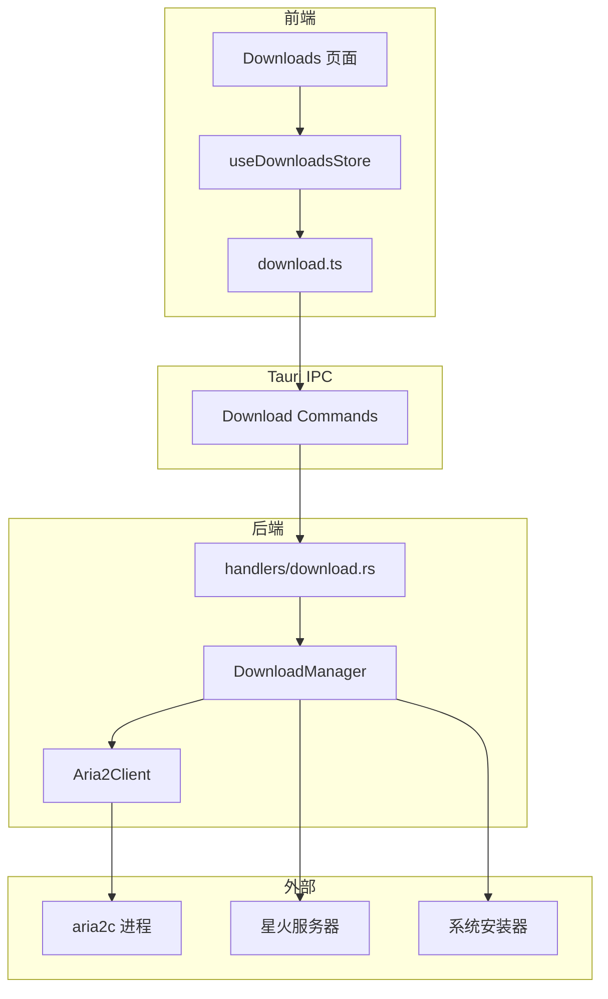
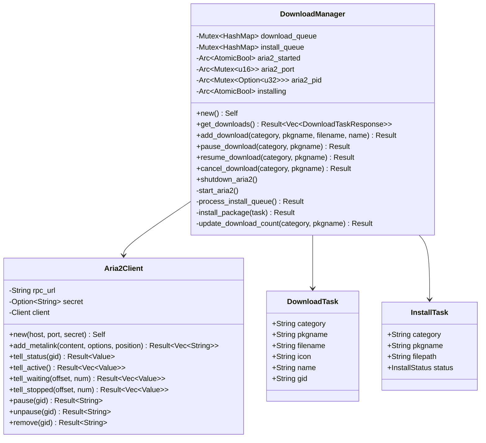
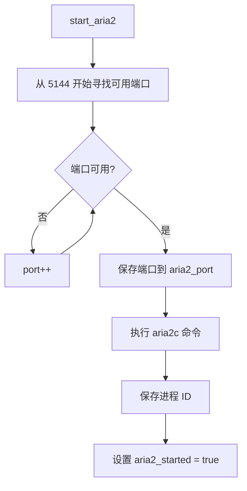
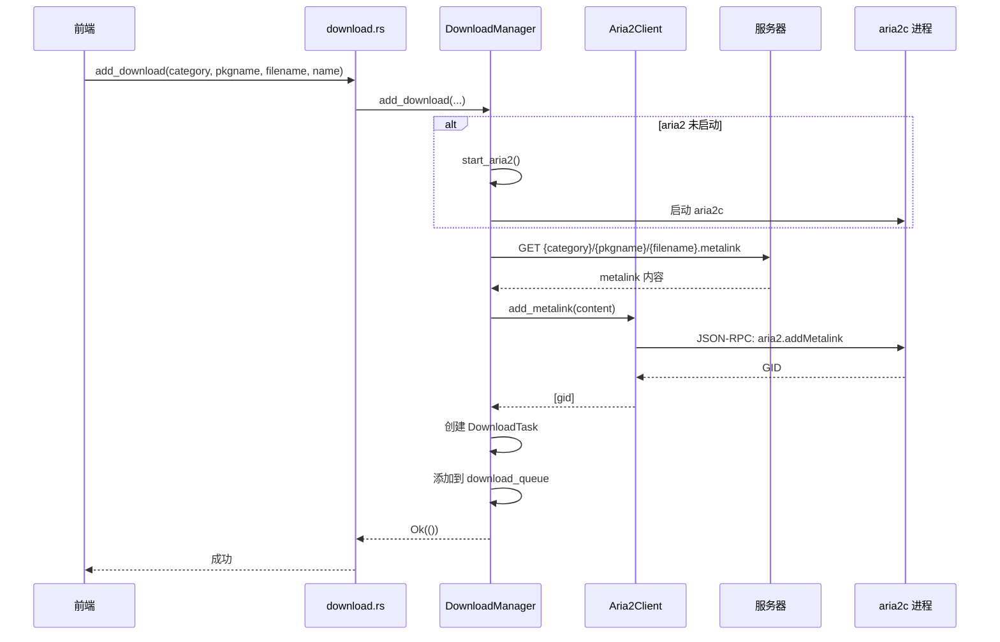
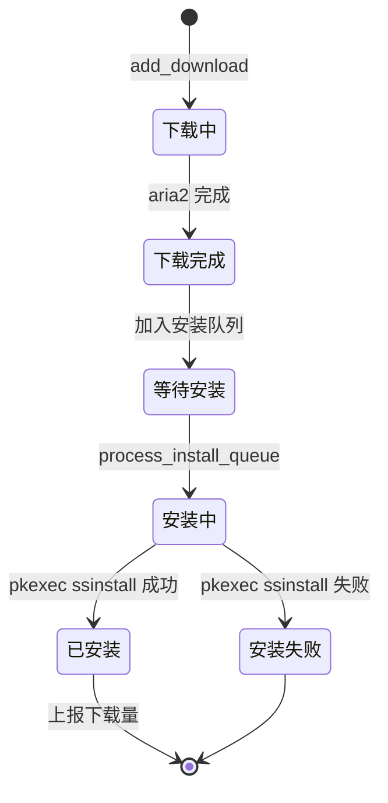
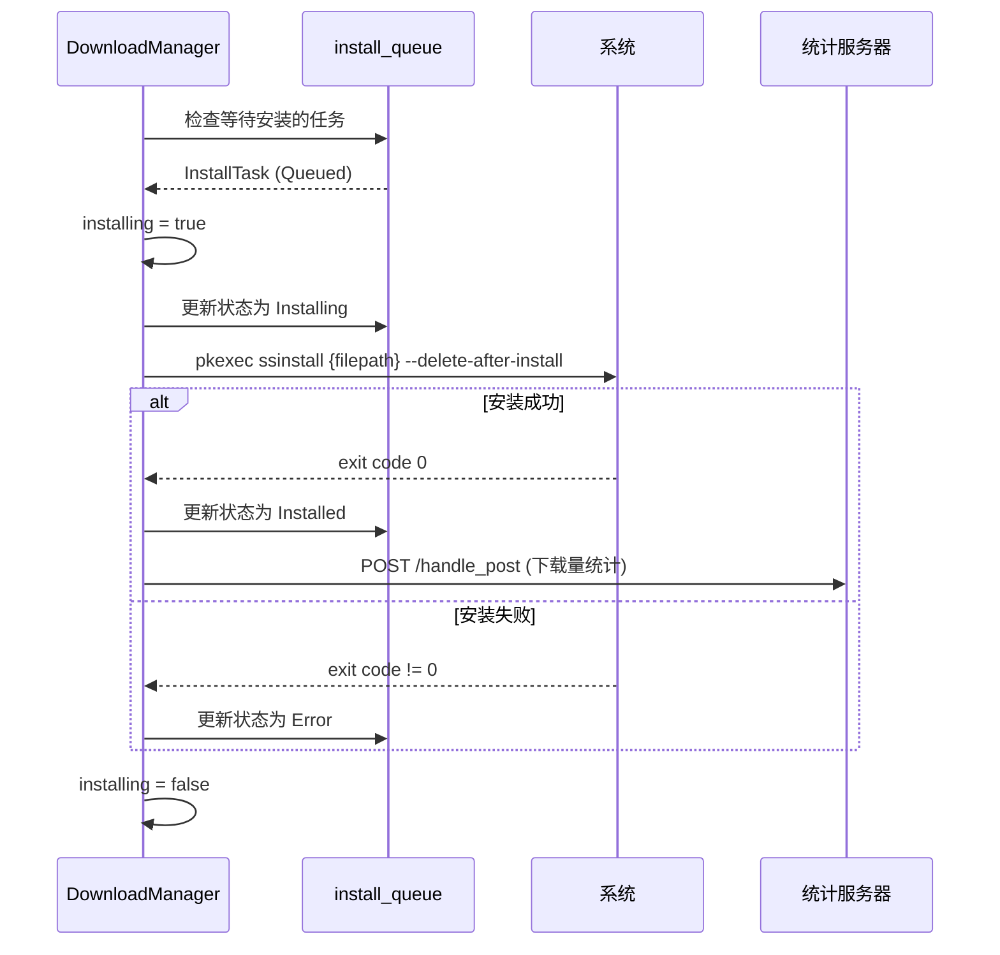
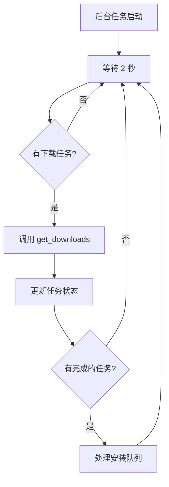

# 07 - 下载管理模块

## 模块概览

### 文件位置

- `src-tauri/src/utils/download_manager.rs` - 下载管理器
- `src-tauri/src/utils/aria2.rs` - aria2 RPC 客户端
- `src-tauri/src/handlers/download.rs` - 下载命令处理器
- `src-tauri/src/models/download.rs` - 下载数据模型
- `src/lib/api/download.ts` - 前端 API 封装
- `src/features/downloads/store.ts` - 前端状态管理

### 功能职责

下载管理模块负责：
- aria2 进程的启动与管理
- 下载任务的添加、暂停、恢复、取消
- 下载状态的实时更新
- 下载完成后的自动安装
- 安装完成后的下载量统计上报

### 模块关系图



## DownloadManager 核心实现

### 数据结构

```rust
// 文件路径: src-tauri/src/utils/download_manager.rs
pub struct DownloadManager {
    // 下载队列: task_id -> DownloadTask
    download_queue: Mutex<HashMap<String, DownloadTask>>,
    // 安装队列: task_id -> InstallTask
    install_queue: Mutex<HashMap<String, InstallTask>>,
    // aria2 是否已启动
    aria2_started: Arc<AtomicBool>,
    // aria2 端口
    aria2_port: Arc<Mutex<u16>>,
    // aria2 进程 ID
    aria2_pid: Arc<Mutex<Option<u32>>>,
    // 是否正在安装
    installing: Arc<AtomicBool>,
    // 上次获取下载状态的时间
    last_get_downloads: Arc<Mutex<Option<std::time::Instant>>>,
}
```

### 类结构图



## aria2 集成

### aria2 启动流程

```rust
fn start_aria2(&self) {
    // 寻找可用端口
    let mut port = 5144;
    while TcpListener::bind(format!("127.0.0.1:{}", port)).is_err() {
        port += 1;
    }
    
    // 保存端口
    if let Ok(mut port_guard) = self.aria2_port.lock() {
        *port_guard = port;
    }

    // 启动 aria2c
    let child = Command::new("aria2c")
        .args([
            "--enable-rpc",
            "--rpc-listen-all=false",
            &format!("--rpc-listen-port={}", port),
            &format!("--user-agent={}", UA),
            "--follow-metalink=mem",
            "--dir=/tmp/spark-store",
        ])
        .spawn()
        .unwrap();

    // 保存进程 ID
    if let Ok(mut pid_guard) = self.aria2_pid.lock() {
        *pid_guard = Some(child.id());
    }

    self.aria2_started.store(true, Ordering::SeqCst);
}
```

### aria2 启动流程图



### aria2 RPC 客户端

```rust
// 文件路径: src-tauri/src/utils/aria2.rs
impl Aria2Client {
    pub fn new(host: &str, port: u16, secret: Option<String>) -> Self {
        let rpc_url = format!("http://{}:{}/jsonrpc", host, port);
        Aria2Client { rpc_url, secret, client: Client::new() }
    }

    // 添加 Metalink 下载
    pub async fn add_metalink(
        &self,
        metalink: &[u8],
        options: Option<HashMap<String, Value>>,
        position: Option<usize>,
    ) -> Result<Vec<String>, Box<dyn Error>> {
        let encoded_metalink = general_purpose::STANDARD.encode(metalink);
        let mut params = Vec::new();
        
        if let Some(secret) = &self.secret {
            params.push(json!(secret));
        }
        params.push(json!(encoded_metalink));
        
        let response = self.send_request("aria2.addMetalink", params).await?;
        // 解析返回的 GID 列表...
    }

    // 获取活动中的下载任务
    pub async fn tell_active(&self) -> Result<Vec<Value>, Box<dyn Error>> {
        let response = self.send_request("aria2.tellActive", params).await?;
        // ...
    }
    
    // 暂停下载
    pub async fn pause(&self, gid: &str) -> Result<String, Box<dyn Error>> {
        let response = self.send_request("aria2.pause", params).await?;
        // ...
    }
    
    // 恢复下载
    pub async fn unpause(&self, gid: &str) -> Result<String, Box<dyn Error>> {
        let response = self.send_request("aria2.unpause", params).await?;
        // ...
    }
}
```

### aria2 RPC 方法映射

| Rust 方法 | aria2 RPC 方法 | 说明 |
|-----------|----------------|------|
| `add_metalink` | `aria2.addMetalink` | 添加 Metalink 下载 |
| `tell_status` | `aria2.tellStatus` | 获取任务状态 |
| `tell_active` | `aria2.tellActive` | 获取活动任务 |
| `tell_waiting` | `aria2.tellWaiting` | 获取等待任务 |
| `tell_stopped` | `aria2.tellStopped` | 获取已停止任务 |
| `pause` | `aria2.pause` | 暂停任务 |
| `unpause` | `aria2.unpause` | 恢复任务 |
| `remove` | `aria2.remove` | 删除任务 |

## 下载流程

### 添加下载

```rust
pub async fn add_download(
    &self,
    category: String,
    pkgname: String,
    filename: String,
    name: String,
) -> Result<(), String> {
    // 1. 确保 aria2 已启动
    if !self.aria2_started.load(Ordering::SeqCst) {
        self.start_aria2();
    }

    // 2. 获取 metalink 文件
    let metalink_url = format!(
        "{}{}/{}/{}.metalink",
        json_server_url, category, pkgname, filename
    );
    
    let metalink_content = client.get(&metalink_url)
        .header("User-Agent", UA)
        .send().await?
        .bytes().await?;

    // 3. 添加到 aria2
    let port = *self.aria2_port.lock()?;
    let aria2_client = Aria2Client::new("127.0.0.1", port, None);
    let gids = aria2_client.add_metalink(&metalink_content, None, None).await?;

    // 4. 添加到下载队列
    let task = DownloadTask {
        category: category.clone(),
        pkgname: pkgname.clone(),
        filename,
        name,
        icon: format_icon_url(&category, &pkgname),
        gid: gids[0].clone(),
    };
    
    downloads.insert(task_id, task);
    Ok(())
}
```

### 添加下载时序图



### 获取下载状态

```rust
async fn get_downloads_internal(&self) -> Result<Vec<DownloadTaskResponse>, String> {
    // 1. 获取队列中的任务
    let tasks_clone: Vec<DownloadTask> = downloads.values().cloned().collect();
    
    // 2. 从 aria2 获取状态
    let active_downloads = aria2_client.tell_active().await?;
    let waiting_downloads = aria2_client.tell_waiting(0, 100).await?;
    let stopped_downloads = aria2_client.tell_stopped(0, 100).await?;
    
    // 3. 构建 GID -> 状态 映射
    let mut aria2_tasks = HashMap::new();
    
    for task in active_downloads {
        aria2_tasks.insert(gid, (task, ResponseStatus::Downloading));
    }
    
    for task in waiting_downloads {
        let status = if paused { ResponseStatus::Paused } else { ResponseStatus::Queued };
        aria2_tasks.insert(gid, (task, status));
    }
    
    for task in stopped_downloads {
        if completed {
            // 添加到安装队列
            self.process_install_queue().await?;
        }
        aria2_tasks.insert(gid, (task, status));
    }
    
    // 4. 合并队列和 aria2 状态
    let mut result = Vec::new();
    for task in tasks_clone {
        // 构建 DownloadTaskResponse...
        result.push(response);
    }
    
    Ok(result)
}
```

## 安装流程

### 安装队列处理

```rust
pub async fn process_install_queue(&self) -> Result<(), String> {
    // 1. 检查是否有任务正在安装
    if self.installing.load(Ordering::SeqCst) {
        return Ok(());
    }

    // 2. 查找第一个等待安装的任务
    let (task_id, task) = {
        let mut install_queue = self.install_queue.lock()?;
        if let Some((id, task)) = install_queue.iter_mut()
            .find(|(_, task)| matches!(task.status, InstallStatus::Queued))
            .map(|(id, task)| (id.clone(), task.clone()))
        {
            // 更新状态为安装中
            install_queue.get_mut(&id).unwrap().status = InstallStatus::Installing;
            (id, task)
        } else {
            return Ok(());
        }
    };

    // 3. 标记为正在安装
    self.installing.store(true, Ordering::SeqCst);

    // 4. 执行安装
    let install_result = self.install_package(&task).await;

    // 5. 更新状态
    {
        let mut install_queue = self.install_queue.lock()?;
        if let Some(task) = install_queue.get_mut(&task_id) {
            task.status = match &install_result {
                Ok(_) => InstallStatus::Installed,
                Err(_) => InstallStatus::Error,
            };
        }
    }

    // 6. 重置安装状态
    self.installing.store(false, Ordering::SeqCst);

    Ok(())
}

async fn install_package(&self, task: &InstallTask) -> Result<(), String> {
    let filepath = task.filepath.trim_matches('"');

    let output = Command::new("pkexec")
        .arg("ssinstall")
        .arg(filepath)
        .arg("--delete-after-install")
        .output()?;

    if output.status.success() {
        // 更新下载量统计
        self.update_download_count(&task.category, &task.pkgname).await?;
        Ok(())
    } else {
        Err(String::from_utf8_lossy(&output.stderr).to_string())
    }
}
```

### 安装流程状态图



### 安装时序图



## 下载量统计

```rust
pub async fn update_download_count(&self, category: &str, pkgname: &str) -> Result<(), String> {
    let url = "https://feedback.spark-app.store/handle_post";
    let client = reqwest::Client::new();

    let json_body = serde_json::json!({
        "path": format!("{}/{}/{}", get_target_arch_to_store(), category, pkgname)
    });

    client.post(url)
        .header("Content-Type", "application/json")
        .header("User-Agent", UA)
        .json(&json_body)
        .send()
        .await?;

    Ok(())
}
```

## 进程生命周期管理

### 窗口销毁时清理

```rust
// 在 lib.rs 中
.on_window_event(|window, event| match event {
    tauri::WindowEvent::Destroyed => {
        let download_manager = window.state::<DownloadManager>();
        download_manager.shutdown_aria2();
    }
    _ => {}
})
```

### 关闭 aria2

```rust
pub fn shutdown_aria2(&self) {
    if self.aria2_started.load(Ordering::SeqCst) {
        if let Ok(pid_guard) = self.aria2_pid.lock() {
            if let Some(pid) = *pid_guard {
                Command::new("kill").arg(pid.to_string()).output();
            }
        }
        self.aria2_started.store(false, Ordering::SeqCst);
    }
}
```

## 后台状态检查

```rust
// 在 lib.rs setup 中
tauri::async_runtime::spawn(async move {
    loop {
        {
            let download_manager = app_handle.state::<DownloadManager>();
            if download_manager.has_downloads() {
                let _ = download_manager.get_downloads().await;
            }
        }
        tokio::time::sleep(tokio::time::Duration::from_secs(2)).await;
    }
});
```

### 后台任务流程



---

[上一篇: 06-页面功能模块](06-页面功能模块.md) | [返回目录](README.md) | [下一篇: 08-API接口文档](08-API接口文档.md)
