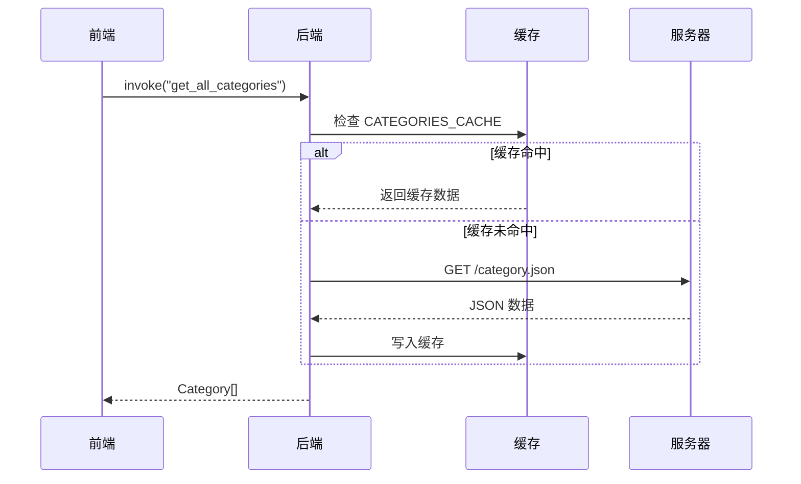
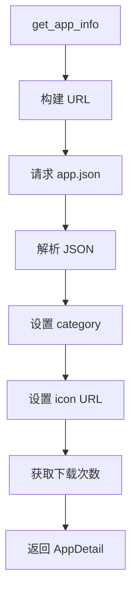
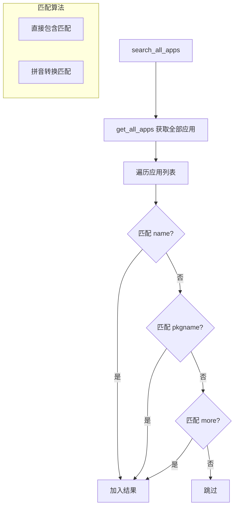
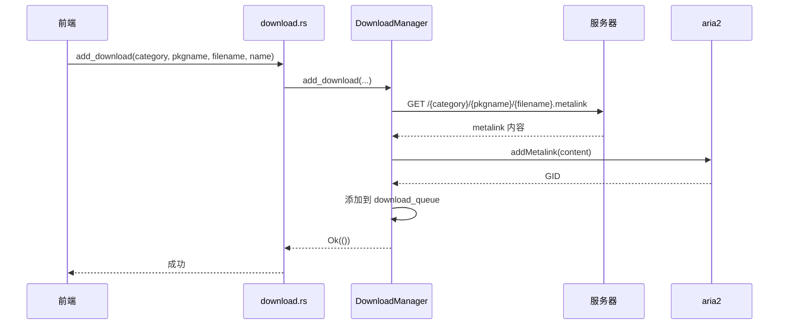

# 08 - API 接口文档

## 模块概览

### 文件位置

- 前端 API：`src/lib/api/`
- 后端 Handlers：`src-tauri/src/handlers/`

### 功能职责

本文档详细描述所有 Tauri IPC 接口的调用方式、参数和返回值。

### 接口总览

```mermaid
graph LR
    subgraph Frontend["前端 API 层"]
        ServerAPI[server.ts]
        CategoryAPI[category.ts]
        AppAPI[app.ts]
        HomeAPI[home.ts]
        DownloadAPI[download.ts]
        FileAPI[file.ts]
        DebAPI[deb.ts]
    end
    
    subgraph IPC["Tauri IPC"]
        Invoke[invoke]
    end
    
    subgraph Backend["后端 Handlers"]
        ServerHandler[server.rs]
        CategoryHandler[category.rs]
        AppHandler[app.rs]
        HomeHandler[home.rs]
        DownloadHandler[download.rs]
        FileHandler[file.rs]
        DebHandler[deb.rs]
    end
    
    Frontend --> IPC
    IPC --> Backend
```



## 服务器配置接口

### get_target_arch_to_store

获取当前系统架构对应的商店架构标识。

| 属性 | 值 |
|------|-----|
| 命令名 | `get_target_arch_to_store` |
| 参数 | 无 |
| 返回值 | `string` |

**前端调用**

```typescript
// src/lib/api/server.ts
import { invoke } from "@tauri-apps/api/core";

const arch = await invoke<string>('get_target_arch_to_store');
// 返回: "amd64-store" | "arm64-store" | "loong64-store"
```

**后端实现**

```rust
// src-tauri/src/handlers/server.rs
#[tauri::command]
pub fn get_target_arch_to_store() -> String {
    #[cfg(target_arch = "x86_64")]
    { return "amd64-store".to_string(); }
    
    #[cfg(target_arch = "aarch64")]
    { return "arm64-store".to_string(); }
    
    #[cfg(target_arch = "loongarch64")]
    { return "loong64-store".to_string(); }
}
```

### get_json_server_url

获取 JSON 数据服务器 URL。

| 属性 | 值 |
|------|-----|
| 命令名 | `get_json_server_url` |
| 参数 | 无 |
| 返回值 | `string` |

**示例返回**

```
https://cdn.d.store.deepinos.org.cn/amd64-store/
```

### get_img_server_url

获取图片服务器 URL。

| 属性 | 值 |
|------|-----|
| 命令名 | `get_img_server_url` |
| 参数 | 无 |
| 返回值 | `string` |

**示例返回**

```
https://spk-json.spark-app.store/amd64-store/
```

### get_user_agent

获取应用 User-Agent 字符串。

| 属性 | 值 |
|------|-----|
| 命令名 | `get_user_agent` |
| 参数 | 无 |
| 返回值 | `string` |

**示例返回**

```
Spark-Store/4.9.9
```

## 分类接口

### get_all_categories

获取所有应用分类列表。

| 属性 | 值 |
|------|-----|
| 命令名 | `get_all_categories` |
| 参数 | 无 |
| 返回值 | `Category[]` |

**前端调用**

```typescript
// src/lib/api/category.ts
import { invoke } from "@tauri-apps/api/core";

const categories = await invoke<Category[]>("get_all_categories");
```

**返回示例**

```json
[
  { "id": "chat", "icon": "message-circle", "name_zh_cn": "即时通讯" },
  { "id": "music", "icon": "music", "name_zh_cn": "音乐欣赏" },
  { "id": "games", "icon": "gamepad-2", "name_zh_cn": "游戏娱乐" }
]
```

**流程图**



### get_category_apps

获取指定分类下的应用列表。

| 属性 | 值 |
|------|-----|
| 命令名 | `get_category_apps` |
| 参数 | `{ categoryId: string }` |
| 返回值 | `AppItem[]` |

**前端调用**

```typescript
// src/lib/api/category.ts
const rawApps = await invoke<Array<{
  More: string,
  Name: string,
  Pkgname: string,
  Tags?: string,
  Update: string,
  icon?: string,
  category?: string
}>>("get_category_apps", { categoryId: "chat" });

// 需要转换字段名
const apps = rawApps.map(app => ({
  more: app.More,
  name: app.Name,
  pkgname: app.Pkgname,
  tags: app.Tags,
  update: app.Update,
  icon: app.icon,
  category: app.category
}));
```

### get_all_apps

获取所有分类的全部应用（用于搜索）。

| 属性 | 值 |
|------|-----|
| 命令名 | `get_all_apps` |
| 参数 | 无 |
| 返回值 | `AppItem[]` |

## 应用接口

### get_app_info

获取应用详细信息。

| 属性 | 值 |
|------|-----|
| 命令名 | `get_app_info` |
| 参数 | `{ category: string, pkgname: string }` |
| 返回值 | `AppDetail` |

**前端调用**

```typescript
// src/lib/api/app.ts
import { invoke } from "@tauri-apps/api/core";

const appInfo = await invoke<AppDetail>("get_app_info", {
  category: "chat",
  pkgname: "com.tencent.weixin"
});
```

**后端实现逻辑**



**返回示例**

```json
{
  "More": "微信是一款跨平台的通讯工具",
  "Name": "微信",
  "Pkgname": "com.tencent.weixin",
  "Tags": "社交,即时通讯",
  "Update": "2024-01-01",
  "Icon": "https://spk-json.spark-app.store/amd64-store/chat/com.tencent.weixin/icon.png",
  "Category": "chat",
  "Version": "3.0.0",
  "Filename": "com.tencent.weixin_3.0.0_amd64.deb",
  "Author": "Tencent",
  "Contributor": "spark-store",
  "Website": "https://weixin.qq.com",
  "Size": "150 MB",
  "DownloadTimes": 12345
}
```

### search_all_apps

搜索应用（支持拼音）。

| 属性 | 值 |
|------|-----|
| 命令名 | `search_all_apps` |
| 参数 | `{ query: string }` |
| 返回值 | `AppItem[]` |

**前端调用**

```typescript
// src/lib/api/app.ts
const results = await invoke<AppItem[]>("search_all_apps", { query: "weixin" });
```

**搜索算法说明**



## 首页接口

### get_home_links

获取首页轮播数据。

| 属性 | 值 |
|------|-----|
| 命令名 | `get_home_links` |
| 参数 | 无 |
| 返回值 | `HomeLink[]` |

**返回示例**

```json
[
  {
    "name": "新年活动",
    "more": "参与活动赢取奖励",
    "imgUrl": "https://spk-json.spark-app.store/amd64-store/home/banner1.png",
    "type": "link",
    "url": "https://spark-app.store/activity"
  }
]
```

### get_home_lists

获取首页列表配置。

| 属性 | 值 |
|------|-----|
| 命令名 | `get_home_lists` |
| 参数 | 无 |
| 返回值 | `HomeList[]` |

**返回示例**

```json
[
  {
    "name": "热门推荐",
    "type": "list",
    "jsonUrl": "/home/hot.json"
  }
]
```

### get_home_list_apps

获取首页列表中的应用数据。

| 属性 | 值 |
|------|-----|
| 命令名 | `get_home_list_apps` |
| 参数 | `{ jsonUrl: string }` |
| 返回值 | `HomeListApp[]` |

## 下载接口

### get_downloads

获取所有下载任务状态。

| 属性 | 值 |
|------|-----|
| 命令名 | `get_downloads` |
| 参数 | 无 |
| 返回值 | `DownloadTask[]` |

**前端调用**

```typescript
// src/lib/api/download.ts
const downloads = await invoke<DownloadTask[]>("get_downloads");
```

**返回示例**

```json
[
  {
    "category": "chat",
    "pkgname": "com.tencent.weixin",
    "filename": "com.tencent.weixin_3.0.0_amd64.deb",
    "status": "downloading",
    "icon": "https://...",
    "name": "微信",
    "progress": 45.5,
    "speed": "1.5 MB/s",
    "size": "150 MB"
  }
]
```

### add_download

添加下载任务。

| 属性 | 值 |
|------|-----|
| 命令名 | `add_download` |
| 参数 | `{ category: string, pkgname: string, filename: string, name: string }` |
| 返回值 | `void` |

**前端调用**

```typescript
// src/lib/api/download.ts
await invoke("add_download", {
  category: "chat",
  pkgname: "com.tencent.weixin",
  filename: "com.tencent.weixin_3.0.0_amd64.deb",
  name: "微信"
});
```

**时序图**



### pause_download

暂停下载任务。

| 属性 | 值 |
|------|-----|
| 命令名 | `pause_download` |
| 参数 | `{ category: string, pkgname: string }` |
| 返回值 | `void` |

### resume_download

恢复下载任务。

| 属性 | 值 |
|------|-----|
| 命令名 | `resume_download` |
| 参数 | `{ category: string, pkgname: string }` |
| 返回值 | `void` |

### cancel_download

取消下载任务。

| 属性 | 值 |
|------|-----|
| 命令名 | `cancel_download` |
| 参数 | `{ category: string, pkgname: string }` |
| 返回值 | `void` |

## 文件接口

### save_text_file

保存文本文件到配置目录。

| 属性 | 值 |
|------|-----|
| 命令名 | `save_text_file` |
| 参数 | `{ filename: string, content: string }` |
| 返回值 | `void` |

**前端调用**

```typescript
// src/lib/api/file.ts
await invoke('save_text_file', {
  filename: 'collections.json',
  content: JSON.stringify(collections)
});
```

**文件路径**

```
~/.config/spark-store/{filename}
```

### read_text_file

从配置目录读取文本文件。

| 属性 | 值 |
|------|-----|
| 命令名 | `read_text_file` |
| 参数 | `{ filename: string }` |
| 返回值 | `string` |

**前端调用**

```typescript
// src/lib/api/file.ts
const content = await invoke<string>('read_text_file', {
  filename: 'collections.json'
});
const data = JSON.parse(content);
```

## DEB 包接口

### check_is_installed

检查应用是否已安装。

| 属性 | 值 |
|------|-----|
| 命令名 | `check_is_installed` |
| 参数 | `{ pkgname: string }` |
| 返回值 | `boolean` |

**前端调用**

```typescript
// src/lib/api/deb.ts
const installed = await invoke<boolean>('check_is_installed', {
  pkgname: 'com.tencent.weixin'
});
```

**后端实现**

```rust
#[tauri::command]
pub async fn check_is_installed(pkgname: String) -> Result<bool, String> {
    let output = Command::new("/opt/durapps/spark-store/bin/store-helper/check-is-installed")
        .arg(&pkgname)
        .output()?;
    
    Ok(output.status.success())
}
```

### check_launch_app

检查应用是否可以启动。

| 属性 | 值 |
|------|-----|
| 命令名 | `check_launch_app` |
| 参数 | `{ pkgname: string }` |
| 返回值 | `boolean` |

### launch_launch_app

启动应用。

| 属性 | 值 |
|------|-----|
| 命令名 | `launch_launch_app` |
| 参数 | `{ pkgname: string }` |
| 返回值 | `void` |

**后端实现**

```rust
#[tauri::command]
pub async fn launch_launch_app(pkgname: String) -> Result<(), String> {
    Command::new("/opt/durapps/spark-store/bin/store-helper/ss-launcher")
        .arg("launch")
        .arg(&pkgname)
        .process_group(0)  // 独立进程组，不阻塞主进程
        .spawn()?;
    
    Ok(())
}
```

## 错误处理

所有命令的错误都以 `Result<T, String>` 形式返回，前端需要捕获并处理：

```typescript
try {
  const result = await invoke("some_command", { param: value });
} catch (error) {
  console.error("命令执行失败:", error);
  showToast({ description: `操作失败: ${error}`, variant: "error" });
}
```

## 接口汇总表

| 分类 | 命令名 | 参数 | 返回值 |
|------|--------|------|--------|
| **服务器** | `get_target_arch_to_store` | - | `string` |
| | `get_json_server_url` | - | `string` |
| | `get_img_server_url` | - | `string` |
| | `get_user_agent` | - | `string` |
| **分类** | `get_all_categories` | - | `Category[]` |
| | `get_category_apps` | `categoryId` | `AppItem[]` |
| | `get_all_apps` | - | `AppItem[]` |
| **应用** | `get_app_info` | `category`, `pkgname` | `AppDetail` |
| | `search_all_apps` | `query` | `AppItem[]` |
| **首页** | `get_home_links` | - | `HomeLink[]` |
| | `get_home_lists` | - | `HomeList[]` |
| | `get_home_list_apps` | `jsonUrl` | `HomeListApp[]` |
| **下载** | `get_downloads` | - | `DownloadTask[]` |
| | `add_download` | `category`, `pkgname`, `filename`, `name` | `void` |
| | `pause_download` | `category`, `pkgname` | `void` |
| | `resume_download` | `category`, `pkgname` | `void` |
| | `cancel_download` | `category`, `pkgname` | `void` |
| **文件** | `save_text_file` | `filename`, `content` | `void` |
| | `read_text_file` | `filename` | `string` |
| **DEB** | `check_is_installed` | `pkgname` | `boolean` |
| | `check_launch_app` | `pkgname` | `boolean` |
| | `launch_launch_app` | `pkgname` | `void` |

---

[上一篇: 07-下载管理模块](07-下载管理模块.md) | [返回目录](README.md)
