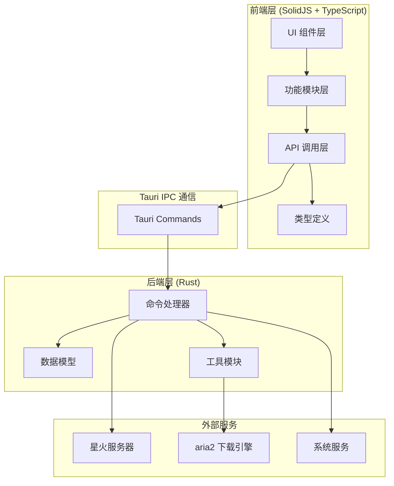
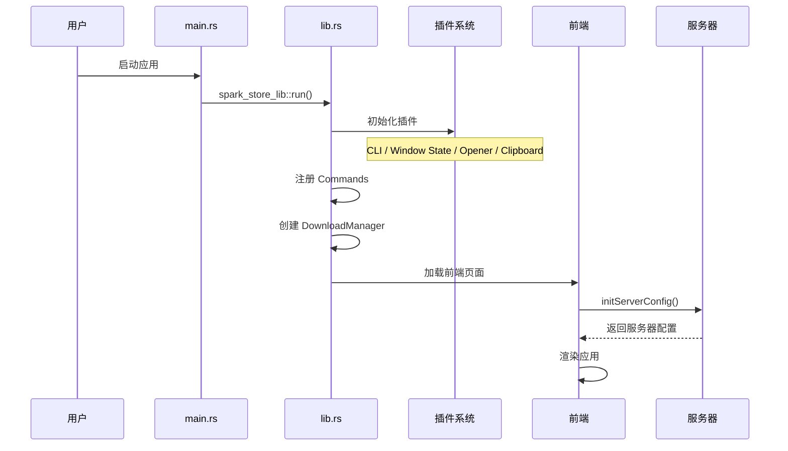
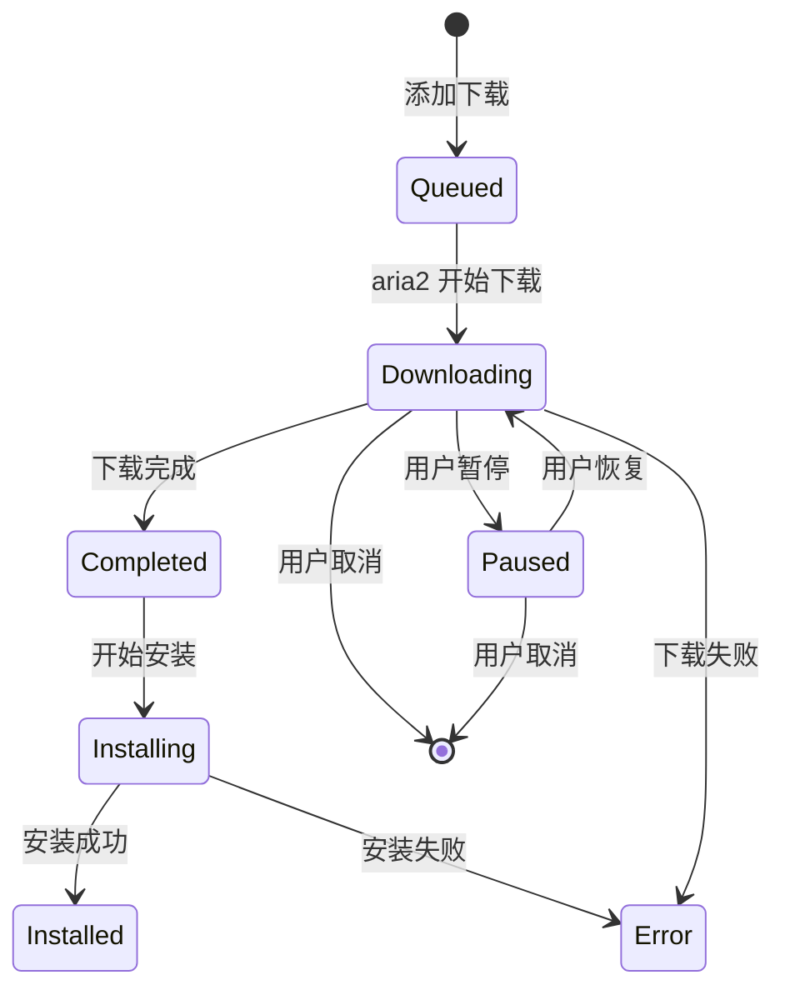

# Spark Store Tauri 项目文档

## 项目概述

Spark Store Tauri 是星火应用商店的跨平台桌面客户端，采用 Tauri 2.0 框架构建。项目采用 Rust 作为后端语言，SolidJS + TypeScript 作为前端技术栈，实现了一个功能完整的 Linux 应用商店客户端。

### 核心功能

- 🏠 首页推荐与轮播展示
- 🔍 应用搜索（支持拼音搜索）
- 📂 分类浏览
- 📦 应用详情展示
- ⬇️ 下载管理（基于 aria2）
- 💾 收藏夹功能
- 🔗 SPK 协议支持

## 技术栈

| 层级 | 技术 | 版本 | 说明 |
|------|------|------|------|
| **前端框架** | SolidJS | ^1.9.3 | 响应式 UI 框架 |
| **路由** | @solidjs/router | ^0.15.3 | SPA 路由管理 |
| **UI 组件** | Kobalte | ^0.13.7 | 无障碍组件库 |
| **样式** | TailwindCSS | ^3.4.17 | 原子化 CSS 框架 |
| **构建工具** | Vite | ^6.0.3 | 现代前端构建工具 |
| **桌面框架** | Tauri | 2.0 | 跨平台桌面应用框架 |
| **后端语言** | Rust | 2021 Edition | 系统级编程语言 |
| **HTTP 客户端** | reqwest | 0.12.12 | Rust 异步 HTTP 客户端 |
| **异步运行时** | Tokio | 1.43.0 | Rust 异步运行时 |
| **下载引擎** | aria2 | - | 多协议下载工具 |

## 目录结构

```
spark-store-tauri/
├── index.html                 # HTML 入口文件
├── package.json               # NPM 配置文件
├── vite.config.ts             # Vite 构建配置
├── tailwind.config.cjs        # TailwindCSS 配置
├── tsconfig.json              # TypeScript 配置
├── public/                    # 静态资源目录
├── src/                       # 前端源码目录
│   ├── index.tsx              # 应用入口 + 路由配置
│   ├── App.tsx                # 根组件
│   ├── App.css                # 全局样式
│   ├── assets/                # 静态资源
│   ├── components/            # 通用组件
│   │   ├── AppCard/           # 应用卡片组件
│   │   ├── AppList/           # 应用列表组件
│   │   ├── DownloadCard/      # 下载卡片组件
│   │   ├── HomeCarousel/      # 首页轮播组件
│   │   ├── HomeListApps/      # 首页应用列表组件
│   │   ├── ScreenshotCarousel/# 截图轮播组件
│   │   ├── Sidebar/           # 侧边栏组件
│   │   ├── TitleBar/          # 标题栏组件
│   │   └── ui/                # 基础 UI 组件库
│   ├── features/              # 功能模块
│   │   ├── app-detail/        # 应用详情页
│   │   ├── categories/        # 分类页面
│   │   ├── collection/        # 收藏夹功能
│   │   ├── downloads/         # 下载管理
│   │   ├── home/              # 首页
│   │   └── search/            # 搜索功能
│   ├── lib/                   # 工具库
│   │   ├── api/               # API 调用封装
│   │   ├── icon.ts            # 图标工具
│   │   ├── share.ts           # 分享功能
│   │   └── utils.ts           # 通用工具函数
│   └── types/                 # TypeScript 类型定义
│       ├── app.ts             # 应用类型
│       ├── category.ts        # 分类类型
│       ├── collection.ts      # 收藏类型
│       ├── download.ts        # 下载类型
│       └── home.ts            # 首页类型
└── src-tauri/                 # Tauri 后端源码
    ├── Cargo.toml             # Rust 依赖配置
    ├── tauri.conf.json        # Tauri 配置文件
    ├── build.rs               # 构建脚本
    ├── icons/                 # 应用图标
    ├── capabilities/          # 权限配置
    └── src/                   # Rust 源码
        ├── main.rs            # 主入口
        ├── lib.rs             # 库入口 + Tauri 配置
        ├── handlers/          # 命令处理器
        │   ├── app.rs         # 应用相关命令
        │   ├── category.rs    # 分类相关命令
        │   ├── deb.rs         # DEB 包操作命令
        │   ├── download.rs    # 下载相关命令
        │   ├── file.rs        # 文件操作命令
        │   ├── home.rs        # 首页数据命令
        │   └── server.rs      # 服务器配置命令
        ├── models/            # 数据模型
        │   ├── app.rs         # 应用模型
        │   ├── category.rs    # 分类模型
        │   ├── download.rs    # 下载模型
        │   └── home.rs        # 首页模型
        └── utils/             # 工具模块
            ├── aria2.rs       # aria2 RPC 客户端
            ├── download_manager.rs  # 下载管理器
            ├── format.rs      # 格式化工具
            └── search.rs      # 搜索算法
```

## 架构总览



## 核心流程

### 应用启动流程



### 下载安装流程



## 文档索引

| 文档 | 说明 |
|------|------|
| [01-项目结构](01-项目结构.md) | 项目配置与构建系统详解 |
| [02-前端核心模块](02-前端核心模块.md) | 前端应用入口与路由系统 |
| [03-后端核心模块](03-后端核心模块.md) | Rust 后端架构与命令处理器 |
| [04-数据类型定义](04-数据类型定义.md) | TypeScript 与 Rust 类型系统 |
| [05-UI组件模块](05-UI组件模块.md) | 通用 UI 组件库 |
| [06-页面功能模块](06-页面功能模块.md) | 各页面功能实现 |
| [07-下载管理模块](07-下载管理模块.md) | aria2 集成与下载管理 |
| [08-API接口文档](08-API接口文档.md) | 前后端接口调用详解 |

## 快速开始

### 环境要求

- Node.js 22+
- Rust (rustup)
- yarn
- 系统依赖：libwebkit2gtk-4.1-dev, libssl-dev 等

### 安装依赖

```bash
# 安装前端依赖
yarn

# 开发模式运行
yarn tauri dev

# 构建 DEB 包
yarn tauri build --bundles deb
```

## 许可证

MIT License
