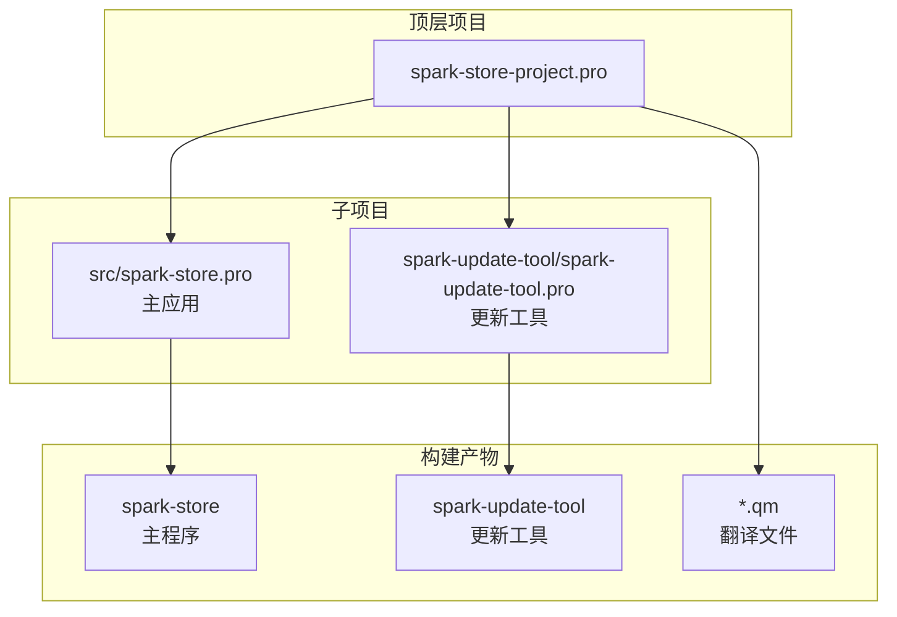
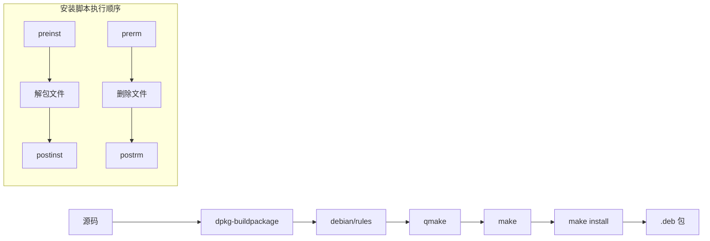

# 01 - 工程结构

> 本文档详细介绍 Spark Store 项目的目录结构、构建系统和 Debian 打包配置

## 目录结构总览

```
spark-store/
├── src/                          # 主应用源代码
│   ├── main.cpp                  # 程序入口点
│   ├── application.cpp/h         # DApplication 子类
│   ├── mainwindow-dtk.cpp/h/ui   # 主窗口实现
│   ├── spark-store.pro           # 应用 qmake 项目文件
│   ├── README.md                 # 源码说明
│   ├── assets/                   # 资源文件 (图标、QSS 等)
│   ├── backend/                  # 后端逻辑模块
│   ├── dbus/                     # D-Bus 接口定义
│   ├── pages/                    # 页面组件
│   ├── utils/                    # 工具函数
│   └── widgets/                  # 自定义控件
├── spark-update-tool/            # 更新工具子项目
│   ├── src/                      # 更新工具源码
│   ├── debian/                   # 更新工具打包配置
│   ├── resources/                # 更新工具资源
│   └── spark-update-tool.pro     # 更新工具项目文件
├── tool/                         # 工具脚本集合
│   ├── ssinstall                 # 核心安装脚本
│   ├── aptss                     # apt 包管理封装
│   ├── ssaudit                   # 审计工具
│   ├── spark-dstore-patch        # 商店补丁
│   ├── apt-fast/                 # apt-fast 加速组件
│   ├── apt-fast-conf/            # apt-fast 配置
│   ├── bashimport/               # Bash 导入脚本
│   ├── open-in-terminal/         # 终端打开工具
│   ├── ss-feedback/              # 反馈工具
│   ├── store-helper/             # 商店辅助工具
│   └── update-upgrade/           # 更新升级脚本
├── debian/                       # Debian 打包配置
│   ├── control                   # 包元数据
│   ├── rules                     # 构建规则
│   ├── changelog                 # 版本日志
│   ├── spark-store.postinst      # 安装后脚本
│   ├── spark-store.postrm        # 卸载后脚本
│   ├── spark-store.preinst       # 安装前脚本
│   ├── spark-store.prerm         # 卸载前脚本
│   └── spark-store.triggers      # 触发器配置
├── translations/                 # 国际化翻译文件
│   ├── spark-store_zh_CN.ts      # 简体中文
│   ├── spark-store_zh_TW.ts      # 繁体中文
│   ├── spark-store_en.ts         # 英语
│   ├── spark-store_es.ts         # 西班牙语
│   └── spark-store_fr.ts         # 法语
├── DOCS/                         # 内部文档
│   ├── json-api-doc.md           # JSON API 文档
│   ├── spk-doc.md                # SPK 协议文档
│   ├── 内网部署.md                # 内网部署指南
│   └── write-preview-skeleton.md # 预览骨架说明
├── pkg/                          # 打包资源
│   ├── etc/                      # 配置文件模板
│   ├── lib/                      # 库文件
│   ├── tmp/                      # 临时文件
│   └── usr/                      # 用户数据
├── patchs/                       # 补丁文件
├── spark-store-project.pro       # 顶层 qmake 项目文件
├── build_and_install.sh          # 构建安装脚本
├── translate_generation.sh       # 翻译生成脚本
├── translate_update.sh           # 翻译更新脚本
├── LICENSE                       # GPL-3.0 许可证
├── README.md / README.zh.md      # 项目说明
├── FAQ.md / FAQ.zh.md            # 常见问题
├── EULA                          # 最终用户许可协议
└── Jenkinsfile                   # CI/CD 配置
```

## 构建系统

### 项目结构图



### 顶层项目文件 (spark-store-project.pro)

```qmake
TEMPLATE = subdirs

# 子项目定义
SUBDIRS += \
    src \
    spark-update-tool

# 安装目标
tool.path = /opt/durapps/$${TARGET}/bin
tool.files = tool/*

qm.path = /usr/share/spark-store/translations
qm.files = translations/*.qm

desktop.path = /usr/share/applications
desktop.files = pkg/usr/share/applications/*

icon.path = /usr/share/icons/hicolor/scalable/apps
icon.files = pkg/usr/share/icons/hicolor/scalable/apps/*

INSTALLS += tool qm desktop icon
```

### 主应用项目文件 (src/spark-store.pro)

**核心配置伪代码：**

```
项目配置:
    模板类型 = app
    目标名称 = spark-store
    
Qt 模块依赖:
    - core, gui, concurrent
    - dbus, network, svg
    - webenginewidgets
    
PKG-CONFIG 依赖:
    - dtkcore, dtkgui, dtkwidget
    
版本管理:
    VERSION = $BUILD_VERSION 或 "4.2.6"
    定义 APP_VERSION 宏
    定义 APP_BRANCH 宏 (从 git 获取分支名)
    
安装路径:
    二进制文件 → /opt/durapps/spark-store/bin/
```

**关键代码引用：**

```qmake
# 文件: src/spark-store.pro

QT += core gui concurrent dbus network svg webenginewidgets
CONFIG += c++17 link_pkgconfig
PKGCONFIG += dtkcore dtkgui dtkwidget

# 版本定义
isEmpty(BUILD_VERSION) {
    VERSION = 4.2.6
} else {
    VERSION = $$BUILD_VERSION
}

DEFINES += APP_VERSION=\\\"'$${VERSION}'\\\"
DEFINES += APP_BRANCH=\\\"'$$system(git symbolic-ref --short -q HEAD)'\\\"

# 安装配置
target.path = /opt/durapps/$${TARGET}/bin
INSTALLS += target
```

## Debian 打包配置

### 构建流程



### 控制文件 (debian/control)

```
Source: spark-store
Section: utils
Priority: optional
Maintainer: shenmo <shenmo@spark-app.store>

Build-Depends:
    debhelper (>= 11),
    qtbase5-dev,
    qtwebengine5-dev,
    libdtkcore-dev,
    libdtkgui-dev,
    libdtkwidget-dev (>= 5.0)

Package: spark-store
Architecture: any
Depends:
    ${shlibs:Depends},
    ${misc:Depends},
    dde-qt5integration,
    curl,
    aria2,
    gnupg,
    zenity,
    policykit-1,
    libnotify-bin,
    qtwayland5
```

### 安装脚本功能

| 脚本 | 执行时机 | 主要功能 |
|------|----------|----------|
| `preinst` | 安装前 | 环境检查、旧版本清理 |
| `postinst` | 安装后 | 注册 MIME 类型、更新图标缓存、配置权限 |
| `prerm` | 卸载前 | 停止运行中的服务 |
| `postrm` | 卸载后 | 清理配置文件、缓存 |
| `triggers` | 触发器 | 响应系统事件 (如图标缓存更新) |

**postinst 伪代码：**

```
postinst(action):
    if action == "configure":
        # 注册 spk:// URL 协议
        update-desktop-database
        
        # 更新图标缓存
        gtk-update-icon-cache
        
        # 设置 ssinstall 权限
        chmod +x /opt/durapps/spark-store/bin/ssinstall
        
        # 配置 polkit 策略
        install polkit-policy to /usr/share/polkit-1/actions/
```

## 翻译系统

### 支持的语言

| 语言 | 文件 | 状态 |
|------|------|------|
| 简体中文 | `spark-store_zh_CN.ts` | 完整 |
| 繁体中文 | `spark-store_zh_TW.ts` | 完整 |
| 英语 | `spark-store_en.ts` | 完整 |
| 西班牙语 | `spark-store_es.ts` | 部分 |
| 法语 | `spark-store_fr.ts` | 部分 |

### 翻译工作流


### 翻译脚本

**translate_update.sh** - 从源码提取待翻译字符串：

```bash
#!/bin/bash
# 扫描源码中的 tr() 调用，更新 .ts 文件
lupdate src/ -ts translations/spark-store_*.ts
```

**translate_generation.sh** - 生成二进制翻译文件：

```bash
#!/bin/bash
# 将 .ts 文件编译为 .qm 二进制格式
lrelease translations/spark-store_*.ts
```

## 构建与安装

### 手动构建

```bash
# 1. 安装依赖
sudo apt install qtbase5-dev qtwebengine5-dev \
    libdtkcore-dev libdtkgui-dev libdtkwidget-dev

# 2. 生成 Makefile
qmake spark-store-project.pro

# 3. 编译
make -j$(nproc)

# 4. 安装
sudo make install
```

### 使用构建脚本

```bash
# 一键构建安装
./build_and_install.sh
```

**build_and_install.sh 伪代码：**

```
build_and_install():
    # 检查依赖
    check_dependencies()
    
    # 清理旧构建
    make clean
    
    # 生成翻译文件
    ./translate_generation.sh
    
    # 构建
    qmake
    make -j$(nproc)
    
    # 安装
    sudo make install
    
    # 后处理
    update-desktop-database
    gtk-update-icon-cache
```

### 打包 Debian 包

```bash
# 构建 .deb 包
dpkg-buildpackage -b -us -uc

# 或使用 debuild
debuild -b -us -uc
```

## 安装路径说明

| 路径 | 内容 |
|------|------|
| `/opt/durapps/spark-store/bin/` | 主程序和工具脚本 |
| `/usr/share/spark-store/translations/` | 翻译文件 (.qm) |
| `/usr/share/applications/` | 桌面入口文件 |
| `/usr/share/icons/hicolor/scalable/apps/` | 应用图标 |
| `/usr/share/polkit-1/actions/` | PolicyKit 策略 |
| `~/.config/spark-store/` | 用户配置 |
| `/tmp/spark-store/` | 下载缓存 |

---

[返回目录](README.md) | [下一篇: 核心模块](02-核心模块.md)
