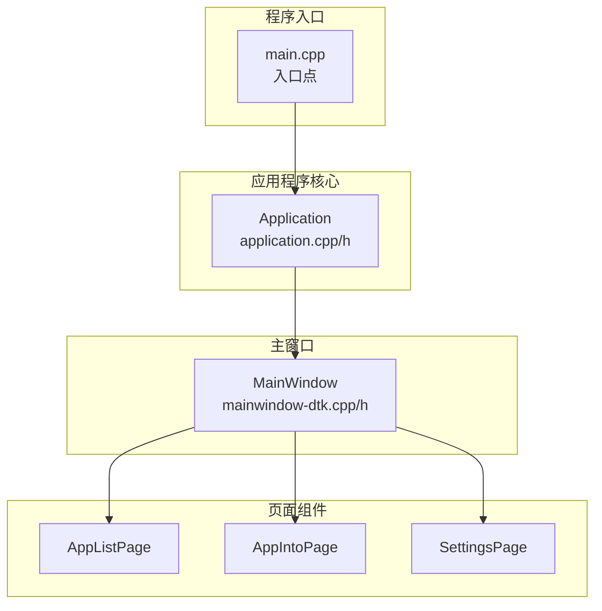
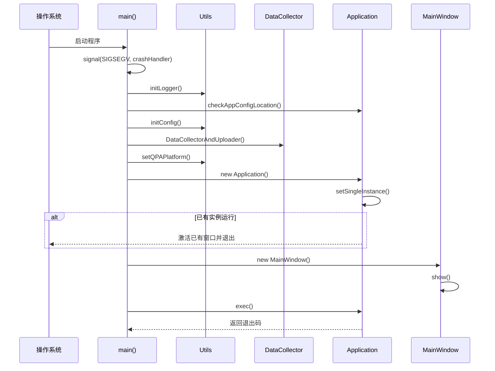
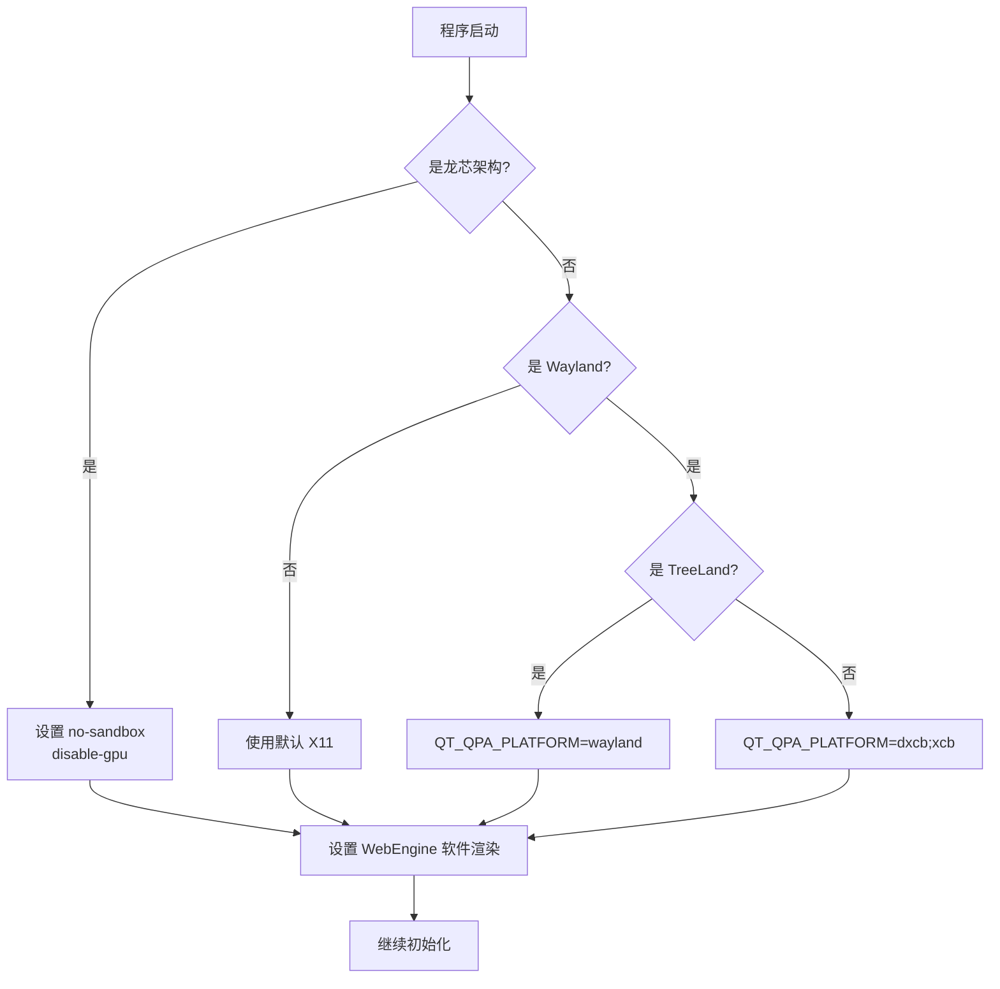
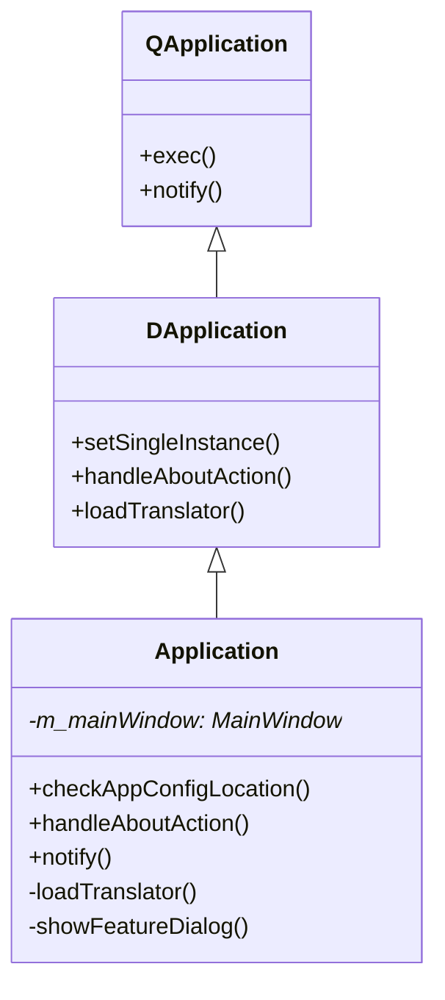
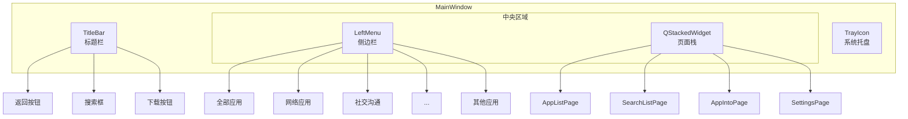
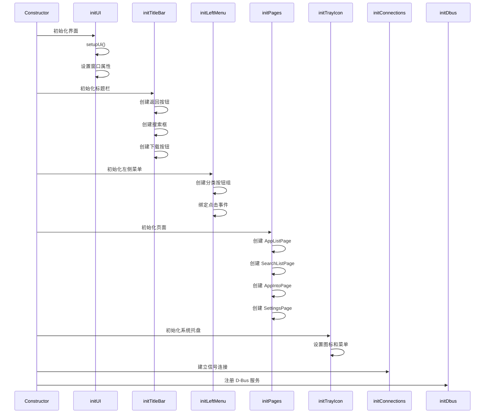
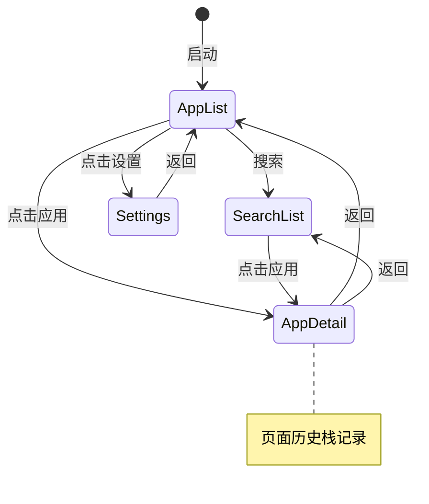
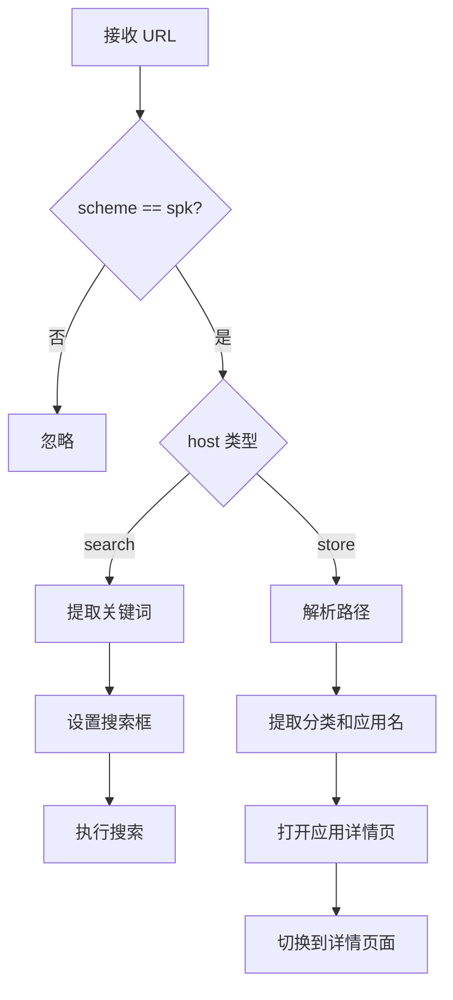
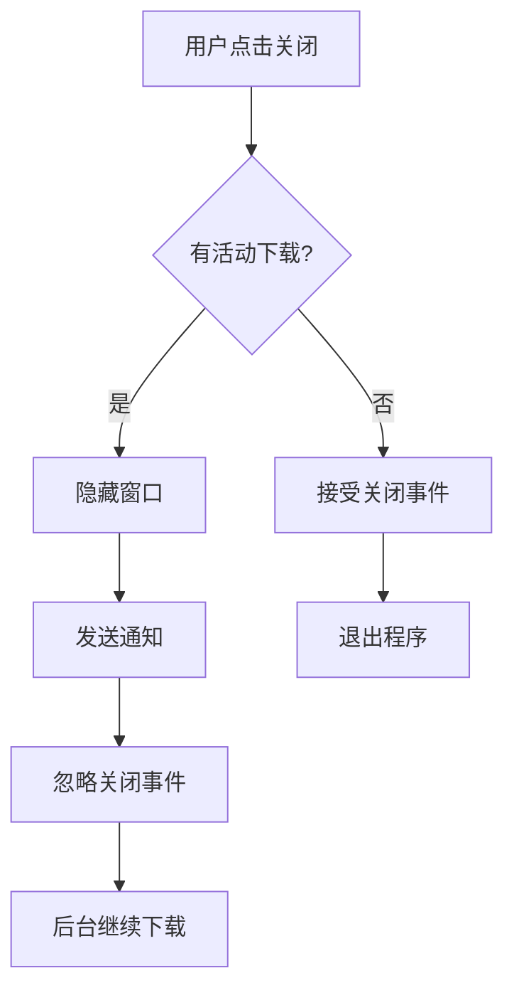

# 02 - 核心模块

> 本文档详细介绍 Spark Store 的核心模块：程序入口、Application 类和 MainWindow 类

## 模块概览



---

## main.cpp - 程序入口

### 文件位置

`src/main.cpp`

### 功能职责

1. **崩溃处理** - 注册 SIGSEGV 信号处理函数
2. **日志系统** - 初始化日志记录
3. **配置初始化** - 创建配置目录和默认配置
4. **平台适配** - 处理不同桌面环境和显示协议
5. **单实例控制** - 确保只有一个实例运行
6. **URL 协议** - 处理 spk:// 协议启动

### 启动流程



### 核心代码解析

#### 崩溃处理器

```cpp
// 文件: src/main.cpp

void crashHandler(int sig) {
    // 获取调用栈
    void *array[30];
    size_t size = backtrace(array, 30);
    char **strings = backtrace_symbols(array, size);
    
    // 收集系统信息
    QString cpuArch = QSysInfo::currentCpuArchitecture();
    QString distro = getDistroInfo();
    QString memInfo = getMemoryInfo();
    
    // 生成崩溃日志
    QString logPath = QString("/tmp/spark_store_crash_log_%1.txt")
                      .arg(QDateTime::currentSecsSinceEpoch());
    
    // 写入日志文件
    QFile file(logPath);
    file.open(QIODevice::WriteOnly);
    // ... 写入调用栈和系统信息
    
    // 使用 xdg-open 打开日志
    QProcess::startDetached("xdg-open", {logPath});
    
    exit(1);
}
```

**伪代码：**

```
crashHandler(signal):
    array = 获取调用栈(最多30层)
    strings = 解析调用栈符号
    
    收集系统信息:
        - CPU 架构
        - 发行版信息
        - 内存信息
        - 应用版本
    
    logPath = "/tmp/spark_store_crash_log_{timestamp}.txt"
    
    写入日志文件:
        - 信号类型
        - 调用栈
        - 系统信息
    
    xdg-open 打开日志文件
    exit(1)
```

#### 平台适配

```cpp
// 文件: src/main.cpp

// 龙芯架构特殊处理
#if defined (__loongarch__)
    qputenv("QTWEBENGINE_CHROMIUM_FLAGS", 
            "--no-sandbox --disable-gpu");
#endif

// Wayland 检测与适配
if (Utils::isWayland()) {
    if (Utils::isTreeLand()) {
        qputenv("QT_QPA_PLATFORM", "wayland");
    } else {
        qputenv("QT_QPA_PLATFORM", "dxcb;xcb");
    }
}

// WebEngine 软件渲染 (避免黑屏)
qputenv("QTWEBENGINE_CHROMIUM_FLAGS", 
        "--disable-gpu --enable-software-compositing");
```

**平台适配流程图：**



#### 单实例与 URL 处理

```cpp
// 文件: src/main.cpp

// 设置单实例
a.setSingleInstance("spark-store");

// 处理命令行参数中的 URL
if (argc > 1) {
    QString arg = QString::fromLocal8Bit(argv[1]);
    if (arg.startsWith("spk://")) {
        w.openUrl(arg);
    }
}
```

---

## Application 类

### 文件位置

- 头文件: `src/application.h`
- 实现: `src/application.cpp`

### 类定义

```cpp
// 文件: src/application.h

class Application : public DApplication {
    Q_OBJECT
    
public:
    explicit Application(int &argc, char **argv);
    
    // 静态方法
    static void checkAppConfigLocation();
    
    // 重写方法
    void handleAboutAction() override;
    bool notify(QObject *watched, QEvent *event) override;
    
private:
    void loadTranslator();
    void showFeatureDialog();
    
private:
    MainWindow *m_mainWindow = nullptr;
};
```

### 继承关系



### 核心功能实现

#### 配置目录检查

```cpp
// 文件: src/application.cpp

void Application::checkAppConfigLocation() {
    QString configPath = QStandardPaths::writableLocation(
        QStandardPaths::ConfigLocation) + "/spark-store";
    
    QDir dir(configPath);
    if (!dir.exists()) {
        dir.mkpath(".");
        dir.mkpath("logs");
    }
}
```

**伪代码：**

```
checkAppConfigLocation():
    configPath = ~/.config/spark-store
    
    if not exists(configPath):
        mkdir(configPath)
        mkdir(configPath/logs)
```

#### 翻译加载

```cpp
// 文件: src/application.cpp

void Application::loadTranslator() {
    // 加载 Qt 内置翻译
    QTranslator *qtTranslator = new QTranslator(this);
    qtTranslator->load("qt_" + QLocale::system().name(),
                       QLibraryInfo::location(QLibraryInfo::TranslationsPath));
    installTranslator(qtTranslator);
    
    // 加载应用翻译
    QTranslator *appTranslator = new QTranslator(this);
    QString translationPath = "/usr/share/spark-store/translations";
    appTranslator->load("spark-store_" + QLocale::system().name(), 
                        translationPath);
    installTranslator(appTranslator);
}
```

#### 关于对话框

```cpp
// 文件: src/application.cpp

void Application::handleAboutAction() {
    DAboutDialog *dialog = new DAboutDialog(m_mainWindow);
    
    dialog->setWindowTitle(tr("About Spark Store"));
    dialog->setProductName(tr("Spark Store"));
    dialog->setVersion(APP_VERSION);
    dialog->setDescription(tr("A community-driven app store for Linux"));
    dialog->setCompanyLogo(QPixmap(":/icons/spark-store.svg"));
    dialog->setWebsiteName("spark-app.store");
    dialog->setWebsiteLink("https://www.spark-app.store");
    dialog->setLicense(tr("GPL-3.0"));
    
    dialog->exec();
}
```

#### 事件分发

```cpp
// 文件: src/application.cpp

bool Application::notify(QObject *watched, QEvent *event) {
    // 处理文件打开事件 (macOS 拖拽)
    if (event->type() == QEvent::FileOpen) {
        QFileOpenEvent *fileEvent = static_cast<QFileOpenEvent*>(event);
        QString url = fileEvent->url().toString();
        if (url.startsWith("spk://") && m_mainWindow) {
            m_mainWindow->openUrl(url);
            return true;
        }
    }
    
    return DApplication::notify(watched, event);
}
```

---

## MainWindow 类

### 文件位置

- 头文件: `src/mainwindow-dtk.h`
- 实现: `src/mainwindow-dtk.cpp`
- UI 文件: `src/mainwindow-dtk.ui`

### 类定义

```cpp
// 文件: src/mainwindow-dtk.h

// 页面索引定义
#define AppPageApplist    0  // 应用列表
#define AppPageSearchlist 1  // 搜索结果
#define AppPageAppdetail  2  // 应用详情
#define AppPageSettings   3  // 设置页面

class MainWindow : public DMainWindow {
    Q_OBJECT
    
public:
    explicit MainWindow(QWidget *parent = nullptr);
    ~MainWindow();
    
    void openUrl(const QString &url);
    
signals:
    void themeChanged(bool isDark);
    
public slots:
    void goBack();
    void switchToPage(int pageIndex);
    
private:
    void initUI();
    void initTitleBar();
    void initLeftMenu();
    void initPages();
    void initTrayIcon();
    void initConnections();
    void initDbus();
    
private:
    Ui::MainWindow *ui;
    
    // 页面组件
    AppListPage *m_appListPage;
    AppListPage *m_searchListPage;
    AppIntoPage *m_appIntoPage;
    SettingsPage *m_settingsPage;
    
    // 控件
    DownloadListWidget *m_downloadListWidget;
    DSearchEdit *m_searchEdit;
    QButtonGroup *m_categoryGroup;
    
    // 状态
    QStack<int> m_pageHistory;
    QSystemTrayIcon *m_trayIcon;
    ThemeChecker *m_themeChecker;
};
```

### UI 结构



### 初始化流程



### 核心功能实现

#### 标题栏初始化

```cpp
// 文件: src/mainwindow-dtk.cpp

void MainWindow::initTitleBar() {
    // 获取标题栏
    DTitlebar *titlebar = this->titlebar();
    
    // 返回按钮
    DIconButton *backBtn = new DIconButton(DStyle::SP_ArrowLeave);
    backBtn->setFixedSize(36, 36);
    connect(backBtn, &DIconButton::clicked, this, &MainWindow::goBack);
    
    // 搜索框
    m_searchEdit = new DSearchEdit();
    m_searchEdit->setPlaceholderText(tr("Search applications"));
    m_searchEdit->setFixedWidth(300);
    connect(m_searchEdit, &DSearchEdit::returnPressed, 
            this, &MainWindow::onSearch);
    
    // 下载按钮
    DIconButton *downloadBtn = new DIconButton();
    downloadBtn->setIcon(QIcon(":/icons/download.svg"));
    connect(downloadBtn, &DIconButton::clicked, 
            this, &MainWindow::showDownloadList);
    
    // 添加到标题栏
    titlebar->addWidget(backBtn, Qt::AlignLeft);
    titlebar->addWidget(m_searchEdit, Qt::AlignCenter);
    titlebar->addWidget(downloadBtn, Qt::AlignRight);
}
```

#### 分类菜单

```cpp
// 文件: src/mainwindow-dtk.cpp

void MainWindow::initLeftMenu() {
    // 分类列表
    QStringList categories;
    categories << tr("All") << tr("Network") << tr("Chat")
               << tr("Music") << tr("Video") << tr("Graphics")
               << tr("Games") << tr("Office") << tr("Reading")
               << tr("Development") << tr("Tools") 
               << tr("Themes") << tr("Others");
    
    // 服务器目录映射
    QStringList serverDirs;
    serverDirs << "" << "network" << "chat" << "music" 
               << "video" << "image_graphics" << "games"
               << "office" << "reading" << "development"
               << "tools" << "themes" << "others";
    
    m_categoryGroup = new QButtonGroup(this);
    
    for (int i = 0; i < categories.size(); i++) {
        DPushButton *btn = new DPushButton(categories[i]);
        btn->setProperty("serverDir", serverDirs[i]);
        m_categoryGroup->addButton(btn, i);
        ui->leftMenuLayout->addWidget(btn);
    }
    
    connect(m_categoryGroup, 
            QOverload<int>::of(&QButtonGroup::buttonClicked),
            this, &MainWindow::onCategoryClicked);
}
```

**分类映射表：**

| 索引 | 显示名称 | 服务器目录 |
|------|----------|------------|
| 0 | 全部 | (空) |
| 1 | 网络应用 | network |
| 2 | 社交沟通 | chat |
| 3 | 音乐欣赏 | music |
| 4 | 视频播放 | video |
| 5 | 图形图像 | image_graphics |
| 6 | 游戏娱乐 | games |
| 7 | 办公学习 | office |
| 8 | 阅读翻译 | reading |
| 9 | 编程开发 | development |
| 10 | 系统工具 | tools |
| 11 | 主题美化 | themes |
| 12 | 其他应用 | others |

#### 页面导航

```cpp
// 文件: src/mainwindow-dtk.cpp

void MainWindow::switchToPage(int pageIndex) {
    // 记录历史
    int currentIndex = ui->stackedWidget->currentIndex();
    if (currentIndex != pageIndex) {
        m_pageHistory.push(currentIndex);
    }
    
    // 切换页面
    ui->stackedWidget->setCurrentIndex(pageIndex);
    
    // 更新返回按钮状态
    ui->backButton->setEnabled(!m_pageHistory.isEmpty());
}

void MainWindow::goBack() {
    if (!m_pageHistory.isEmpty()) {
        int previousPage = m_pageHistory.pop();
        ui->stackedWidget->setCurrentIndex(previousPage);
    }
    
    ui->backButton->setEnabled(!m_pageHistory.isEmpty());
}
```

**页面导航流程：**



#### URL 协议处理

```cpp
// 文件: src/mainwindow-dtk.cpp

void MainWindow::openUrl(const QString &url) {
    QUrl qurl(url);
    
    if (qurl.scheme() != "spk") {
        return;
    }
    
    QString host = qurl.host();
    QString path = qurl.path();
    
    if (host == "search") {
        // spk://search/keyword
        QString keyword = path.mid(1); // 去掉开头的 /
        m_searchEdit->setText(keyword);
        onSearch();
    } 
    else if (host == "store") {
        // spk://store/category/appname
        QStringList parts = path.split("/", Qt::SkipEmptyParts);
        if (parts.size() >= 2) {
            QString category = parts[0];
            QString appname = parts[1];
            m_appIntoPage->openUrl(url);
            switchToPage(AppPageAppdetail);
        }
    }
}
```

**URL 解析流程：**



#### 主题检测

```cpp
// 文件: src/mainwindow-dtk.cpp

void MainWindow::initConnections() {
    // 主题检测器
    m_themeChecker = new ThemeChecker(this);
    
    connect(m_themeChecker, &ThemeChecker::themeChanged,
            this, [this](bool isDark) {
        // 更新 WebEngine 页面主题
        m_appListPage->setDarkMode(isDark);
        m_searchListPage->setDarkMode(isDark);
        
        emit themeChanged(isDark);
    });
    
    // DTK 主题变化
    connect(DGuiApplicationHelper::instance(), 
            &DGuiApplicationHelper::themeTypeChanged,
            this, &MainWindow::onThemeChanged);
}
```

#### 系统托盘

```cpp
// 文件: src/mainwindow-dtk.cpp

void MainWindow::initTrayIcon() {
    m_trayIcon = new QSystemTrayIcon(this);
    m_trayIcon->setIcon(QIcon(":/icons/spark-store.svg"));
    m_trayIcon->setToolTip(tr("Spark Store"));
    
    // 托盘菜单
    QMenu *trayMenu = new QMenu(this);
    
    QAction *showAction = trayMenu->addAction(tr("Show"));
    connect(showAction, &QAction::triggered, 
            this, &MainWindow::show);
    
    QAction *quitAction = trayMenu->addAction(tr("Quit"));
    connect(quitAction, &QAction::triggered, 
            qApp, &QApplication::quit);
    
    m_trayIcon->setContextMenu(trayMenu);
    
    // 双击显示窗口
    connect(m_trayIcon, &QSystemTrayIcon::activated,
            this, [this](QSystemTrayIcon::ActivationReason reason) {
        if (reason == QSystemTrayIcon::DoubleClick) {
            this->show();
            this->activateWindow();
        }
    });
    
    m_trayIcon->show();
}
```

### 窗口关闭行为

```cpp
// 文件: src/mainwindow-dtk.cpp

void MainWindow::closeEvent(QCloseEvent *event) {
    // 检查是否有下载任务
    if (m_downloadListWidget->hasActiveDownloads()) {
        // 最小化到托盘
        this->hide();
        
        Utils::sendNotification(
            "spark-store",
            tr("Spark Store"),
            tr("Minimized to tray. Downloads continue in background.")
        );
        
        event->ignore();
    } else {
        event->accept();
    }
}
```

**关闭流程：**



---

[上一篇: 工程结构](01-工程结构.md) | [返回目录](README.md) | [下一篇: 后端模块](03-后端模块.md)
