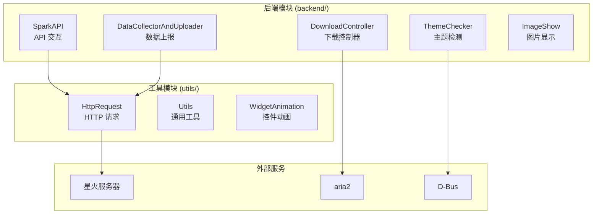
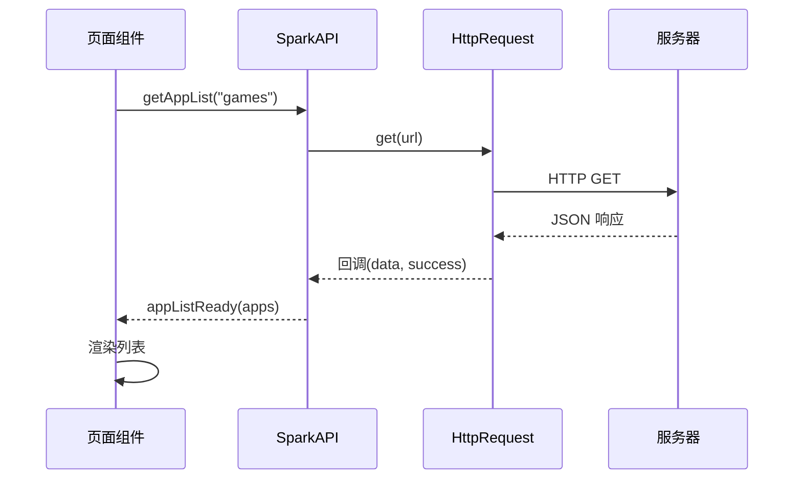
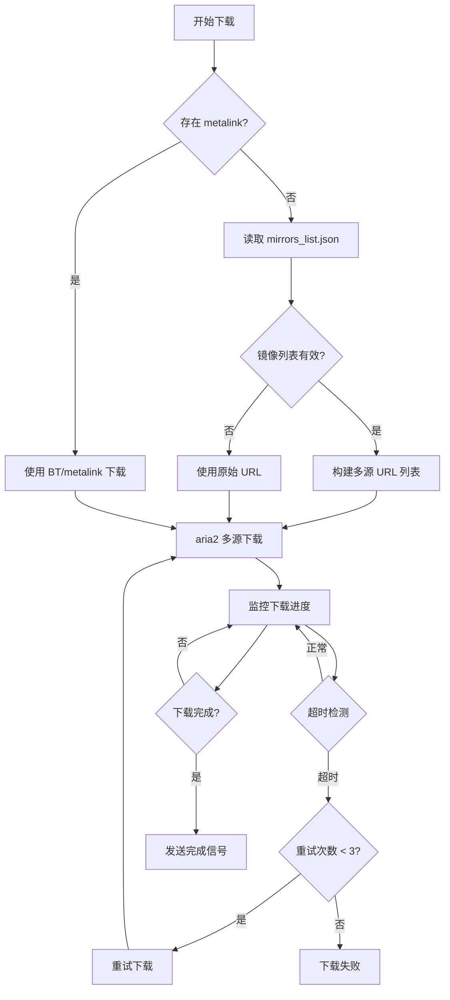
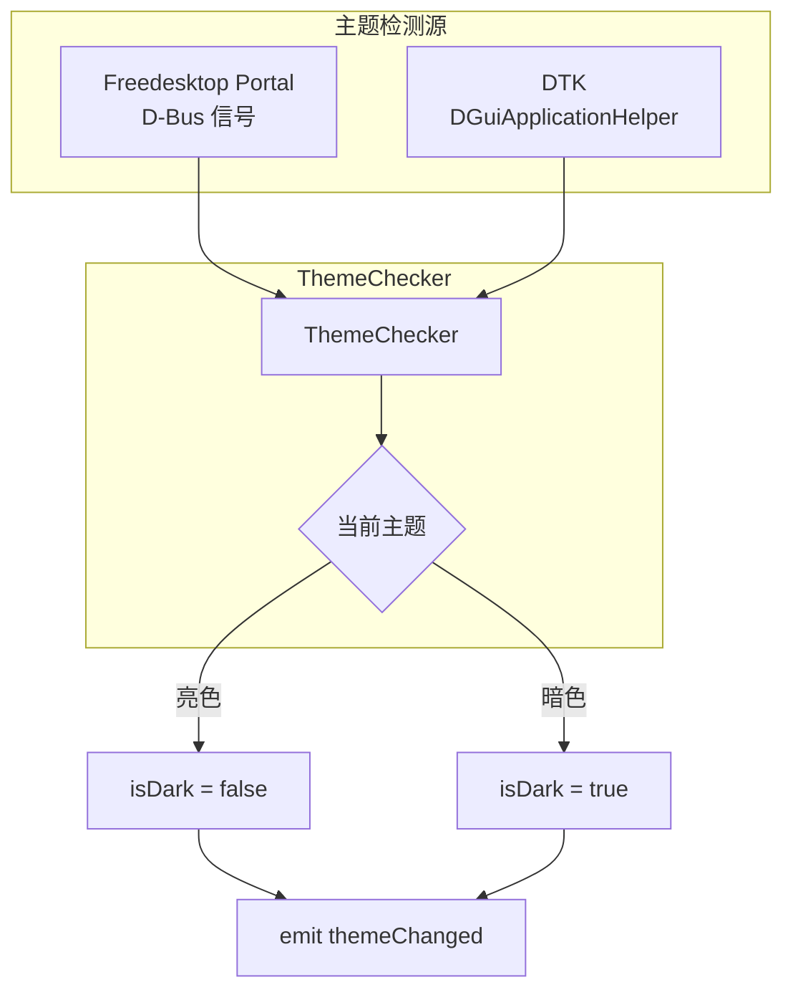
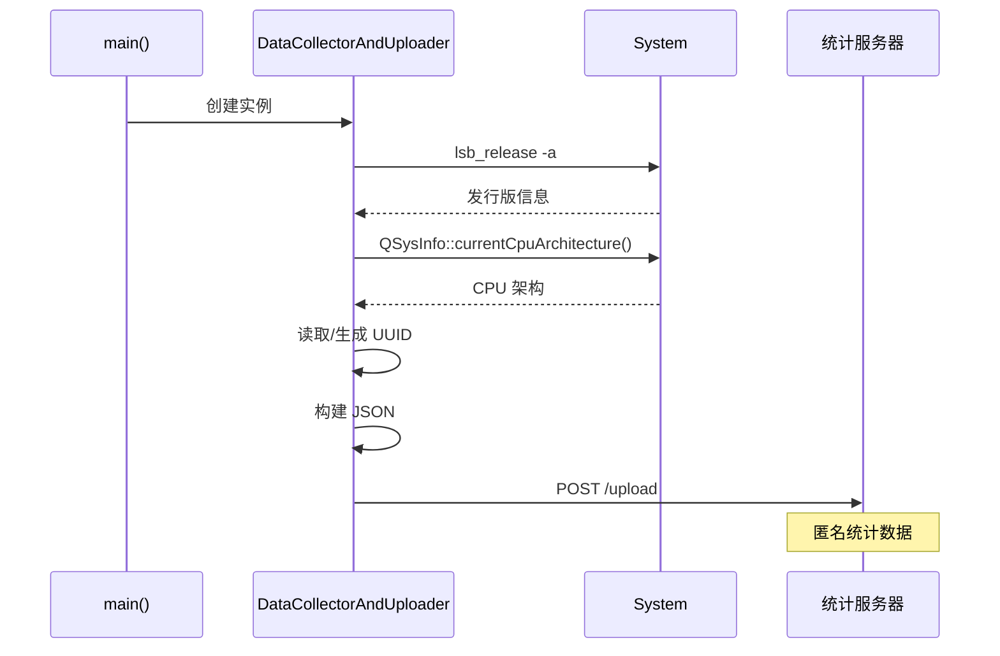

# 03 - 后端模块

> 本文档详细介绍 Spark Store 的后端模块：SparkAPI、DownloadController、ThemeChecker 和 DataCollectorAndUploader

## 模块概览



---

## SparkAPI - API 交互模块

### 文件位置

`src/backend/sparkapi.cpp` / `src/backend/sparkapi.h`

### 类定义

```cpp
// 文件: src/backend/sparkapi.h

class SparkAPI : public QObject {
    Q_OBJECT
    
public:
    explicit SparkAPI(QObject *parent = nullptr);
    
    // 静态方法
    static QString getServerUrl();
    static void setServerUrl(const QString &url);
    static QString getArchDir();
    
    // API 请求
    void getAppList(const QString &category);
    void getAppInfo(const QUrl &spkUrl);
    void getSearchList(const QString &keyword);
    void getAppDownloadTimes(const QUrl &spkUrl);
    
signals:
    void appListReady(const QJsonArray &apps);
    void appInfoReady(const QJsonObject &info);
    void searchListReady(const QJsonArray &results);
    void downloadTimesReady(int times);
    void requestError(const QString &error);
    
private:
    HttpRequest *m_http;
    static QString s_serverUrl;
};
```

### API 端点

| 功能 | 端点格式 | 请求方式 |
|------|----------|----------|
| 分类列表 | `{server}/{arch}/{category}/applist.json` | GET |
| 应用详情 | `{server}/{arch}/{category}/{appname}/app.json` | GET |
| 搜索 | `https://search.deepinos.org.cn/appinfo/search?keyword={keyword}` | GET |
| 下载次数 | `https://spark-app.store/api/appdltimes?name={appname}` | GET |
| 镜像列表 | `{server}/mirrors_list.json` | GET |
| 服务器列表 | `{server}/server.json` | GET |

### 架构目录映射

```cpp
// 文件: src/backend/sparkapi.cpp

QString SparkAPI::getArchDir() {
    QString arch;
    
#if defined(__aarch64__)
    arch = "aarch64-store";
#elif defined(__loongarch__)
    arch = "loong64-store";
#elif defined(__riscv) && __riscv_xlen == 64
    arch = "riscv64-store";
#else
    arch = "store";  // x86_64 默认
#endif
    
    return arch;
}
```

**架构映射表：**

| CPU 架构 | 预处理器宏 | 目录名 |
|----------|------------|--------|
| x86_64 | 默认 | store |
| ARM64 | `__aarch64__` | aarch64-store |
| LoongArch | `__loongarch__` | loong64-store |
| RISC-V 64 | `__riscv && __riscv_xlen == 64` | riscv64-store |

### 核心实现

#### 获取应用列表

```cpp
// 文件: src/backend/sparkapi.cpp

void SparkAPI::getAppList(const QString &category) {
    QString url = QString("%1/%2/%3/applist.json")
                  .arg(getServerUrl())
                  .arg(getArchDir())
                  .arg(category);
    
    m_http->get(url, [this](const QByteArray &data, bool success) {
        if (success) {
            QJsonDocument doc = QJsonDocument::fromJson(data);
            QJsonArray apps = doc.array();
            emit appListReady(apps);
        } else {
            emit requestError(tr("Failed to get app list"));
        }
    });
}
```

**伪代码：**

```
getAppList(category):
    url = "{serverUrl}/{archDir}/{category}/applist.json"
    
    http.get(url) -> (data, success):
        if success:
            apps = JSON.parse(data)
            emit appListReady(apps)
        else:
            emit requestError("获取应用列表失败")
```

#### 获取应用详情

```cpp
// 文件: src/backend/sparkapi.cpp

void SparkAPI::getAppInfo(const QUrl &spkUrl) {
    // 解析 spk://store/category/appname
    QString path = spkUrl.path();
    QStringList parts = path.split("/", Qt::SkipEmptyParts);
    
    if (parts.size() < 2) {
        emit requestError(tr("Invalid SPK URL"));
        return;
    }
    
    QString category = parts[0];
    QString appname = parts[1];
    
    QString url = QString("%1/%2/%3/%4/app.json")
                  .arg(getServerUrl())
                  .arg(getArchDir())
                  .arg(category)
                  .arg(appname);
    
    m_http->get(url, [this](const QByteArray &data, bool success) {
        if (success) {
            QJsonDocument doc = QJsonDocument::fromJson(data);
            QJsonObject info = doc.object();
            emit appInfoReady(info);
        } else {
            emit requestError(tr("Failed to get app info"));
        }
    });
}
```

#### 搜索应用

```cpp
// 文件: src/backend/sparkapi.cpp

void SparkAPI::getSearchList(const QString &keyword) {
    // 搜索使用独立的搜索服务器
    QString url = QString("https://search.deepinos.org.cn/appinfo/search")
                  + QString("?keyword=%1").arg(QUrl::toPercentEncoding(keyword));
    
    m_http->get(url, [this](const QByteArray &data, bool success) {
        if (success) {
            QJsonDocument doc = QJsonDocument::fromJson(data);
            QJsonObject obj = doc.object();
            QJsonArray results = obj["data"].toArray();
            emit searchListReady(results);
        } else {
            emit requestError(tr("Search failed"));
        }
    });
}
```

### 数据流



---

## DownloadController - 下载控制器

### 文件位置

`src/backend/downloadworker.cpp` / `src/backend/downloadworker.h`

### 类定义

```cpp
// 文件: src/backend/downloadworker.h

class DownloadController : public QObject {
    Q_OBJECT
    
public:
    static DownloadController* instance();
    
    void startDownload(const QString &url, 
                       const QString &filename,
                       const QString &metalinkUrl = QString());
    void cancelDownload();
    bool isDownloading() const;
    
signals:
    void downloadProcess(qint64 received, qint64 total, double speed);
    void downloadFinished(bool success, const QString &filePath);
    void downloadError(const QString &error);
    
private:
    explicit DownloadController(QObject *parent = nullptr);
    
    void parseAria2Output(const QString &output);
    void handleTimeout();
    
private:
    QProcess *m_aria2Process;
    QString m_currentFile;
    QTimer *m_timeoutTimer;
    int m_retryCount;
    qint64 m_lastProgress;
    
    static DownloadController *s_instance;
};
```

### 下载策略



### 核心实现

#### 启动下载

```cpp
// 文件: src/backend/downloadworker.cpp

void DownloadController::startDownload(const QString &url,
                                        const QString &filename,
                                        const QString &metalinkUrl) {
    if (m_aria2Process && m_aria2Process->state() != QProcess::NotRunning) {
        emit downloadError(tr("Another download in progress"));
        return;
    }
    
    m_currentFile = filename;
    m_retryCount = 0;
    m_lastProgress = 0;
    
    QStringList args;
    
    if (!metalinkUrl.isEmpty()) {
        // 使用 metalink
        args << metalinkUrl << "--follow-metalink=true";
    } else {
        // 获取镜像列表
        QStringList mirrors = getMirrorUrls(url);
        for (const QString &mirror : mirrors) {
            args << mirror;
        }
    }
    
    // aria2 通用参数
    args << "-d" << "/tmp/spark-store/"
         << "-o" << filename
         << "--summary-interval=1"
         << "--min-split-size=1M"
         << "--no-conf"
         << "--max-connection-per-server=1"
         << "--max-concurrent-downloads=16"
         << "--connect-timeout=5"
         << "--max-tries=1";
    
    m_aria2Process = new QProcess(this);
    
    connect(m_aria2Process, &QProcess::readyReadStandardOutput,
            this, &DownloadController::onAria2Output);
    connect(m_aria2Process, QOverload<int, QProcess::ExitStatus>::of(&QProcess::finished),
            this, &DownloadController::onAria2Finished);
    
    m_aria2Process->start("aria2c", args);
    
    // 启动超时检测
    m_timeoutTimer = new QTimer(this);
    m_timeoutTimer->setInterval(200000); // 200 秒
    connect(m_timeoutTimer, &QTimer::timeout, 
            this, &DownloadController::handleTimeout);
    m_timeoutTimer->start();
}
```

**伪代码：**

```
startDownload(url, filename, metalinkUrl):
    if 正在下载:
        emit downloadError("另一个下载正在进行")
        return
    
    args = []
    
    if metalinkUrl 存在:
        args.append(metalinkUrl)
        args.append("--follow-metalink=true")
    else:
        mirrors = getMirrorUrls(url)
        for mirror in mirrors:
            args.append(mirror)
    
    args.extend([
        "-d", "/tmp/spark-store/",
        "-o", filename,
        "--summary-interval=1",
        "--min-split-size=1M",
        ...
    ])
    
    启动 aria2c 进程(args)
    启动超时计时器(200秒)
```

#### 解析 aria2 输出

```cpp
// 文件: src/backend/downloadworker.cpp

void DownloadController::parseAria2Output(const QString &output) {
    // aria2 输出格式示例:
    // [#abc123 50MiB/100MiB(50%) CN:16 DL:5.0MiB]
    
    QRegularExpression re(
        R"(\[#\w+ (\d+(?:\.\d+)?)(Ki|Mi|Gi)?B/(\d+(?:\.\d+)?)(Ki|Mi|Gi)?B\((\d+)%\).*DL:(\d+(?:\.\d+)?)(Ki|Mi|Gi)?B\])"
    );
    
    QRegularExpressionMatch match = re.match(output);
    if (match.hasMatch()) {
        qint64 received = parseSize(match.captured(1), match.captured(2));
        qint64 total = parseSize(match.captured(3), match.captured(4));
        double speed = parseSpeed(match.captured(6), match.captured(7));
        
        // 重置超时计时器
        if (received > m_lastProgress) {
            m_lastProgress = received;
            m_timeoutTimer->start();
        }
        
        emit downloadProcess(received, total, speed);
    }
}

qint64 DownloadController::parseSize(const QString &num, const QString &unit) {
    double value = num.toDouble();
    if (unit == "Ki") return value * 1024;
    if (unit == "Mi") return value * 1024 * 1024;
    if (unit == "Gi") return value * 1024 * 1024 * 1024;
    return value;
}
```

#### 超时处理

```cpp
// 文件: src/backend/downloadworker.cpp

void DownloadController::handleTimeout() {
    m_timeoutTimer->stop();
    
    if (m_retryCount < 3) {
        m_retryCount++;
        
        // 终止当前下载
        m_aria2Process->terminate();
        m_aria2Process->waitForFinished(5000);
        
        // 重新下载
        // ... 重新调用 startDownload
    } else {
        emit downloadError(tr("Download timeout after 3 retries"));
    }
}
```

### 下载完成处理

```cpp
// 文件: src/backend/downloadworker.cpp

void DownloadController::onAria2Finished(int exitCode, 
                                          QProcess::ExitStatus status) {
    m_timeoutTimer->stop();
    
    QString filePath = QString("/tmp/spark-store/%1").arg(m_currentFile);
    
    if (exitCode == 0 && QFile::exists(filePath)) {
        emit downloadFinished(true, filePath);
    } else {
        emit downloadFinished(false, QString());
    }
    
    m_aria2Process->deleteLater();
    m_aria2Process = nullptr;
}
```

---

## ThemeChecker - 主题检测器

### 文件位置

`src/backend/ThemeChecker.cpp` / `src/backend/ThemeChecker.h`

### 类定义

```cpp
// 文件: src/backend/ThemeChecker.h

class ThemeChecker : public QObject {
    Q_OBJECT
    
public:
    explicit ThemeChecker(QObject *parent = nullptr);
    
    bool isDarkMode() const;
    
signals:
    void themeChanged(bool isDark);
    
private slots:
    void onPortalSettingChanged(const QString &namespace_,
                                 const QString &key,
                                 const QDBusVariant &value);
    void onDtkThemeChanged();
    
private:
    void initDBusConnection();
    void checkCurrentTheme();
    
    QDBusInterface *m_portalInterface;
    bool m_isDark;
};
```

### 检测机制



### 核心实现

#### D-Bus 连接

```cpp
// 文件: src/backend/ThemeChecker.cpp

void ThemeChecker::initDBusConnection() {
    // 连接 Freedesktop Portal
    QDBusConnection sessionBus = QDBusConnection::sessionBus();
    
    sessionBus.connect(
        "org.freedesktop.portal.Desktop",
        "/org/freedesktop/portal/desktop",
        "org.freedesktop.portal.Settings",
        "SettingChanged",
        this,
        SLOT(onPortalSettingChanged(QString, QString, QDBusVariant))
    );
    
    // 初始化查询接口
    m_portalInterface = new QDBusInterface(
        "org.freedesktop.portal.Desktop",
        "/org/freedesktop/portal/desktop",
        "org.freedesktop.portal.Settings",
        sessionBus,
        this
    );
}
```

#### 主题变化处理

```cpp
// 文件: src/backend/ThemeChecker.cpp

void ThemeChecker::onPortalSettingChanged(const QString &namespace_,
                                           const QString &key,
                                           const QDBusVariant &value) {
    if (namespace_ == "org.freedesktop.appearance" && 
        key == "color-scheme") {
        // 0 = 无偏好, 1 = 暗色, 2 = 亮色
        int scheme = value.variant().toInt();
        bool isDark = (scheme == 1);
        
        if (isDark != m_isDark) {
            m_isDark = isDark;
            emit themeChanged(m_isDark);
        }
    }
}

void ThemeChecker::onDtkThemeChanged() {
    DGuiApplicationHelper::ColorType type = 
        DGuiApplicationHelper::instance()->themeType();
    
    bool isDark = (type == DGuiApplicationHelper::DarkType);
    
    if (isDark != m_isDark) {
        m_isDark = isDark;
        emit themeChanged(m_isDark);
    }
}
```

**伪代码：**

```
onPortalSettingChanged(namespace, key, value):
    if namespace == "org.freedesktop.appearance" and key == "color-scheme":
        scheme = value.toInt()
        isDark = (scheme == 1)  # 1 表示暗色
        
        if isDark != m_isDark:
            m_isDark = isDark
            emit themeChanged(m_isDark)
```

---

## DataCollectorAndUploader - 数据上报模块

### 文件位置

`src/backend/DataCollectorAndUploader.cpp` / `src/backend/DataCollectorAndUploader.h`

### 类定义

```cpp
// 文件: src/backend/DataCollectorAndUploader.h

class DataCollectorAndUploader : public QObject {
    Q_OBJECT
    
public:
    explicit DataCollectorAndUploader(QObject *parent = nullptr);
    
private:
    void collectAndUpload();
    QJsonObject collectSystemInfo();
    QString getOrCreateUUID();
    
    HttpRequest *m_http;
};
```

### 收集的数据

```json
{
    "Distributor ID": "deepin",
    "Release": "23",
    "Architecture": "x86_64",
    "Store_Version": "4.2.6",
    "UUID": "xxxxxxxx-xxxx-xxxx-xxxx-xxxxxxxxxxxx"
}
```

### 实现

```cpp
// 文件: src/backend/DataCollectorAndUploader.cpp

QJsonObject DataCollectorAndUploader::collectSystemInfo() {
    QJsonObject info;
    
    // 发行版信息
    QProcess lsbProcess;
    lsbProcess.start("lsb_release", {"-a"});
    lsbProcess.waitForFinished();
    QString lsbOutput = lsbProcess.readAllStandardOutput();
    
    QRegularExpression distroRe("Distributor ID:\\s*(.+)");
    QRegularExpression releaseRe("Release:\\s*(.+)");
    
    auto distroMatch = distroRe.match(lsbOutput);
    if (distroMatch.hasMatch()) {
        info["Distributor ID"] = distroMatch.captured(1).trimmed();
    }
    
    auto releaseMatch = releaseRe.match(lsbOutput);
    if (releaseMatch.hasMatch()) {
        info["Release"] = releaseMatch.captured(1).trimmed();
    }
    
    // CPU 架构
    info["Architecture"] = QSysInfo::currentCpuArchitecture();
    
    // 应用版本
    info["Store_Version"] = APP_VERSION;
    
    // 唯一标识
    info["UUID"] = getOrCreateUUID();
    
    return info;
}

void DataCollectorAndUploader::collectAndUpload() {
    QJsonObject info = collectSystemInfo();
    QJsonDocument doc(info);
    
    m_http->post(
        "https://status.spark-app.store/upload",
        doc.toJson(),
        [](const QByteArray &, bool) {
            // 静默处理，不关心结果
        }
    );
}

QString DataCollectorAndUploader::getOrCreateUUID() {
    QString configPath = QStandardPaths::writableLocation(
        QStandardPaths::ConfigLocation) + "/spark-store/uuid";
    
    QFile file(configPath);
    if (file.exists()) {
        file.open(QIODevice::ReadOnly);
        return file.readAll().trimmed();
    }
    
    // 生成新 UUID
    QString uuid = QUuid::createUuid().toString(QUuid::WithoutBraces);
    file.open(QIODevice::WriteOnly);
    file.write(uuid.toUtf8());
    
    return uuid;
}
```

### 数据流



---

## HttpRequest - HTTP 请求封装

### 文件位置

`src/utils/httprequest.cpp` / `src/utils/httprequest.h`

### 类定义

```cpp
// 文件: src/utils/httprequest.h

class HttpRequest : public QObject {
    Q_OBJECT
    
public:
    using Callback = std::function<void(const QByteArray &data, bool success)>;
    
    explicit HttpRequest(QObject *parent = nullptr);
    
    void get(const QString &url, Callback callback);
    void post(const QString &url, const QByteArray &data, Callback callback);
    void download(const QString &url, const QString &savePath, 
                  std::function<void(qint64, qint64)> progressCallback,
                  Callback finishCallback);
    
private:
    QNetworkAccessManager *m_manager;
};
```

### 实现

```cpp
// 文件: src/utils/httprequest.cpp

void HttpRequest::get(const QString &url, Callback callback) {
    QNetworkRequest request(url);
    request.setHeader(QNetworkRequest::UserAgentHeader, 
                      "SparkStore/" APP_VERSION);
    
    QNetworkReply *reply = m_manager->get(request);
    
    connect(reply, &QNetworkReply::finished, this, [reply, callback]() {
        bool success = (reply->error() == QNetworkReply::NoError);
        QByteArray data = reply->readAll();
        callback(data, success);
        reply->deleteLater();
    });
}

void HttpRequest::post(const QString &url, 
                        const QByteArray &data, 
                        Callback callback) {
    QNetworkRequest request(url);
    request.setHeader(QNetworkRequest::ContentTypeHeader, 
                      "application/json");
    request.setHeader(QNetworkRequest::UserAgentHeader,
                      "SparkStore/" APP_VERSION);
    
    QNetworkReply *reply = m_manager->post(request, data);
    
    connect(reply, &QNetworkReply::finished, this, [reply, callback]() {
        bool success = (reply->error() == QNetworkReply::NoError);
        QByteArray responseData = reply->readAll();
        callback(responseData, success);
        reply->deleteLater();
    });
}
```

---

## Utils - 通用工具函数

### 文件位置

`src/utils/utils.cpp` / `src/utils/utils.h`

### 核心函数

```cpp
// 文件: src/utils/utils.h

namespace Utils {
    // 系统检测
    bool isDDE();           // 是否为 DDE 桌面
    bool isWayland();       // 是否为 Wayland 协议
    bool isTreeLand();      // 是否为 TreeLand 混成器
    bool isUOS();           // 是否为 UOS 系统
    
    // 通知
    void sendNotification(const QString &icon,
                          const QString &title,
                          const QString &body);
    
    // 配置
    void initConfig();
    QVariant getConfig(const QString &key);
    void setConfig(const QString &key, const QVariant &value);
    
    // 日志
    void initLogger();
    void writeLog(LogLevel level, const QString &message);
    bool exportLogs(const QString &targetPath);
    
    // 平台适配
    void setQPAPlatform();
}
```

### 实现

#### 系统检测

```cpp
// 文件: src/utils/utils.cpp

bool Utils::isDDE() {
    QString desktop = qgetenv("XDG_CURRENT_DESKTOP");
    return desktop.contains("Deepin", Qt::CaseInsensitive) ||
           desktop.contains("DDE", Qt::CaseInsensitive);
}

bool Utils::isWayland() {
    QString sessionType = qgetenv("XDG_SESSION_TYPE");
    return sessionType == "wayland" || 
           !qgetenv("WAYLAND_DISPLAY").isEmpty();
}

bool Utils::isTreeLand() {
    QString compositor = qgetenv("DDE_COMPOSITOR");
    return compositor == "TreeLand";
}

bool Utils::isUOS() {
    QFile osRelease("/etc/os-release");
    if (osRelease.open(QIODevice::ReadOnly)) {
        QString content = osRelease.readAll();
        return content.contains("uos", Qt::CaseInsensitive);
    }
    return false;
}
```

#### 发送通知

```cpp
// 文件: src/utils/utils.cpp

void Utils::sendNotification(const QString &icon,
                              const QString &title,
                              const QString &body) {
    QDBusInterface notify(
        "org.freedesktop.Notifications",
        "/org/freedesktop/Notifications",
        "org.freedesktop.Notifications",
        QDBusConnection::sessionBus()
    );
    
    QList<QVariant> args;
    args << "spark-store"           // app_name
         << (uint)0                 // replaces_id
         << icon                    // app_icon
         << title                   // summary
         << body                    // body
         << QStringList()           // actions
         << QVariantMap()           // hints
         << (int)5000;              // expire_timeout (ms)
    
    notify.callWithArgumentList(QDBus::NoBlock, "Notify", args);
}
```

#### 日志系统

```cpp
// 文件: src/utils/utils.cpp

void Utils::initLogger() {
    QString logDir = QStandardPaths::writableLocation(
        QStandardPaths::ConfigLocation) + "/spark-store/logs";
    
    QDir().mkpath(logDir);
    
    QString logFile = QString("%1/spark-store_%2.log")
                      .arg(logDir)
                      .arg(QDate::currentDate().toString("yyyy-MM-dd"));
    
    // 设置 Qt 消息处理器
    qInstallMessageHandler([](QtMsgType type, 
                              const QMessageLogContext &context,
                              const QString &msg) {
        QString level;
        switch (type) {
            case QtDebugMsg:    level = "DEBUG"; break;
            case QtInfoMsg:     level = "INFO"; break;
            case QtWarningMsg:  level = "WARN"; break;
            case QtCriticalMsg: level = "ERROR"; break;
            case QtFatalMsg:    level = "FATAL"; break;
        }
        
        QString text = QString("[%1] [%2] %3\n")
                       .arg(QDateTime::currentDateTime().toString(Qt::ISODate))
                       .arg(level)
                       .arg(msg);
        
        // 写入日志文件
        QFile file(currentLogFile);
        file.open(QIODevice::Append);
        file.write(text.toUtf8());
    });
}
```

---

[上一篇: 核心模块](02-核心模块.md) | [返回目录](README.md) | [下一篇: 页面与控件](04-页面与控件.md)
