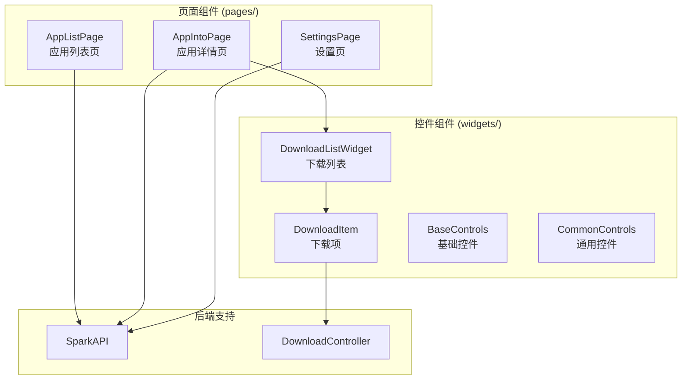
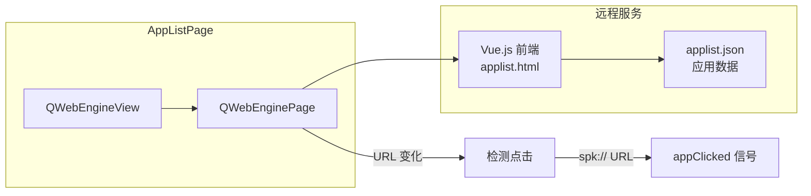
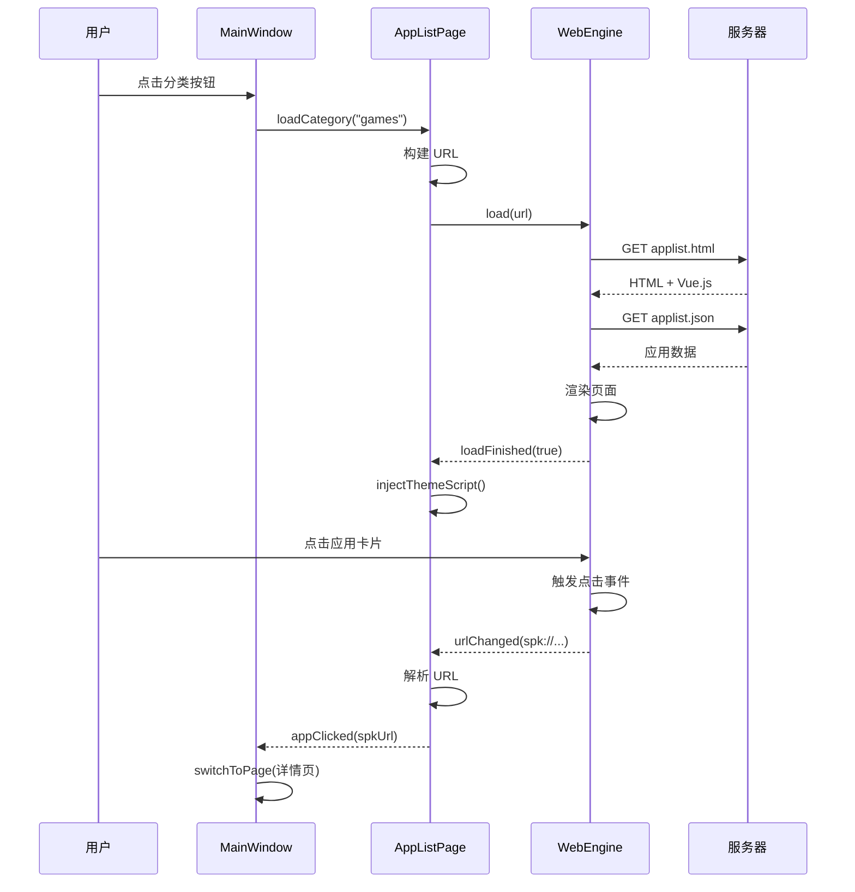
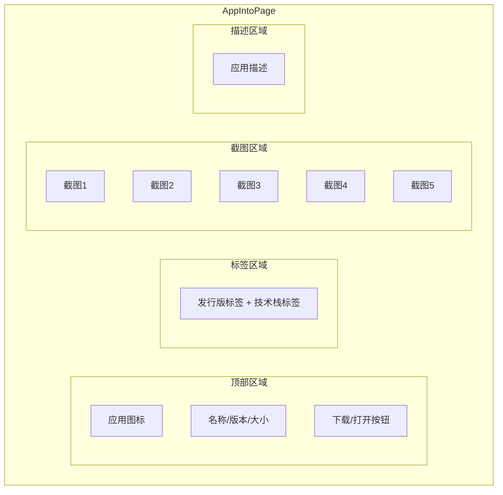
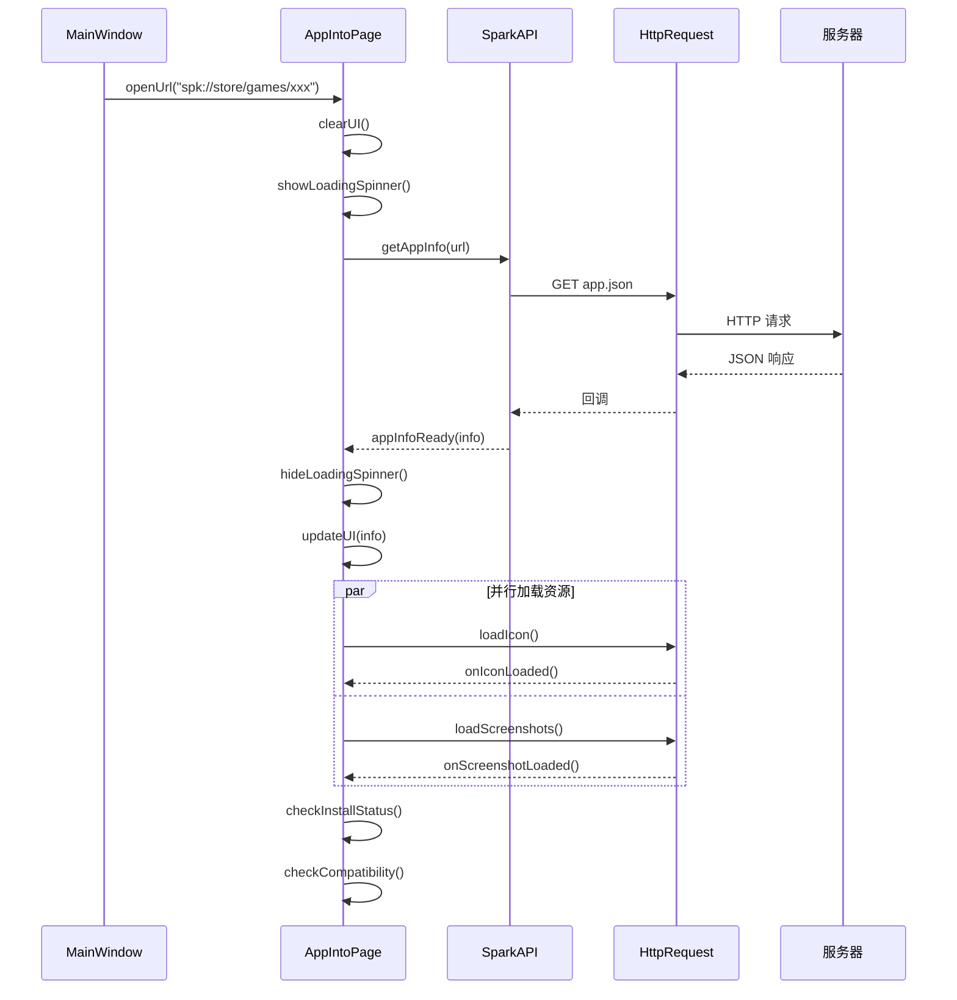
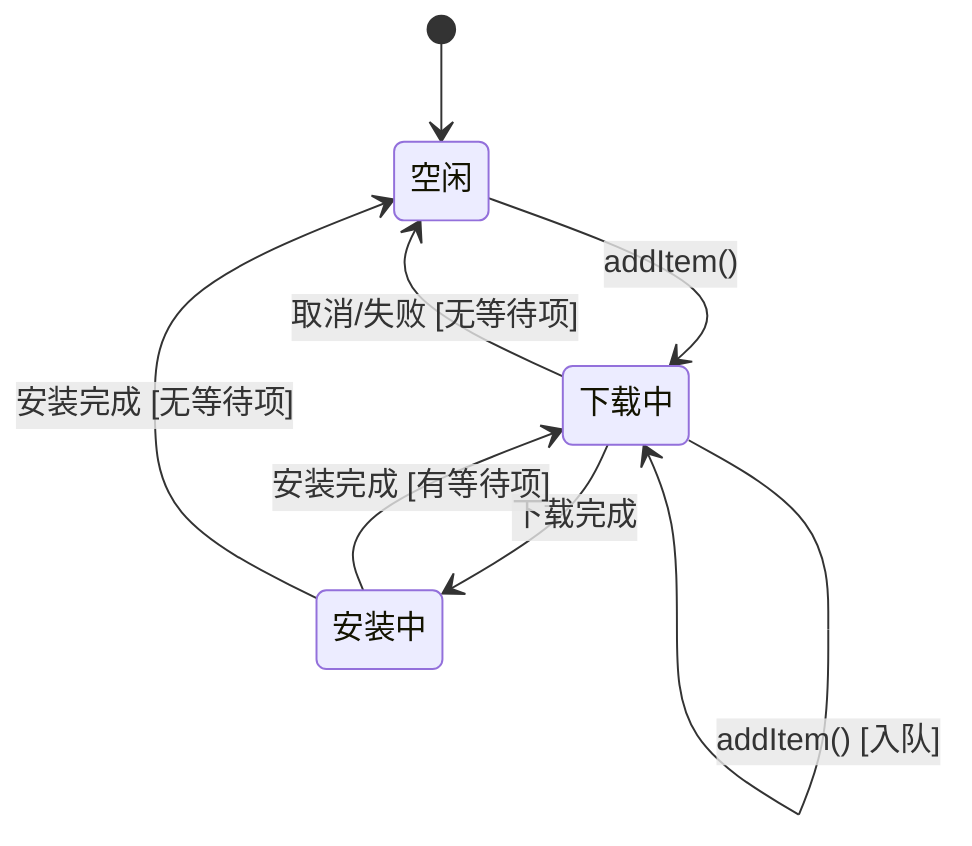
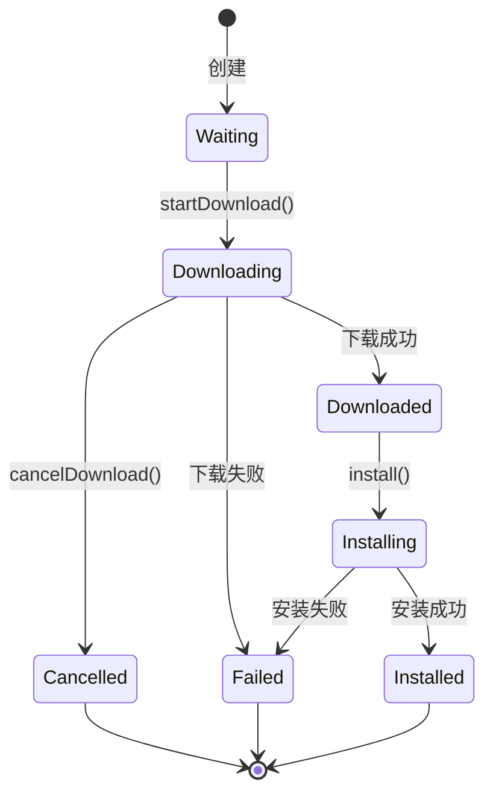
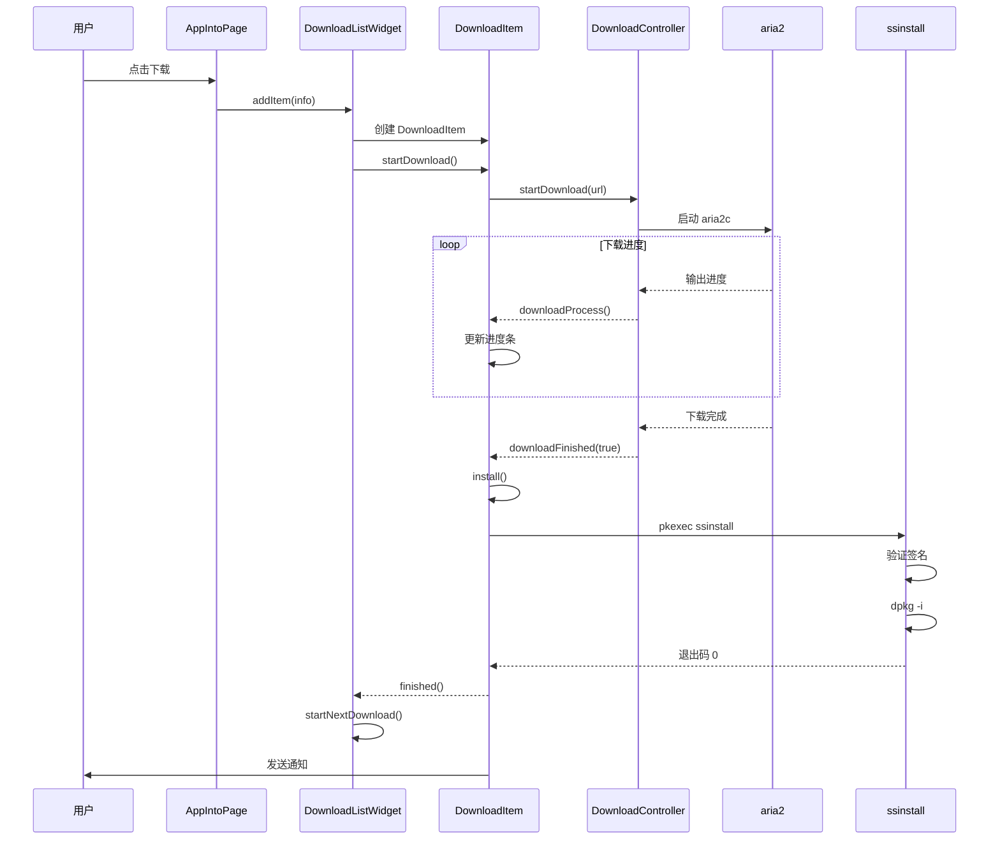

# 04 - 页面与控件

> 本文档详细介绍 Spark Store 的页面组件 (pages/) 和自定义控件 (widgets/)

## 模块概览



---

## AppListPage - 应用列表页

### 文件位置

`src/pages/applistpage.cpp` / `src/pages/applistpage.h`

### 功能概述

使用 QtWebEngine 加载远程 Vue.js 前端页面，展示应用列表。支持分类筛选和应用跳转。

### 类定义

```cpp
// 文件: src/pages/applistpage.h

class AppListPage : public QWidget {
    Q_OBJECT
    
public:
    explicit AppListPage(QWidget *parent = nullptr);
    
    void loadCategory(const QString &category);
    void setDarkMode(bool isDark);
    
signals:
    void appClicked(const QString &spkUrl);
    
private slots:
    void onUrlChanged(const QUrl &url);
    void onLoadFinished(bool ok);
    
private:
    void initWebEngine();
    void injectThemeScript();
    
private:
    QWebEngineView *m_webView;
    QWebEnginePage *m_page;
    QString m_currentCategory;
    bool m_isDarkMode;
};
```

### 架构图



### 核心实现

#### 初始化 WebEngine

```cpp
// 文件: src/pages/applistpage.cpp

void AppListPage::initWebEngine() {
    m_webView = new QWebEngineView(this);
    m_page = new QWebEnginePage(m_webView);
    
    // 配置 WebEngine
    QWebEngineSettings *settings = m_page->settings();
    settings->setAttribute(QWebEngineSettings::JavascriptEnabled, true);
    settings->setAttribute(QWebEngineSettings::LocalStorageEnabled, true);
    settings->setAttribute(QWebEngineSettings::ScrollAnimatorEnabled, true);
    
    m_webView->setPage(m_page);
    
    // 监听 URL 变化
    connect(m_page, &QWebEnginePage::urlChanged,
            this, &AppListPage::onUrlChanged);
    
    connect(m_page, &QWebEnginePage::loadFinished,
            this, &AppListPage::onLoadFinished);
    
    // 布局
    QVBoxLayout *layout = new QVBoxLayout(this);
    layout->setContentsMargins(0, 0, 0, 0);
    layout->addWidget(m_webView);
}
```

#### 加载分类

```cpp
// 文件: src/pages/applistpage.cpp

void AppListPage::loadCategory(const QString &category) {
    m_currentCategory = category;
    
    QString baseUrl = SparkAPI::getServerUrl();
    QString archDir = SparkAPI::getArchDir();
    
    // 构建 URL
    QString url;
    if (category.isEmpty()) {
        // 全部应用
        url = QString("%1/%2/applist.html").arg(baseUrl).arg(archDir);
    } else {
        // 特定分类
        url = QString("%1/%2/%3/applist.html")
              .arg(baseUrl).arg(archDir).arg(category);
    }
    
    // 添加主题参数
    url += QString("?theme=%1").arg(m_isDarkMode ? "dark" : "light");
    
    m_webView->load(QUrl(url));
}
```

**伪代码：**

```
loadCategory(category):
    baseUrl = SparkAPI.getServerUrl()
    archDir = SparkAPI.getArchDir()
    
    if category 为空:
        url = "{baseUrl}/{archDir}/applist.html"
    else:
        url = "{baseUrl}/{archDir}/{category}/applist.html"
    
    url += "?theme=" + (isDarkMode ? "dark" : "light")
    
    webView.load(url)
```

#### URL 变化检测

```cpp
// 文件: src/pages/applistpage.cpp

void AppListPage::onUrlChanged(const QUrl &url) {
    QString urlStr = url.toString();
    
    // 检测是否点击了应用
    // 前端会将点击重定向到 spk:// URL 或特定路径
    if (urlStr.startsWith("spk://")) {
        emit appClicked(urlStr);
        // 阻止导航，返回原页面
        m_webView->back();
    } 
    else if (urlStr.contains("/app.html")) {
        // 从 URL 解析应用信息
        QRegularExpression re(R"(/(\w+)/(\w+)/app\.html)");
        auto match = re.match(urlStr);
        if (match.hasMatch()) {
            QString category = match.captured(1);
            QString appname = match.captured(2);
            QString spkUrl = QString("spk://store/%1/%2")
                             .arg(category).arg(appname);
            emit appClicked(spkUrl);
            m_webView->back();
        }
    }
}
```

#### 主题注入

```cpp
// 文件: src/pages/applistpage.cpp

void AppListPage::setDarkMode(bool isDark) {
    m_isDarkMode = isDark;
    injectThemeScript();
}

void AppListPage::injectThemeScript() {
    QString script = QString(R"(
        (function() {
            document.documentElement.setAttribute('data-theme', '%1');
            document.body.classList.toggle('dark-mode', %2);
        })();
    )").arg(m_isDarkMode ? "dark" : "light")
       .arg(m_isDarkMode ? "true" : "false");
    
    m_page->runJavaScript(script);
}
```

### 页面加载流程



---

## AppIntoPage - 应用详情页

### 文件位置

`src/pages/appintopage.cpp` / `src/pages/appintopage.h`

### 功能概述

显示应用详细信息，包括图标、截图、描述、标签等。支持下载安装功能。

### 类定义

```cpp
// 文件: src/pages/appintopage.h

class AppIntoPage : public QWidget {
    Q_OBJECT
    
public:
    explicit AppIntoPage(QWidget *parent = nullptr);
    
    void openUrl(const QString &spkUrl);
    void loadAppInfo(const QJsonObject &info);
    
signals:
    void clickedDownloadBtn();
    void backRequested();
    
private slots:
    void onAppInfoReady(const QJsonObject &info);
    void onDownloadBtnClicked();
    void onIconLoaded(const QByteArray &data);
    void onScreenshotLoaded(int index, const QByteArray &data);
    
private:
    void initUI();
    void updateUI(const QJsonObject &info);
    void loadIcon(const QString &iconUrl);
    void loadScreenshots(const QJsonArray &screenshots);
    void checkInstallStatus();
    void showCompatibilityNotice();
    
private:
    // UI 组件
    QLabel *m_iconLabel;
    QLabel *m_nameLabel;
    QLabel *m_versionLabel;
    QLabel *m_descLabel;
    QLabel *m_sizeLabel;
    DPushButton *m_downloadBtn;
    DPushButton *m_openBtn;
    
    // 截图轮播
    QList<QLabel*> m_screenshotLabels;
    QHBoxLayout *m_screenshotLayout;
    
    // 标签
    DFlowLayout *m_tagLayout;
    
    // 数据
    QJsonObject m_appInfo;
    SparkAPI *m_api;
    HttpRequest *m_http;
};
```

### UI 布局



### 核心实现

#### 加载应用信息

```cpp
// 文件: src/pages/appintopage.cpp

void AppIntoPage::openUrl(const QString &spkUrl) {
    // 清空当前显示
    clearUI();
    
    // 显示加载状态
    showLoadingSpinner();
    
    // 请求应用信息
    m_api->getAppInfo(QUrl(spkUrl));
}

void AppIntoPage::onAppInfoReady(const QJsonObject &info) {
    m_appInfo = info;
    hideLoadingSpinner();
    updateUI(info);
}
```

#### 更新界面

```cpp
// 文件: src/pages/appintopage.cpp

void AppIntoPage::updateUI(const QJsonObject &info) {
    // 基本信息
    m_nameLabel->setText(info["Name"].toString());
    m_versionLabel->setText(info["Version"].toString());
    m_descLabel->setText(info["More"].toString());
    
    // 文件大小
    QString sizeStr = info["Size"].toString();
    m_sizeLabel->setText(formatSize(sizeStr));
    
    // 加载图标
    QString iconUrl = info["Icon"].toString();
    if (!iconUrl.isEmpty()) {
        loadIcon(iconUrl);
    }
    
    // 加载截图 (最多5张)
    QJsonArray screenshots = info["Screenshots"].toArray();
    loadScreenshots(screenshots);
    
    // 解析并显示标签
    QString tagsStr = info["Tags"].toString();
    updateTags(tagsStr);
    
    // 检查安装状态
    checkInstallStatus();
    
    // 兼容性检查
    checkCompatibility(info);
}
```

**伪代码：**

```
updateUI(info):
    # 设置基本信息
    nameLabel.text = info["Name"]
    versionLabel.text = info["Version"]
    descLabel.text = info["More"]
    sizeLabel.text = formatSize(info["Size"])
    
    # 异步加载图标
    if info["Icon"] 不为空:
        loadIcon(info["Icon"])
    
    # 异步加载截图 (最多5张)
    screenshots = info["Screenshots"]
    loadScreenshots(screenshots)
    
    # 解析标签
    updateTags(info["Tags"])
    
    # 检查是否已安装
    checkInstallStatus()
    
    # 检查兼容性
    checkCompatibility(info)
```

#### 标签系统

```cpp
// 文件: src/pages/appintopage.cpp

void AppIntoPage::updateTags(const QString &tagsStr) {
    // 清空现有标签
    QLayoutItem *item;
    while ((item = m_tagLayout->takeAt(0)) != nullptr) {
        delete item->widget();
        delete item;
    }
    
    // 标签映射表
    QMap<QString, QString> tagNames = {
        {"ubuntu", "Ubuntu"},
        {"deepin", "Deepin"},
        {"uos", "UOS"},
        {"debian", "Debian"},
        {"dtk5", "DTK 5"},
        {"dwine2", "Deepin Wine 2"},
        {"dwine5", "Deepin Wine 5"},
        {"a2d", "Android 兼容"},
        {"native", "原生应用"},
        {"amber-ce-bookworm", "ACE Bookworm"},
        {"amber-ce-trixie", "ACE Trixie"},
        {"amber-ce-deepin23", "ACE Deepin 23"},
        {"amber-ce-sid", "ACE Sid"}
    };
    
    // 标签颜色
    QMap<QString, QString> tagColors = {
        {"ubuntu", "#E95420"},
        {"deepin", "#0087FF"},
        {"uos", "#0087FF"},
        {"debian", "#A80030"},
        {"dtk5", "#0087FF"},
        {"native", "#4CAF50"},
        {"amber-ce-*", "#FF9800"}  // ACE 容器统一颜色
    };
    
    QStringList tags = tagsStr.split(",", Qt::SkipEmptyParts);
    
    for (const QString &tag : tags) {
        QString trimmed = tag.trimmed();
        
        DLabel *tagLabel = new DLabel(tagNames.value(trimmed, trimmed));
        tagLabel->setStyleSheet(QString(
            "background-color: %1;"
            "color: white;"
            "border-radius: 4px;"
            "padding: 2px 8px;"
        ).arg(getTagColor(trimmed, tagColors)));
        
        m_tagLayout->addWidget(tagLabel);
    }
}
```

**支持的标签：**

| 标签 | 类型 | 说明 |
|------|------|------|
| `ubuntu` | 发行版 | 支持 Ubuntu |
| `deepin` | 发行版 | 支持 Deepin |
| `uos` | 发行版 | 支持 UOS |
| `debian` | 发行版 | 支持 Debian |
| `dtk5` | 技术栈 | 使用 DTK 5 框架 |
| `dwine2` | 技术栈 | 使用 Deepin Wine 2 |
| `dwine5` | 技术栈 | 使用 Deepin Wine 5 |
| `a2d` | 技术栈 | Android 兼容层 |
| `native` | 技术栈 | 原生 Linux 应用 |
| `amber-ce-*` | 容器 | ACE 容器环境 |

#### 安装状态检测

```cpp
// 文件: src/pages/appintopage.cpp

void AppIntoPage::checkInstallStatus() {
    QString pkgName = m_appInfo["Pkgname"].toString();
    
    // 使用 dpkg 检查安装状态
    QProcess dpkg;
    dpkg.start("dpkg-query", {"-W", "-f=${Status}", pkgName});
    dpkg.waitForFinished(3000);
    
    QString output = dpkg.readAllStandardOutput();
    bool installed = output.contains("install ok installed");
    
    if (installed) {
        m_downloadBtn->hide();
        m_openBtn->show();
        
        // 获取 .desktop 文件路径
        findDesktopFile(pkgName);
    } else {
        m_downloadBtn->show();
        m_openBtn->hide();
    }
}
```

#### 下载按钮点击

```cpp
// 文件: src/pages/appintopage.cpp

void AppIntoPage::onDownloadBtnClicked() {
    // 触发抖动动画
    emit clickedDownloadBtn();
    
    // 构建下载信息
    QString filename = m_appInfo["Filename"].toString();
    QString pkgname = m_appInfo["Pkgname"].toString();
    QString name = m_appInfo["Name"].toString();
    QString author = m_appInfo["Author"].toString();
    QString iconUrl = m_appInfo["Icon"].toString();
    QString tags = m_appInfo["Tags"].toString();
    
    // 构建下载 URL
    QString baseUrl = SparkAPI::getServerUrl();
    QString archDir = SparkAPI::getArchDir();
    QString category = m_appInfo["category"].toString();
    
    QString downloadUrl = QString("%1/%2/%3/%4/%5")
                          .arg(baseUrl)
                          .arg(archDir)
                          .arg(category)
                          .arg(pkgname)
                          .arg(filename);
    
    // 检查 metalink
    QString metalinkUrl = downloadUrl + ".metalink";
    
    // 添加到下载列表
    DownloadListWidget::instance()->addItem(
        name,
        author,
        downloadUrl,
        filename,
        iconUrl,
        metalinkUrl,
        tags
    );
}
```

### 应用详情加载流程



---

## SettingsPage - 设置页

### 文件位置

`src/pages/settingspage.cpp` / `src/pages/settingspage.h`

### 功能概述

提供应用设置界面，包括服务器选择、缓存清理、偏好设置等。

### 类定义

```cpp
// 文件: src/pages/settingspage.h

class SettingsPage : public QWidget {
    Q_OBJECT
    
public:
    explicit SettingsPage(QWidget *parent = nullptr);
    
signals:
    void serverChanged(const QString &url);
    
private slots:
    void onServerSelected(int index);
    void onClearCacheClicked();
    void onClearWebCacheClicked();
    void onUpdateAptSourceClicked();
    void onExportLogsClicked();
    
private:
    void initUI();
    void loadServerList();
    void updateCacheSize();
    
private:
    DComboBox *m_serverCombo;
    DPushButton *m_clearCacheBtn;
    DPushButton *m_clearWebCacheBtn;
    DPushButton *m_updateAptBtn;
    DPushButton *m_exportLogsBtn;
    DSwitchButton *m_compatNotifySwitch;
    DSwitchButton *m_webSandboxSwitch;
    DLabel *m_cacheSizeLabel;
    
    QList<QPair<QString, QString>> m_servers;
};
```

### 设置项

| 设置项 | 类型 | 说明 |
|--------|------|------|
| 服务器选择 | 下拉框 | 选择镜像服务器 |
| 更新 APT 源 | 按钮 | 同步星火 APT 源 |
| 清理下载缓存 | 按钮 | 清理 /tmp/spark-store/ |
| 清理 WebEngine 缓存 | 按钮 | 清理浏览器缓存 |
| 兼容性通知 | 开关 | 应用不兼容时显示通知 |
| WebEngine 沙箱 | 开关 | 启用/禁用 Chromium 沙箱 |
| 导出日志 | 按钮 | 导出调试日志 |

### 核心实现

#### 加载服务器列表

```cpp
// 文件: src/pages/settingspage.cpp

void SettingsPage::loadServerList() {
    m_serverCombo->clear();
    m_servers.clear();
    
    // 从服务器获取列表
    QString url = QString("%1/server.json").arg(SparkAPI::getServerUrl());
    
    HttpRequest *http = new HttpRequest(this);
    http->get(url, [this, http](const QByteArray &data, bool success) {
        if (success) {
            QJsonDocument doc = QJsonDocument::fromJson(data);
            QJsonArray servers = doc.array();
            
            for (const QJsonValue &val : servers) {
                QJsonObject obj = val.toObject();
                QString name = obj["name"].toString();
                QString serverUrl = obj["url"].toString();
                
                m_servers.append({name, serverUrl});
                m_serverCombo->addItem(name);
            }
            
            // 选中当前服务器
            QString currentUrl = SparkAPI::getServerUrl();
            for (int i = 0; i < m_servers.size(); i++) {
                if (m_servers[i].second == currentUrl) {
                    m_serverCombo->setCurrentIndex(i);
                    break;
                }
            }
        }
        
        http->deleteLater();
    });
}
```

#### 清理缓存

```cpp
// 文件: src/pages/settingspage.cpp

void SettingsPage::onClearCacheClicked() {
    QString cachePath = "/tmp/spark-store/";
    QDir cacheDir(cachePath);
    
    if (cacheDir.exists()) {
        qint64 sizeBefore = calculateDirSize(cachePath);
        
        // 删除所有文件
        QStringList files = cacheDir.entryList(QDir::Files);
        for (const QString &file : files) {
            QFile::remove(cachePath + file);
        }
        
        // 显示清理结果
        QString sizeStr = formatSize(sizeBefore);
        Utils::sendNotification(
            "spark-store",
            tr("Cache Cleared"),
            tr("Freed %1 of disk space").arg(sizeStr)
        );
        
        updateCacheSize();
    }
}

void SettingsPage::onClearWebCacheClicked() {
    // QtWebEngine 缓存路径
    QString webCachePath = QStandardPaths::writableLocation(
        QStandardPaths::CacheLocation) + "/QtWebEngine";
    
    QDir webCacheDir(webCachePath);
    if (webCacheDir.exists()) {
        webCacheDir.removeRecursively();
        
        Utils::sendNotification(
            "spark-store",
            tr("WebEngine Cache Cleared"),
            tr("Browser cache has been cleared")
        );
    }
}
```

#### 更新 APT 源

```cpp
// 文件: src/pages/settingspage.cpp

void SettingsPage::onUpdateAptSourceClicked() {
    // 使用 aptss 工具更新
    QProcess *process = new QProcess(this);
    
    connect(process, QOverload<int, QProcess::ExitStatus>::of(&QProcess::finished),
            this, [this, process](int exitCode, QProcess::ExitStatus) {
        if (exitCode == 0) {
            Utils::sendNotification(
                "spark-store",
                tr("APT Source Updated"),
                tr("Spark Store APT source has been updated")
            );
        } else {
            Utils::sendNotification(
                "spark-store",
                tr("Update Failed"),
                tr("Failed to update APT source")
            );
        }
        process->deleteLater();
    });
    
    process->start("pkexec", {
        "/opt/durapps/spark-store/bin/aptss",
        "ssupdate"
    });
}
```

---

## DownloadListWidget - 下载列表控件

### 文件位置

`src/widgets/downloadlistwidget.cpp` / `src/widgets/downloadlistwidget.h`

### 功能概述

管理下载队列，显示下载进度，控制下载顺序。

### 类定义

```cpp
// 文件: src/widgets/downloadlistwidget.h

class DownloadListWidget : public DWidget {
    Q_OBJECT
    
public:
    static DownloadListWidget* instance();
    
    void addItem(const QString &name,
                 const QString &author,
                 const QString &url,
                 const QString &filename,
                 const QString &iconUrl,
                 const QString &metalinkUrl,
                 const QString &tags);
    
    bool hasActiveDownloads() const;
    int itemCount() const;
    
signals:
    void downloadStarted();
    void allDownloadsFinished();
    
private slots:
    void onItemFinished(DownloadItem *item);
    void startNextDownload();
    
private:
    explicit DownloadListWidget(QWidget *parent = nullptr);
    
    QVBoxLayout *m_layout;
    QList<DownloadItem*> m_items;
    DownloadItem *m_currentDownload;
    
    static DownloadListWidget *s_instance;
};
```

### 下载队列管理



### 核心实现

#### 添加下载项

```cpp
// 文件: src/widgets/downloadlistwidget.cpp

void DownloadListWidget::addItem(const QString &name,
                                  const QString &author,
                                  const QString &url,
                                  const QString &filename,
                                  const QString &iconUrl,
                                  const QString &metalinkUrl,
                                  const QString &tags) {
    // 检查是否已存在
    for (DownloadItem *item : m_items) {
        if (item->filename() == filename) {
            // 已存在，高亮显示
            item->highlight();
            return;
        }
    }
    
    // 创建新下载项
    DownloadItem *item = new DownloadItem(this);
    item->setInfo(name, author, url, filename, iconUrl, metalinkUrl, tags);
    
    connect(item, &DownloadItem::finished,
            this, &DownloadListWidget::onItemFinished);
    connect(item, &DownloadItem::cancelled,
            this, [this, item]() {
        m_items.removeOne(item);
        item->deleteLater();
        startNextDownload();
    });
    
    m_layout->addWidget(item);
    m_items.append(item);
    
    // 如果没有正在下载的任务，开始下载
    if (m_currentDownload == nullptr) {
        startNextDownload();
    }
}
```

#### 顺序下载控制

```cpp
// 文件: src/widgets/downloadlistwidget.cpp

void DownloadListWidget::startNextDownload() {
    // 查找下一个待下载项
    for (DownloadItem *item : m_items) {
        if (item->status() == DownloadItem::Waiting) {
            m_currentDownload = item;
            item->startDownload();
            emit downloadStarted();
            return;
        }
    }
    
    // 没有待下载项
    m_currentDownload = nullptr;
    
    // 检查是否全部完成
    bool allFinished = true;
    for (DownloadItem *item : m_items) {
        if (item->status() != DownloadItem::Installed &&
            item->status() != DownloadItem::Failed) {
            allFinished = false;
            break;
        }
    }
    
    if (allFinished && !m_items.isEmpty()) {
        emit allDownloadsFinished();
    }
}

void DownloadListWidget::onItemFinished(DownloadItem *item) {
    if (item == m_currentDownload) {
        m_currentDownload = nullptr;
    }
    startNextDownload();
}
```

**伪代码：**

```
startNextDownload():
    for item in m_items:
        if item.status == Waiting:
            m_currentDownload = item
            item.startDownload()
            emit downloadStarted()
            return
    
    m_currentDownload = null
    
    # 检查是否全部完成
    allFinished = true
    for item in m_items:
        if item.status not in [Installed, Failed]:
            allFinished = false
            break
    
    if allFinished and m_items 非空:
        emit allDownloadsFinished()
```

---

## DownloadItem - 下载项控件

### 文件位置

`src/widgets/downloaditem.cpp` / `src/widgets/downloaditem.h`

### 类定义

```cpp
// 文件: src/widgets/downloaditem.h

class DownloadItem : public DFrame {
    Q_OBJECT
    
public:
    enum Status {
        Waiting = 0,    // 等待下载
        Downloading,    // 下载中
        Downloaded,     // 下载完成
        Installing,     // 安装中
        Installed,      // 已安装
        Failed,         // 失败
        Cancelled       // 已取消
    };
    
    explicit DownloadItem(QWidget *parent = nullptr);
    
    void setInfo(const QString &name, ...);
    void startDownload();
    void cancelDownload();
    void install();
    
    Status status() const;
    QString filename() const;
    void highlight();
    
signals:
    void finished(DownloadItem *item);
    void cancelled(DownloadItem *item);
    
private slots:
    void onDownloadProgress(qint64 received, qint64 total, double speed);
    void onDownloadFinished(bool success, const QString &filePath);
    void onInstallFinished(int exitCode);
    
private:
    void updateProgressUI(qint64 received, qint64 total, double speed);
    void updateStatusUI();
    QString getInstallArgs() const;
    
private:
    // UI 组件
    QLabel *m_iconLabel;
    QLabel *m_nameLabel;
    QLabel *m_statusLabel;
    DProgressBar *m_progressBar;
    DIconButton *m_cancelBtn;
    
    // 数据
    QString m_name;
    QString m_url;
    QString m_filename;
    QString m_metalinkUrl;
    QString m_filePath;
    QString m_tags;
    Status m_status;
    
    // 安装锁
    static bool s_installing;
};
```

### 状态流转



### 核心实现

#### 开始下载

```cpp
// 文件: src/widgets/downloaditem.cpp

void DownloadItem::startDownload() {
    m_status = Downloading;
    updateStatusUI();
    
    // 获取下载控制器
    DownloadController *dc = DownloadController::instance();
    
    connect(dc, &DownloadController::downloadProcess,
            this, &DownloadItem::onDownloadProgress);
    connect(dc, &DownloadController::downloadFinished,
            this, &DownloadItem::onDownloadFinished);
    
    // 开始下载
    dc->startDownload(m_url, m_filename, m_metalinkUrl);
}

void DownloadItem::onDownloadProgress(qint64 received, qint64 total, double speed) {
    int percent = (total > 0) ? (received * 100 / total) : 0;
    
    m_progressBar->setValue(percent);
    m_statusLabel->setText(tr("Downloading: %1% (%2/s)")
                           .arg(percent)
                           .arg(formatSpeed(speed)));
}

void DownloadItem::onDownloadFinished(bool success, const QString &filePath) {
    // 断开信号连接
    DownloadController *dc = DownloadController::instance();
    disconnect(dc, nullptr, this, nullptr);
    
    if (success) {
        m_status = Downloaded;
        m_filePath = filePath;
        m_progressBar->setValue(100);
        
        // 自动开始安装
        install();
    } else {
        m_status = Failed;
        m_statusLabel->setText(tr("Download failed"));
        emit finished(this);
    }
    
    updateStatusUI();
}
```

#### 安装应用

```cpp
// 文件: src/widgets/downloaditem.cpp

bool DownloadItem::s_installing = false;

void DownloadItem::install() {
    // 安装锁 - 防止并发安装
    if (s_installing) {
        // 等待当前安装完成后重试
        QTimer::singleShot(1000, this, &DownloadItem::install);
        return;
    }
    
    s_installing = true;
    m_status = Installing;
    m_statusLabel->setText(tr("Installing..."));
    updateStatusUI();
    
    // 构建安装参数
    QStringList args = getInstallArgs();
    
    QProcess *process = new QProcess(this);
    
    connect(process, QOverload<int, QProcess::ExitStatus>::of(&QProcess::finished),
            this, [this, process](int exitCode, QProcess::ExitStatus) {
        onInstallFinished(exitCode);
        process->deleteLater();
    });
    
    // 使用 pkexec 提权
    process->start("pkexec", args);
}

QStringList DownloadItem::getInstallArgs() const {
    QStringList args;
    args << "/opt/durapps/spark-store/bin/ssinstall";
    args << m_filePath;
    
    // 根据标签选择安装方式
    if (m_tags.contains("native")) {
        args << "--native";
    } else if (m_tags.contains("amber-ce-bookworm")) {
        args << "--amber-ce-bookworm";
    } else if (m_tags.contains("amber-ce-trixie")) {
        args << "--amber-ce-trixie";
    } else if (m_tags.contains("amber-ce-deepin23")) {
        args << "--amber-ce-deepin23";
    } else if (m_tags.contains("amber-ce-sid")) {
        args << "--amber-ce-sid";
    }
    
    // 安装后删除包
    args << "--delete-after-install";
    
    return args;
}

void DownloadItem::onInstallFinished(int exitCode) {
    s_installing = false;
    
    if (exitCode == 0) {
        m_status = Installed;
        m_statusLabel->setText(tr("Installed"));
        m_progressBar->hide();
        
        Utils::sendNotification(
            "spark-store",
            tr("Installation Complete"),
            tr("%1 has been installed").arg(m_name)
        );
    } else {
        m_status = Failed;
        m_statusLabel->setText(tr("Installation failed"));
    }
    
    updateStatusUI();
    emit finished(this);
}
```

### 下载安装完整流程



---

[上一篇: 后端模块](03-后端模块.md) | [返回目录](README.md) | [下一篇: D-Bus 接口](05-DBus接口.md)
