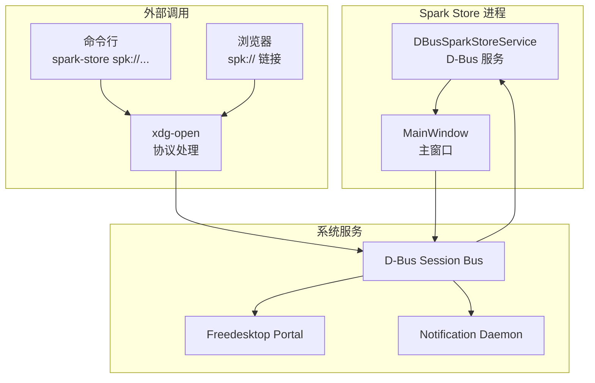
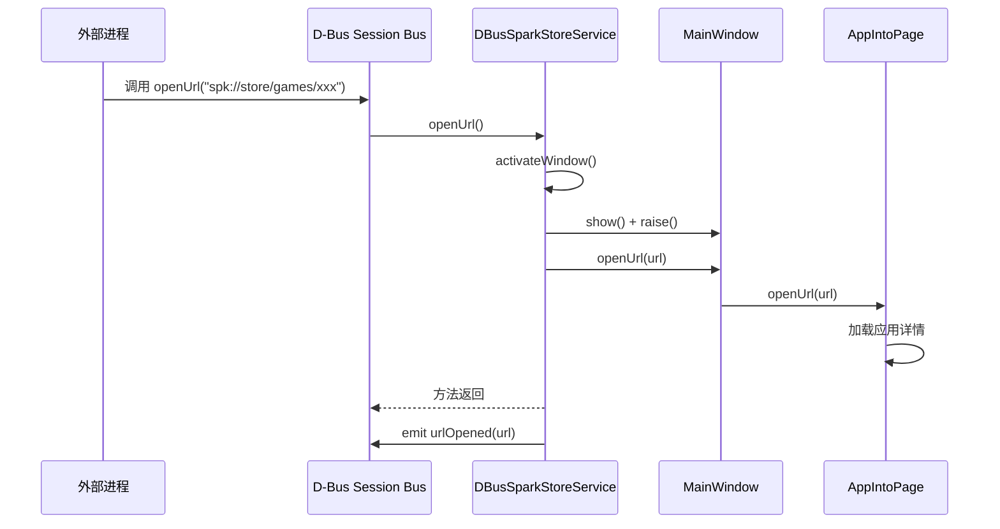
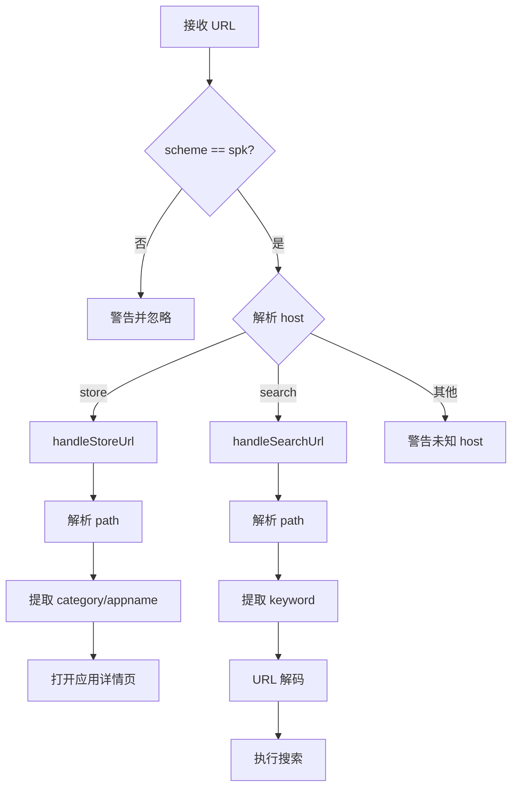
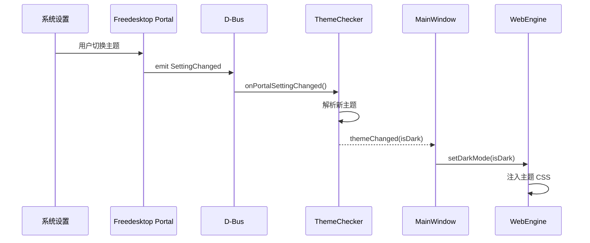
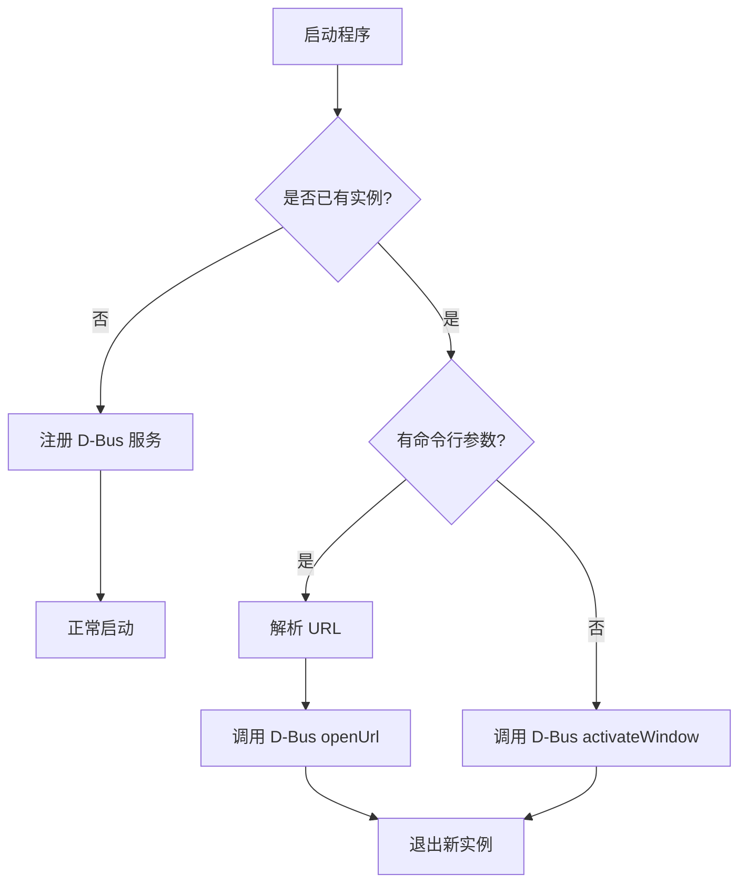

# 05 - D-Bus 接口

> 本文档详细介绍 Spark Store 的 D-Bus 服务接口和 SPK URL 协议

## 概述

Spark Store 通过 D-Bus 提供进程间通信能力，支持：
- 单实例控制
- URL 协议处理
- 系统通知发送
- 主题变化监听



---

## DBusSparkStoreService - D-Bus 服务

### 文件位置

`src/dbus/dbussparkstoreservice.cpp` / `src/dbus/dbussparkstoreservice.h`

### 服务信息

| 属性 | 值 |
|------|-----|
| 服务名 | `store.spark.dbus` |
| 对象路径 | `/store/spark/dbus` |
| 接口 | `store.spark.dbus` |

### 类定义

```cpp
// 文件: src/dbus/dbussparkstoreservice.h

class DBusSparkStoreService : public QObject {
    Q_OBJECT
    Q_CLASSINFO("D-Bus Interface", "store.spark.dbus")
    
public:
    explicit DBusSparkStoreService(MainWindow *mainWindow, 
                                    QObject *parent = nullptr);
    
public slots:
    // D-Bus 可调用方法
    Q_SCRIPTABLE void openUrl(const QString &url);
    Q_SCRIPTABLE void activateWindow();
    Q_SCRIPTABLE QString getVersion();
    Q_SCRIPTABLE bool isDownloading();
    
signals:
    // D-Bus 信号
    void urlOpened(const QString &url);
    
private:
    MainWindow *m_mainWindow;
};
```

### D-Bus 接口定义 (XML)

```xml
<!-- store.spark.dbus.xml -->
<!DOCTYPE node PUBLIC "-//freedesktop//DTD D-BUS Object Introspection 1.0//EN"
 "http://www.freedesktop.org/standards/dbus/1.0/introspect.dtd">
<node>
  <interface name="store.spark.dbus">
    <!-- 方法 -->
    <method name="openUrl">
      <arg name="url" type="s" direction="in"/>
    </method>
    
    <method name="activateWindow">
    </method>
    
    <method name="getVersion">
      <arg name="version" type="s" direction="out"/>
    </method>
    
    <method name="isDownloading">
      <arg name="downloading" type="b" direction="out"/>
    </method>
    
    <!-- 信号 -->
    <signal name="urlOpened">
      <arg name="url" type="s"/>
    </signal>
  </interface>
</node>
```

### 核心实现

#### 服务注册

```cpp
// 文件: src/mainwindow-dtk.cpp

void MainWindow::initDbus() {
    // 创建服务实例
    DBusSparkStoreService *service = new DBusSparkStoreService(this, this);
    
    // 注册到 Session Bus
    QDBusConnection sessionBus = QDBusConnection::sessionBus();
    
    // 注册服务名
    if (!sessionBus.registerService("store.spark.dbus")) {
        qWarning() << "Failed to register D-Bus service:"
                   << sessionBus.lastError().message();
        return;
    }
    
    // 注册对象
    if (!sessionBus.registerObject("/store/spark/dbus", 
                                    service,
                                    QDBusConnection::ExportScriptableSlots |
                                    QDBusConnection::ExportScriptableSignals)) {
        qWarning() << "Failed to register D-Bus object:"
                   << sessionBus.lastError().message();
    }
}
```

#### 方法实现

```cpp
// 文件: src/dbus/dbussparkstoreservice.cpp

void DBusSparkStoreService::openUrl(const QString &url) {
    // 激活窗口
    activateWindow();
    
    // 处理 URL
    if (url.startsWith("spk://")) {
        m_mainWindow->openUrl(url);
        emit urlOpened(url);
    }
}

void DBusSparkStoreService::activateWindow() {
    m_mainWindow->show();
    m_mainWindow->raise();
    m_mainWindow->activateWindow();
    
    // X11 下额外处理
    if (!Utils::isWayland()) {
        // 使用 _NET_ACTIVE_WINDOW 协议
        QWindow *window = m_mainWindow->windowHandle();
        if (window) {
            // ... X11 激活代码
        }
    }
}

QString DBusSparkStoreService::getVersion() {
    return APP_VERSION;
}

bool DBusSparkStoreService::isDownloading() {
    return DownloadListWidget::instance()->hasActiveDownloads();
}
```

### 调用流程



---

## SPK URL 协议

### 协议格式

```
spk://host/path

支持的格式:
- spk://store/{category}/{appname}    打开应用详情
- spk://search/{keyword}              搜索应用
```

### 协议注册

#### .desktop 文件

```ini
# /usr/share/applications/spark-store.desktop

[Desktop Entry]
Name=Spark Store
Name[zh_CN]=星火应用商店
Exec=/opt/durapps/spark-store/bin/spark-store %u
Icon=spark-store
Type=Application
Categories=System;
MimeType=x-scheme-handler/spk;
StartupWMClass=spark-store
```

#### MIME 类型注册

```bash
# postinst 脚本中执行
xdg-mime default spark-store.desktop x-scheme-handler/spk
update-desktop-database
```

### URL 解析

```cpp
// 文件: src/mainwindow-dtk.cpp

void MainWindow::openUrl(const QString &urlStr) {
    QUrl url(urlStr);
    
    if (url.scheme() != "spk") {
        qWarning() << "Invalid URL scheme:" << url.scheme();
        return;
    }
    
    QString host = url.host();
    QString path = url.path();
    
    if (host == "store") {
        // spk://store/category/appname
        handleStoreUrl(path);
    } else if (host == "search") {
        // spk://search/keyword
        handleSearchUrl(path);
    } else {
        qWarning() << "Unknown URL host:" << host;
    }
}

void MainWindow::handleStoreUrl(const QString &path) {
    // 路径格式: /category/appname
    QStringList parts = path.split("/", Qt::SkipEmptyParts);
    
    if (parts.size() >= 2) {
        QString category = parts[0];
        QString appname = parts[1];
        
        // 切换到详情页
        m_appIntoPage->openUrl(QString("spk://store/%1/%2")
                               .arg(category).arg(appname));
        switchToPage(AppPageAppdetail);
    }
}

void MainWindow::handleSearchUrl(const QString &path) {
    // 路径格式: /keyword
    QString keyword = path.mid(1);  // 去掉开头的 /
    keyword = QUrl::fromPercentEncoding(keyword.toUtf8());
    
    m_searchEdit->setText(keyword);
    onSearch();
}
```

### URL 解析流程



---

## 系统通知

### 通知服务

Spark Store 使用 Freedesktop Notifications 规范发送系统通知。

### 接口信息

| 属性 | 值 |
|------|-----|
| 服务名 | `org.freedesktop.Notifications` |
| 对象路径 | `/org/freedesktop/Notifications` |
| 接口 | `org.freedesktop.Notifications` |

### 实现

```cpp
// 文件: src/utils/utils.cpp

void Utils::sendNotification(const QString &icon,
                              const QString &title,
                              const QString &body) {
    QDBusInterface notify(
        "org.freedesktop.Notifications",
        "/org/freedesktop/Notifications",
        "org.freedesktop.Notifications",
        QDBusConnection::sessionBus()
    );
    
    if (!notify.isValid()) {
        qWarning() << "Notification service not available";
        return;
    }
    
    // Notify 方法参数
    QList<QVariant> args;
    args << "spark-store"           // app_name: 应用名称
         << (uint)0                 // replaces_id: 替换通知ID (0=新通知)
         << icon                    // app_icon: 图标名称或路径
         << title                   // summary: 标题
         << body                    // body: 内容
         << QStringList()           // actions: 操作按钮
         << QVariantMap()           // hints: 提示信息
         << (int)5000;              // expire_timeout: 超时时间(ms)
    
    notify.callWithArgumentList(QDBus::NoBlock, "Notify", args);
}
```

### 通知场景

| 场景 | 图标 | 标题 | 内容 |
|------|------|------|------|
| 下载完成 | spark-store | 下载完成 | {应用名} 已下载完成 |
| 安装完成 | spark-store | 安装完成 | {应用名} 已安装 |
| 安装失败 | dialog-error | 安装失败 | {应用名} 安装失败 |
| 最小化到托盘 | spark-store | 星火应用商店 | 已最小化到系统托盘，下载将在后台继续 |
| 缓存清理 | spark-store | 缓存已清理 | 已释放 {大小} 磁盘空间 |
| 兼容性警告 | dialog-warning | 兼容性警告 | {应用名} 可能不支持您的系统 |

---

## 主题监听

### Freedesktop Portal

Spark Store 通过 Freedesktop Portal 监听系统主题变化。

### 接口信息

| 属性 | 值 |
|------|-----|
| 服务名 | `org.freedesktop.portal.Desktop` |
| 对象路径 | `/org/freedesktop/portal/desktop` |
| 接口 | `org.freedesktop.portal.Settings` |

### 实现

```cpp
// 文件: src/backend/ThemeChecker.cpp

void ThemeChecker::initDBusConnection() {
    QDBusConnection sessionBus = QDBusConnection::sessionBus();
    
    // 连接 SettingChanged 信号
    sessionBus.connect(
        "org.freedesktop.portal.Desktop",        // 服务名
        "/org/freedesktop/portal/desktop",       // 对象路径
        "org.freedesktop.portal.Settings",       // 接口
        "SettingChanged",                        // 信号名
        this,
        SLOT(onPortalSettingChanged(QString, QString, QDBusVariant))
    );
    
    // 初始化接口用于查询
    m_portalInterface = new QDBusInterface(
        "org.freedesktop.portal.Desktop",
        "/org/freedesktop/portal/desktop",
        "org.freedesktop.portal.Settings",
        sessionBus,
        this
    );
    
    // 查询当前主题
    checkCurrentTheme();
}

void ThemeChecker::checkCurrentTheme() {
    QDBusMessage reply = m_portalInterface->call(
        "Read",
        "org.freedesktop.appearance",
        "color-scheme"
    );
    
    if (reply.type() == QDBusMessage::ReplyMessage) {
        QVariant value = reply.arguments().at(0);
        // 解包 QDBusVariant
        QDBusVariant dbusVar = value.value<QDBusVariant>();
        int scheme = dbusVar.variant().toInt();
        
        // 0 = 无偏好, 1 = 暗色, 2 = 亮色
        m_isDark = (scheme == 1);
    }
}

void ThemeChecker::onPortalSettingChanged(const QString &namespace_,
                                           const QString &key,
                                           const QDBusVariant &value) {
    if (namespace_ == "org.freedesktop.appearance" && 
        key == "color-scheme") {
        int scheme = value.variant().toInt();
        bool isDark = (scheme == 1);
        
        if (isDark != m_isDark) {
            m_isDark = isDark;
            emit themeChanged(m_isDark);
        }
    }
}
```

### 主题值含义

| 值 | 含义 |
|----|------|
| 0 | 无偏好 (跟随系统默认) |
| 1 | 暗色主题 |
| 2 | 亮色主题 |

### 主题切换流程



---

## 命令行调用

### 从终端调用 D-Bus

```bash
# 打开应用详情
dbus-send --session \
    --dest=store.spark.dbus \
    --type=method_call \
    /store/spark/dbus \
    store.spark.dbus.openUrl \
    string:"spk://store/games/spark-store"

# 激活窗口
dbus-send --session \
    --dest=store.spark.dbus \
    --type=method_call \
    /store/spark/dbus \
    store.spark.dbus.activateWindow

# 获取版本
dbus-send --session \
    --dest=store.spark.dbus \
    --type=method_call \
    --print-reply \
    /store/spark/dbus \
    store.spark.dbus.getVersion

# 查询下载状态
dbus-send --session \
    --dest=store.spark.dbus \
    --type=method_call \
    --print-reply \
    /store/spark/dbus \
    store.spark.dbus.isDownloading
```

### 使用 qdbus 工具

```bash
# 列出可用方法
qdbus store.spark.dbus /store/spark/dbus

# 调用方法
qdbus store.spark.dbus /store/spark/dbus openUrl "spk://store/games/xxx"
qdbus store.spark.dbus /store/spark/dbus activateWindow
qdbus store.spark.dbus /store/spark/dbus getVersion
qdbus store.spark.dbus /store/spark/dbus isDownloading
```

### 使用 busctl (systemd)

```bash
# 内省接口
busctl --user introspect store.spark.dbus /store/spark/dbus

# 调用方法
busctl --user call store.spark.dbus /store/spark/dbus \
    store.spark.dbus openUrl s "spk://store/games/xxx"
```

---

## 单实例控制

### 实现机制

使用 DTK 的 `setSingleInstance` 方法实现单实例控制。

```cpp
// 文件: src/application.cpp

Application::Application(int &argc, char **argv)
    : DApplication(argc, argv)
{
    // 设置单实例标识符
    if (!setSingleInstance("spark-store")) {
        // 已有实例运行，通过 D-Bus 传递参数
        if (argc > 1) {
            QString url = QString::fromLocal8Bit(argv[1]);
            QDBusInterface iface(
                "store.spark.dbus",
                "/store/spark/dbus",
                "store.spark.dbus",
                QDBusConnection::sessionBus()
            );
            
            if (iface.isValid()) {
                iface.call("openUrl", url);
            }
        } else {
            // 仅激活窗口
            QDBusInterface iface(
                "store.spark.dbus",
                "/store/spark/dbus",
                "store.spark.dbus",
                QDBusConnection::sessionBus()
            );
            
            if (iface.isValid()) {
                iface.call("activateWindow");
            }
        }
        
        // 退出新实例
        exit(0);
    }
}
```

### 单实例流程



---

[上一篇: 页面与控件](04-页面与控件.md) | [返回目录](README.md) | [下一篇: 辅助工具](06-辅助工具.md)
