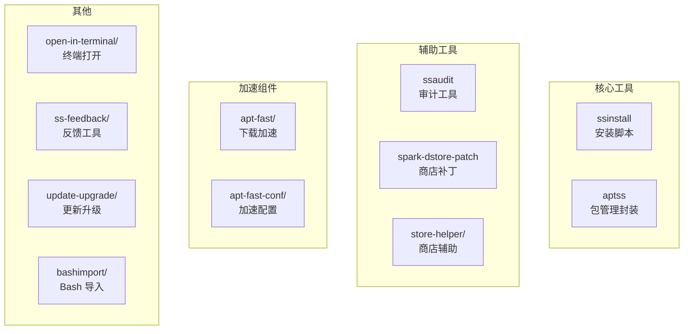
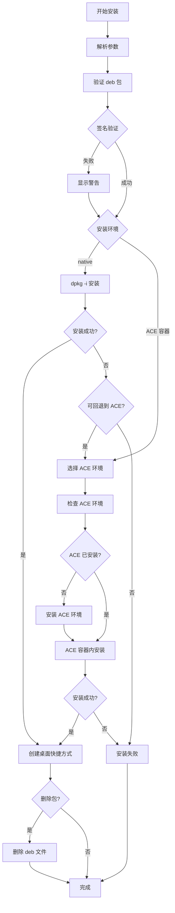
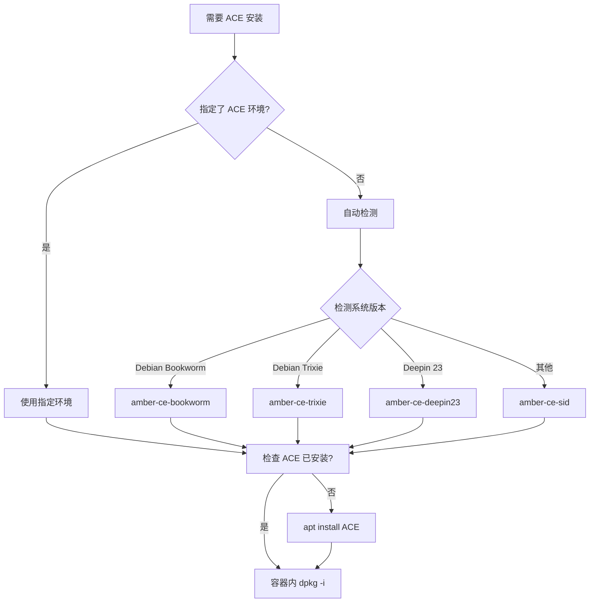
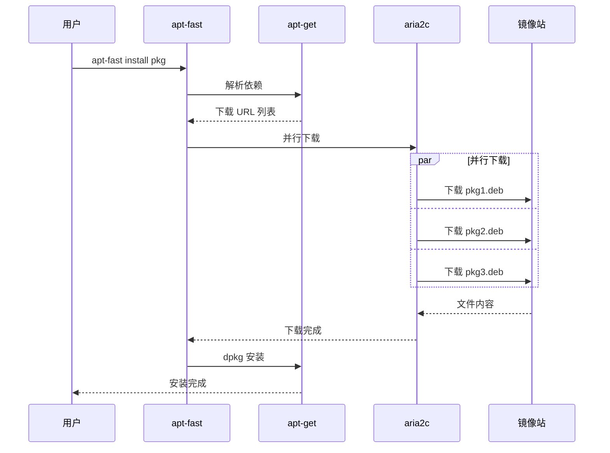
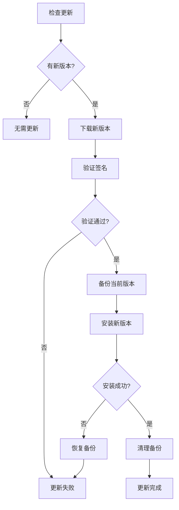
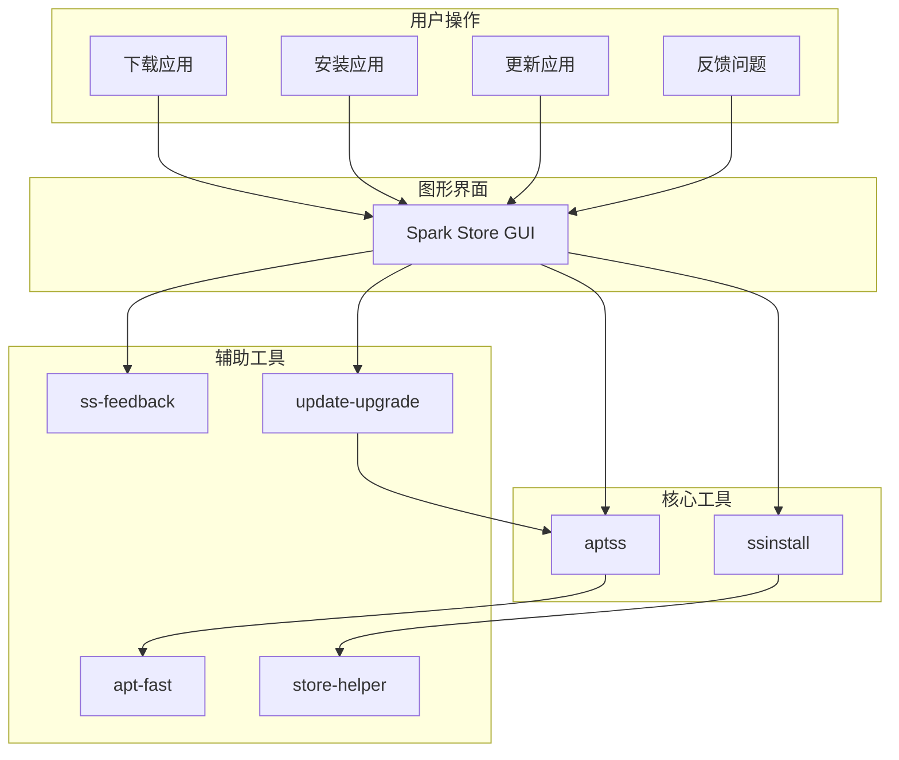

# 06 - 辅助工具

> 本文档详细介绍 Spark Store 的工具脚本集合 (tool/ 目录)

## 工具概览



---

## ssinstall - 核心安装脚本

### 文件位置

`tool/ssinstall`

### 功能概述

ssinstall 是 Spark Store 的核心安装脚本，负责：
- deb 包签名验证
- 多环境安装支持 (原生/ACE 容器)
- 桌面快捷方式创建
- 安装失败自动回退

### 使用方法

```bash
ssinstall <deb_file> [options]

选项:
  --delete-after-install    安装后删除包文件
  --native                  强制使用原生安装
  --no-create-desktop-entry 不创建桌面快捷方式
  --amber-ce-bookworm       使用 ACE Bookworm 环境
  --amber-ce-trixie         使用 ACE Trixie 环境
  --amber-ce-deepin23       使用 ACE Deepin 23 环境
  --amber-ce-sid            使用 ACE Sid 环境
```

### 安装流程



### 核心实现

#### 签名验证

```bash
# 文件: tool/ssinstall

verify_signature() {
    local deb_file="$1"
    local sig_file="${deb_file}.sig"
    local pubkey="/opt/durapps/spark-store/bin/spark-store.asc"
    
    # 检查签名文件是否存在
    if [ ! -f "$sig_file" ]; then
        # 从包内提取签名
        local sha512_file
        sha512_file=$(dpkg-deb --ctrl-tarfile "$deb_file" | \
                      tar -xOf - ./sha512sums 2>/dev/null)
        
        if [ -z "$sha512_file" ]; then
            echo "警告: 无法验证包签名"
            return 1
        fi
    fi
    
    # 验证 SHA512 哈希
    local expected_hash actual_hash
    expected_hash=$(cat "$sig_file" 2>/dev/null || echo "$sha512_file")
    actual_hash=$(sha512sum "$deb_file" | cut -d' ' -f1)
    
    if [ "$expected_hash" = "$actual_hash" ]; then
        echo "签名验证成功"
        return 0
    else
        echo "警告: 签名验证失败"
        return 1
    fi
}
```

**伪代码：**

```
verify_signature(deb_file):
    sig_file = deb_file + ".sig"
    
    if not exists(sig_file):
        # 尝试从 deb 包内提取签名
        sha512_file = extract_from_deb(deb_file, "sha512sums")
        if sha512_file is empty:
            warn("无法验证包签名")
            return false
    
    expected_hash = read(sig_file) or sha512_file
    actual_hash = sha512sum(deb_file)
    
    if expected_hash == actual_hash:
        print("签名验证成功")
        return true
    else:
        warn("签名验证失败")
        return false
```

#### 原生安装

```bash
# 文件: tool/ssinstall

install_native() {
    local deb_file="$1"
    
    echo "正在安装: $deb_file"
    
    # 使用文件锁防止并发
    exec 200>/var/lock/ssinstall.lock
    flock -x 200
    
    # 执行安装
    if dpkg -i "$deb_file"; then
        echo "安装成功"
        flock -u 200
        return 0
    else
        echo "dpkg 安装失败，尝试修复依赖..."
        apt-get -f install -y
        
        # 重试安装
        if dpkg -i "$deb_file"; then
            echo "安装成功"
            flock -u 200
            return 0
        fi
    fi
    
    flock -u 200
    return 1
}
```

#### ACE 容器安装

```bash
# 文件: tool/ssinstall

install_ace() {
    local deb_file="$1"
    local ace_env="$2"  # bookworm, trixie, deepin23, sid
    
    local ace_name="amber-ce-${ace_env}"
    
    # 检查 ACE 环境是否安装
    if ! command -v "$ace_name" &>/dev/null; then
        echo "正在安装 ACE 环境: $ace_name"
        apt-get install -y "$ace_name" || {
            echo "ACE 环境安装失败"
            return 1
        }
    fi
    
    # 初始化 ACE 环境 (首次使用)
    if [ ! -d "/opt/amber-ce/${ace_env}" ]; then
        echo "正在初始化 ACE 环境..."
        "$ace_name" --init
    fi
    
    # 在容器内安装
    echo "在 ACE 容器内安装: $deb_file"
    "$ace_name" dpkg -i "$deb_file"
    
    if [ $? -eq 0 ]; then
        echo "ACE 容器安装成功"
        
        # 修复依赖
        "$ace_name" apt-get -f install -y
        
        return 0
    fi
    
    return 1
}
```

**ACE 环境选择流程：**



#### 创建桌面快捷方式

```bash
# 文件: tool/ssinstall

create_desktop_entry() {
    local deb_file="$1"
    local pkg_name
    pkg_name=$(dpkg-deb --field "$deb_file" Package)
    
    # 查找 .desktop 文件
    local desktop_file
    desktop_file=$(dpkg -L "$pkg_name" 2>/dev/null | \
                   grep "\.desktop$" | head -1)
    
    if [ -z "$desktop_file" ]; then
        echo "未找到 .desktop 文件"
        return 0
    fi
    
    # 获取当前用户
    local user="${SUDO_USER:-$USER}"
    local desktop_dir="/home/$user/Desktop"
    
    # 创建桌面目录
    mkdir -p "$desktop_dir"
    
    # 复制 .desktop 文件
    local target="$desktop_dir/$(basename "$desktop_file")"
    cp "$desktop_file" "$target"
    
    # 设置权限
    chown "$user:$user" "$target"
    chmod +x "$target"
    
    # 标记为可信 (GNOME)
    if command -v gio &>/dev/null; then
        sudo -u "$user" gio set "$target" \
            metadata::trusted true 2>/dev/null
    fi
    
    echo "已创建桌面快捷方式: $target"
}
```

---

## aptss - 包管理封装

### 文件位置

`tool/aptss`

### 功能概述

aptss 是对 apt 的封装，提供：
- 独立的星火软件源管理
- apt-fast 下载加速
- 隔离的包列表

### 使用方法

```bash
aptss <command> [options] [packages]

命令:
  install       安装软件包
  remove        移除软件包
  update        更新软件包列表
  upgrade       升级软件包
  ssupdate      仅更新星火源
  search        搜索软件包
  show          显示软件包信息
  list          列出软件包
```

### 配置文件

| 文件 | 路径 | 说明 |
|------|------|------|
| 软件源 | `/opt/durapps/spark-store/bin/apt-fast-conf/spark.list` | 星火 APT 源 |
| APT 配置 | `/opt/durapps/spark-store/bin/apt-fast-conf/aptss-apt.conf` | APT 选项 |
| 包列表 | `/opt/durapps/spark-store/bin/apt-fast-conf/lists/` | 独立的包列表目录 |

### 核心实现

```bash
# 文件: tool/aptss

#!/bin/bash

SPARK_DIR="/opt/durapps/spark-store/bin"
APT_CONF="$SPARK_DIR/apt-fast-conf/aptss-apt.conf"
SOURCES_LIST="$SPARK_DIR/apt-fast-conf/spark.list"

# 设置环境变量
export APT_CONFIG="$APT_CONF"

case "$1" in
    ssupdate)
        # 仅更新星火源
        echo "更新星火软件源..."
        apt-get update \
            -o Dir::Etc::sourcelist="$SOURCES_LIST" \
            -o Dir::Etc::sourceparts="-" \
            -o APT::Get::List-Cleanup="0"
        ;;
    
    update)
        # 同步系统源配置后更新
        sync_system_sources
        apt-get update
        ;;
    
    install|remove|upgrade)
        # 使用 apt-fast 加速
        shift
        "$SPARK_DIR/apt-fast/apt-fast" "$@"
        ;;
    
    *)
        # 其他命令直接传递
        apt-get "$@"
        ;;
esac
```

**伪代码：**

```
main(command, args):
    设置 APT_CONFIG 环境变量
    
    switch command:
        case "ssupdate":
            # 仅更新星火源，不影响系统源
            apt-get update with:
                sourcelist = spark.list
                sourceparts = 禁用
                List-Cleanup = 禁用
        
        case "update":
            sync_system_sources()
            apt-get update
        
        case "install", "remove", "upgrade":
            # 使用 apt-fast 加速下载
            apt-fast command args
        
        default:
            apt-get command args
```

### 源同步

```bash
# 文件: tool/aptss

sync_system_sources() {
    local system_list="/etc/apt/sources.list"
    local system_parts="/etc/apt/sources.list.d/"
    local spark_list="$SOURCES_LIST"
    local aptss_parts="$SPARK_DIR/apt-fast-conf/sources.list.d/"
    
    # 创建目录
    mkdir -p "$aptss_parts"
    
    # 复制系统源
    if [ -f "$system_list" ]; then
        cp "$system_list" "$SPARK_DIR/apt-fast-conf/sources.list"
    fi
    
    # 复制系统源片段
    if [ -d "$system_parts" ]; then
        cp -r "$system_parts"/* "$aptss_parts/" 2>/dev/null
    fi
    
    # 添加星火源 (如果不存在)
    if ! grep -q "spark-app.store" "$aptss_parts"/* 2>/dev/null; then
        cp "$spark_list" "$aptss_parts/spark.list"
    fi
}
```

---

## apt-fast - 下载加速

### 文件位置

`tool/apt-fast/`

### 功能概述

apt-fast 通过 aria2 实现多线程并行下载，显著提升包下载速度。

### 工作原理



### 配置

```bash
# 文件: tool/apt-fast-conf/apt-fast.conf

# aria2 配置
_DOWNLOADER='aria2c'
DOWNLOADBEFORE=true

# 下载参数
_MAXNUM=16              # 最大并发数
_MAXCONPERSRV=4         # 每服务器最大连接数
_SPLITCON=4             # 分片连接数
_MINSPLITSZ=1M          # 最小分片大小

# 镜像列表
MIRRORS=(
    'https://mirrors.ustc.edu.cn/spark-store/'
    'https://mirrors.sdu.edu.cn/spark-store/'
    'https://d.store.deepinos.org.cn/'
)
```

---

## store-helper - 商店辅助

### 文件位置

`tool/store-helper/`

### 功能概述

store-helper 提供商店运行时的辅助功能：
- 环境检测
- 依赖修复
- 配置迁移

### 主要脚本

```bash
# store-helper/check-env.sh
# 检查运行环境

check_environment() {
    local errors=()
    
    # 检查 aria2
    if ! command -v aria2c &>/dev/null; then
        errors+=("aria2 未安装")
    fi
    
    # 检查 polkit
    if ! command -v pkexec &>/dev/null; then
        errors+=("policykit-1 未安装")
    fi
    
    # 检查 WebEngine
    if ! check_webengine; then
        errors+=("QtWebEngine 未正确配置")
    fi
    
    # 检查 D-Bus
    if ! dbus-send --session --print-reply \
         --dest=org.freedesktop.DBus / \
         org.freedesktop.DBus.GetId &>/dev/null; then
        errors+=("D-Bus 会话总线不可用")
    fi
    
    if [ ${#errors[@]} -gt 0 ]; then
        echo "发现以下问题:"
        for err in "${errors[@]}"; do
            echo "  - $err"
        done
        return 1
    fi
    
    echo "环境检查通过"
    return 0
}
```

---

## ss-feedback - 反馈工具

### 文件位置

`tool/ss-feedback/`

### 功能概述

收集系统信息并生成反馈报告。

### 收集的信息

| 信息类型 | 收集命令 |
|----------|----------|
| 系统版本 | `lsb_release -a` |
| 内核版本 | `uname -a` |
| 桌面环境 | `$XDG_CURRENT_DESKTOP` |
| 显示协议 | `$XDG_SESSION_TYPE` |
| 商店版本 | `spark-store --version` |
| 安装日志 | `/var/log/dpkg.log` (最近50行) |
| 系统日志 | `journalctl -u spark-store` |

### 实现

```bash
# 文件: tool/ss-feedback/feedback.sh

generate_feedback() {
    local output_file="$1"
    
    {
        echo "=== 系统信息 ==="
        lsb_release -a 2>/dev/null
        echo ""
        
        echo "=== 内核版本 ==="
        uname -a
        echo ""
        
        echo "=== 桌面环境 ==="
        echo "XDG_CURRENT_DESKTOP: $XDG_CURRENT_DESKTOP"
        echo "XDG_SESSION_TYPE: $XDG_SESSION_TYPE"
        echo "WAYLAND_DISPLAY: $WAYLAND_DISPLAY"
        echo ""
        
        echo "=== 商店版本 ==="
        /opt/durapps/spark-store/bin/spark-store --version 2>/dev/null
        echo ""
        
        echo "=== CPU 信息 ==="
        lscpu | grep -E "Architecture|Model name"
        echo ""
        
        echo "=== 内存信息 ==="
        free -h
        echo ""
        
        echo "=== 最近安装日志 ==="
        tail -50 /var/log/dpkg.log 2>/dev/null
        echo ""
        
        echo "=== 商店日志 ==="
        cat ~/.config/spark-store/logs/*.log 2>/dev/null | tail -100
        
    } > "$output_file"
    
    echo "反馈报告已生成: $output_file"
}
```

---

## open-in-terminal - 终端打开

### 文件位置

`tool/open-in-terminal/`

### 功能概述

在终端中打开指定目录或执行命令，支持多种终端模拟器。

### 终端检测顺序

1. `deepin-terminal`
2. `gnome-terminal`
3. `konsole`
4. `xfce4-terminal`
5. `mate-terminal`
6. `xterm`

### 实现

```bash
# 文件: tool/open-in-terminal/open-terminal.sh

open_in_terminal() {
    local dir="${1:-.}"
    local cmd="${2:-}"
    
    # 检测可用终端
    local terminal
    for t in deepin-terminal gnome-terminal konsole \
             xfce4-terminal mate-terminal xterm; do
        if command -v "$t" &>/dev/null; then
            terminal="$t"
            break
        fi
    done
    
    if [ -z "$terminal" ]; then
        zenity --error --text="未找到可用的终端模拟器"
        return 1
    fi
    
    # 根据终端类型构建命令
    case "$terminal" in
        deepin-terminal)
            deepin-terminal --work-directory "$dir" ${cmd:+-e "$cmd"}
            ;;
        gnome-terminal)
            gnome-terminal --working-directory="$dir" ${cmd:+-- $cmd}
            ;;
        konsole)
            konsole --workdir "$dir" ${cmd:+-e $cmd}
            ;;
        xfce4-terminal)
            xfce4-terminal --working-directory="$dir" ${cmd:+-e "$cmd"}
            ;;
        mate-terminal)
            mate-terminal --working-directory="$dir" ${cmd:+-e "$cmd"}
            ;;
        xterm)
            cd "$dir" && xterm ${cmd:+-e "$cmd"}
            ;;
    esac
}
```

---

## update-upgrade - 更新升级

### 文件位置

`tool/update-upgrade/`

### 功能概述

管理 Spark Store 及其应用的更新。

### 检查更新

```bash
# 文件: tool/update-upgrade/check-update.sh

check_store_update() {
    local current_version
    local latest_version
    
    # 获取当前版本
    current_version=$(/opt/durapps/spark-store/bin/spark-store --version 2>/dev/null)
    
    # 从服务器获取最新版本
    latest_version=$(curl -s "https://gitee.com/api/v5/repos/spark-store-project/spark-store/releases/latest" | \
                     jq -r '.tag_name' 2>/dev/null)
    
    if [ -z "$latest_version" ]; then
        echo "无法获取最新版本信息"
        return 1
    fi
    
    # 版本比较
    if version_gt "$latest_version" "$current_version"; then
        echo "发现新版本: $latest_version (当前: $current_version)"
        return 0
    else
        echo "已是最新版本: $current_version"
        return 1
    fi
}

version_gt() {
    # 版本号比较
    test "$(printf '%s\n' "$@" | sort -V | head -n1)" != "$1"
}
```

### 执行更新



---

## ssaudit - 审计工具

### 文件位置

`tool/ssaudit`

### 功能概述

审计已安装的星火应用，检查完整性和安全性。

### 审计项目

| 检查项 | 说明 |
|--------|------|
| 包完整性 | 验证已安装文件的 MD5 |
| 签名验证 | 检查包的数字签名 |
| 权限检查 | 检查敏感文件权限 |
| 依赖检查 | 验证依赖完整性 |

### 实现

```bash
# 文件: tool/ssaudit

audit_package() {
    local pkg_name="$1"
    local result="PASS"
    
    echo "审计包: $pkg_name"
    
    # 1. 检查包完整性
    echo -n "  [1/4] 检查文件完整性... "
    if dpkg --verify "$pkg_name" 2>/dev/null; then
        echo "通过"
    else
        echo "失败"
        result="FAIL"
    fi
    
    # 2. 检查签名
    echo -n "  [2/4] 验证数字签名... "
    local deb_cache="/var/cache/apt/archives/${pkg_name}*.deb"
    if [ -f $deb_cache ]; then
        if verify_signature "$deb_cache"; then
            echo "通过"
        else
            echo "警告 (签名缺失或无效)"
        fi
    else
        echo "跳过 (无缓存包)"
    fi
    
    # 3. 检查权限
    echo -n "  [3/4] 检查文件权限... "
    local suid_files
    suid_files=$(dpkg -L "$pkg_name" 2>/dev/null | \
                 xargs -I{} find {} -perm /4000 2>/dev/null)
    if [ -z "$suid_files" ]; then
        echo "通过"
    else
        echo "警告 (发现 SUID 文件)"
        echo "$suid_files" | sed 's/^/    /'
    fi
    
    # 4. 检查依赖
    echo -n "  [4/4] 检查依赖完整性... "
    if apt-cache depends "$pkg_name" &>/dev/null; then
        if dpkg -s $(apt-cache depends "$pkg_name" | \
                     grep "Depends:" | cut -d: -f2) &>/dev/null; then
            echo "通过"
        else
            echo "失败"
            result="FAIL"
        fi
    else
        echo "跳过"
    fi
    
    echo "审计结果: $result"
    return $([[ "$result" == "PASS" ]] && echo 0 || echo 1)
}
```

---

## 工具调用关系



---

[上一篇: D-Bus 接口](05-DBus接口.md) | [返回目录](README.md) | [下一篇: API 文档](07-API文档.md)
