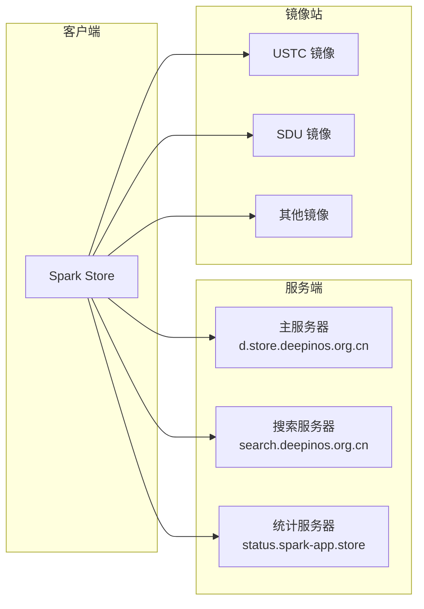
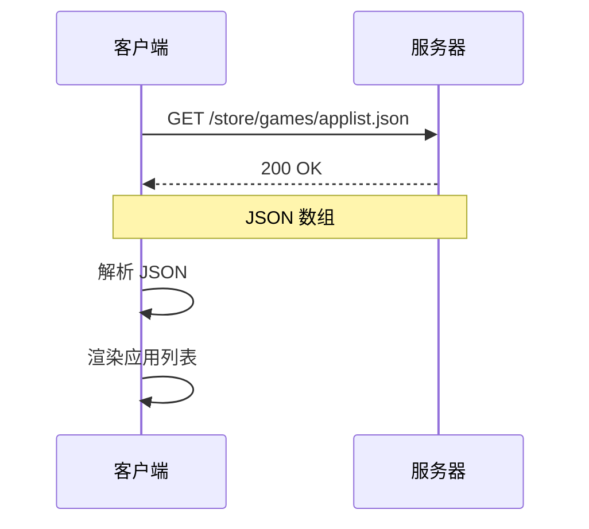
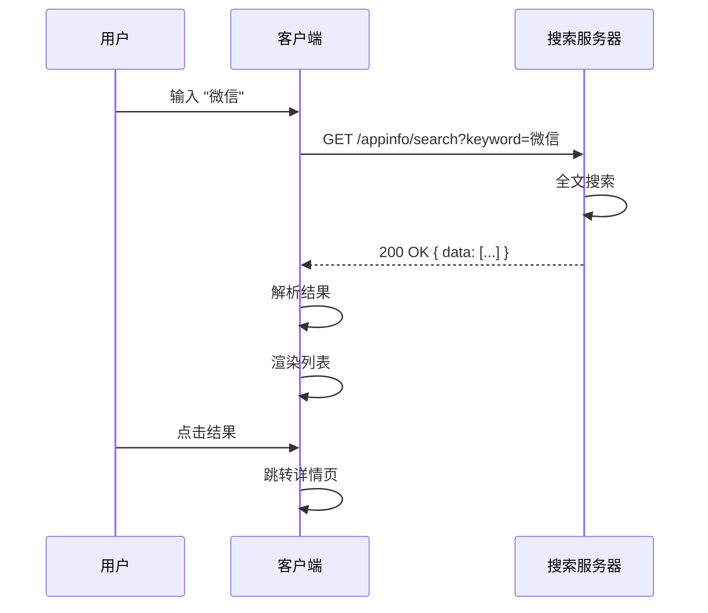
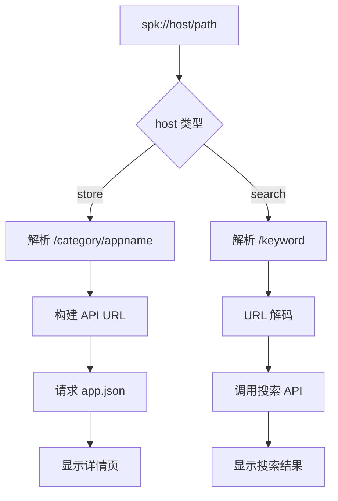

# 07 - API 文档

> 本文档详细介绍 Spark Store 的服务器 API 接口规范

## API 概述

Spark Store 使用 RESTful JSON API 与服务器通信，获取应用列表、详情、搜索结果等数据。



---

## 基础配置

### 服务器地址

| 服务 | 地址 | 用途 |
|------|------|------|
| 主服务器 | `https://d.store.deepinos.org.cn` | 应用数据 |
| 搜索服务 | `https://search.deepinos.org.cn` | 全文搜索 |
| 统计服务 | `https://status.spark-app.store` | 使用统计 |

### 架构目录

| 架构 | 目录 |
|------|------|
| x86_64 | `store` |
| ARM64 | `aarch64-store` |
| LoongArch | `loong64-store` |
| RISC-V 64 | `riscv64-store` |

### URL 模式

```
https://{server}/{arch}/{category}/{app}/resource
```

---

## 应用列表 API

### 获取分类应用列表

**请求**

```http
GET /{arch}/{category}/applist.json
```

**参数**

| 参数 | 类型 | 说明 |
|------|------|------|
| arch | path | 架构目录 |
| category | path | 分类目录 |

**分类列表**

| 分类 | 目录名 | 说明 |
|------|--------|------|
| 全部 | (空) | 所有应用 |
| 网络应用 | network | 浏览器、下载工具等 |
| 社交沟通 | chat | 即时通讯、邮件等 |
| 音乐欣赏 | music | 音乐播放器等 |
| 视频播放 | video | 视频播放器等 |
| 图形图像 | image_graphics | 图像编辑、查看等 |
| 游戏娱乐 | games | 游戏 |
| 办公学习 | office | 办公软件、教育等 |
| 阅读翻译 | reading | 阅读器、翻译等 |
| 编程开发 | development | IDE、开发工具等 |
| 系统工具 | tools | 系统工具 |
| 主题美化 | themes | 主题、图标等 |
| 其他应用 | others | 其他 |

**响应**

```json
[
    {
        "Name": "微信",
        "Pkgname": "com.qq.weixin.deepin",
        "Category": "chat",
        "IconUrl": "https://d.store.deepinos.org.cn/store/chat/com.qq.weixin.deepin/icon.png",
        "Score": 4.5,
        "Tags": "deepin,uos,dwine5"
    },
    {
        "Name": "Firefox",
        "Pkgname": "firefox",
        "Category": "network",
        "IconUrl": "https://d.store.deepinos.org.cn/store/network/firefox/icon.png",
        "Score": 4.8,
        "Tags": "native,ubuntu,deepin,debian"
    }
]
```

**响应字段**

| 字段 | 类型 | 说明 |
|------|------|------|
| Name | string | 应用显示名称 |
| Pkgname | string | 包名 |
| Category | string | 分类 |
| IconUrl | string | 图标 URL |
| Score | number | 评分 (1-5) |
| Tags | string | 标签，逗号分隔 |

### 流程图



---

## 应用详情 API

### 获取应用详情

**请求**

```http
GET /{arch}/{category}/{pkgname}/app.json
```

**响应**

```json
{
    "Name": "微信",
    "Pkgname": "com.qq.weixin.deepin",
    "Version": "3.1.0.41",
    "Author": "Tencent",
    "Website": "https://weixin.qq.com",
    "More": "微信是一款跨平台的通讯工具...",
    "Tags": "deepin,uos,dwine5,chat",
    "Filename": "com.qq.weixin.deepin_3.1.0.41_amd64.deb",
    "Size": "168542208",
    "Icon": "https://d.store.deepinos.org.cn/store/chat/com.qq.weixin.deepin/icon.png",
    "Screenshots": [
        "https://d.store.deepinos.org.cn/store/chat/com.qq.weixin.deepin/screenshot_1.png",
        "https://d.store.deepinos.org.cn/store/chat/com.qq.weixin.deepin/screenshot_2.png"
    ],
    "Category": "chat",
    "Score": 4.5,
    "DownloadUrl": "https://d.store.deepinos.org.cn/store/chat/com.qq.weixin.deepin/com.qq.weixin.deepin_3.1.0.41_amd64.deb"
}
```

**响应字段**

| 字段 | 类型 | 必填 | 说明 |
|------|------|------|------|
| Name | string | 是 | 应用名称 |
| Pkgname | string | 是 | 包名 |
| Version | string | 是 | 版本号 |
| Author | string | 否 | 作者/开发商 |
| Website | string | 否 | 官方网站 |
| More | string | 是 | 详细描述 |
| Tags | string | 是 | 标签列表 |
| Filename | string | 是 | deb 文件名 |
| Size | string | 是 | 文件大小 (字节) |
| Icon | string | 是 | 图标 URL |
| Screenshots | array | 否 | 截图 URL 列表 |
| Category | string | 是 | 分类 |
| Score | number | 否 | 评分 |
| DownloadUrl | string | 否 | 下载直链 |

### 标签系统

**发行版标签**

| 标签 | 说明 |
|------|------|
| `ubuntu` | 支持 Ubuntu |
| `deepin` | 支持 Deepin |
| `uos` | 支持 UOS |
| `debian` | 支持 Debian |

**技术栈标签**

| 标签 | 说明 |
|------|------|
| `native` | 原生 Linux 应用 |
| `dtk5` | 使用 DTK 5 框架 |
| `dwine2` | Deepin Wine 2 运行 |
| `dwine5` | Deepin Wine 5 运行 |
| `a2d` | Android 兼容层运行 |

**ACE 容器标签**

| 标签 | 说明 |
|------|------|
| `amber-ce-bookworm` | ACE Bookworm 环境 |
| `amber-ce-trixie` | ACE Trixie 环境 |
| `amber-ce-deepin23` | ACE Deepin 23 环境 |
| `amber-ce-sid` | ACE Sid 环境 |

### 资源 URL 格式

```
图标: /{arch}/{category}/{pkgname}/icon.png
截图: /{arch}/{category}/{pkgname}/screenshot_{n}.png
包文件: /{arch}/{category}/{pkgname}/{filename}.deb
Metalink: /{arch}/{category}/{pkgname}/{filename}.deb.metalink
```

---

## 搜索 API

### 搜索应用

**请求**

```http
GET https://search.deepinos.org.cn/appinfo/search?keyword={keyword}
```

**参数**

| 参数 | 类型 | 说明 |
|------|------|------|
| keyword | query | 搜索关键词 |

**响应**

```json
{
    "code": 0,
    "msg": "success",
    "data": [
        {
            "Name": "微信",
            "Pkgname": "com.qq.weixin.deepin",
            "Category": "chat",
            "IconUrl": "https://...",
            "Tags": "deepin,uos,dwine5",
            "arch": "amd64"
        }
    ],
    "total": 1
}
```

**响应字段**

| 字段 | 类型 | 说明 |
|------|------|------|
| code | number | 状态码 (0=成功) |
| msg | string | 状态消息 |
| data | array | 搜索结果列表 |
| total | number | 结果总数 |

**data 数组元素**

| 字段 | 类型 | 说明 |
|------|------|------|
| Name | string | 应用名称 |
| Pkgname | string | 包名 |
| Category | string | 分类 |
| IconUrl | string | 图标 URL |
| Tags | string | 标签 |
| arch | string | 支持的架构 |

### 搜索流程



---

## 下载次数 API

### 获取下载次数

**请求**

```http
GET https://spark-app.store/api/appdltimes?name={pkgname}
```

**参数**

| 参数 | 类型 | 说明 |
|------|------|------|
| name | query | 包名 |

**响应**

```json
{
    "code": 0,
    "times": 12345
}
```

---

## 服务器配置 API

### 获取服务器列表

**请求**

```http
GET /{arch}/server.json
```

**响应**

```json
[
    {
        "name": "主服务器",
        "url": "https://d.store.deepinos.org.cn"
    },
    {
        "name": "USTC 镜像",
        "url": "https://mirrors.ustc.edu.cn/spark-store"
    },
    {
        "name": "SDU 镜像",
        "url": "https://mirrors.sdu.edu.cn/spark-store"
    }
]
```

### 获取镜像列表

**请求**

```http
GET /{arch}/mirrors_list.json
```

**响应**

```json
{
    "mirrors": [
        "https://d.store.deepinos.org.cn",
        "https://mirrors.ustc.edu.cn/spark-store",
        "https://mirrors.sdu.edu.cn/spark-store"
    ]
}
```

---

## 统计 API

### 上传使用统计

**请求**

```http
POST https://status.spark-app.store/upload
Content-Type: application/json

{
    "Distributor ID": "deepin",
    "Release": "23",
    "Architecture": "x86_64",
    "Store_Version": "4.2.6",
    "UUID": "xxxxxxxx-xxxx-xxxx-xxxx-xxxxxxxxxxxx"
}
```

**响应**

```json
{
    "code": 0,
    "msg": "success"
}
```

---

## SPK URL 协议

### 协议格式

```
spk://host/path
```

### 支持的格式

| 格式 | 示例 | 说明 |
|------|------|------|
| 应用详情 | `spk://store/games/spark-store` | 打开应用详情 |
| 搜索 | `spk://search/微信` | 执行搜索 |

### 解析规则



---

## 错误处理

### HTTP 状态码

| 状态码 | 说明 | 处理方式 |
|--------|------|----------|
| 200 | 成功 | 正常处理 |
| 404 | 资源不存在 | 显示"应用不存在" |
| 500 | 服务器错误 | 提示稍后重试 |
| 502/503 | 服务不可用 | 切换镜像重试 |

### 错误响应格式

```json
{
    "code": 1001,
    "msg": "Application not found",
    "data": null
}
```

### 错误码

| 错误码 | 说明 |
|--------|------|
| 0 | 成功 |
| 1001 | 应用不存在 |
| 1002 | 分类不存在 |
| 1003 | 搜索无结果 |
| 2001 | 服务器内部错误 |
| 2002 | 数据库错误 |

---

## 客户端实现

### API 调用示例

```cpp
// 获取应用列表
void SparkAPI::getAppList(const QString &category) {
    QString url = QString("%1/%2/%3/applist.json")
                  .arg(getServerUrl())
                  .arg(getArchDir())
                  .arg(category);
    
    m_http->get(url, [this](const QByteArray &data, bool success) {
        if (success) {
            QJsonDocument doc = QJsonDocument::fromJson(data);
            emit appListReady(doc.array());
        } else {
            emit requestError(tr("Failed to get app list"));
        }
    });
}

// 获取应用详情
void SparkAPI::getAppInfo(const QUrl &spkUrl) {
    // 解析 spk://store/category/appname
    QString path = spkUrl.path();
    QStringList parts = path.split("/", Qt::SkipEmptyParts);
    
    QString category = parts[0];
    QString appname = parts[1];
    
    QString url = QString("%1/%2/%3/%4/app.json")
                  .arg(getServerUrl())
                  .arg(getArchDir())
                  .arg(category)
                  .arg(appname);
    
    m_http->get(url, [this](const QByteArray &data, bool success) {
        if (success) {
            QJsonDocument doc = QJsonDocument::fromJson(data);
            emit appInfoReady(doc.object());
        } else {
            emit requestError(tr("Failed to get app info"));
        }
    });
}

// 搜索应用
void SparkAPI::getSearchList(const QString &keyword) {
    QString url = QString("https://search.deepinos.org.cn/appinfo/search?keyword=%1")
                  .arg(QUrl::toPercentEncoding(keyword));
    
    m_http->get(url, [this](const QByteArray &data, bool success) {
        if (success) {
            QJsonDocument doc = QJsonDocument::fromJson(data);
            QJsonObject obj = doc.object();
            emit searchListReady(obj["data"].toArray());
        } else {
            emit requestError(tr("Search failed"));
        }
    });
}
```

### 请求头

```http
User-Agent: SparkStore/4.2.6
Accept: application/json
Accept-Language: zh-CN
```

### 超时设置

| 类型 | 超时时间 |
|------|----------|
| 连接超时 | 5 秒 |
| 读取超时 | 30 秒 |
| 下载超时 | 200 秒 (无进度) |

---

## 缓存策略

### 缓存规则

| 资源类型 | 缓存时间 | 说明 |
|----------|----------|------|
| applist.json | 5 分钟 | 应用列表 |
| app.json | 10 分钟 | 应用详情 |
| icon.png | 24 小时 | 应用图标 |
| screenshot_*.png | 24 小时 | 截图 |
| server.json | 1 小时 | 服务器列表 |

### 缓存路径

```
~/.cache/spark-store/
├── api/                 # API 响应缓存
├── icons/               # 图标缓存
└── screenshots/         # 截图缓存
```

---

[上一篇: 辅助工具](06-辅助工具.md) | [返回目录](README.md) | [下一篇: 流程图](08-流程图.md)
