# 08 - 流程图

> 本文档包含 Spark Store 各核心业务流程的 Mermaid 流程图

## 目录

- [应用启动流程](#应用启动流程)
- [应用下载安装流程](#应用下载安装流程)
- [URL 协议处理流程](#url-协议处理流程)
- [主题切换流程](#主题切换流程)
- [页面导航流程](#页面导航流程)
- [搜索流程](#搜索流程)
- [ACE 容器安装流程](#ace-容器安装流程)
- [崩溃处理流程](#崩溃处理流程)
- [单实例控制流程](#单实例控制流程)
- [模块依赖关系](#模块依赖关系)

---

## 应用启动流程

### 完整启动序列

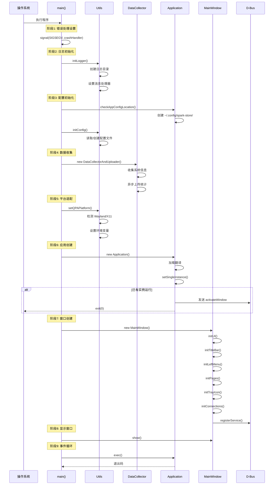

### 平台适配流程

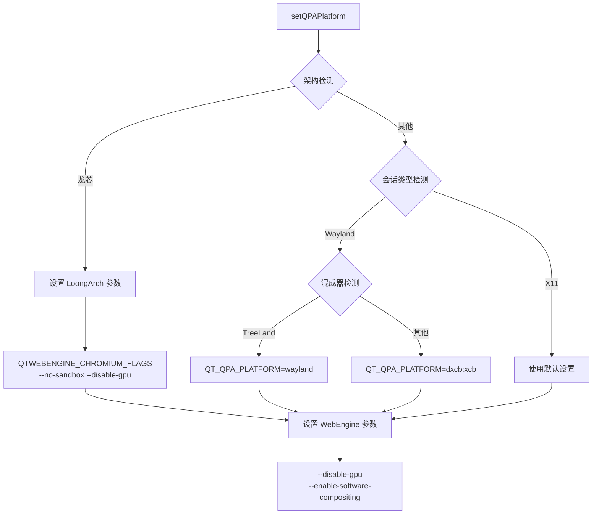

---

## 应用下载安装流程

### 完整下载安装流程

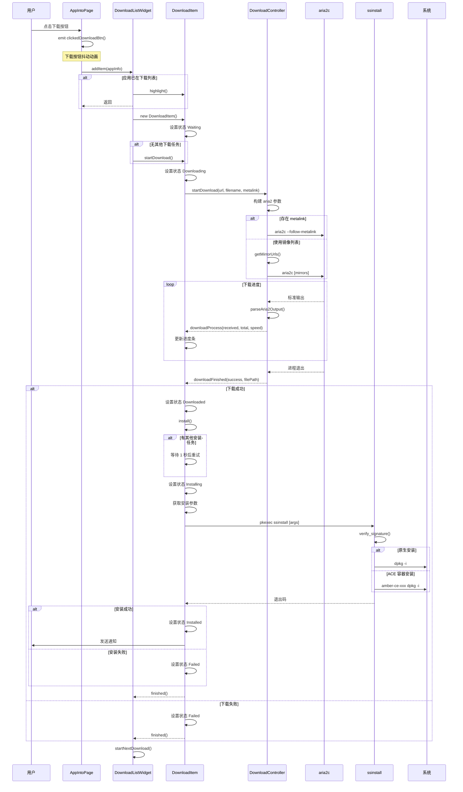

### 下载状态机

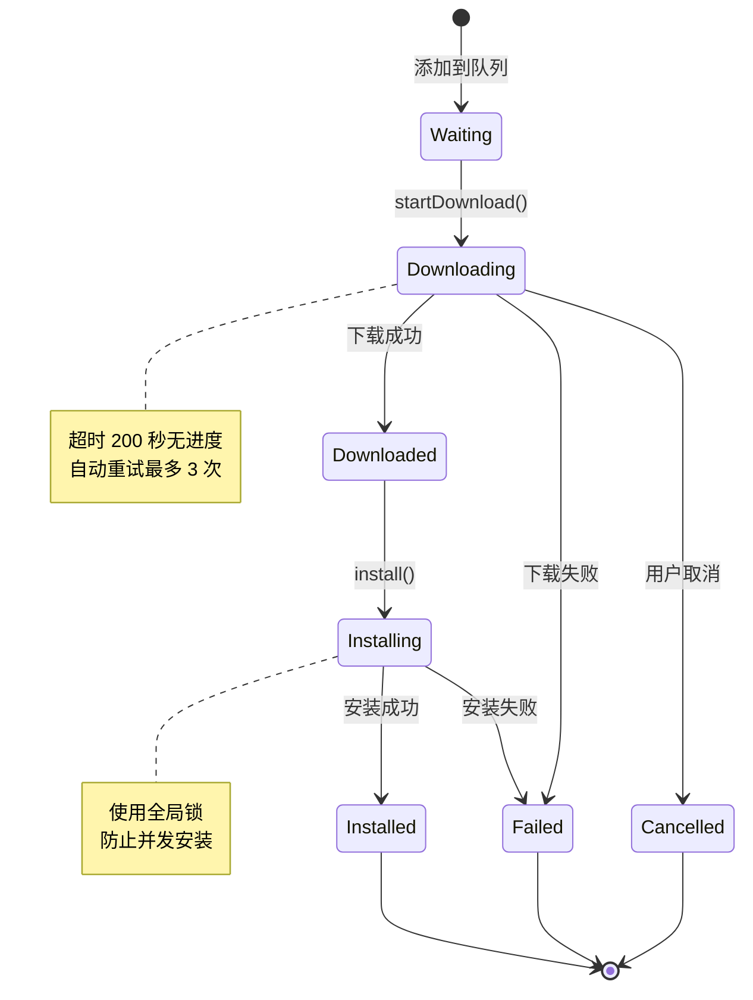

---

## URL 协议处理流程

### SPK URL 处理

```mermaid
flowchart TD
    A[接收 URL] --> B{来源}
    
    B -->|命令行参数| C[main() 处理]
    B -->|D-Bus 调用| D[DBusService.openUrl()]
    B -->|浏览器点击| E[xdg-open 触发]
    
    C --> F[MainWindow.openUrl()]
    D --> G[activateWindow()]
    G --> F
    E --> H{已有实例?}
    H -->|是| I[D-Bus openUrl]
    I --> D
    H -->|否| J[启动新实例]
    J --> C
    
    F --> K{解析 scheme}
    K -->|非 spk| L[忽略]
    K -->|spk| M{解析 host}
    
    M -->|store| N[handleStoreUrl]
    M -->|search| O[handleSearchUrl]
    M -->|其他| P[警告并忽略]
    
    N --> Q[解析 /category/appname]
    Q --> R[AppIntoPage.openUrl()]
    R --> S[SparkAPI.getAppInfo()]
    S --> T[显示应用详情]
    
    O --> U[解析 /keyword]
    U --> V[URL 解码]
    V --> W[设置搜索框]
    W --> X[执行搜索]
    X --> Y[显示搜索结果]
```

### URL 解析详情

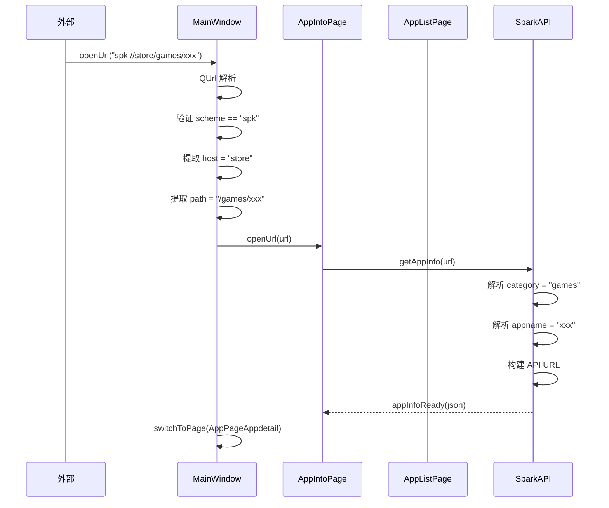

---

## 主题切换流程

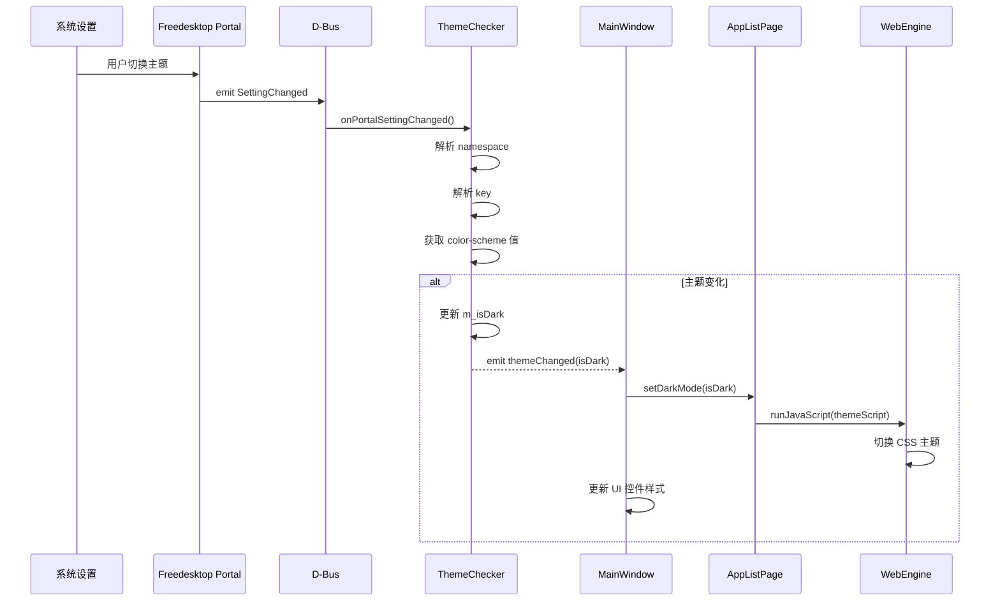

### 主题检测源

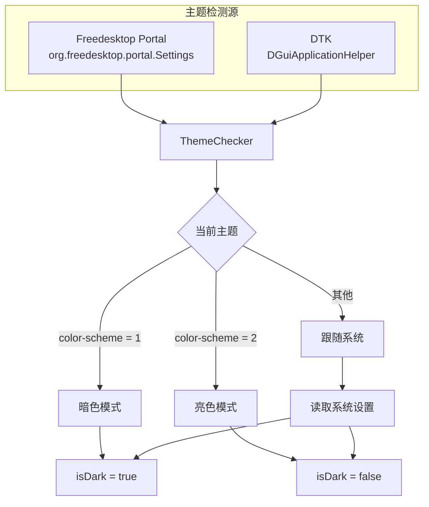

---

## 页面导航流程

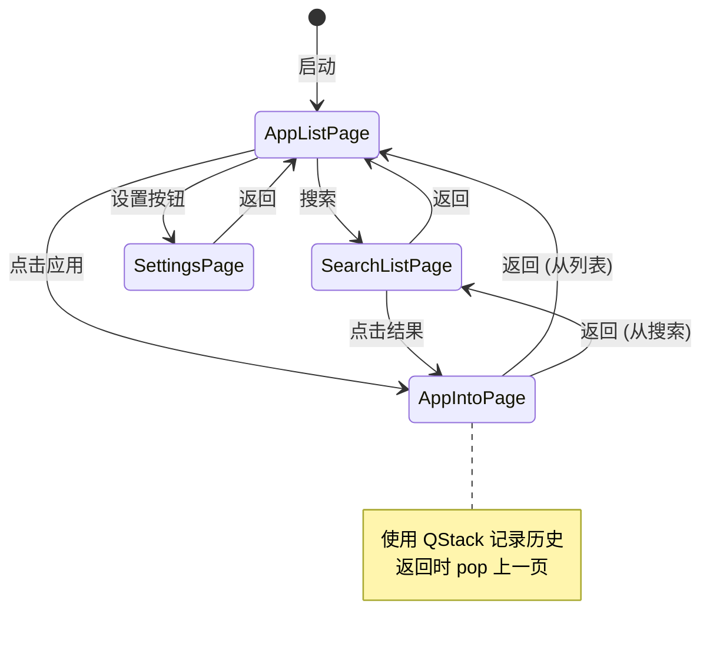

### 页面切换逻辑

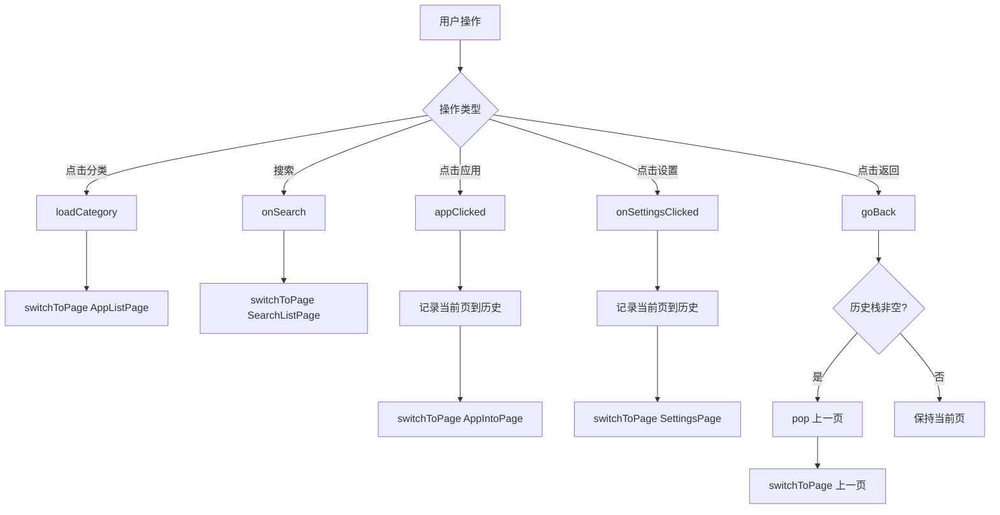

---

## 搜索流程

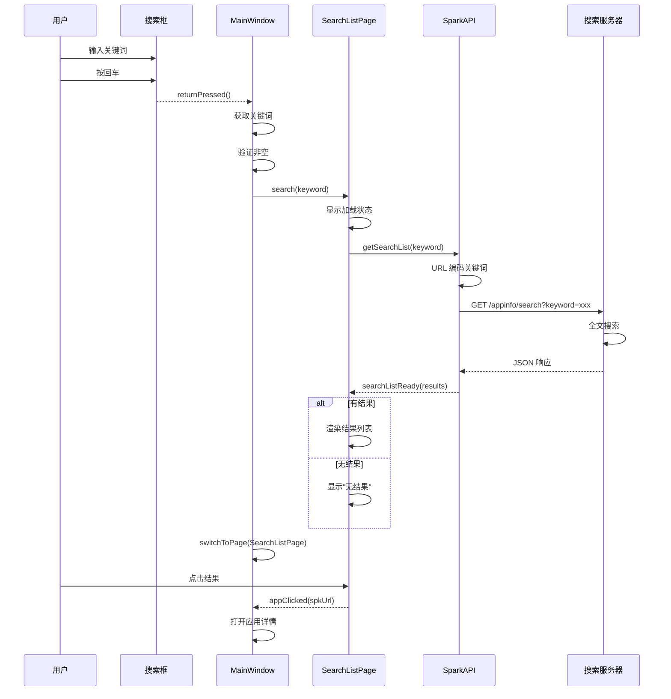

---

## ACE 容器安装流程

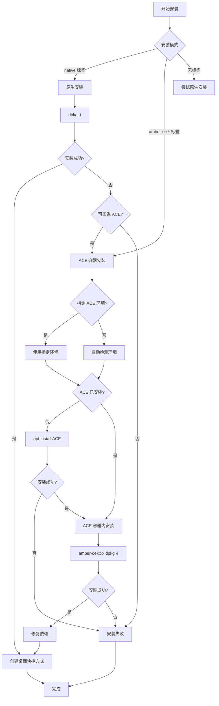

### ACE 环境选择

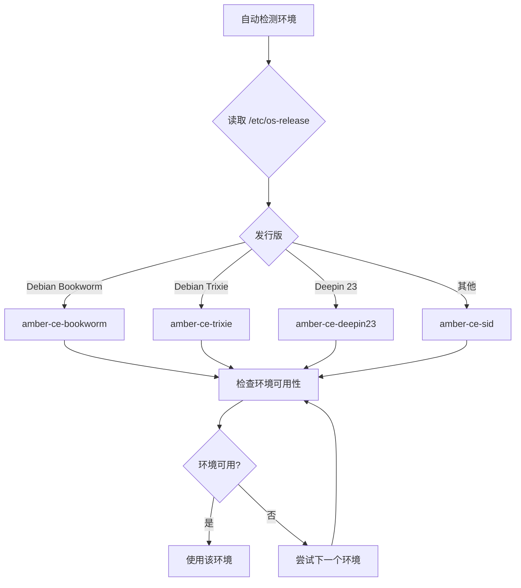

---

## 崩溃处理流程

```mermaid
flowchart TD
    A[程序崩溃<br/>SIGSEGV] --> B[crashHandler]
    
    B --> C[获取调用栈]
    C --> D[backtrace 30 层]
    D --> E[backtrace_symbols 解析]
    
    B --> F[收集系统信息]
    F --> G[CPU 架构]
    F --> H[发行版信息]
    F --> I[内存信息]
    F --> J[应用版本]
    
    E --> K[生成日志文件]
    G --> K
    H --> K
    I --> K
    J --> K
    
    K --> L[/tmp/spark_store_crash_log_时间戳.txt]
    
    L --> M[写入日志内容]
    M --> N[信号类型]
    M --> O[调用栈]
    M --> P[系统信息]
    
    N --> Q[xdg-open 打开日志]
    O --> Q
    P --> Q
    
    Q --> R[exit 1]
```

---

## 单实例控制流程

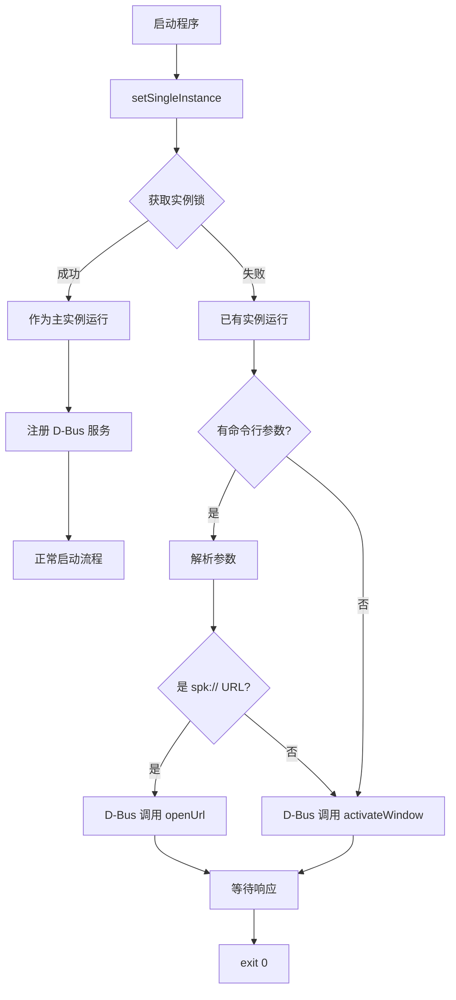

---

## 模块依赖关系

### 整体架构

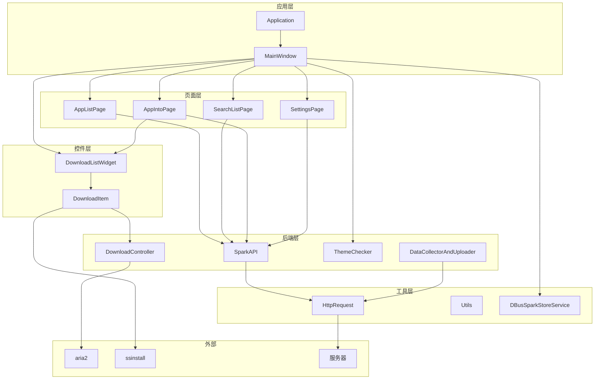

### 数据流

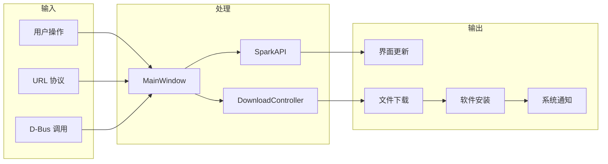

---

[上一篇: API 文档](07-API文档.md) | [返回目录](README.md) | [下一篇: 更新工具](09-更新工具.md)
