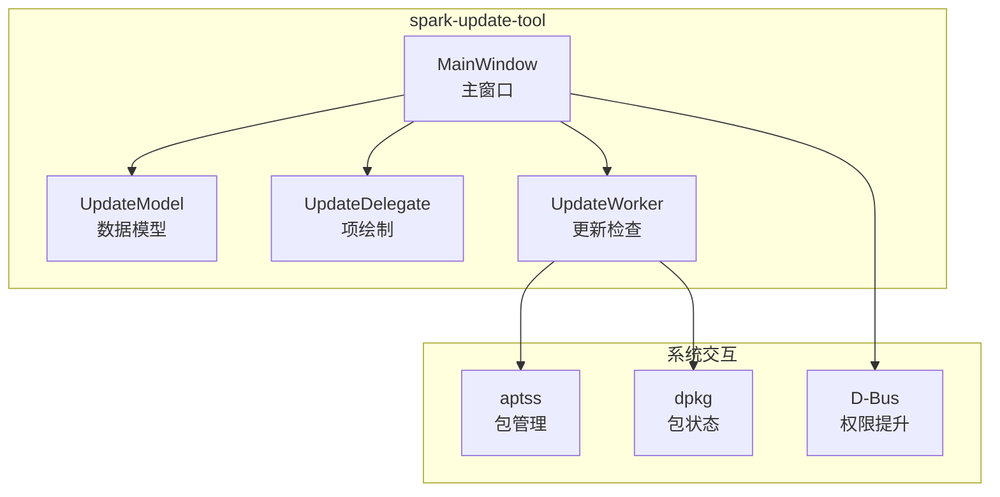
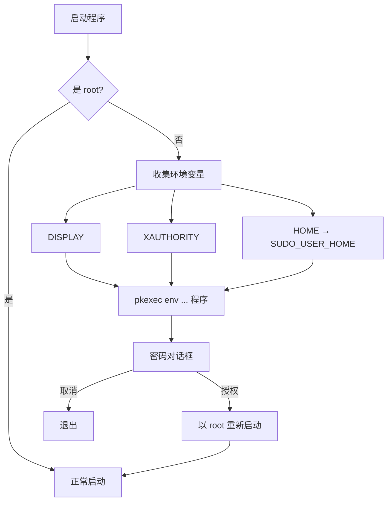
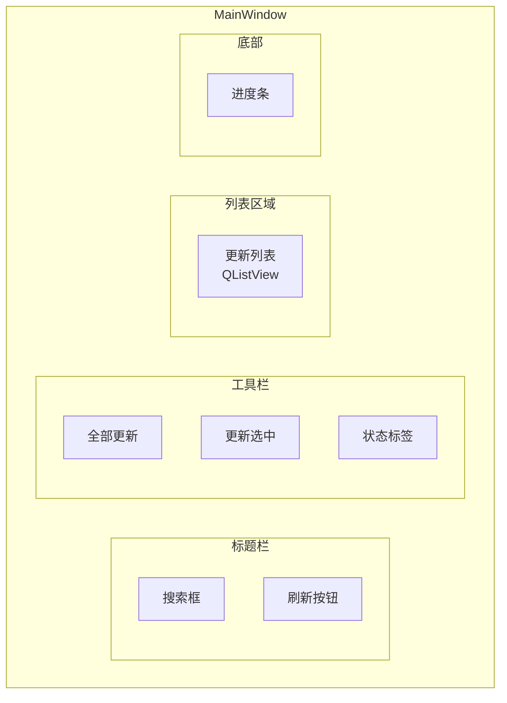
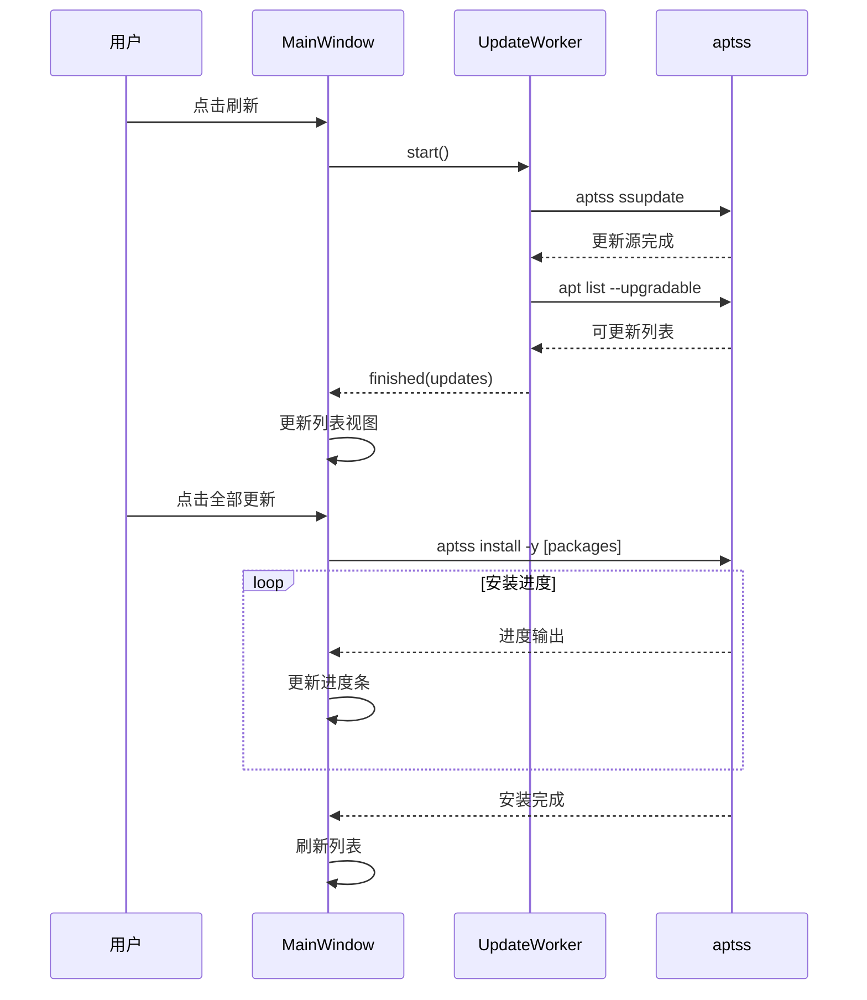
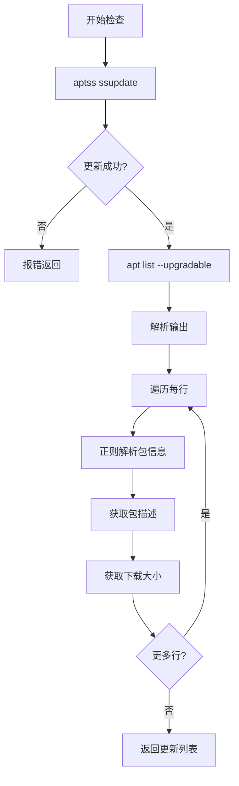
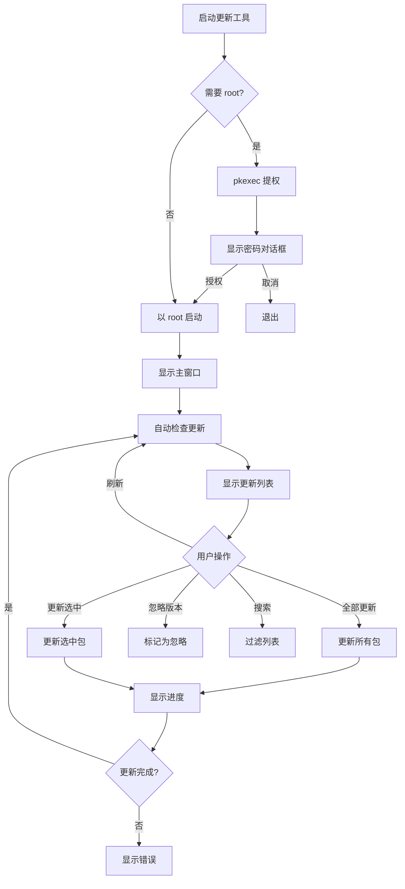

# 09 - 更新工具

> 本文档详细介绍 spark-update-tool 子项目

## 项目概述

spark-update-tool 是 Spark Store 的配套更新管理工具，提供图形界面管理已安装应用的更新。



---

## 目录结构

```
spark-update-tool/
├── src/
│   ├── main.cpp                 # 程序入口
│   ├── mainwindow.cpp/h         # 主窗口
│   ├── updatemodel.cpp/h        # 数据模型
│   ├── updatedelegate.cpp/h     # 列表项绘制
│   ├── updateworker.cpp/h       # 更新检查
│   └── settingsmanager.cpp/h    # 设置管理
├── resources/
│   ├── icons/                   # 图标资源
│   └── styles/                  # 样式表
├── debian/
│   ├── control                  # 打包配置
│   └── ...
├── spark-update-tool.pro        # 项目文件
├── CMakeLists.txt               # CMake 配置
├── LICENSE
└── README.md / README.zh.md
```

---

## 程序入口 (main.cpp)

### 功能

1. **权限提升** - 自动使用 pkexec 获取 root 权限
2. **环境传递** - 传递显示相关环境变量
3. **单实例控制** - 防止重复运行

### 实现

```cpp
// 文件: spark-update-tool/src/main.cpp

int main(int argc, char *argv[]) {
    // 检查是否以 root 运行
    if (getuid() != 0) {
        // 需要提权
        QStringList args;
        
        // 传递环境变量
        QString display = qgetenv("DISPLAY");
        QString xauthority = qgetenv("XAUTHORITY");
        QString sudoHome = qgetenv("HOME");
        
        args << QString("DISPLAY=%1").arg(display);
        args << QString("XAUTHORITY=%1").arg(xauthority);
        args << QString("SUDO_USER_HOME=%1").arg(sudoHome);
        args << argv[0];
        
        // 追加原始参数
        for (int i = 1; i < argc; i++) {
            args << argv[i];
        }
        
        // 使用 pkexec 提权
        QProcess::execute("pkexec", {"env"} + args);
        return 0;
    }
    
    // 以 root 身份运行
    DApplication app(argc, argv);
    
    app.setOrganizationName("spark-union");
    app.setApplicationName("spark-update-tool");
    app.setApplicationVersion(APP_VERSION);
    
    // 单实例检查
    if (!app.setSingleInstance("spark-update-tool")) {
        return 0;
    }
    
    MainWindow w;
    w.show();
    
    return app.exec();
}
```

**伪代码：**

```
main(argc, argv):
    if 非 root 用户:
        # 收集环境变量
        env_vars = [DISPLAY, XAUTHORITY, SUDO_USER_HOME]
        
        # 使用 pkexec 重新启动
        pkexec env {env_vars} {程序路径} {参数}
        return 0
    
    # root 模式运行
    创建 DApplication
    设置单实例
    
    创建并显示 MainWindow
    进入事件循环
```

### 提权流程



---

## MainWindow - 主窗口

### 类定义

```cpp
// 文件: spark-update-tool/src/mainwindow.h

class MainWindow : public DMainWindow {
    Q_OBJECT
    
public:
    explicit MainWindow(QWidget *parent = nullptr);
    ~MainWindow();
    
private slots:
    void onRefreshClicked();
    void onUpdateAllClicked();
    void onUpdateSelectedClicked();
    void onSearchTextChanged(const QString &text);
    void onWorkerFinished(const QList<UpdateInfo> &updates);
    void onUpdateProgress(const QString &package, int progress);
    void onUpdateFinished(bool success, const QString &message);
    
private:
    void initUI();
    void initConnections();
    void startUpdateCheck();
    void updatePackages(const QStringList &packages);
    
private:
    QListView *m_listView;
    UpdateModel *m_model;
    UpdateDelegate *m_delegate;
    
    DSearchEdit *m_searchEdit;
    DPushButton *m_refreshBtn;
    DPushButton *m_updateAllBtn;
    DPushButton *m_updateSelectedBtn;
    
    UpdateWorker *m_worker;
    QProgressBar *m_progressBar;
    DLabel *m_statusLabel;
};
```

### UI 布局



### 核心实现

#### 初始化

```cpp
// 文件: spark-update-tool/src/mainwindow.cpp

void MainWindow::initUI() {
    // 设置窗口属性
    setWindowTitle(tr("Spark Update Tool"));
    setMinimumSize(800, 600);
    
    // 创建中央控件
    QWidget *centralWidget = new QWidget(this);
    QVBoxLayout *layout = new QVBoxLayout(centralWidget);
    
    // 工具栏
    QHBoxLayout *toolbarLayout = new QHBoxLayout();
    
    m_refreshBtn = new DPushButton(tr("Refresh"));
    m_updateAllBtn = new DPushButton(tr("Update All"));
    m_updateSelectedBtn = new DPushButton(tr("Update Selected"));
    m_statusLabel = new DLabel();
    
    toolbarLayout->addWidget(m_refreshBtn);
    toolbarLayout->addWidget(m_updateAllBtn);
    toolbarLayout->addWidget(m_updateSelectedBtn);
    toolbarLayout->addStretch();
    toolbarLayout->addWidget(m_statusLabel);
    
    // 列表视图
    m_listView = new QListView();
    m_model = new UpdateModel(this);
    m_delegate = new UpdateDelegate(this);
    
    m_listView->setModel(m_model);
    m_listView->setItemDelegate(m_delegate);
    m_listView->setSelectionMode(QAbstractItemView::MultiSelection);
    
    // 进度条
    m_progressBar = new QProgressBar();
    m_progressBar->setVisible(false);
    
    layout->addLayout(toolbarLayout);
    layout->addWidget(m_listView);
    layout->addWidget(m_progressBar);
    
    setCentralWidget(centralWidget);
    
    // 搜索框放在标题栏
    m_searchEdit = new DSearchEdit();
    m_searchEdit->setPlaceholderText(tr("Search packages"));
    titlebar()->addWidget(m_searchEdit, Qt::AlignCenter);
}
```

#### 更新检查

```cpp
// 文件: spark-update-tool/src/mainwindow.cpp

void MainWindow::startUpdateCheck() {
    m_refreshBtn->setEnabled(false);
    m_statusLabel->setText(tr("Checking for updates..."));
    
    // 在后台线程执行
    m_worker = new UpdateWorker(this);
    
    connect(m_worker, &UpdateWorker::finished,
            this, &MainWindow::onWorkerFinished);
    connect(m_worker, &UpdateWorker::error,
            this, [this](const QString &msg) {
        m_statusLabel->setText(msg);
        m_refreshBtn->setEnabled(true);
    });
    
    m_worker->start();
}

void MainWindow::onWorkerFinished(const QList<UpdateInfo> &updates) {
    m_model->setUpdates(updates);
    
    m_statusLabel->setText(tr("%1 updates available")
                           .arg(updates.size()));
    
    m_refreshBtn->setEnabled(true);
    m_updateAllBtn->setEnabled(!updates.isEmpty());
}
```

#### 执行更新

```cpp
// 文件: spark-update-tool/src/mainwindow.cpp

void MainWindow::updatePackages(const QStringList &packages) {
    if (packages.isEmpty()) return;
    
    m_progressBar->setVisible(true);
    m_progressBar->setMaximum(packages.size());
    m_progressBar->setValue(0);
    
    m_updateAllBtn->setEnabled(false);
    m_updateSelectedBtn->setEnabled(false);
    
    // 使用 aptss 更新
    QProcess *process = new QProcess(this);
    
    connect(process, &QProcess::readyReadStandardOutput,
            this, [this, process]() {
        QString output = process->readAllStandardOutput();
        // 解析进度
        parseAptOutput(output);
    });
    
    connect(process, QOverload<int, QProcess::ExitStatus>::of(&QProcess::finished),
            this, [this, process](int exitCode, QProcess::ExitStatus) {
        m_progressBar->setVisible(false);
        
        if (exitCode == 0) {
            m_statusLabel->setText(tr("Update completed"));
            startUpdateCheck();  // 刷新列表
        } else {
            m_statusLabel->setText(tr("Update failed"));
        }
        
        m_updateAllBtn->setEnabled(true);
        m_updateSelectedBtn->setEnabled(true);
        process->deleteLater();
    });
    
    QStringList args;
    args << "/opt/durapps/spark-store/bin/aptss"
         << "install" << "-y"
         << packages;
    
    process->start("env", args);
}
```

### 更新流程



---

## UpdateModel - 数据模型

### 类定义

```cpp
// 文件: spark-update-tool/src/updatemodel.h

struct UpdateInfo {
    QString packageName;    // 包名
    QString displayName;    // 显示名称
    QString currentVersion; // 当前版本
    QString newVersion;     // 新版本
    QString size;           // 下载大小
    QString description;    // 描述
    bool selected;          // 是否选中
    bool ignored;           // 是否忽略
};

class UpdateModel : public QAbstractListModel {
    Q_OBJECT
    
public:
    enum Roles {
        PackageNameRole = Qt::UserRole + 1,
        DisplayNameRole,
        CurrentVersionRole,
        NewVersionRole,
        SizeRole,
        DescriptionRole,
        SelectedRole,
        IgnoredRole
    };
    
    explicit UpdateModel(QObject *parent = nullptr);
    
    // QAbstractListModel 接口
    int rowCount(const QModelIndex &parent = QModelIndex()) const override;
    QVariant data(const QModelIndex &index, int role) const override;
    bool setData(const QModelIndex &index, const QVariant &value, int role) override;
    Qt::ItemFlags flags(const QModelIndex &index) const override;
    
    // 自定义方法
    void setUpdates(const QList<UpdateInfo> &updates);
    QList<UpdateInfo> getUpdates() const;
    QStringList getSelectedPackages() const;
    void setAllSelected(bool selected);
    void ignoreVersion(const QString &package, const QString &version);
    
private:
    QList<UpdateInfo> m_updates;
    QSet<QString> m_ignoredVersions;  // package@version
};
```

### 实现

```cpp
// 文件: spark-update-tool/src/updatemodel.cpp

QVariant UpdateModel::data(const QModelIndex &index, int role) const {
    if (!index.isValid() || index.row() >= m_updates.size())
        return QVariant();
    
    const UpdateInfo &info = m_updates.at(index.row());
    
    switch (role) {
        case Qt::DisplayRole:
        case DisplayNameRole:
            return info.displayName;
        case PackageNameRole:
            return info.packageName;
        case CurrentVersionRole:
            return info.currentVersion;
        case NewVersionRole:
            return info.newVersion;
        case SizeRole:
            return info.size;
        case DescriptionRole:
            return info.description;
        case SelectedRole:
            return info.selected;
        case IgnoredRole:
            return info.ignored;
        default:
            return QVariant();
    }
}

bool UpdateModel::setData(const QModelIndex &index, 
                          const QVariant &value, 
                          int role) {
    if (!index.isValid() || index.row() >= m_updates.size())
        return false;
    
    if (role == SelectedRole) {
        m_updates[index.row()].selected = value.toBool();
        emit dataChanged(index, index, {SelectedRole});
        return true;
    }
    
    return false;
}

void UpdateModel::ignoreVersion(const QString &package, 
                                 const QString &version) {
    QString key = QString("%1@%2").arg(package).arg(version);
    m_ignoredVersions.insert(key);
    
    // 更新对应项的 ignored 状态
    for (int i = 0; i < m_updates.size(); i++) {
        if (m_updates[i].packageName == package && 
            m_updates[i].newVersion == version) {
            m_updates[i].ignored = true;
            QModelIndex idx = index(i);
            emit dataChanged(idx, idx, {IgnoredRole});
            break;
        }
    }
    
    // 保存到配置文件
    saveIgnoredVersions();
}
```

---

## UpdateDelegate - 列表项绘制

### 类定义

```cpp
// 文件: spark-update-tool/src/updatedelegate.h

class UpdateDelegate : public QStyledItemDelegate {
    Q_OBJECT
    
public:
    explicit UpdateDelegate(QObject *parent = nullptr);
    
    void paint(QPainter *painter, 
               const QStyleOptionViewItem &option,
               const QModelIndex &index) const override;
    
    QSize sizeHint(const QStyleOptionViewItem &option,
                   const QModelIndex &index) const override;
    
    bool editorEvent(QEvent *event, 
                     QAbstractItemModel *model,
                     const QStyleOptionViewItem &option,
                     const QModelIndex &index) override;
    
signals:
    void ignoreClicked(const QModelIndex &index);
};
```

### 绘制逻辑

```cpp
// 文件: spark-update-tool/src/updatedelegate.cpp

void UpdateDelegate::paint(QPainter *painter,
                            const QStyleOptionViewItem &option,
                            const QModelIndex &index) const {
    painter->save();
    
    // 背景
    if (option.state & QStyle::State_Selected) {
        painter->fillRect(option.rect, option.palette.highlight());
    } else if (option.state & QStyle::State_MouseOver) {
        painter->fillRect(option.rect, 
                          option.palette.highlight().color().lighter(150));
    }
    
    // 获取数据
    QString displayName = index.data(UpdateModel::DisplayNameRole).toString();
    QString currentVer = index.data(UpdateModel::CurrentVersionRole).toString();
    QString newVer = index.data(UpdateModel::NewVersionRole).toString();
    QString size = index.data(UpdateModel::SizeRole).toString();
    bool selected = index.data(UpdateModel::SelectedRole).toBool();
    bool ignored = index.data(UpdateModel::IgnoredRole).toBool();
    
    int x = option.rect.x() + 10;
    int y = option.rect.y() + 10;
    
    // 复选框
    QRect checkRect(x, y + 10, 20, 20);
    drawCheckBox(painter, checkRect, selected);
    x += 30;
    
    // 应用名称
    QFont nameFont = option.font;
    nameFont.setPointSize(12);
    nameFont.setBold(true);
    painter->setFont(nameFont);
    
    if (ignored) {
        painter->setPen(Qt::gray);
    }
    
    painter->drawText(x, y + 20, displayName);
    
    // 版本信息
    QFont verFont = option.font;
    verFont.setPointSize(10);
    painter->setFont(verFont);
    painter->setPen(Qt::darkGray);
    
    QString verText = QString("%1 → %2").arg(currentVer).arg(newVer);
    painter->drawText(x, y + 40, verText);
    
    // 大小
    painter->drawText(option.rect.right() - 100, y + 30, size);
    
    // 忽略按钮
    if (!ignored) {
        QRect ignoreRect(option.rect.right() - 180, y + 15, 60, 24);
        drawIgnoreButton(painter, ignoreRect);
    }
    
    painter->restore();
}

QSize UpdateDelegate::sizeHint(const QStyleOptionViewItem &option,
                                const QModelIndex &index) const {
    Q_UNUSED(option)
    Q_UNUSED(index)
    return QSize(0, 60);  // 固定高度 60 像素
}
```

### 列表项布局

```
┌─────────────────────────────────────────────────────────────────┐
│ ☐  应用名称                                    [忽略]   15.2 MB │
│     1.0.0 → 2.0.0                                               │
└─────────────────────────────────────────────────────────────────┘
```

---

## UpdateWorker - 更新检查

### 类定义

```cpp
// 文件: spark-update-tool/src/updateworker.h

class UpdateWorker : public QThread {
    Q_OBJECT
    
public:
    explicit UpdateWorker(QObject *parent = nullptr);
    
signals:
    void finished(const QList<UpdateInfo> &updates);
    void error(const QString &message);
    void progress(const QString &status);
    
protected:
    void run() override;
    
private:
    QList<UpdateInfo> checkUpdates();
    UpdateInfo parsePackageInfo(const QString &line);
    QString getPackageDescription(const QString &package);
};
```

### 实现

```cpp
// 文件: spark-update-tool/src/updateworker.cpp

void UpdateWorker::run() {
    emit progress(tr("Updating package lists..."));
    
    // 更新软件源
    QProcess updateProcess;
    updateProcess.start("/opt/durapps/spark-store/bin/aptss", 
                        {"ssupdate"});
    updateProcess.waitForFinished(60000);  // 60 秒超时
    
    if (updateProcess.exitCode() != 0) {
        emit error(tr("Failed to update package lists"));
        return;
    }
    
    emit progress(tr("Checking for updates..."));
    
    // 获取可更新列表
    QList<UpdateInfo> updates = checkUpdates();
    
    emit finished(updates);
}

QList<UpdateInfo> UpdateWorker::checkUpdates() {
    QList<UpdateInfo> updates;
    
    QProcess listProcess;
    listProcess.start("apt", {"list", "--upgradable"});
    listProcess.waitForFinished(30000);
    
    QString output = listProcess.readAllStandardOutput();
    QStringList lines = output.split("\n", Qt::SkipEmptyParts);
    
    // 跳过第一行 "Listing..."
    for (int i = 1; i < lines.size(); i++) {
        UpdateInfo info = parsePackageInfo(lines[i]);
        if (!info.packageName.isEmpty()) {
            // 获取包描述
            info.description = getPackageDescription(info.packageName);
            updates.append(info);
        }
    }
    
    return updates;
}

UpdateInfo UpdateWorker::parsePackageInfo(const QString &line) {
    // 格式: package/source version arch [upgradable from: old_version]
    // 示例: firefox/stable 100.0-1 amd64 [upgradable from: 99.0-1]
    
    UpdateInfo info;
    
    QRegularExpression re(
        R"(^(\S+)/\S+\s+(\S+)\s+\S+\s+\[upgradable from:\s+(\S+)\])"
    );
    
    auto match = re.match(line);
    if (match.hasMatch()) {
        info.packageName = match.captured(1);
        info.displayName = info.packageName;
        info.newVersion = match.captured(2);
        info.currentVersion = match.captured(3);
        info.selected = true;
        info.ignored = false;
        
        // 获取下载大小
        info.size = getDownloadSize(info.packageName);
    }
    
    return info;
}
```

### 检查流程



---

## 设置管理

### 忽略版本

用户可以选择忽略特定版本的更新，忽略的版本信息保存在配置文件中。

```cpp
// 文件: spark-update-tool/src/settingsmanager.cpp

class SettingsManager {
public:
    static SettingsManager* instance();
    
    void saveIgnoredVersions(const QSet<QString> &ignored);
    QSet<QString> loadIgnoredVersions();
    
    void setAutoCheck(bool enabled);
    bool autoCheckEnabled();
    
private:
    QString configPath();
    QSettings *m_settings;
};

void SettingsManager::saveIgnoredVersions(const QSet<QString> &ignored) {
    m_settings->beginGroup("Updates");
    m_settings->setValue("ignored", QStringList(ignored.begin(), ignored.end()));
    m_settings->endGroup();
    m_settings->sync();
}

QSet<QString> SettingsManager::loadIgnoredVersions() {
    m_settings->beginGroup("Updates");
    QStringList list = m_settings->value("ignored").toStringList();
    m_settings->endGroup();
    return QSet<QString>(list.begin(), list.end());
}
```

### 配置文件

```ini
# ~/.config/spark-union/spark-update-tool.conf

[Updates]
ignored=package1@1.0.0,package2@2.0.0

[General]
autoCheck=true
checkInterval=86400
```

---

## 构建配置

### qmake 项目文件

```qmake
# 文件: spark-update-tool/spark-update-tool.pro

QT += core gui widgets

CONFIG += c++17 link_pkgconfig
PKGCONFIG += dtkcore dtkgui dtkwidget

TARGET = spark-update-tool
TEMPLATE = app

isEmpty(BUILD_VERSION) {
    VERSION = 1.0.0
} else {
    VERSION = $$BUILD_VERSION
}

DEFINES += APP_VERSION=\\\"'$${VERSION}'\\\"

SOURCES += \
    src/main.cpp \
    src/mainwindow.cpp \
    src/updatemodel.cpp \
    src/updatedelegate.cpp \
    src/updateworker.cpp \
    src/settingsmanager.cpp

HEADERS += \
    src/mainwindow.h \
    src/updatemodel.h \
    src/updatedelegate.h \
    src/updateworker.h \
    src/settingsmanager.h

RESOURCES += resources/resources.qrc

target.path = /opt/durapps/spark-store/bin
INSTALLS += target
```

### CMake 配置

```cmake
# 文件: spark-update-tool/CMakeLists.txt

cmake_minimum_required(VERSION 3.16)
project(spark-update-tool VERSION 1.0.0)

set(CMAKE_CXX_STANDARD 17)
set(CMAKE_AUTOMOC ON)
set(CMAKE_AUTORCC ON)

find_package(Qt5 REQUIRED COMPONENTS Core Gui Widgets)
find_package(DtkCore REQUIRED)
find_package(DtkGui REQUIRED)
find_package(DtkWidget REQUIRED)

add_executable(${PROJECT_NAME}
    src/main.cpp
    src/mainwindow.cpp
    src/updatemodel.cpp
    src/updatedelegate.cpp
    src/updateworker.cpp
    src/settingsmanager.cpp
    resources/resources.qrc
)

target_link_libraries(${PROJECT_NAME}
    Qt5::Core
    Qt5::Gui
    Qt5::Widgets
    ${DtkCore_LIBRARIES}
    ${DtkGui_LIBRARIES}
    ${DtkWidget_LIBRARIES}
)

install(TARGETS ${PROJECT_NAME}
    DESTINATION /opt/durapps/spark-store/bin)
```

---

## 使用流程



---

[上一篇: 流程图](08-流程图.md) | [返回目录](README.md)
