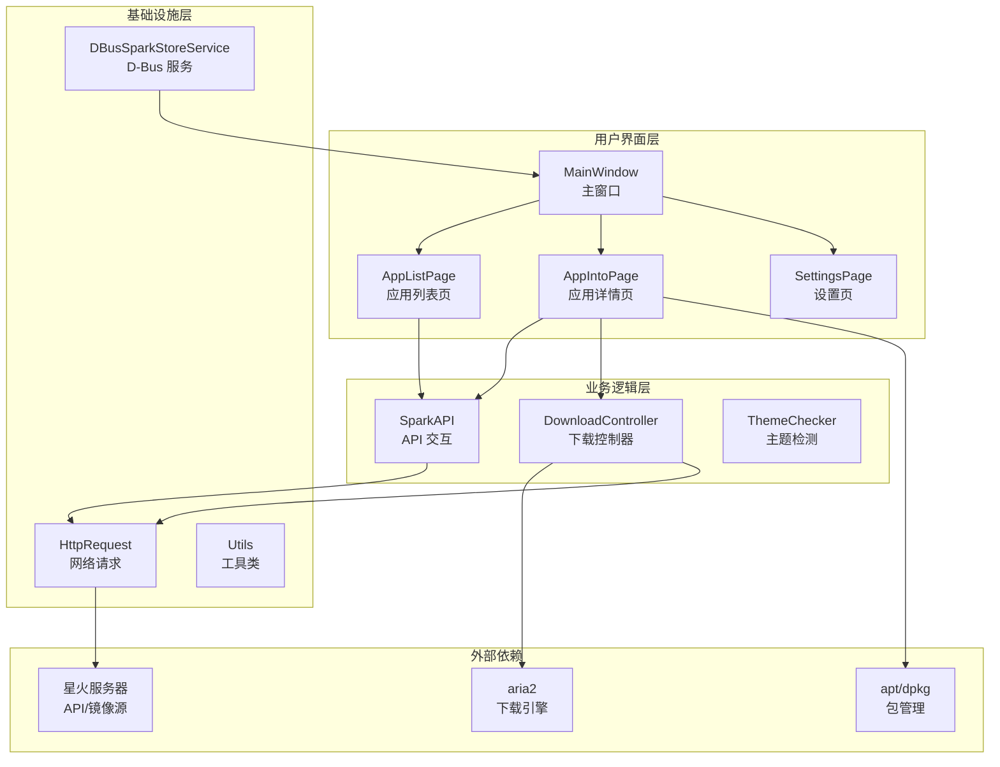

# 星火应用商店 (Spark Store) 技术文档

> 本文档基于 [Examples/spark-store](../../../Examples/spark-store) 源代码分析生成

## 项目概述

**星火应用商店**是为 Linux 平台用户设计的应用商店客户端，旨在解决 Linux 生态下应用分散、难以获取的问题。项目使用 **Qt5 + DTK (Deepin Tool Kit)** 开发，完美适配 Deepin/UOS 桌面环境，同时支持多种 Linux 发行版和多种 CPU 架构。

### 核心特性

- 🚀 **高效下载** - 基于 aria2 的多源并行下载，支持 Metalink 和断点续传
- 🌐 **多架构支持** - 支持 x86_64、ARM64、LoongArch、RISC-V 等架构
- 🎨 **原生体验** - 深度集成 DTK，完美适配 DDE 桌面环境
- 📦 **兼容性方案** - ACE 容器技术解决依赖兼容性问题
- 🔧 **完整工具链** - 配套 aptss、ssinstall、更新工具等组件
- 🌍 **国际化** - 支持中文、英文、法语、西班牙语等多语言

---

## 支持的平台

| 架构 | 支持的发行版 |
|:----:|:------------|
| **amd64** | Deepin 20/23, Ubuntu 20.04/22.04, UOS 家庭版 20, Debian 11+ |
| **arm64** | UOS 专业版 1060, Ubuntu 22.04, Deepin 23 |
| **loong64** | Deepin 23 |
| **riscv64** | 实验性支持 |

---

## 技术选型

| 技术领域 | 选择 | 说明 |
|:---------|:-----|:-----|
| GUI 框架 | Qt5 + DTK | 深度生态兼容，原生 DDE 风格 |
| 网页渲染 | Qt WebEngine | 复用 Web 前端展示应用列表 |
| 下载引擎 | aria2 | 多源并行下载，断点续传 |
| 包管理 | apt + 自定义脚本 | 兼容 Debian 系发行版 |
| 进程通信 | D-Bus | Linux 桌面标准 IPC |
| 容器化 | ACE (Amber CE) | 解决依赖兼容性问题 |
| 构建系统 | qmake | Qt 原生构建工具 |

---

## 文档目录

本文档按模块拆分为以下子文档，请按需阅读：

| 文档 | 描述 |
|:-----|:-----|
| [01-工程结构](./01-工程结构.md) | 目录布局、构建系统、Debian 打包配置 |
| [02-核心模块](./02-核心模块.md) | Application、MainWindow 类解析 |
| [03-后端模块](./03-后端模块.md) | SparkAPI、DownloadController、ThemeChecker 等 |
| [04-页面与控件](./04-页面与控件.md) | pages/ 和 widgets/ 目录模块解析 |
| [05-DBus接口](./05-DBus接口.md) | D-Bus 服务接口、SPK URL 协议 |
| [06-辅助工具](./06-辅助工具.md) | aptss、ssinstall、store-helper 等脚本工具 |
| [07-API文档](./07-API文档.md) | JSON API 规范、端点定义 |
| [08-流程图](./08-流程图.md) | Mermaid 业务流程图集合 |
| [09-更新工具](./09-更新工具.md) | spark-update-tool 子项目文档 |

---

## 架构总览

---

## 快速链接

- **项目主页**: https://www.spark-app.store/
- **源代码仓库**: https://gitee.com/spark-store-project/spark-store
- **问题反馈**: https://gitee.com/spark-store-project/spark-store/issues

---

## 许可证

本项目采用 [GPL-3.0](../../../Examples/spark-store/LICENSE) 许可证开源。

---

*文档生成日期: 2025年12月10日*
